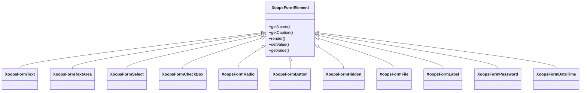

## Descripción General

XOOPS proporciona un conjunto exhaustivo de elementos de formulario a través de la jerarquía de clases `XoopsFormElement`. Estos elementos manejan la renderización, validación y procesamiento de datos para formularios web.

## Jerarquía de Elementos de Formulario



## Elementos de Entrada de Texto

### XoopsFormText

Entrada de texto de una sola línea:

```php
use XoopsFormText;

$element = new XoopsFormText(
    caption: 'Username',
    name: 'username',
    size: 30,
    maxlength: 50,
    value: $currentValue
);
```

### XoopsFormPassword

Entrada de contraseña con enmascaramiento:

```php
use XoopsFormPassword;

$element = new XoopsFormPassword(
    caption: 'Password',
    name: 'password',
    size: 30,
    maxlength: 100
);
```

### XoopsFormTextArea

Entrada de texto multi-línea:

```php
use XoopsFormTextArea;

$element = new XoopsFormTextArea(
    caption: 'Description',
    name: 'description',
    value: $currentValue,
    rows: 5,
    cols: 50
);
```

## Elementos de Selección

### XoopsFormSelect

Desplegable de selección:

```php
use XoopsFormSelect;

$element = new XoopsFormSelect(
    caption: 'Category',
    name: 'category_id',
    value: $selected,
    size: 1,
    multiple: false
);

$element->addOption(1, 'Category 1');
$element->addOption(2, 'Category 2');
$element->addOptionArray([
    3 => 'Category 3',
    4 => 'Category 4'
]);
```

### XoopsFormCheckBox

Entrada de casilla de verificación:

```php
use XoopsFormCheckBox;

$element = new XoopsFormCheckBox(
    caption: 'Features',
    name: 'features',
    value: $selected
);

$element->addOption('comments', 'Enable Comments');
$element->addOption('ratings', 'Enable Ratings');
```

### XoopsFormRadio

Grupo de botones de radio:

```php
use XoopsFormRadio;

$element = new XoopsFormRadio(
    caption: 'Status',
    name: 'status',
    value: $currentValue
);

$element->addOption('draft', 'Draft');
$element->addOption('published', 'Published');
$element->addOption('archived', 'Archived');
```

## Carga de Archivos

### XoopsFormFile

Entrada de carga de archivos:

```php
use XoopsFormFile;

$element = new XoopsFormFile(
    caption: 'Upload Image',
    name: 'image'
);

$element->setMaxFileSize(2 * 1024 * 1024); // 2MB
```

## Fecha y Hora

### XoopsFormDateTime

Selector de fecha/hora:

```php
use XoopsFormDateTime;

$element = new XoopsFormDateTime(
    caption: 'Publish Date',
    name: 'publish_date',
    size: 15,
    value: time()
);
```

## Elementos Especiales

### XoopsFormHidden

Campo oculto:

```php
use XoopsFormHidden;

$element = new XoopsFormHidden('article_id', $articleId);
```

### XoopsFormLabel

Etiqueta de solo lectura:

```php
use XoopsFormLabel;

$element = new XoopsFormLabel(
    caption: 'Created By',
    value: $authorName
);
```

### XoopsFormButton

Botones de formulario:

```php
use XoopsFormButton;

// Botón de envío
$submit = new XoopsFormButton('', 'submit', 'Save', 'submit');

// Botón de reinicio
$reset = new XoopsFormButton('', 'reset', 'Reset', 'reset');
```

## Personalización de Elementos

### Añadir Clases CSS

```php
$element->setExtra('class="form-control custom-class"');
```

### Añadir Atributos Personalizados

```php
$element->setExtra('data-validate="required" placeholder="Enter text..."');
```

### Establecer Descripción

```php
$element->setDescription('Enter a unique username (3-20 characters)');
```

## Documentación Relacionada

- Descripción General de Formularios
- Validación de Formularios
- Renderizadores Personalizados
