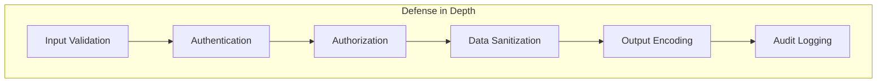

## Descripción General

Este documento describe las mejores prácticas de seguridad para el desarrollo de XOOPS, cubriendo validación de entrada, codificación de salida, autenticación, autorización y protección contra vulnerabilidades web comunes.

## Principios de Seguridad



## Validación de Entrada

### Sanitización de Solicitudes

```php
use Xoops\Core\Request;

// Siempre usar getters tipados
$id = Request::getInt('id', 0, 'GET');
$name = Request::getString('name', '', 'POST');
$email = Request::getEmail('email', '', 'POST');
$url = Request::getUrl('website', '', 'POST');

// Nunca usar $_GET/$_POST/$_REQUEST directamente
// Malo: $id = $_GET['id'];
// Bueno: $id = Request::getInt('id', 0, 'GET');
```

### Reglas de Validación

```php
// Validar antes de usar
if ($id <= 0) {
    throw new InvalidArgumentException('Invalid ID');
}

if (!preg_match('/^[a-zA-Z0-9_]{3,50}$/', $username)) {
    throw new InvalidArgumentException('Invalid username format');
}

// Usar validación de lista blanca para enumeraciones
$allowedStatuses = ['draft', 'published', 'archived'];
if (!in_array($status, $allowedStatuses, true)) {
    throw new InvalidArgumentException('Invalid status');
}
```

## Prevención de Inyección SQL

### Usar Consultas Parametrizadas

```php
// BUENO: Consulta parametrizada
$sql = "SELECT * FROM {$xoopsDB->prefix('users')} WHERE uid = ?";
$result = $xoopsDB->query($sql, [$userId]);

// MALO: Concatenación de cadenas (vulnerable!)
// $sql = "SELECT * FROM users WHERE uid = " . $userId;
```

### Usar Objetos Criteria

```php
use Criteria;
use CriteriaCompo;

$criteria = new CriteriaCompo();
$criteria->add(new Criteria('status', 'published'));
$criteria->add(new Criteria('uid', $userId, '='));
$criteria->add(new Criteria('created', time() - 86400, '>'));

$articles = $articleHandler->getObjects($criteria);
```

## Prevención de XSS

### Codificación de Salida

```php
use Xoops\Core\Text\Sanitizer;

// Contexto HTML
$safeName = htmlspecialchars($userName, ENT_QUOTES, 'UTF-8');

// En plantillas (auto-escapado)
{$userName|escape}

// Para contenido enriquecido
$sanitizer = Sanitizer::getInstance();
$safeContent = $sanitizer->sanitizeForDisplay($content);
```

### Política de Seguridad de Contenido

```php
// Establecer encabezados CSP
header("Content-Security-Policy: default-src 'self'; script-src 'self'; style-src 'self' 'unsafe-inline'");
```

## Protección CSRF

### Implementación de Token

```php
// Generar token
use Xoops\Core\Security;

$token = Security::createToken();

// En formulario
echo '<input type="hidden" name="XOOPS_TOKEN_REQUEST" value="' . $token . '">';

// Verificar en envío
if (!Security::checkToken()) {
    die('Security token mismatch');
}
```

### Usar XoopsForm

```php
// Añade automáticamente token CSRF
$form = new XoopsThemeForm('Edit Article', 'articleform', 'save.php');
$form->addElement(new XoopsFormHiddenToken());
```

## Autenticación

### Manejo de Contraseñas

```php
// Hash de contraseñas (PHP 5.5+)
$hashedPassword = password_hash($plainPassword, PASSWORD_ARGON2ID);

// Verificar contraseñas
if (password_verify($plainPassword, $storedHash)) {
    // Contraseña correcta
}

// Verificar si necesita rehashing
if (password_needs_rehash($storedHash, PASSWORD_ARGON2ID)) {
    $newHash = password_hash($plainPassword, PASSWORD_ARGON2ID);
    // Actualizar hash almacenado
}
```

### Seguridad de Sesión

```php
// Regenerar ID de sesión después de iniciar sesión
session_regenerate_id(true);

// Establecer opciones seguras de cookies de sesión
ini_set('session.cookie_httponly', 1);
ini_set('session.cookie_secure', 1);
ini_set('session.cookie_samesite', 'Lax');
```

## Autorización

### Comprobaciones de Permiso

```php
// Verificar administrador de módulo
if (!$xoopsUser || !$xoopsUser->isAdmin($xoopsModule->mid())) {
    redirect_header('index.php', 3, 'Access denied');
}

// Verificar permisos de grupo
$grouppermHandler = xoops_getHandler('groupperm');
$groups = $xoopsUser ? $xoopsUser->getGroups() : [XOOPS_GROUP_ANONYMOUS];

if (!$grouppermHandler->checkRight('view_item', $itemId, $groups, $moduleId)) {
    throw new AccessDeniedException('Permission denied');
}
```

### Acceso Basado en Roles

```php
class PermissionChecker
{
    public function canEdit(Article $article, ?XoopsUser $user): bool
    {
        if (!$user) {
            return false;
        }

        // Admin puede editar cualquier cosa
        if ($user->isAdmin()) {
            return true;
        }

        // Autor puede editar el suyo propio
        if ($article->getAuthorId() === $user->uid()) {
            return true;
        }

        // Verificar permiso de editor
        return $this->hasPermission($user, 'article_edit');
    }
}
```

## Seguridad de Carga de Archivos

```php
class SecureUploader
{
    private array $allowedMimeTypes = [
        'image/jpeg',
        'image/png',
        'image/gif'
    ];

    private array $allowedExtensions = ['jpg', 'jpeg', 'png', 'gif'];

    public function validate(array $file): bool
    {
        // Verificar tamaño de archivo
        if ($file['size'] > 2 * 1024 * 1024) {
            throw new FileTooLargeException();
        }

        // Verificar tipo MIME
        $finfo = new finfo(FILEINFO_MIME_TYPE);
        $mimeType = $finfo->file($file['tmp_name']);

        if (!in_array($mimeType, $this->allowedMimeTypes, true)) {
            throw new InvalidFileTypeException();
        }

        // Verificar extensión
        $extension = strtolower(pathinfo($file['name'], PATHINFO_EXTENSION));
        if (!in_array($extension, $this->allowedExtensions, true)) {
            throw new InvalidFileTypeException();
        }

        // Generar nombre de archivo seguro
        return true;
    }

    public function generateSafeFilename(string $original): string
    {
        $extension = strtolower(pathinfo($original, PATHINFO_EXTENSION));
        return bin2hex(random_bytes(16)) . '.' . $extension;
    }
}
```

## Registro de Auditoría

```php
class SecurityLogger
{
    public function logAuthAttempt(string $username, bool $success, string $ip): void
    {
        $data = [
            'username' => $username,
            'success' => $success,
            'ip' => $ip,
            'user_agent' => $_SERVER['HTTP_USER_AGENT'] ?? '',
            'timestamp' => time()
        ];

        // Registrar en base de datos o archivo
        $this->log('auth', $data);
    }

    public function logSensitiveAction(int $userId, string $action, array $context): void
    {
        $data = [
            'user_id' => $userId,
            'action' => $action,
            'context' => json_encode($context),
            'ip' => $_SERVER['REMOTE_ADDR'],
            'timestamp' => time()
        ];

        $this->log('audit', $data);
    }
}
```

## Encabezados de Seguridad

```php
// Encabezados de seguridad recomendados
header('X-Content-Type-Options: nosniff');
header('X-Frame-Options: SAMEORIGIN');
header('X-XSS-Protection: 1; mode=block');
header('Referrer-Policy: strict-origin-when-cross-origin');
header('Permissions-Policy: geolocation=(), microphone=(), camera=()');

// HSTS (solo para sitios HTTPS)
if (isset($_SERVER['HTTPS']) && $_SERVER['HTTPS'] === 'on') {
    header('Strict-Transport-Security: max-age=31536000; includeSubDomains');
}
```

## Limitación de Tasa

```php
class RateLimiter
{
    public function check(string $key, int $maxAttempts, int $windowSeconds): bool
    {
        $cacheKey = 'rate_limit:' . $key;
        $attempts = (int) $this->cache->get($cacheKey, 0);

        if ($attempts >= $maxAttempts) {
            return false; // Limitado de tasa
        }

        $this->cache->increment($cacheKey, 1, $windowSeconds);
        return true;
    }
}

// Uso
$limiter = new RateLimiter();
if (!$limiter->check('login:' . $ip, 5, 300)) {
    throw new TooManyRequestsException('Too many login attempts');
}
```

## Lista de Verificación de Seguridad

- [ ] Toda entrada del usuario validada y sanitizada
- [ ] Consultas parametrizadas para todas las operaciones de base de datos
- [ ] Codificación de salida para todo contenido generado por usuario
- [ ] Tokens CSRF en todos los formularios de cambio de estado
- [ ] Hash de contraseña seguro (Argon2id)
- [ ] Seguridad de sesión configurada
- [ ] Validación de carga de archivos
- [ ] Encabezados de seguridad establecidos
- [ ] Limitación de tasa implementada
- [ ] Registro de auditoría habilitado
- [ ] Los mensajes de error no filtran información sensible

## Documentación Relacionada

- Sistema de Autenticación
- Sistema de Permisos
- Validación de Entrada
