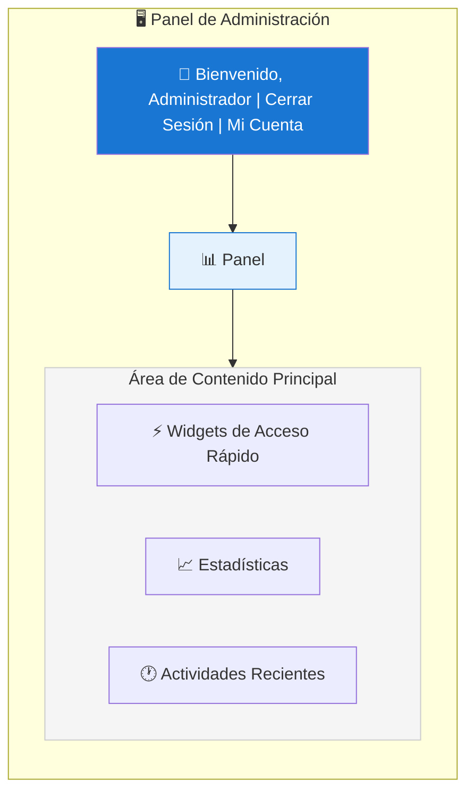
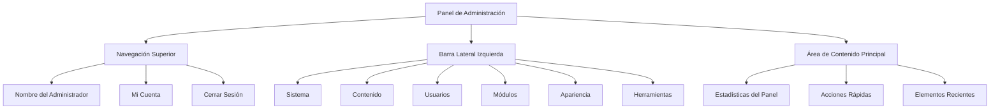

# Descripción General del Panel de Administración de XOOPS

Guía completa para navegar y usar el panel de administrador de XOOPS.

## Acceso al Panel de Administración

### Inicio de Sesión de Administrador

Abra su navegador y navegue a:

```
http://your-domain.com/xoops/admin/
```

O si XOOPS está en la raíz:

```
http://your-domain.com/admin/
```

Ingrese sus credenciales de administrador:

```
Nombre de usuario: [Su nombre de usuario de administrador]
Contraseña: [Su contraseña de administrador]
```

### Después de Iniciar Sesión

Verá el panel de administración principal:



## Diseño del Panel de Administración



## Componentes del Panel

### Barra Superior

La barra superior contiene controles esenciales:

| Elemento | Propósito |
|---|---|
| **Logotipo del Administrador** | Haz clic para volver al panel |
| **Mensaje de Bienvenida** | Muestra el nombre del administrador conectado |
| **Mi Cuenta** | Editar perfil del administrador y contraseña |
| **Ayuda** | Acceso a documentación |
| **Cerrar Sesión** | Salir del panel de administración |

### Barra Lateral de Navegación Izquierda

Menú principal organizado por función:

```
├── Sistema
│   ├── Panel
│   ├── Preferencias
│   ├── Usuarios Administradores
│   ├── Grupos
│   ├── Permisos
│   ├── Módulos
│   └── Herramientas
├── Contenido
│   ├── Páginas
│   ├── Categorías
│   ├── Comentarios
│   └── Gestor de Medios
├── Usuarios
│   ├── Usuarios
│   ├── Solicitudes de Usuarios
│   ├── Usuarios En Línea
│   └── Grupos de Usuarios
├── Módulos
│   ├── Módulos
│   ├── Configuración de Módulos
│   └── Actualizaciones de Módulos
├── Apariencia
│   ├── Temas
│   ├── Plantillas
│   ├── Bloques
│   └── Imágenes
└── Herramientas
    ├── Mantenimiento
    ├── Correo Electrónico
    ├── Estadísticas
    ├── Registros
    └── Copias de Seguridad
```

### Área de Contenido Principal

Muestra información y controles para la sección seleccionada:

- Formularios de configuración
- Tablas de datos con listas
- Gráficos y estadísticas
- Botones de acciones rápidas
- Texto de ayuda e información sobre herramientas

### Widgets del Panel

Acceso rápido a información clave:

- **Información del Sistema:** Versión de PHP, versión de MySQL, versión de XOOPS
- **Estadísticas Rápidas:** Recuento de usuarios, total de publicaciones, módulos instalados
- **Actividad Reciente:** Últimos inicios de sesión, cambios de contenido, errores
- **Estado del Servidor:** CPU, memoria, uso de disco
- **Notificaciones:** Alertas del sistema, actualizaciones pendientes

## Funciones Principales del Administrador

### Gestión del Sistema

**Ubicación:** Sistema > [Varias Opciones]

#### Preferencias

Configure los ajustes básicos del sistema:

```
Sistema > Preferencias > [Categoría de Configuración]
```

Categorías:
- Configuración General (nombre del sitio, zona horaria)
- Configuración de Usuarios (registro, perfiles)
- Configuración de Correo Electrónico (configuración SMTP)
- Configuración de Caché (opciones de almacenamiento en caché)
- Configuración de URL (URL amigables)
- Meta Etiquetas (configuración SEO)

Ver Configuración Básica y Configuración del Sistema.

#### Usuarios Administradores

Administre cuentas de administrador:

```
Sistema > Usuarios Administradores
```

Funciones:
- Agregar nuevos administradores
- Editar perfiles de administrador
- Cambiar contraseñas de administrador
- Eliminar cuentas de administrador
- Establecer permisos de administrador

### Gestión de Contenido

**Ubicación:** Contenido > [Varias Opciones]

#### Páginas/Artículos

Administre el contenido del sitio:

```
Contenido > Páginas (o su módulo)
```

Funciones:
- Crear nuevas páginas
- Editar contenido existente
- Eliminar páginas
- Publicar/despublicar
- Establecer categorías
- Administrar revisiones

#### Categorías

Organice el contenido:

```
Contenido > Categorías
```

Funciones:
- Crear jerarquía de categorías
- Editar categorías
- Eliminar categorías
- Asignar a páginas

#### Comentarios

Modere comentarios de usuarios:

```
Contenido > Comentarios
```

Funciones:
- Ver todos los comentarios
- Aprobar comentarios
- Editar comentarios
- Eliminar spam
- Bloquear comentaristas

### Gestión de Usuarios

**Ubicación:** Usuarios > [Varias Opciones]

#### Usuarios

Administre cuentas de usuario:

```
Usuarios > Usuarios
```

Funciones:
- Ver todos los usuarios
- Crear nuevos usuarios
- Editar perfiles de usuario
- Eliminar cuentas
- Restablecer contraseñas
- Cambiar estado de usuario
- Asignar a grupos

#### Usuarios En Línea

Monitoree usuarios activos:

```
Usuarios > Usuarios En Línea
```

Muestra:
- Usuarios actualmente en línea
- Hora de última actividad
- Dirección IP
- Ubicación del usuario (si se configura)

#### Grupos de Usuarios

Administre roles y permisos de usuario:

```
Usuarios > Grupos
```

Funciones:
- Crear grupos personalizados
- Establecer permisos de grupo
- Asignar usuarios a grupos
- Eliminar grupos

### Gestión de Módulos

**Ubicación:** Módulos > [Varias Opciones]

#### Módulos

Instale y configure módulos:

```
Módulos > Módulos
```

Funciones:
- Ver módulos instalados
- Habilitar/deshabilitar módulos
- Actualizar módulos
- Configurar ajustes de módulo
- Instalar nuevos módulos
- Ver detalles del módulo

#### Buscar Actualizaciones

```
Módulos > Módulos > Buscar Actualizaciones
```

Muestra:
- Actualizaciones de módulos disponibles
- Registro de cambios
- Opciones de descarga e instalación

### Gestión de Apariencia

**Ubicación:** Apariencia > [Varias Opciones]

#### Temas

Administre temas del sitio:

```
Apariencia > Temas
```

Funciones:
- Ver temas instalados
- Establecer tema predeterminado
- Cargar nuevos temas
- Eliminar temas
- Vista previa de tema
- Configuración de tema

#### Bloques

Administre bloques de contenido:

```
Apariencia > Bloques
```

Funciones:
- Crear bloques personalizados
- Editar contenido del bloque
- Organizar bloques en página
- Establecer visibilidad del bloque
- Eliminar bloques
- Configurar almacenamiento en caché del bloque

#### Plantillas

Administre plantillas (avanzado):

```
Apariencia > Plantillas
```

Para usuarios avanzados y desarrolladores.

### Herramientas del Sistema

**Ubicación:** Sistema > Herramientas

#### Modo de Mantenimiento

Prevenir acceso de usuarios durante mantenimiento:

```
Sistema > Modo de Mantenimiento
```

Configure:
- Habilitar/deshabilitar mantenimiento
- Mensaje de mantenimiento personalizado
- Direcciones IP permitidas (para pruebas)

#### Gestión de Base de Datos

```
Sistema > Base de Datos
```

Funciones:
- Verificar consistencia de la base de datos
- Ejecutar actualizaciones de base de datos
- Reparar tablas
- Optimizar base de datos
- Exportar estructura de base de datos

#### Registros de Actividad

```
Sistema > Registros
```

Monitoree:
- Actividad de usuario
- Acciones administrativas
- Eventos del sistema
- Registros de errores

## Acciones Rápidas

Tareas comunes accesibles desde el panel:

```
Enlaces Rápidos:
├── Crear Nueva Página
├── Agregar Nuevo Usuario
├── Crear Bloque de Contenido
├── Cargar Imagen
├── Enviar Correo Masivo
├── Actualizar Todos los Módulos
└── Limpiar Caché
```

## Atajos de Teclado del Panel de Administración

Navegación rápida:

| Atajo | Acción |
|---|---|
| `Ctrl+H` | Ir a ayuda |
| `Ctrl+D` | Ir al panel |
| `Ctrl+Q` | Búsqueda rápida |
| `Ctrl+L` | Cerrar sesión |

## Gestión de Cuentas de Usuario

### Mi Cuenta

Acceda a su perfil de administrador:

1. Haz clic en "Mi Cuenta" en la esquina superior derecha
2. Editar información del perfil:
   - Dirección de correo electrónico
   - Nombre real
   - Información del usuario
   - Avatar

### Cambiar Contraseña

Cambie su contraseña de administrador:

1. Vaya a **Mi Cuenta**
2. Haz clic en "Cambiar Contraseña"
3. Ingrese la contraseña actual
4. Ingrese la nueva contraseña (dos veces)
5. Haz clic en "Guardar"

**Consejos de Seguridad:**
- Use contraseñas seguras (16+ caracteres)
- Incluya mayúsculas, minúsculas, números, símbolos
- Cambie la contraseña cada 90 días
- Nunca comparta credenciales de administrador

### Cerrar Sesión

Salga del panel de administración:

1. Haz clic en "Cerrar Sesión" en la esquina superior derecha
2. Será redirigido a la página de inicio de sesión

## Estadísticas del Panel de Administración

### Estadísticas del Panel

Descripción general rápida de métricas del sitio:

| Métrica | Valor |
|--------|-------|
| Usuarios En Línea | 12 |
| Total de Usuarios | 256 |
| Total de Publicaciones | 1.234 |
| Total de Comentarios | 5.678 |
| Total de Módulos | 8 |

### Estado del Sistema

Información del servidor y rendimiento:

| Componente | Versión/Valor |
|-----------|---------------|
| Versión de XOOPS | 2.5.11 |
| Versión de PHP | 8.2.x |
| Versión de MySQL | 8.0.x |
| Carga del Servidor | 0.45, 0.42 |
| Tiempo de Actividad | 45 días |

### Actividad Reciente

Línea de tiempo de eventos recientes:

```
12:45 - Inicio de sesión del administrador
12:30 - Nuevo usuario registrado
12:15 - Página publicada
12:00 - Comentario publicado
11:45 - Módulo actualizado
```

## Sistema de Notificaciones

### Alertas de Administrador

Reciba notificaciones para:

- Nuevos registros de usuario
- Comentarios pendientes de moderación
- Intentos de inicio de sesión fallidos
- Errores del sistema
- Actualizaciones de módulos disponibles
- Problemas de base de datos
- Advertencias de espacio en disco

Configure alertas:

**Sistema > Preferencias > Configuración de Correo Electrónico**

```
Notificar al Administrador en el Registro: Sí
Notificar al Administrador en Comentarios: Sí
Notificar al Administrador en Errores: Sí
Correo Electrónico de Alerta: admin@your-domain.com
```

## Tareas Comunes del Administrador

### Crear una Nueva Página

1. Vaya a **Contenido > Páginas** (o módulo relevante)
2. Haz clic en "Agregar Nueva Página"
3. Rellene:
   - Título
   - Contenido
   - Descripción
   - Categoría
   - Metadatos
4. Haz clic en "Publicar"

### Administrar Usuarios

1. Vaya a **Usuarios > Usuarios**
2. Ver lista de usuarios con:
   - Nombre de usuario
   - Correo electrónico
   - Fecha de registro
   - Último inicio de sesión
   - Estado

3. Haz clic en el nombre de usuario para:
   - Editar perfil
   - Cambiar contraseña
   - Editar grupos
   - Bloquear/desbloquear usuario

### Configurar Módulo

1. Vaya a **Módulos > Módulos**
2. Busque el módulo en la lista
3. Haz clic en el nombre del módulo
4. Haz clic en "Preferencias" o "Configuración"
5. Configure las opciones del módulo
6. Guarde los cambios

### Crear un Nuevo Bloque

1. Vaya a **Apariencia > Bloques**
2. Haz clic en "Agregar Nuevo Bloque"
3. Ingrese:
   - Título del bloque
   - Contenido del bloque (se permite HTML)
   - Posición en página
   - Visibilidad (todas las páginas o específicas)
   - Módulo (si es aplicable)
4. Haz clic en "Enviar"

## Ayuda del Panel de Administración

### Documentación Incorporada

Acceso a ayuda desde el panel de administración:

1. Haz clic en el botón "Ayuda" en la barra superior
2. Ayuda contextual para la página actual
3. Enlaces a documentación
4. Preguntas frecuentes

### Recursos Externos

- Sitio Oficial de XOOPS: https://xoops.org/
- Foro Comunitario: https://xoops.org/modules/newbb/
- Repositorio de Módulos: https://xoops.org/modules/repository/
- Errores/Problemas: https://github.com/XOOPS/XoopsCore/issues

## Personalización del Panel de Administración

### Tema del Administrador

Elija el tema de interfaz de administración:

**Sistema > Preferencias > Configuración General**

```
Tema del Administrador: [Seleccione tema]
```

Temas disponibles:
- Predeterminado (claro)
- Modo oscuro
- Temas personalizados

### Personalización del Panel

Elija qué widgets aparecen:

**Panel > Personalizar**

Seleccione:
- Información del sistema
- Estadísticas
- Actividad reciente
- Enlaces rápidos
- Widgets personalizados

## Permisos del Panel de Administración

Los diferentes niveles de administrador tienen permisos diferentes:

| Rol | Capacidades |
|---|---|
| **Webmaster** | Acceso completo a todas las funciones de administración |
| **Administrador** | Funciones de administración limitadas |
| **Moderador** | Solo moderación de contenido |
| **Editor** | Creación y edición de contenido |

Administre permisos:

**Sistema > Permisos**

## Mejores Prácticas de Seguridad para el Panel de Administración

1. **Contraseña Fuerte:** Use contraseña de 16+ caracteres
2. **Cambios Regulares:** Cambie la contraseña cada 90 días
3. **Monitoree el Acceso:** Revise los registros de "Usuarios Administradores" regularmente
4. **Limite el Acceso:** Cambie el nombre de la carpeta de administración para seguridad adicional
5. **Use HTTPS:** Siempre acceda a la administración a través de HTTPS
6. **Whitelist de IP:** Restrinja el acceso de administración a IP específicas
7. **Cierre de Sesión Regular:** Cierre sesión cuando termine
8. **Seguridad del Navegador:** Limpie regularmente el caché del navegador

Ver Configuración de Seguridad.

## Solución de Problemas del Panel de Administración

### No Puedo Acceder al Panel de Administración

**Solución:**
1. Verifique las credenciales de inicio de sesión
2. Limpie el caché y las cookies del navegador
3. Pruebe con un navegador diferente
4. Verifique que la ruta de la carpeta de administración sea correcta
5. Verifique los permisos de archivo en la carpeta de administración
6. Verifique la conexión de base de datos en mainfile.php

### Página del Administrador en Blanco

**Solución:**
```bash
# Verificar errores de PHP
tail -f /var/log/apache2/error.log

# Habilitar modo de depuración temporalmente
sed -i "s/define('XOOPS_DEBUG', 0)/define('XOOPS_DEBUG', 1)/" /var/www/html/xoops/mainfile.php

# Verificar permisos de archivo
ls -la /var/www/html/xoops/admin/
```

### Panel de Administración Lento

**Solución:**
1. Limpiar caché: **Sistema > Herramientas > Limpiar Caché**
2. Optimizar base de datos: **Sistema > Base de Datos > Optimizar**
3. Verificar recursos del servidor: `htop`
4. Revisar consultas lentas en MySQL

### Módulo No Apareciendo

**Solución:**
1. Verificar módulo instalado: **Módulos > Módulos**
2. Verificar que el módulo esté habilitado
3. Verificar permisos asignados
4. Verificar que los archivos del módulo existan
5. Revisar registros de errores

## Próximos Pasos

Después de familiarizarse con el panel de administración:

1. Cree su primera página
2. Configure grupos de usuarios
3. Instale módulos adicionales
4. Configure la configuración básica
5. Implemente seguridad

---

**Etiquetas:** #panel-de-administración #panel #navegación #comenzar

**Artículos Relacionados:**
- ../Configuration/Basic-Configuration
- ../Configuration/System-Settings
- Creating-Your-First-Page
- Managing-Users
- Installing-Modules
