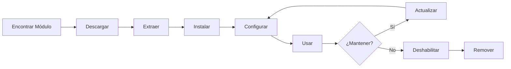

# Instalando y Gestionando Módulos de XOOPS

Aprende cómo extender la funcionalidad de XOOPS instalando y configurando módulos.

## Entendiendo los Módulos de XOOPS

### ¿Qué son los Módulos?

Los módulos son extensiones que añaden funcionalidad a XOOPS:

| Tipo | Propósito | Ejemplos |
|---|---|---|
| **Contenido** | Gestionar tipos de contenido específicos | Noticias, Blog, Tickets |
| **Comunidad** | Interacción de usuarios | Foro, Comentarios, Reseñas |
| **eCommerce** | Vender productos | Tienda, Carrito, Pagos |
| **Medios** | Manejar archivos/imágenes | Galería, Descargas, Videos |
| **Utilidad** | Herramientas y ayudantes | Email, Copia de seguridad, Analíticas |

### Módulos Principales vs. Opcionales

| Módulo | Tipo | Incluido | Removible |
|---|---|---|---|
| **Sistema** | Principal | Sí | No |
| **Usuario** | Principal | Sí | No |
| **Perfil** | Recomendado | Sí | Sí |
| **MP (Mensaje Privado)** | Recomendado | Sí | Sí |
| **WF-Channel** | Opcional | A menudo | Sí |
| **Noticias** | Opcional | No | Sí |
| **Foro** | Opcional | No | Sí |

## Ciclo de Vida del Módulo



## Encontrando Módulos

### Repositorio de Módulos XOOPS

Repositorio oficial de módulos XOOPS:

**Visita:** https://xoops.org/modules/repository/

```
Directorio > Módulos > [Examinar Categorías]
```

Examina por categoría:
- Gestión de Contenido
- Comunidad
- eCommerce
- Multimedia
- Desarrollo
- Administración del Sitio

### Evaluando Módulos

Antes de instalar, comprueba:

| Criterio | Qué Buscar |
|---|---|
| **Compatibilidad** | Funciona con tu versión de XOOPS |
| **Calificación** | Buenas reseñas y calificaciones de usuarios |
| **Actualizaciones** | Mantenido recientemente |
| **Descargas** | Popular y ampliamente utilizado |
| **Requisitos** | Compatible con tu servidor |
| **Licencia** | GPL o similar código abierto |
| **Soporte** | Desarrollador y comunidad activos |

### Lee Información del Módulo

Cada listado de módulo muestra:

```
Nombre del Módulo: [Nombre]
Versión: [X.X.X]
Requiere: XOOPS [Versión]
Autor: [Nombre]
Última Actualización: [Fecha]
Descargas: [Número]
Calificación: [Estrellas]
Descripción: [Descripción breve]
Compatibilidad: PHP [Versión], MySQL [Versión]
```

## Instalando Módulos

### Método 1: Instalación desde Panel de Admin

**Paso 1: Acceder a la Sección de Módulos**

1. Inicia sesión en el panel de admin
2. Navega a **Módulos > Módulos**
3. Haz clic en **"Instalar Nuevo Módulo"** o **"Examinar Módulos"**

**Paso 2: Subir Módulo**

Opción A - Subida Directa:
1. Haz clic en **"Elegir Archivo"**
2. Selecciona el archivo .zip del módulo desde tu computadora
3. Haz clic en **"Subir"**

Opción B - Subida por URL:
1. Pega la URL del módulo
2. Haz clic en **"Descargar e Instalar"**

**Paso 3: Revisar Información del Módulo**

```
Nombre del Módulo: [Nombre mostrado]
Versión: [Versión]
Autor: [Información del autor]
Descripción: [Descripción completa]
Requisitos: [Versiones PHP/MySQL]
```

Revisa y haz clic en **"Proceder con la Instalación"**

**Paso 4: Elegir Tipo de Instalación**

```
☐ Instalación Limpia (Nueva instalación)
☐ Actualizar (Actualizar existente)
☐ Eliminar Luego Instalar (Reemplazar existente)
```

Selecciona la opción apropiada.

**Paso 5: Confirmar Instalación**

Revisa la confirmación final:
```
El módulo se instalará en: /modules/modulename/
Base de Datos: xoops_db
¿Proceder? [Sí] [No]
```

Haz clic en **"Sí"** para confirmar.

**Paso 6: Instalación Completa**

```
¡Instalación exitosa!

Módulo: [Nombre del Módulo]
Versión: [Versión]
Tablas creadas: [Número]
Archivos instalados: [Número]

[Ir a Configuración del Módulo]  [Volver a Módulos]
```

### Método 2: Instalación Manual (Avanzado)

Para instalación manual o solución de problemas:

**Paso 1: Descargar Módulo**

1. Descarga el módulo .zip del repositorio
2. Extrae a `/var/www/html/xoops/modules/modulename/`

```bash
# Extrae módulo
unzip module_name.zip
cp -r module_name /var/www/html/xoops/modules/

# Establece permisos
chmod -R 755 /var/www/html/xoops/modules/module_name
```

**Paso 2: Ejecutar Script de Instalación**

```
Visita: http://your-domain.com/xoops/modules/module_name/admin/index.php?op=install
```

O a través del panel de admin (Sistema > Módulos > Actualizar BD).

**Paso 3: Verificar Instalación**

1. Ve a **Módulos > Módulos** en admin
2. Busca tu módulo en la lista
3. Verifica que muestra como "Activo"

## Configuración de Módulos

### Acceder a Configuración del Módulo

1. Ve a **Módulos > Módulos**
2. Encuentra tu módulo
3. Haz clic en el nombre del módulo
4. Haz clic en **"Preferencias"** o **"Configuración"**

### Configuración Común de Módulos

La mayoría de módulos ofrecen:

```
Estado del Módulo: [Habilitado/Deshabilitado]
Mostrar en Menú: [Sí/No]
Peso del Módulo: [1-999] (orden de visualización)
Visible para Grupos: [Casillas de verificación para grupos de usuarios]
```

### Opciones Específicas del Módulo

Cada módulo tiene configuración única. Ejemplos:

**Módulo de Noticias:**
```
Elementos por Página: 10
Mostrar Autor: Sí
Permitir Comentarios: Sí
Moderación Requerida: Sí
```

**Módulo de Foro:**
```
Temas por Página: 20
Publicaciones por Página: 15
Tamaño Máximo de Archivo Adjunto: 5MB
Habilitar Firmas: Sí
```

**Módulo de Galería:**
```
Imágenes por Página: 12
Tamaño de Miniatura: 150x150
Subida Máxima: 10MB
Marca de Agua: Sí/No
```

Revisa la documentación de tu módulo para opciones específicas.

### Guardar Configuración

Después de ajustar la configuración:

1. Haz clic en **"Enviar"** o **"Guardar"**
2. Verás una confirmación:
   ```
   ¡La configuración se guardó correctamente!
   ```

## Gestionando Bloques de Módulos

Muchos módulos crean "bloques" - áreas de contenido tipo widget.

### Ver Bloques del Módulo

1. Ve a **Apariencia > Bloques**
2. Busca bloques de tu módulo
3. La mayoría de módulos muestran "[Nombre del Módulo] - [Descripción del Bloque]"

### Configurar Bloques

1. Haz clic en el nombre del bloque
2. Ajusta:
   - Título del bloque
   - Visibilidad (todas las páginas o específicas)
   - Posición en la página (izquierda, centro, derecha)
   - Grupos de usuarios que pueden ver
3. Haz clic en **"Enviar"**

### Mostrar Bloque en la Página Principal

1. Ve a **Apariencia > Bloques**
2. Encuentra el bloque que deseas
3. Haz clic en **"Editar"**
4. Establece:
   - **Visible para:** Selecciona grupos
   - **Posición:** Elige columna (izquierda/centro/derecha)
   - **Páginas:** Página principal o todas las páginas
5. Haz clic en **"Enviar"**

## Instalando Ejemplos de Módulos Específicos

### Instalando Módulo de Noticias

**Perfecto para:** Entradas de blog, anuncios

1. Descarga el módulo de Noticias del repositorio
2. Sube vía **Módulos > Módulos > Instalar**
3. Configura en **Módulos > Noticias > Preferencias**:
   - Historias por página: 10
   - Permitir comentarios: Sí
   - Aprobar antes de publicar: Sí
4. Crea bloques para noticias recientes
5. ¡Comienza a publicar historias!

### Instalando Módulo de Foro

**Perfecto para:** Discusión comunitaria

1. Descarga el módulo de Foro
2. Instala vía panel de admin
3. Crea categorías de foro en el módulo
4. Configura opciones:
   - Temas/página: 20
   - Publicaciones/página: 15
   - Habilitar moderación: Sí
5. Asigna permisos a grupos de usuarios
6. Crea bloques para últimos temas

### Instalando Módulo de Galería

**Perfecto para:** Mostrar imágenes

1. Descarga el módulo de Galería
2. Instala y configura
3. Crea álbumes de fotos
4. Sube imágenes
5. Establece permisos para visualización/subida
6. Muestra la galería en el sitio web

## Actualizando Módulos

### Comprobar Actualizaciones

```
Panel de Admin > Módulos > Módulos > Comprobar Actualizaciones
```

Esto muestra:
- Actualizaciones de módulos disponibles
- Versión actual vs. nueva
- Registro de cambios/notas de lanzamiento

### Actualizar un Módulo

1. Ve a **Módulos > Módulos**
2. Haz clic en el módulo con actualización disponible
3. Haz clic en el botón **"Actualizar"**
4. Selecciona **"Actualizar"** del Tipo de Instalación
5. Sigue el asistente de instalación
6. ¡Módulo actualizado!

### Notas Importantes de Actualización

Antes de actualizar:

- [ ] Copia de seguridad de la base de datos
- [ ] Copia de seguridad de archivos del módulo
- [ ] Revisa el registro de cambios
- [ ] Prueba en servidor de prueba primero
- [ ] Anota cualquier modificación personalizada

Después de actualizar:
- [ ] Verifica funcionalidad
- [ ] Revisa la configuración del módulo
- [ ] Busca advertencias/errores
- [ ] Borra la caché

## Permisos de Módulos

### Asignar Acceso de Grupo de Usuarios

Controla qué grupos de usuarios pueden acceder a los módulos:

**Ubicación:** Sistema > Permisos

Para cada módulo, configura:

```
Módulo: [Nombre del Módulo]

Acceso Admin: [Selecciona grupos]
Acceso de Usuario: [Selecciona grupos]
Permiso de Lectura: [Grupos permitidos para ver]
Permiso de Escritura: [Grupos permitidos para publicar]
Permiso de Eliminación: [Solo administradores]
```

### Niveles de Permiso Comunes

```
Contenido Público (Noticias, Páginas):
├── Acceso Admin: Webmaster
├── Acceso de Usuario: Todos los usuarios que han iniciado sesión
└── Permiso de Lectura: Todos

Características de Comunidad (Foro, Comentarios):
├── Acceso Admin: Webmaster, Moderadores
├── Acceso de Usuario: Todos los usuarios que han iniciado sesión
└── Permiso de Escritura: Todos los usuarios que han iniciado sesión

Herramientas de Admin:
├── Acceso Admin: Solo Webmaster
└── Acceso de Usuario: Deshabilitado
```

## Deshabilitando y Removiendo Módulos

### Deshabilitar Módulo (Mantener Archivos)

Mantén el módulo pero ocúltalo del sitio:

1. Ve a **Módulos > Módulos**
2. Encuentra el módulo
3. Haz clic en el nombre del módulo
4. Haz clic en **"Deshabilitar"** o establece el estado a Inactivo
5. Módulo oculto pero datos preservados

Vuelve a habilitar en cualquier momento:
1. Haz clic en el módulo
2. Haz clic en **"Habilitar"**

### Remover Módulo Completamente

Elimina el módulo y sus datos:

1. Ve a **Módulos > Módulos**
2. Encuentra el módulo
3. Haz clic en **"Desinstalar"** o **"Eliminar"**
4. Confirma: "¿Eliminar módulo y todos sus datos?"
5. Haz clic en **"Sí"** para confirmar

**Advertencia:** ¡Desinstalar elimina todos los datos del módulo!

### Reinstalar Después de Desinstalar

Si desinstales un módulo:
- Los archivos del módulo se eliminan
- Las tablas de la base de datos se eliminan
- Todos los datos se pierden
- Debes reinstalar para usarlo de nuevo
- Puedes restaurar desde una copia de seguridad

## Solución de Problemas de Instalación de Módulos

### El Módulo No Aparece Después de Instalar

**Síntoma:** El módulo aparece en la lista pero no es visible en el sitio

**Solución:**
```
1. Comprueba que el módulo es "Activo" (Módulos > Módulos)
2. Habilita bloques del módulo (Apariencia > Bloques)
3. Verifica permisos de usuario (Sistema > Permisos)
4. Borra la caché (Sistema > Herramientas > Borrar Caché)
5. Comprueba que .htaccess no bloquee el módulo
```

### Error de Instalación: "La Tabla Ya Existe"

**Síntoma:** Error durante la instalación del módulo

**Solución:**
```
1. El módulo fue parcialmente instalado antes
2. Intenta la opción "Eliminar Luego Instalar"
3. O desinstala primero, luego instala limpio
4. Comprueba la base de datos para tablas existentes:
   mysql> SHOW TABLES LIKE 'xoops_module%';
```

### Módulo Carece de Dependencias

**Síntoma:** El módulo no se instala - requiere otro módulo

**Solución:**
```
1. Anota los módulos requeridos del mensaje de error
2. Instala primero los módulos requeridos
3. Luego instala el módulo
4. Instala en el orden correcto
```

### Página en Blanco al Acceder al Módulo

**Síntoma:** El módulo carga pero no muestra nada

**Solución:**
```
1. Habilita modo de depuración en mainfile.php:
   define('XOOPS_DEBUG', 1);

2. Comprueba el registro de errores PHP:
   tail -f /var/log/php_errors.log

3. Verifica permisos de archivo:
   chmod -R 755 /var/www/html/xoops/modules/modulename

4. Comprueba la conexión a la base de datos en la configuración del módulo

5. Deshabilita el módulo y reinstala
```

### El Módulo Rompe el Sitio

**Síntoma:** Instalar el módulo rompe el sitio web

**Solución:**
```
1. Deshabilita el módulo problemático inmediatamente:
   Admin > Módulos > [Módulo] > Deshabilitar

2. Borra la caché:
   rm -rf /var/www/html/xoops/cache/*
   rm -rf /var/www/html/xoops/templates_c/*

3. Restaura desde copia de seguridad si es necesario

4. Comprueba los registros de errores para encontrar la causa raíz

5. Contacta al desarrollador del módulo
```

## Consideraciones de Seguridad del Módulo

### Solo Instala desde Fuentes Confiables

```
✓ Repositorio Oficial de XOOPS
✓ Módulos oficiales de XOOPS en GitHub
✓ Desarrolladores de módulos confiables
✗ Sitios web desconocidos
✗ Fuentes no verificadas
```

### Comprueba Permisos del Módulo

Después de la instalación:

1. Revisa el código del módulo para actividad sospechosa
2. Comprueba las tablas de la base de datos para anomalías
3. Monitorea cambios de archivo
4. Mantén los módulos actualizados
5. Elimina módulos no utilizados

### Mejor Práctica de Permisos

```
Directorio del módulo: 755 (legible, no escribible por el servidor web)
Archivos del módulo: 644 (solo legible)
Datos del módulo: Protegidos por base de datos
```

## Recursos de Desarrollo de Módulos

### Aprende Desarrollo de Módulos

- Documentación Oficial: https://xoops.org/
- Repositorio GitHub: https://github.com/XOOPS/
- Foro Comunitario: https://xoops.org/modules/newbb/
- Guía de Desarrollador: Disponible en carpeta de docs

## Mejores Prácticas para Módulos

1. **Instala Uno a la Vez:** Monitorea conflictos
2. **Prueba Después de Instalar:** Verifica funcionalidad
3. **Documenta Configuración Personalizada:** Anota tu configuración
4. **Mantén Actualizado:** Instala actualizaciones del módulo prontamente
5. **Elimina No Utilizados:** Elimina módulos no necesarios
6. **Copia de Seguridad Antes:** Siempre copia de seguridad antes de instalar
7. **Lee Documentación:** Comprueba las instrucciones del módulo
8. **Únete a la Comunidad:** Pide ayuda si la necesitas

## Lista de Verificación de Instalación de Módulos

Para cada instalación de módulo:

- [ ] Investiga y lee reseñas
- [ ] Verifica compatibilidad de versión de XOOPS
- [ ] Copia de seguridad de base de datos y archivos
- [ ] Descarga la última versión
- [ ] Instala vía panel de admin
- [ ] Configura la configuración
- [ ] Crea/posiciona bloques
- [ ] Establece permisos de usuario
- [ ] Prueba funcionalidad
- [ ] Documenta la configuración
- [ ] Programa actualizaciones

## Próximos Pasos

Después de instalar módulos:

1. Crea contenido para módulos
2. Configura grupos de usuarios
3. Explora características de admin
4. Optimiza el rendimiento
5. Instala módulos adicionales según sea necesario

---

**Etiquetas:** #módulos #instalación #extensión #gestión

**Artículos Relacionados:**
- Admin-Panel-Overview
- Managing-Users
- Creating-Your-First-Page
- ../Configuration/System-Settings
