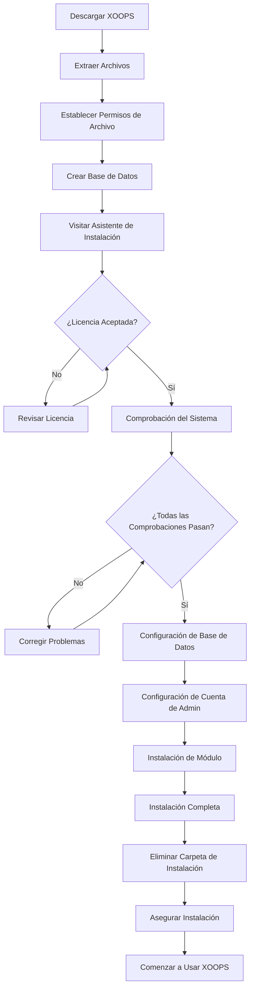

# Guía Completa de Instalación de XOOPS

Esta guía proporciona un recorrido completo para instalar XOOPS desde cero usando el asistente de instalación.

## Requisitos Previos

Antes de comenzar la instalación, asegúrate de que tienes:

- Acceso a tu servidor web vía FTP o SSH
- Acceso de administrador a tu servidor de base de datos
- Un nombre de dominio registrado
- Requisitos del servidor verificados
- Herramientas de copia de seguridad disponibles

## Proceso de Instalación



## Instalación Paso a Paso

### Paso 1: Descargar XOOPS

Descarga la última versión desde [https://xoops.org/](https://xoops.org/):

```bash
# Usando wget
wget https://xoops.org/download/xoops-2.5.8.zip

# Usando curl
curl -O https://xoops.org/download/xoops-2.5.8.zip
```

### Paso 2: Extraer Archivos

Extrae el archivo de XOOPS a tu raíz web:

```bash
# Navega a la raíz web
cd /var/www/html

# Extrae XOOPS
unzip xoops-2.5.8.zip

# Renombra la carpeta (opcional, pero recomendado)
mv xoops-2.5.8 xoops
cd xoops
```

### Paso 3: Establecer Permisos de Archivo

Establece los permisos adecuados para los directorios de XOOPS:

```bash
# Haz que los directorios sean escribibles (755 para directorios, 644 para archivos)
find . -type d -exec chmod 755 {} \;
find . -type f -exec chmod 644 {} \;

# Haz que directorios específicos sean escribibles por el servidor web
chmod 777 uploads/
chmod 777 templates_c/
chmod 777 var/
chmod 777 cache/

# Asegura mainfile.php después de la instalación
chmod 644 mainfile.php
```

### Paso 4: Crear Base de Datos

Crea una nueva base de datos para XOOPS usando MySQL:

```sql
-- Crear base de datos
CREATE DATABASE xoops_db CHARACTER SET utf8mb4 COLLATE utf8mb4_unicode_ci;

-- Crear usuario
CREATE USER 'xoops_user'@'localhost' IDENTIFIED BY 'secure_password_here';

-- Conceder privilegios
GRANT ALL PRIVILEGES ON xoops_db.* TO 'xoops_user'@'localhost';
FLUSH PRIVILEGES;
```

O usando phpMyAdmin:

1. Inicia sesión en phpMyAdmin
2. Haz clic en la pestaña "Bases de Datos"
3. Introduce el nombre de la base de datos: `xoops_db`
4. Selecciona la clasificación "utf8mb4_unicode_ci"
5. Haz clic en "Crear"
6. Crea un usuario con el mismo nombre que la base de datos
7. Concede todos los privilegios

### Paso 5: Ejecutar Asistente de Instalación

Abre tu navegador y navega a:

```
http://your-domain.com/xoops/install/
```

#### Fase de Comprobación del Sistema

El asistente comprueba la configuración de tu servidor:

- Versión de PHP >= 5.6.0
- MySQL/MariaDB disponible
- Extensiones PHP requeridas (GD, PDO, etc.)
- Permisos de directorio
- Conectividad de base de datos

**Si las comprobaciones fallan:**

Consulta la sección #Common-Installation-Issues para soluciones.

#### Configuración de Base de Datos

Introduce tus credenciales de base de datos:

```
Host de la Base de Datos: localhost
Nombre de la Base de Datos: xoops_db
Usuario de Base de Datos: xoops_user
Contraseña de Base de Datos: [tu_contraseña_segura]
Prefijo de Tabla: xoops_
```

**Notas Importantes:**
- Si tu host de base de datos difiere de localhost (p. ej., servidor remoto), introduce el nombre de host correcto
- El prefijo de tabla ayuda si ejecutas múltiples instancias de XOOPS en una base de datos
- Usa una contraseña fuerte con mayúsculas, números y símbolos

#### Configuración de Cuenta de Admin

Crea tu cuenta de administrador:

```
Nombre de Usuario de Admin: admin (o elige uno personalizado)
Email de Admin: admin@your-domain.com
Contraseña de Admin: [contraseña_única_fuerte]
Confirmar Contraseña: [repetir_contraseña]
```

**Mejores Prácticas:**
- Usa un nombre de usuario único, no "admin"
- Usa una contraseña con 16+ caracteres
- Almacena credenciales en un gestor de contraseñas seguro
- Nunca compartas credenciales de admin

#### Instalación de Módulo

Elige módulos predeterminados para instalar:

- **Módulo del Sistema** (requerido) - Funcionalidad principal de XOOPS
- **Módulo de Usuario** (requerido) - Gestión de usuarios
- **Módulo de Perfil** (recomendado) - Perfiles de usuario
- **Módulo de MP (Mensaje Privado)** (recomendado) - Mensajería interna
- **Módulo WF-Channel** (opcional) - Gestión de contenido

Selecciona todos los módulos recomendados para una instalación completa.

### Paso 6: Completar Instalación

Después de todos los pasos, verás una pantalla de confirmación:

```
¡Instalación Completa!

Tu instalación de XOOPS está lista para usar.
Panel de Admin: http://your-domain.com/xoops/admin/
Panel de Usuario: http://your-domain.com/xoops/
```

### Paso 7: Asegurar tu Instalación

#### Eliminar Carpeta de Instalación

```bash
# Elimina el directorio de instalación (CRÍTICO para seguridad)
rm -rf /var/www/html/xoops/install/

# O renómbralo
mv /var/www/html/xoops/install/ /var/www/html/xoops/install.bak
```

**ADVERTENCIA:** ¡Nunca dejes la carpeta de instalación accesible en producción!

#### Asegurar mainfile.php

```bash
# Haz mainfile.php de solo lectura
chmod 644 /var/www/html/xoops/mainfile.php

# Establece el propietario
chown www-data:www-data /var/www/html/xoops/mainfile.php
```

#### Establecer Permisos de Archivo Adecuados

```bash
# Permisos de producción recomendados
find . -type f -name "*.php" -exec chmod 644 {} \;
find . -type d -exec chmod 755 {} \;

# Directorios escribibles para el servidor web
chmod 777 uploads/ var/ cache/ templates_c/
```

#### Habilitar HTTPS/SSL

Configura SSL en tu servidor web (nginx o Apache).

**Para Apache:**
```apache
<VirtualHost *:443>
    ServerName your-domain.com
    DocumentRoot /var/www/html/xoops

    SSLEngine on
    SSLCertificateFile /etc/ssl/certs/your-cert.crt
    SSLCertificateKeyFile /etc/ssl/private/your-key.key

    # Fuerza redireccionamiento HTTPS
    <IfModule mod_rewrite.c>
        RewriteEngine On
        RewriteCond %{HTTPS} off
        RewriteRule ^(.*)$ https://%{HTTP_HOST}%{REQUEST_URI} [L,R=301]
    </IfModule>
</VirtualHost>
```

## Configuración Post-Instalación

### 1. Acceder al Panel de Admin

Navega a:
```
http://your-domain.com/xoops/admin/
```

Inicia sesión con tus credenciales de admin.

### 2. Configurar Ajustes Básicos

Configura lo siguiente:

- Nombre y descripción del sitio
- Dirección de email del admin
- Zona horaria y formato de fecha
- Optimización del motor de búsqueda

### 3. Probar Instalación

- [ ] Visita la página principal
- [ ] Comprueba que los módulos carguen
- [ ] Verifica que el registro de usuario funcione
- [ ] Prueba las funciones del panel de admin
- [ ] Confirma que SSL/HTTPS funciona

### 4. Programar Copias de Seguridad

Configura copias de seguridad automáticas:

```bash
# Crea un script de copia de seguridad (backup.sh)
#!/bin/bash
DATE=$(date +%Y%m%d_%H%M%S)
BACKUP_DIR="/backups/xoops"
XOOPS_DIR="/var/www/html/xoops"

# Copia de seguridad de base de datos
mysqldump -u xoops_user -p[password] xoops_db > $BACKUP_DIR/db_$DATE.sql

# Copia de seguridad de archivos
tar -czf $BACKUP_DIR/files_$DATE.tar.gz $XOOPS_DIR

echo "Copia de seguridad completada: $DATE"
```

Programa con cron:
```bash
# Copia de seguridad diaria a las 2 AM
0 2 * * * /usr/local/bin/backup.sh
```

## Problemas Comunes de Instalación

### Problema: Errores de Permiso Denegado

**Síntoma:** "Permiso denegado" al subir o crear archivos

**Solución:**
```bash
# Comprueba el usuario del servidor web
ps aux | grep apache  # Para Apache
ps aux | grep nginx   # Para Nginx

# Corregir permisos (reemplaza www-data con tu usuario del servidor web)
chown -R www-data:www-data /var/www/html/xoops
chmod -R 755 /var/www/html/xoops
chmod 777 uploads/ var/ cache/ templates_c/
```

### Problema: Error de Conexión a Base de Datos

**Síntoma:** "No se puede conectar al servidor de base de datos"

**Solución:**
1. Verifica las credenciales de base de datos en el asistente de instalación
2. Comprueba que MySQL/MariaDB está en ejecución:
   ```bash
   service mysql status  # o mariadb
   ```
3. Verifica que la base de datos existe:
   ```sql
   SHOW DATABASES;
   ```
4. Prueba la conexión desde la línea de comandos:
   ```bash
   mysql -h localhost -u xoops_user -p xoops_db
   ```

### Problema: Pantalla Blanca en Blanco

**Síntoma:** Visitar XOOPS muestra una página en blanco

**Solución:**
1. Comprueba los registros de errores de PHP:
   ```bash
   tail -f /var/log/apache2/error.log
   ```
2. Habilita modo de depuración en mainfile.php:
   ```php
   define('XOOPS_DEBUG', 1);
   ```
3. Comprueba los permisos de archivo en mainfile.php y archivos de configuración
4. Verifica que la extensión PHP-MySQL está instalada

### Problema: No se Puede Escribir en el Directorio de Cargas

**Síntoma:** La función de carga falla, "No se puede escribir en uploads/"

**Solución:**
```bash
# Comprueba permisos actuales
ls -la uploads/

# Corregir permisos
chmod 777 uploads/
chown www-data:www-data uploads/

# Para archivos específicos
chmod 644 uploads/*
```

### Problema: Extensiones PHP Faltantes

**Síntoma:** La comprobación del sistema falla con extensiones faltantes (GD, MySQL, etc.)

**Solución (Ubuntu/Debian):**
```bash
# Instala la biblioteca PHP GD
apt-get install php-gd

# Instala soporte PHP MySQL
apt-get install php-mysql

# Reinicia el servidor web
systemctl restart apache2  # o nginx
```

**Solución (CentOS/RHEL):**
```bash
# Instala la biblioteca PHP GD
yum install php-gd

# Instala soporte PHP MySQL
yum install php-mysql

# Reinicia el servidor web
systemctl restart httpd
```

### Problema: Proceso de Instalación Lento

**Síntoma:** El asistente de instalación se agota o se ejecuta muy lentamente

**Solución:**
1. Aumenta el tiempo de espera de PHP en php.ini:
   ```ini
   max_execution_time = 300  # 5 minutos
   ```
2. Aumenta max_allowed_packet de MySQL:
   ```sql
   SET GLOBAL max_allowed_packet = 256M;
   ```
3. Comprueba los recursos del servidor:
   ```bash
   free -h  # Comprueba RAM
   df -h    # Comprueba espacio en disco
   ```

### Problema: Panel de Admin No Accesible

**Síntoma:** No se puede acceder al panel de admin después de la instalación

**Solución:**
1. Verifica que el usuario admin existe en la base de datos:
   ```sql
   SELECT * FROM xoops_users WHERE uid = 1;
   ```
2. Borra la caché y las cookies del navegador
3. Comprueba que la carpeta de sesiones sea escribible:
   ```bash
   chmod 777 var/
   ```
4. Verifica que las reglas de htaccess no bloqueen el acceso de admin

## Lista de Verificación de Verificación

Después de la instalación, verifica:

- [x] La página principal de XOOPS carga correctamente
- [x] El panel de admin es accesible en /xoops/admin/
- [x] SSL/HTTPS está funcionando
- [x] La carpeta de instalación se ha eliminado o no es accesible
- [x] Los permisos de archivo son seguros (644 para archivos, 755 para directorios)
- [x] Las copias de seguridad de la base de datos están programadas
- [x] Los módulos se cargan sin errores
- [x] El sistema de registro de usuario funciona
- [x] La funcionalidad de carga de archivos funciona
- [x] Las notificaciones de email se envían correctamente

## Próximos Pasos

Una vez que la instalación se complete:

1. Lee la guía de Configuración Básica
2. Asegura tu instalación
3. Explora el panel de admin
4. Instala módulos adicionales
5. Configura grupos de usuarios y permisos

---

**Etiquetas:** #instalación #configuración #comenzar #solución de problemas

**Artículos Relacionados:**
- Server-Requirements
- Upgrading-XOOPS
- ../Configuration/Security-Configuration
