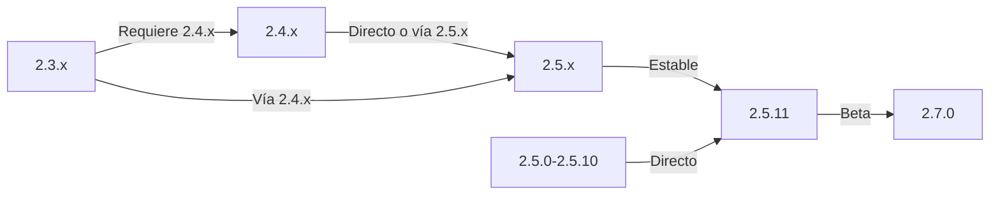

Esta guía cubre la actualización de XOOPS desde versiones antiguas al último lanzamiento mientras preserva tus datos y personalizaciones.

> **Información de Versión**
> - **Estable:** XOOPS 2.5.11
> - **Beta:** XOOPS 2.7.0 (pruebas)
> - **Futuro:** XOOPS 4.0 (en desarrollo - consulta Roadmap)

## Lista de Verificación Previa a la Actualización

Antes de comenzar la actualización, verifica:

- [ ] Versión actual de XOOPS documentada
- [ ] Versión XOOPS de destino identificada
- [ ] Copia de seguridad completa del sistema completada
- [ ] Copia de seguridad de la base de datos verificada
- [ ] Lista de módulos instalados registrada
- [ ] Modificaciones personalizadas documentadas
- [ ] Entorno de prueba disponible
- [ ] Ruta de actualización verificada (algunas versiones saltan lanzamientos intermedios)
- [ ] Recursos del servidor verificados (suficiente espacio en disco, memoria)
- [ ] Modo de mantenimiento habilitado

## Guía de Ruta de Actualización

Diferentes rutas de actualización dependiendo de la versión actual:



**Importante:** Nunca saltes versiones principales. Si estás actualizando de 2.3.x, primero actualiza a 2.4.x, luego a 2.5.x.

## Paso 1: Completar Copia de Seguridad del Sistema

### Copia de Seguridad de Base de Datos

Usa mysqldump para hacer copia de seguridad de la base de datos:

```bash
# Copia de seguridad completa de base de datos
mysqldump -u xoops_user -p xoops_db > /backups/xoops_db_backup_$(date +%Y%m%d_%H%M%S).sql

# Copia de seguridad comprimida
mysqldump -u xoops_user -p xoops_db | gzip > /backups/xoops_db_backup_$(date +%Y%m%d_%H%M%S).sql.gz
```

O usando phpMyAdmin:

1. Selecciona tu base de datos de XOOPS
2. Haz clic en la pestaña "Exportar"
3. Elige el formato "SQL"
4. Selecciona "Guardar como archivo"
5. Haz clic en "Ir"

Verifica el archivo de copia de seguridad:

```bash
# Comprueba el tamaño de la copia de seguridad
ls -lh /backups/xoops_db_backup*.sql

# Verifica la integridad de la copia de seguridad (sin comprimir)
head -20 /backups/xoops_db_backup_*.sql

# Verifica la copia de seguridad comprimida
zcat /backups/xoops_db_backup_*.sql.gz | head -20
```

### Copia de Seguridad del Sistema de Archivos

Haz copia de seguridad de todos los archivos de XOOPS:

```bash
# Copia de seguridad comprimida de archivos
tar -czf /backups/xoops_files_$(date +%Y%m%d_%H%M%S).tar.gz /var/www/html/xoops

# Sin comprimir (más rápido, requiere más espacio en disco)
tar -cf /backups/xoops_files_$(date +%Y%m%d_%H%M%S).tar /var/www/html/xoops

# Muestra el progreso de la copia de seguridad
tar -czf /backups/xoops_files_$(date +%Y%m%d_%H%M%S).tar.gz --verbose /var/www/html/xoops | tail
```

Almacena copias de seguridad con seguridad:

```bash
# Almacenamiento seguro de copia de seguridad
chmod 600 /backups/xoops_*
ls -lah /backups/

# Opcional: Copia en almacenamiento remoto
scp /backups/xoops_* user@backup-server:/secure/backups/
```

### Prueba la Restauración de Copia de Seguridad

**CRÍTICO:** Siempre prueba que tu copia de seguridad funciona:

```bash
# Verifica el contenido del archivo tar
tar -tzf /backups/xoops_files_*.tar.gz | head -20

# Extrae a ubicación de prueba
mkdir /tmp/restore_test
cd /tmp/restore_test
tar -xzf /backups/xoops_files_*.tar.gz

# Verifica que existan archivos clave
ls -la xoops/mainfile.php
ls -la xoops/install/
```
