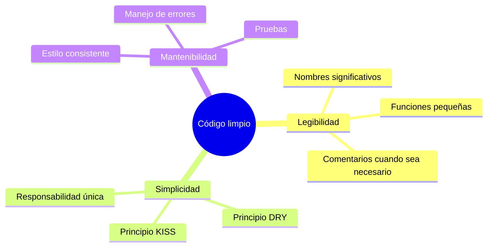

## Descripción general

El código limpio es código que es fácil de leer, comprender y mantener. Esta guía cubre principios de código limpio aplicados específicamente al desarrollo de módulos XOOPS.

## Principios principales



## Nombres significativos

### Variables

```php
// Mal
$d = new DateTime();
$u = $memberHandler->getUser($id);
$arr = [];

// Bien
$createdDate = new DateTime();
$currentUser = $memberHandler->getUser($userId);
$publishedArticles = [];
```

### Funciones

```php
// Mal
function process($data) { ... }
function handle($item) { ... }
function doStuff($x, $y) { ... }

// Bien
function publishArticle(Article $article): void { ... }
function calculateTotalPrice(array $items): float { ... }
function sendNotificationEmail(User $user, string $subject): bool { ... }
```

### Clases

```php
// Mal
class Manager { ... }
class Helper { ... }
class Utils { ... }

// Bien
class ArticleRepository { ... }
class NotificationService { ... }
class PermissionChecker { ... }
```

## Funciones pequeñas

### Responsabilidad única

```php
// Mal - hace demasiadas cosas
function processArticle($data) {
    // Validar
    if (empty($data['title'])) {
        throw new Exception('Título requerido');
    }
    // Guardar
    $article = new Article();
    $article->setTitle($data['title']);
    $this->repository->save($article);
    // Notificar
    $this->mailer->send($article->getAuthor(), 'Artículo publicado');
    // Registrar
    $this->logger->info('Artículo creado');
    return $article;
}

// Bien - cada función hace una cosa
function validateArticleData(array $data): void
{
    if (empty($data['title'])) {
        throw new ValidationException('Título requerido');
    }
}

function createArticle(array $data): Article
{
    $this->validateArticleData($data);
    return Article::create($data['title'], $data['content']);
}

function publishArticle(Article $article): void
{
    $this->repository->save($article);
    $this->notifyAuthor($article);
    $this->logArticleCreation($article);
}
```

### Longitud de la función

Mantenga las funciones cortas - idealmente menos de 20 líneas:

```php
// Good - focused function
public function getPublishedArticles(int $limit = 10): array
{
    $criteria = new CriteriaCompo();
    $criteria->add(new Criteria('status', 'published'));
    $criteria->setSort('published_at');
    $criteria->setOrder('DESC');
    $criteria->setLimit($limit);

    return $this->repository->getObjects($criteria);
}
```

## Principio DRY (No se repita)

### Extraiga el código común

```php
// Mal - código repetido
function getActiveUsers() {
    $criteria = new CriteriaCompo();
    $criteria->add(new Criteria('level', 0, '>'));
    $criteria->setSort('uname');
    return $this->userHandler->getObjects($criteria);
}

function getActiveAdmins() {
    $criteria = new CriteriaCompo();
    $criteria->add(new Criteria('level', 0, '>'));
    $criteria->add(new Criteria('is_admin', 1));
    $criteria->setSort('uname');
    return $this->userHandler->getObjects($criteria);
}

// Bien - lógica compartida extraída
function getUsers(CriteriaCompo $criteria): array
{
    $criteria->add(new Criteria('level', 0, '>'));
    $criteria->setSort('uname');
    return $this->userHandler->getObjects($criteria);
}

function getActiveUsers(): array
{
    return $this->getUsers(new CriteriaCompo());
}

function getActiveAdmins(): array
{
    $criteria = new CriteriaCompo();
    $criteria->add(new Criteria('is_admin', 1));
    return $this->getUsers($criteria);
}
```

## Manejo de errores

### Use excepciones apropiadamente

```php
// Mal - excepciones genéricas
throw new Exception('Error');

// Bien - excepciones específicas
throw new ArticleNotFoundException($articleId);
throw new PermissionDeniedException('No se puede editar el artículo');
throw new ValidationException(['title' => 'Título requerido']);
```

### Maneje errores con elegancia

```php
public function findArticle(string $id): ?Article
{
    try {
        return $this->repository->findById($id);
    } catch (DatabaseException $e) {
        $this->logger->error('Error de base de datos al buscar artículo', [
            'id' => $id,
            'error' => $e->getMessage()
        ]);
        throw new ServiceException('No se puede recuperar el artículo', 0, $e);
    }
}
```

## Comentarios

### Cuándo comentar

```php
// Mal - comentario obvio
// Incrementar contador
$counter++;

// Bien - explica por qué, no qué
// Caché por 1 hora para reducir la carga de la base de datos durante el tráfico máximo
$cache->set($key, $data, 3600);

// Bien - documenta algoritmo complejo
/**
 * Calcule la puntuación de relevancia del artículo usando el algoritmo TF-IDF.
 * Las puntuaciones más altas indican una mejor coincidencia con los términos de búsqueda.
 */
function calculateRelevanceScore(Article $article, array $terms): float
{
    // ...
}
```

## Organización del código

### Estructura de la clase

```php
class ArticleService
{
    // 1. Constantes
    private const MAX_TITLE_LENGTH = 255;

    // 2. Propiedades
    private ArticleRepository $repository;
    private EventDispatcher $events;

    // 3. Constructor
    public function __construct(
        ArticleRepository $repository,
        EventDispatcher $events
    ) {
        $this->repository = $repository;
        $this->events = $events;
    }

    // 4. Métodos públicos
    public function publish(Article $article): void { ... }
    public function archive(Article $article): void { ... }

    // 5. Métodos privados
    private function validateForPublication(Article $article): void { ... }
}
```

## Lista de verificación de código limpio

- [ ] Los nombres son significativos y pronunciables
- [ ] Las funciones hacen una sola cosa
- [ ] Las funciones son pequeñas (< 20 líneas)
- [ ] Sin código duplicado
- [ ] Manejo adecuado de errores con excepciones específicas
- [ ] Los comentarios explican "por qué", no "qué"
- [ ] Formato y estilo consistentes
- [ ] Sin números mágicos ni cadenas
- [ ] Las dependencias se inyectan, no se crean

## Documentación relacionada

- Code Organization
- Error Handling
- Testing Best Practices
- PHP Standards
