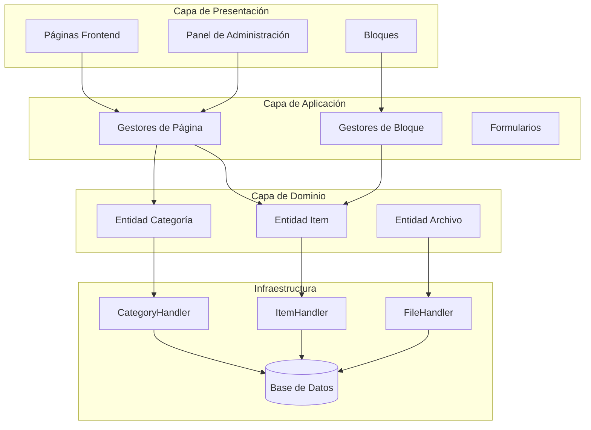
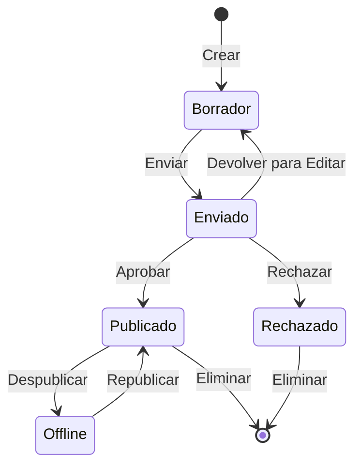

## Descripción General

Este documento proporciona un análisis técnico de la arquitectura del módulo Publisher, patrones y detalles de implementación. Úselo como referencia para entender cómo se estructura un módulo XOOPS de calidad de producción.

## Descripción General de la Arquitectura



## Estructura de Directorios

```
publisher/
├── admin/
│   ├── index.php           # Panel de administración
│   ├── item.php            # Gestión de artículos
│   ├── category.php        # Gestión de categorías
│   ├── permission.php      # Permisos
│   ├── file.php            # Gestor de archivos
│   └── menu.php            # Menú de administración
├── assets/
│   ├── css/
│   ├── js/
│   └── images/
├── class/
│   ├── Category.php        # Entidad de categoría
│   ├── CategoryHandler.php # Acceso de datos de categoría
│   ├── Item.php            # Entidad de artículo
│   ├── ItemHandler.php     # Acceso de datos de artículo
│   ├── File.php            # Archivo adjunto
│   ├── FileHandler.php     # Acceso de datos de archivo
│   ├── Form/               # Clases de formulario
│   ├── Common/             # Utilidades
│   └── Helper.php          # Asistente de módulo
├── include/
│   ├── common.php          # Inicialización
│   ├── functions.php       # Funciones de utilidad
│   ├── oninstall.php       # Ganchos de instalación
│   ├── onupdate.php        # Ganchos de actualización
│   └── search.php          # Integración de búsqueda
├── language/
├── templates/
├── sql/
└── xoops_version.php
```

## Análisis de Entidades

### Entidad Item (Artículo)

```php
class Item extends \XoopsObject
{
    // Fields
    public function initVar(): void
    {
        $this->initVar('itemid', XOBJ_DTYPE_INT, null, false);
        $this->initVar('categoryid', XOBJ_DTYPE_INT, 0, false);
        $this->initVar('title', XOBJ_DTYPE_TXTBOX, '', true);
        $this->initVar('subtitle', XOBJ_DTYPE_TXTBOX, '');
        $this->initVar('summary', XOBJ_DTYPE_TXTAREA, '');
        $this->initVar('body', XOBJ_DTYPE_TXTAREA, '', true);
        $this->initVar('uid', XOBJ_DTYPE_INT, 0);
        $this->initVar('status', XOBJ_DTYPE_INT, 0);
        $this->initVar('datesub', XOBJ_DTYPE_INT, time());
        // ... more fields
    }

    // Business methods
    public function isPublished(): bool
    {
        return $this->getVar('status') == _PUBLISHER_STATUS_PUBLISHED;
    }

    public function canEdit(int $userId): bool
    {
        return $this->getVar('uid') == $userId
            || $this->isAdmin($userId);
    }
}
```

### Patrón Handler

```php
class ItemHandler extends \XoopsPersistableObjectHandler
{
    public function __construct(\XoopsDatabase $db)
    {
        parent::__construct(
            $db,
            'publisher_items',
            Item::class,
            'itemid',
            'title'
        );
    }

    public function getPublishedItems(int $limit = 10): array
    {
        $criteria = new \CriteriaCompo();
        $criteria->add(new \Criteria('status', _PUBLISHER_STATUS_PUBLISHED));
        $criteria->setSort('datesub');
        $criteria->setOrder('DESC');
        $criteria->setLimit($limit);

        return $this->getObjects($criteria);
    }
}
```

## Sistema de Permisos

### Tipos de Permisos

| Permiso | Descripción |
|------------|-------------|
| `publisher_view` | Ver categoría/artículos |
| `publisher_submit` | Enviar nuevos artículos |
| `publisher_approve` | Aprobar automáticamente envíos |
| `publisher_moderate` | Revisar artículos pendientes |
| `publisher_global` | Permisos globales del módulo |

### Verificación de Permisos

```php
class PermissionHandler
{
    public function isGranted(string $permission, int $categoryId): bool
    {
        $userId = $GLOBALS['xoopsUser']?->uid() ?? 0;
        $groups = $this->getUserGroups($userId);

        return $this->grouppermHandler->checkRight(
            $permission,
            $categoryId,
            $groups,
            $this->helper->getModule()->mid()
        );
    }
}
```

## Estados del Flujo de Trabajo



## Estructura de Plantillas

### Plantillas Frontend

| Plantilla | Propósito |
|----------|---------|
| `publisher_index.tpl` | Página principal del módulo |
| `publisher_item.tpl` | Artículo individual |
| `publisher_category.tpl` | Listado de categorías |
| `publisher_submit.tpl` | Formulario de envío |
| `publisher_search.tpl` | Resultados de búsqueda |

### Plantillas de Bloques

| Plantilla | Propósito |
|----------|---------|
| `publisher_block_latest.tpl` | Artículos recientes |
| `publisher_block_spotlight.tpl` | Artículo destacado |
| `publisher_block_category.tpl` | Menú de categoría |

## Patrones Clave Utilizados

1. **Patrón Handler** - Encapsulación de acceso a datos
2. **Objeto de Valor** - Constantes de estado
3. **Método de Plantilla** - Generación de formularios
4. **Estrategia** - Diferentes modos de visualización
5. **Observador** - Notificaciones en eventos

## Lecciones para Desarrollo de Módulos

1. Usar XoopsPersistableObjectHandler para CRUD
2. Implementar permisos granulares
3. Separar presentación de lógica
4. Usar Criteria para consultas
5. Soportar múltiples estados de contenido
6. Integrar con el sistema de notificaciones de XOOPS

## Documentación Relacionada

- Creating-Articles - Gestión de artículos
- Managing-Categories - Sistema de categorías
- Permissions-Setup - Configuración de permisos
- Developer-Guide/Hooks-and-Events - Puntos de extensión
