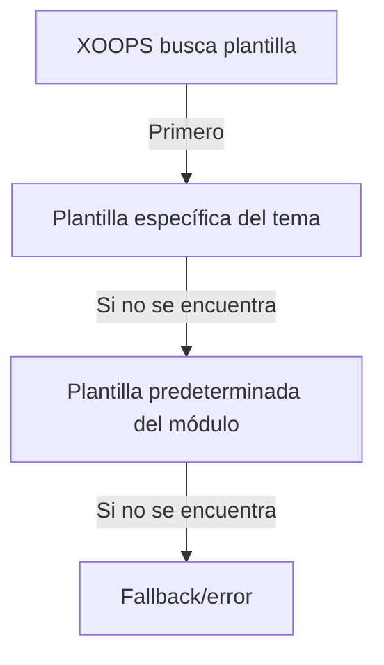

# Plantillas Personalizadas en Publisher

> Guía para crear y personalizar plantillas de Publisher usando Smarty, CSS y anulaciones de HTML.

---

## Descripción General del Sistema de Plantillas

### ¿Qué son las Plantillas?

Las plantillas controlan cómo Publisher muestra el contenido:

```
Las plantillas renderizan:
  ├── Visualización de artículos
  ├── Listados de categorías
  ├── Páginas de archivo
  ├── Listados de artículos
  ├── Secciones de comentarios
  ├── Resultados de búsqueda
  ├── Bloques
  └── Páginas de administración
```

### Tipos de Plantillas

```
Plantillas Base:
  ├── publisher_index.tpl (página principal del módulo)
  ├── publisher_item.tpl (artículo individual)
  ├── publisher_category.tpl (página de categoría)
  └── publisher_archive.tpl (vista de archivo)

Plantillas de Bloques:
  ├── publisher_block_latest.tpl
  ├── publisher_block_categories.tpl
  ├── publisher_block_archives.tpl
  └── publisher_block_top.tpl

Plantillas de Administración:
  ├── admin_articles.tpl
  ├── admin_categories.tpl
  └── admin_*
```

---

## Directorios de Plantillas

### Estructura de Archivos de Plantillas

```
Instalación XOOPS:
├── modules/publisher/
│   └── templates/
│       ├── Publisher/ (plantillas base)
│       │   ├── publisher_index.tpl
│       │   ├── publisher_item.tpl
│       │   ├── publisher_category.tpl
│       │   ├── blocks/
│       │   │   ├── publisher_block_latest.tpl
│       │   │   └── publisher_block_categories.tpl
│       │   └── css/
│       │       └── publisher.css
│       └── Themes/ (específico del tema)
│           ├── Classic/
│           ├── Modern/
│           └── Dark/

themes/yourtheme/
└── modules/
    └── publisher/
        ├── templates/
        │   └── publisher_custom.tpl
        ├── css/
        │   └── custom.css
        └── images/
            └── icons/
```

### Jerarquía de Plantillas



---

## Crear Plantillas Personalizadas

### Copiar Plantilla al Tema

**Método 1: Vía Gestor de Archivos**

```
1. Navegue a /themes/yourtheme/modules/publisher/
2. Cree directorio si no existe:
   - templates/
   - css/
   - js/ (opcional)
3. Copie archivo de plantilla del módulo:
   modules/publisher/templates/Publisher/publisher_item.tpl
   → themes/yourtheme/modules/publisher/templates/publisher_item.tpl
4. Edite copia del tema (¡no copia del módulo!)
```

**Método 2: Vía FTP/SSH**

```bash
# Crear directorio de anulación de tema
mkdir -p /path/to/xoops/themes/yourtheme/modules/publisher/templates

# Copiar archivos de plantilla
cp /path/to/xoops/modules/publisher/templates/Publisher/*.tpl \
   /path/to/xoops/themes/yourtheme/modules/publisher/templates/

# Verificar archivos copiados
ls /path/to/xoops/themes/yourtheme/modules/publisher/templates/
```

### Editar Plantilla Personalizada

Abra copia del tema en editor de texto:

```
Archivo: /themes/yourtheme/modules/publisher/templates/publisher_item.tpl

Editar:
  1. Mantenga variables Smarty intactas
  2. Modifique estructura HTML
  3. Agregue clases CSS personalizadas
  4. Ajuste lógica de visualización
```

---

## Conceptos Básicos de Plantillas Smarty

### Variables Smarty

El Publisher proporciona variables a las plantillas:

#### Variables de Artículo

```smarty
{* Variables de Artículo Individual *}
<h1>{$item->title()}</h1>
<p>{$item->description()}</p>
<p>{$item->body()}</p>
<p>Por {$item->uname()} en {$item->date('l, F j, Y')}</p>
<p>Categoría: {$item->category}</p>
<p>Vistas: {$item->views()}</p>
```

#### Variables de Categoría

```smarty
{* Variables de Categoría *}
<h2>{$category->name()}</h2>
<p>{$category->description()}</p>
image()}" alt="{$category->name()}">
<p>Artículos: {$category->itemCount()}</p>
```

#### Variables de Bloque

```smarty
{* Bloque de Artículos Recientes *}
{foreach from=$items item=item}
  <div class="article">
    <h3>{$item->title()}</h3>
    <p>{$item->summary()}</p>
  </div>
{/foreach}
```

### Sintaxis Común de Smarty

```smarty
{* Variable *}
{$variable}
{$array.key}
{$object->method()}

{* Condicional *}
{if $condition}
  <p>Contenido mostrado si es verdadero</p>
{else}
  <p>Contenido mostrado si es falso</p>
{/if}

{* Bucle *}
{foreach from=$array item=item}
  <li>{$item}</li>
{/foreach}

{* Funciones *}
{$variable|truncate:100:"..."}
{$date|date_format:"%Y-%m-%d"}
{$text|htmlspecialchars}

{* Comentarios *}
{* Este es un comentario Smarty, no se muestra *}
```

---

## Template Examples

### Single Article Template

**File: publisher_item.tpl**

```smarty
<!-- Article Detail View -->
<div class="publisher-item">

  <!-- Header Section -->
  <div class="article-header">
    <h1>{$item->title()}</h1>

    {if $item->subtitle()}
      <h2 class="article-subtitle">{$item->subtitle()}</h2>
    {/if}

    <div class="article-meta">
      <span class="author">
        By <a href="{$item->authorUrl()}">{$item->uname()}</a>
      </span>
      <span class="date">
        {$item->date('l, F j, Y')}
      </span>
      <span class="category">
        <a href="{$item->categoryUrl()}">
          {$item->category}
        </a>
      </span>
      <span class="views">
        {$item->views()} views
      </span>
    </div>
  </div>

  <!-- Featured Image -->
  {if $item->image()}
    <div class="article-featured-image">
      image()}"
           alt="{$item->title()}"
           class="img-fluid">
    </div>
  {/if}

  <!-- Article Body -->
  <div class="article-content">
    {$item->body()}
  </div>

  <!-- Tags -->
  {if $item->tags()}
    <div class="article-tags">
      <strong>Tags:</strong>
      {foreach from=$item->tags() item=tag}
        <span class="tag">
          <a href="{$tag->url()}">{$tag->name()}</a>
        </span>
      {/foreach}
    </div>
  {/if}

  <!-- Footer Section -->
  <div class="article-footer">
    <div class="article-actions">
      {if $canEdit}
        <a href="{$editUrl}" class="btn btn-primary">Edit</a>
      {/if}
      {if $canDelete}
        <a href="{$deleteUrl}" class="btn btn-danger">Delete</a>
      {/if}
    </div>

    {if $allowRatings}
      <div class="article-rating">
        <!-- Rating component -->
      </div>
    {/if}
  </div>

</div>

<!-- Comments Section -->
{if $allowComments}
  <div class="article-comments">
    <h3>Comments</h3>
    {include file="publisher_comments.tpl"}
  </div>
{/if}
```

### Category Listing Template

**File: publisher_category.tpl**

```smarty
<!-- Category Page -->
<div class="publisher-category">

  <!-- Category Header -->
  <div class="category-header">
    <h1>{$category->name()}</h1>

    {if $category->image()}
      image()}"
           alt="{$category->name()}"
           class="category-image">
    {/if}

    {if $category->description()}
      <p class="category-description">
        {$category->description()}
      </p>
    {/if}
  </div>

  <!-- Subcategories -->
  {if $subcategories}
    <div class="subcategories">
      <h3>Subcategories</h3>
      <ul>
        {foreach from=$subcategories item=sub}
          <li>
            <a href="{$sub->url()}">{$sub->name()}</a>
            ({$sub->itemCount()} articles)
          </li>
        {/foreach}
      </ul>
    </div>
  {/if}

  <!-- Articles List -->
  <div class="articles-list">
    <h2>Articles</h2>

    {if count($items) > 0}
      {foreach from=$items item=item}
        <article class="article-preview">
          {if $item->image()}
            <div class="article-image">
              <a href="{$item->url()}">
                image()}" alt="{$item->title()}">
              </a>
            </div>
          {/if}

          <div class="article-content">
            <h3>
              <a href="{$item->url()}">{$item->title()}</a>
            </h3>

            <div class="article-meta">
              <span class="date">{$item->date('M d, Y')}</span>
              <span class="author">by {$item->uname()}</span>
            </div>

            <p class="article-excerpt">
              {$item->description()|truncate:200:"..."}
            </p>

            <a href="{$item->url()}" class="read-more">
              Read More →
            </a>
          </div>
        </article>
      {/foreach}

      <!-- Pagination -->
      {if $pagination}
        <nav class="pagination">
          {$pagination}
        </nav>
      {/if}
    {else}
      <p class="no-articles">
        No articles in this category yet.
      </p>
    {/if}
  </div>

</div>
```

### Latest Articles Block Template

**File: publisher_block_latest.tpl**

```smarty
<!-- Latest Articles Block -->
<div class="publisher-block-latest">
  <h3>{$block_title|default:"Latest Articles"}</h3>

  {if count($items) > 0}
    <ul class="article-list">
      {foreach from=$items item=item name=articles}
        <li class="article-item">
          <a href="{$item->url()}" title="{$item->title()}">
            {$item->title()}
          </a>
          <span class="date">
            {$item->date('M d, Y')}
          </span>

          {if $show_summary && $item->description()}
            <p class="summary">
              {$item->description()|truncate:80:"..."}
            </p>
          {/if}
        </li>
      {/foreach}
    </ul>
  {else}
    <p>No articles available.</p>
  {/if}
</div>
```

---

## Estilización con CSS

### Archivos CSS Personalizados

Cree CSS personalizado en el tema:

```
/themes/yourtheme/modules/publisher/css/custom.css
```

### Estructura de Plantilla Base

Entienda la estructura HTML:

```html
<!-- Publisher Module -->
<div class="publisher-module">

  <!-- Item View -->
  <div class="publisher-item">
    <div class="article-header">...</div>
    <div class="article-featured-image">...</div>
    <div class="article-content">...</div>
    <div class="article-footer">...</div>
  </div>

  <!-- Category View -->
  <div class="publisher-category">
    <div class="category-header">...</div>
    <div class="articles-list">...</div>
  </div>

  <!-- Block -->
  <div class="publisher-block-latest">
    <ul class="article-list">...</ul>
  </div>

</div>
```

### CSS Examples

```css
/* Article Container */
.publisher-item {
  background: #fff;
  border: 1px solid #ddd;
  border-radius: 4px;
  padding: 20px;
  margin-bottom: 20px;
}

/* Article Header */
.article-header {
  border-bottom: 2px solid #f0f0f0;
  padding-bottom: 15px;
  margin-bottom: 20px;
}

.article-header h1 {
  font-size: 2.5em;
  margin: 0 0 10px 0;
  color: #333;
}

.article-subtitle {
  font-size: 1.3em;
  color: #666;
  font-style: italic;
  margin: 0;
}

/* Article Meta Information */
.article-meta {
  font-size: 0.9em;
  color: #999;
}

.article-meta span {
  margin-right: 20px;
}

.article-meta a {
  color: #0066cc;
  text-decoration: none;
}

.article-meta a:hover {
  text-decoration: underline;
}

/* Article Featured Image */
.article-featured-image {
  margin: 20px 0;
  text-align: center;
}

.article-featured-image img {
  max-width: 100%;
  height: auto;
  border-radius: 4px;
}

/* Article Content */
.article-content {
  font-size: 1.1em;
  line-height: 1.8;
  color: #333;
}

.article-content h2 {
  font-size: 1.8em;
  margin: 30px 0 15px 0;
  color: #222;
}

.article-content h3 {
  font-size: 1.4em;
  margin: 20px 0 10px 0;
  color: #444;
}

.article-content p {
  margin-bottom: 15px;
}

.article-content ul,
.article-content ol {
  margin: 15px 0 15px 30px;
}

.article-content li {
  margin-bottom: 8px;
}

/* Article Tags */
.article-tags {
  margin-top: 20px;
  padding-top: 20px;
  border-top: 1px solid #f0f0f0;
}

.tag {
  display: inline-block;
  background: #f0f0f0;
  padding: 5px 10px;
  margin: 5px 5px 5px 0;
  border-radius: 3px;
  font-size: 0.9em;
}

.tag a {
  color: #0066cc;
  text-decoration: none;
}

.tag a:hover {
  text-decoration: underline;
}

/* Category Articles List */
.publisher-category .articles-list {
  margin-top: 30px;
}

.article-preview {
  display: flex;
  margin-bottom: 30px;
  padding-bottom: 30px;
  border-bottom: 1px solid #f0f0f0;
}

.article-preview:last-child {
  border-bottom: none;
}

.article-image {
  flex: 0 0 200px;
  margin-right: 20px;
}

.article-image img {
  width: 100%;
  height: 150px;
  object-fit: cover;
  border-radius: 4px;
}

.article-content {
  flex: 1;
}

/* Responsive */
@media (max-width: 768px) {
  .article-preview {
    flex-direction: column;
  }

  .article-image {
    flex: 1;
    margin: 0 0 15px 0;
  }

  .article-header h1 {
    font-size: 1.8em;
  }
}
```

---

## Referencia de Variables de Plantilla

### Objeto Item (Artículo)

```smarty
{* Propiedades del Artículo *}
{$item->id()}              {* ID del Artículo *}
{$item->title()}           {* Título del artículo *}
{$item->description()}     {* Descripción breve *}
{$item->body()}            {* Contenido completo *}
{$item->subtitle()}        {* Subtítulo *}
{$item->uname()}           {* Nombre de usuario del autor *}
{$item->authorId()}        {* ID de usuario del autor *}
{$item->date()}            {* Fecha de publicación *}
{$item->modified()}        {* Última modificación *}
{$item->image()}           {* URL de imagen destacada *}
{$item->views()}           {* Recuento de vistas *}
{$item->categoryId()}      {* ID de Categoría *}
{$item->category()}        {* Nombre de la categoría *}
{$item->categoryUrl()}     {* URL de la categoría *}
{$item->url()}             {* URL del artículo *}
{$item->status()}          {* Estado del artículo *}
{$item->rating()}          {* Calificación promedio *}
{$item->comments()}        {* Recuento de comentarios *}
{$item->tags()}            {* Array de etiquetas del artículo *}

{* Métodos Formateados *}
{$item->date('Y-m-d')}               {* Fecha formateada *}
{$item->description()|truncate:100}  {* Truncado *}
```

### Objeto Categoría

```smarty
{* Propiedades de Categoría *}
{$category->id()}          {* ID de Categoría *}
{$category->name()}        {* Nombre de la categoría *}
{$category->description()} {* Descripción *}
{$category->image()}       {* URL de Imagen *}
{$category->parentId()}    {* ID de categoría padre *}
{$category->itemCount()}   {* Recuento de artículos *}
{$category->url()}         {* URL de Categoría *}
{$category->status()}      {* Estado *}
```

### Variables de Bloque

```smarty
{$items}           {* Array de elementos *}
{$categories}      {* Array de categorías *}
{$pagination}      {* HTML de paginación *}
{$total}           {* Recuento total *}
{$limit}           {* Elementos por página *}
{$page}            {* Página actual *}
```

---

## Condicionales de Plantilla

### Verificaciones Condicionales Comunes

```smarty
{* Verificar si la variable existe y no está vacía *}
{if $variable}
  <p>{$variable}</p>
{/if}

{* Verificar si el array tiene elementos *}
{if count($items) > 0}
  {foreach from=$items item=item}
    <li>{$item->title()}</li>
  {/foreach}
{else}
  <p>No hay elementos disponibles.</p>
{/if}

{* Verificar permisos de usuario *}
{if $canEdit}
  <a href="edit.php?id={$item->id()}">Editar</a>
{/if}

{if $isAdmin}
  <a href="delete.php?id={$item->id()}">Eliminar</a>
{/if}

{* Verificar configuración del módulo *}
{if $allowComments}
  {include file="publisher_comments.tpl"}
{/if}

{* Verificar estado *}
{if $item->status() == 1}
  <span class="published">Publicado</span>
{elseif $item->status() == 0}
  <span class="draft">Borrador</span>
{/if}
```

---

## Técnicas Avanzadas de Plantilla

### Incluir Otras Plantillas

```smarty
{* Incluir otra plantilla *}
{include file="publisher_comments.tpl"}

{* Incluir con variables *}
{include file="publisher_article_preview.tpl" item=$item}

{* Incluir si existe *}
{include file="custom_header.tpl"|default:"header.tpl"}
```

### Asignar Variables en Plantilla

```smarty
{* Asignar variable para uso posterior *}
{assign var="articleTitle" value=$item->title()}

{* Usar variable asignada *}
<h1>{$articleTitle}</h1>

{* Asignar valores complejos *}
{assign var="count" value=$items|count}
{if $count > 0}
  <p>Se encontraron {$count} artículos</p>
{/if}
```

### Filtros de Plantilla

```smarty
{* Filtros de texto *}
{$text|htmlspecialchars}        {* Escapar HTML *}
{$text|strip_tags}              {* Eliminar etiquetas HTML *}
{$text|truncate:100:"..."}     {* Truncar texto *}
{$text|upper}                   {* MAYÚSCULAS *}
{$text|lower}                   {* minúsculas *}

{* Filtros de fecha *}
{$date|date_format:"%Y-%m-%d"}  {* Formatear fecha *}
{$date|date_format:"%l, %F %j, %Y"} {* Formato completo *}

{* Filtros numéricos *}
{$number|string_format:"%.2f"}  {* Formatear número *}
{$number|number_format}         {* Agregar separadores *}

{* Filtros de array *}
{$array|implode:", "}           {* Unir array *}
{$array|count}                  {* Contar elementos *}
```

---

## Depuración de Plantillas

### Mostrar Variables Smarty

Para depuración (eliminar en producción):

```smarty
{* Mostrar valor de variable *}
<pre>{$variable|print_r}</pre>

{* Mostrar todas las variables disponibles *}
<pre>{$smarty.all|print_r}</pre>

{* Verificar si la variable existe *}
{if isset($variable)}
  La variable existe
{/if}

{* Mostrar información de depuración *}
{if $debug}
  Elemento: {$item->id()}<br>
  Título: {$item->title()}<br>
  Categoría: {$item->categoryId()}<br>
{/if}
```

### Habilitar Modo de Depuración

En `/modules/publisher/xoops_version.php` o configuración de administración:

```php
// Habilitar depuración
define('PUBLISHER_DEBUG', true);
```

---

## Migración de Plantillas

### Desde Versión Anterior de Publisher

Si actualiza desde una versión anterior:

1. Compare archivos de plantilla antiguos y nuevos
2. Combine cambios personalizados
3. Utilice nuevos nombres de variables
4. Pruebe exhaustivamente
5. Haga copia de seguridad de plantillas antiguas

### Ruta de Actualización

```
Plantilla antigua      Plantilla nueva          Acción
publisher_item.tpl → publisher_item.tpl   Combinar personalizaciones
publisher_cat.tpl  → publisher_category.tpl Renombrar, combinar
block_latest.tpl   → publisher_block_latest.tpl Renombrar, verificar
```

---

## Mejores Prácticas

### Directrices de Plantilla

```
✓ Mantener lógica empresarial en PHP, lógica de visualización en plantillas
✓ Usar nombres de clase CSS significativos
✓ Comentar secciones complejas
✓ Probar diseño responsivo
✓ Validar salida HTML
✓ Escapar datos del usuario
✓ Usar HTML semántico
✓ Mantener plantillas DRY (No Te Repitas)
```

### Consejos de Rendimiento

```
✓ Minimizar consultas de base de datos en plantillas
✓ Caché de plantillas compiladas
✓ Carga perezosa de imágenes
✓ Minificar CSS/JavaScript
✓ Usar CDN para activos
✓ Optimizar imágenes
✗ Evitar lógica Smarty compleja
```

---

## Documentación Relacionada

- Referencia de API
- Ganchos y Eventos
- Configuración
- Creación de Artículos

---

## Recursos

- [Documentación de Smarty](https://www.smarty.net/documentation)
- [Publisher GitHub](https://github.com/XoopsModules25x/publisher)
- [Guía de Plantillas XOOPS](../../02-Core-Concepts/Templates/Smarty-Basics.md)

---

#publisher #plantillas #smarty #personalización #tematización #xoops
