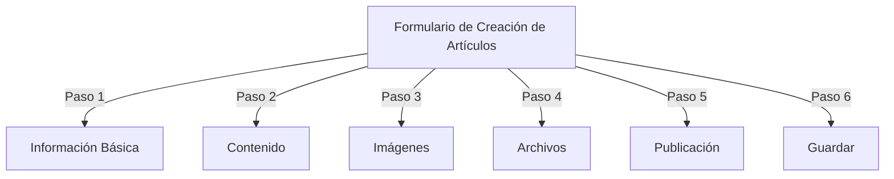
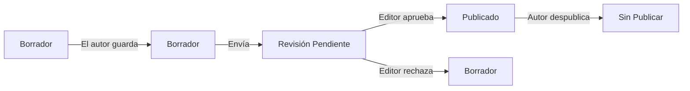
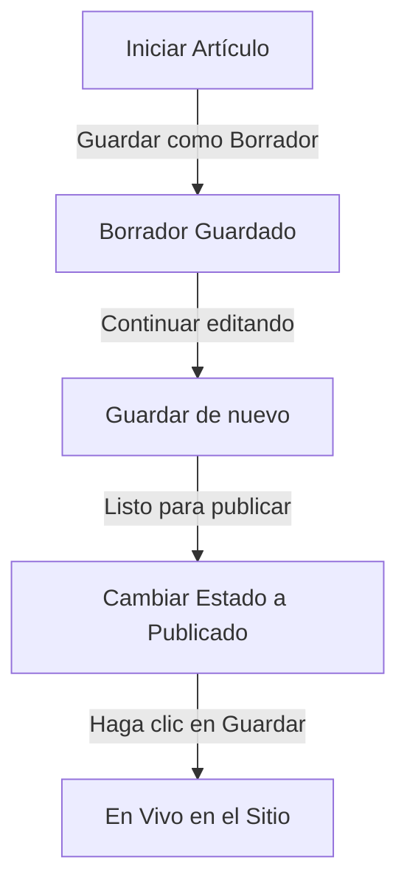

# Crear Artículos en Publisher

> Guía paso a paso para crear, editar, formatear y publicar artículos en el módulo Publisher.

---

## Acceder a la Gestión de Artículos

### Navegación del Panel de Admin

```
Panel de Admin
└── Módulos
    └── Publisher
        └── Artículos
            ├── Crear Nuevo
            ├── Editar
            ├── Eliminar
            └── Publicar
```

### Camino Más Rápido

1. Inicie sesión como **Administrador**
2. Haga clic en **Módulos** en la barra de admin
3. Encuentre **Publisher**
4. Haga clic en el enlace **Admin**
5. Haga clic en **Artículos** en el menú izquierdo
6. Haga clic en el botón **Agregar Artículo**

---

## Formulario de Creación de Artículos

### Información Básica

Al crear un nuevo artículo, complete las siguientes secciones:



---

## Paso 1: Información Básica

### Campos Requeridos

#### Título del Artículo

```
Campo: Título
Tipo: Entrada de texto (obligatorio)
Longitud máxima: 255 caracteres
Ejemplo: "Top 5 Consejos para Fotografía Mejor"
```

**Pautas:**
- Descriptivo y específico
- Incluya palabras clave para SEO
- Evite TODO MAYÚSCULAS
- Mantenga menos de 60 caracteres para la mejor visualización

#### Seleccionar Categoría

```
Campo: Categoría
Tipo: Menú desplegable (obligatorio)
Opciones: Lista de categorías creadas
Ejemplo: Fotografía > Tutoriales
```

**Consejos:**
- Categorías principales y subcategorías disponibles
- Elija la categoría más relevante
- Una sola categoría por artículo
- Se puede cambiar después

#### Subtítulo del Artículo (Opcional)

```
Campo: Subtítulo
Tipo: Entrada de texto (opcional)
Longitud máxima: 255 caracteres
Ejemplo: "Aprenda conceptos fundamentales de fotografía en 5 pasos fáciles"
```

**Úselo para:**
- Titular de resumen
- Texto de teaser
- Título extendido

### Descripción del Artículo

#### Descripción Corta

```
Campo: Descripción Corta
Tipo: Área de texto (opcional)
Longitud máxima: 500 caracteres
```

**Propósito:**
- Texto de vista previa del artículo
- Se muestra en el listado de categorías
- Se usa en resultados de búsqueda
- Descripción meta para SEO

**Ejemplo:**
```
"Descubre técnicas esenciales de fotografía que transformarán tus fotos
de ordinarias a extraordinarias. Esta guía completa cubre composición,
iluminación y configuraciones de exposición."
```

#### Contenido Completo

```
Campo: Cuerpo del Artículo
Tipo: Editor WYSIWYG (obligatorio)
Longitud máxima: Ilimitada
Formato: HTML
```

El área de contenido principal del artículo con edición de texto enriquecido.

---

## Paso 2: Formateo de Contenido

### Usando el Editor WYSIWYG

#### Formato de Texto

```
Negrita:        Ctrl+B o haga clic en botón [B]
Cursiva:        Ctrl+I o haga clic en botón [I]
Subrayado:      Ctrl+U o haga clic en botón [U]
Tachado:        Alt+Mayús+D o haga clic en botón [S]
Subíndice:      Ctrl+, (coma)
Superíndice:    Ctrl+. (punto)
```

#### Estructura de Encabezados

Cree una jerarquía de documentos adecuada:

```html
<h1>Título del Artículo</h1>      <!-- Usar una vez en la parte superior -->
<h2>Sección Principal</h2>        <!-- Para secciones principales -->
<h3>Subsección</h3>               <!-- Para subtemas -->
<h4>Subsección</h4>               <!-- Para detalles -->
```

**En el Editor:**
- Haga clic en el menú desplegable **Formato**
- Seleccione nivel de encabezado (H1-H6)
- Escriba su encabezado

#### Listas

**Lista Desordenada (Viñetas):**

```markdown
• Punto uno
• Punto dos
• Punto tres
```

Pasos en editor:
1. Haga clic en botón [≡] Lista con viñetas
2. Escriba cada punto
3. Presione Enter para el siguiente elemento
4. Presione Retroceso dos veces para terminar la lista

**Lista Ordenada (Numerada):**

```markdown
1. Primer paso
2. Segundo paso
3. Tercer paso
```

Pasos en editor:
1. Haga clic en botón [1.] Lista numerada
2. Escriba cada elemento
3. Presione Enter para el siguiente
4. Presione Retroceso dos veces para terminar

**Listas Anidadas:**

```markdown
1. Punto principal
   a. Sub-punto
   b. Sub-punto
2. Siguiente punto
```

Pasos:
1. Cree primera lista
2. Presione Tab para indentar
3. Cree elementos anidados
4. Presione Mayús+Tab para desindentación

#### Enlaces

**Agregar Hipervínculo:**

1. Seleccione texto a vincular
2. Haga clic en botón **[🔗] Enlace**
3. Ingrese URL: `https://example.com`
4. Opcional: Agregue título/destino
5. Haga clic en **Insertar Enlace**

**Eliminar Enlace:**

1. Haga clic dentro del texto vinculado
2. Haga clic en botón **[🔗] Eliminar Enlace**

#### Código y Citas

**Cita en Bloque:**

```
"Esta es una cita importante de un experto"
- Atribución
```

Pasos:
1. Escriba texto de cita
2. Haga clic en botón **[❝] Cita en Bloque**
3. El texto se indenta y estiliza

**Bloque de Código:**

```python
def hello_world():
    print("Hola, Mundo!")
```

Pasos:
1. Haga clic en **Formato → Código**
2. Pegue código
3. Seleccione idioma (opcional)
4. El código se muestra con resaltado de sintaxis

---

## Paso 3: Agregar Imágenes

### Imagen Destacada (Imagen Hero)

```
Campo: Imagen Destacada / Imagen Principal
Tipo: Carga de imagen
Formato: JPG, PNG, GIF, WebP
Tamaño máximo: 5 MB
Recomendado: 600x400 px
```

**Para Cargar:**

1. Haga clic en botón **Cargar Imagen**
2. Seleccione imagen de la computadora
3. Recorte/redimensione si es necesario
4. Haga clic en **Usar Esta Imagen**

**Colocación de Imagen:**
- Se muestra en la parte superior del artículo
- Se usa en listados de categorías
- Se muestra en archivo
- Se usa para compartir en redes sociales

### Imágenes Intercaladas

Inserte imágenes dentro del texto del artículo:

1. Posicione el cursor en el editor donde la imagen debe ir
2. Haga clic en botón **[🖼️] Imagen** en la barra de herramientas
3. Elija opción de carga:
   - Cargar imagen nueva
   - Seleccionar de galería
   - Ingrese URL de imagen
4. Configure:
   ```
   Tamaño de Imagen:
   - Ancho: 300-600 px
   - Alto: Auto (mantiene proporción)
   - Alineación: Izquierda/Centro/Derecha
   ```
5. Haga clic en **Insertar Imagen**

**Envolver Texto Alrededor de Imagen:**

En editor después de insertar:

```html
<!-- La imagen flota a la izquierda, el texto se envuelve alrededor -->

```

### Galería de Imágenes

Crear galería con múltiples imágenes:

1. Haga clic en botón **Galería** (si está disponible)
2. Cargue múltiples imágenes:
   - Clic único: Agregar uno
   - Arrastrar y soltar: Agregar múltiples
3. Organice orden arrastrando
4. Establezca subtítulos para cada imagen
5. Haga clic en **Crear Galería**

---

## Paso 4: Adjuntar Archivos

### Agregar Archivos Adjuntos

```
Campo: Archivos Adjuntos
Tipo: Carga de archivo (múltiples permitidos)
Soportado: PDF, DOC, XLS, ZIP, etc.
Máximo por archivo: 10 MB
Máximo por artículo: 5 archivos
```

**Para Adjuntar:**

1. Haga clic en botón **Agregar Archivo**
2. Seleccione archivo de la computadora
3. Opcional: Agregue descripción del archivo
4. Haga clic en **Adjuntar Archivo**
5. Repita para múltiples archivos

**Ejemplos de Archivo:**
- Guías PDF
- Hojas de cálculo Excel
- Documentos de Word
- Archivos ZIP
- Código fuente

### Gestionar Archivos Adjuntos

**Editar Archivo:**

1. Haga clic en nombre de archivo
2. Edite descripción
3. Haga clic en **Guardar**

**Eliminar Archivo:**

1. Encuentre archivo en lista
2. Haga clic en icono **[×] Eliminar**
3. Confirme eliminación

---

## Paso 5: Publicación y Estado

### Estado del Artículo

```
Campo: Estado
Tipo: Menú desplegable
Opciones:
  - Borrador: No publicado, solo el autor ve
  - Pendiente: Esperando aprobación
  - Publicado: En vivo en el sitio
  - Archivado: Contenido antiguo
  - Sin Publicar: Fue publicado, ahora oculto
```

**Flujo de Estado del Trabajo:**



### Opciones de Publicación

#### Publicar Inmediatamente

```
Estado: Publicado
Fecha de Inicio: Hoy (rellenado automáticamente)
Fecha de Fin: (deje en blanco para sin expiración)
```

#### Programar para Después

```
Estado: Programado
Fecha de Inicio: Fecha futura/hora
Ejemplo: 15 de Febrero de 2024 a las 9:00 AM
```

El artículo se publicará automáticamente en la hora especificada.

#### Establecer Expiración

```
Habilitar Expiración: Sí
Fecha de Expiración: Fecha futura
Acción: Archivo/Ocultar/Eliminar
Ejemplo: 1 de Abril de 2024 (artículo se archiva automáticamente)
```

### Opciones de Visibilidad

```yaml
Mostrar Artículo:
  - Mostrar en primera página: Sí/No
  - Mostrar en categoría: Sí/No
  - Incluir en búsqueda: Sí/No
  - Incluir en artículos recientes: Sí/No

Artículo Destacado:
  - Marcar como destacado: Sí/No
  - Posición de sección destacada: (número)
```

---

## Paso 6: SEO y Metadatos

### Configuración de SEO

```
Campo: Configuración de SEO (Expandir sección)
```

#### Descripción Meta

```
Campo: Descripción Meta
Tipo: Texto (160 caracteres recomendado)
Usado por: Motores de búsqueda, redes sociales

Ejemplo:
"Aprenda conceptos fundamentales de fotografía en 5 pasos fáciles.
Descubre técnicas de composición, iluminación y exposición."
```

#### Palabras Clave Meta

```
Campo: Palabras Clave Meta
Tipo: Lista separada por comas
Máximo: 5-10 palabras clave

Ejemplo: Fotografía, Tutorial, Composición, Iluminación, Exposición
```

#### Slug de URL

```
Campo: Slug de URL (auto-generado desde el título)
Tipo: Texto
Formato: minúsculas, guiones, sin espacios

Automático: "top-5-consejos-para-fotografia-mejor"
Editar: Cambiar antes de publicar
```

#### Etiquetas Open Graph

Auto-generadas a partir de información del artículo:
- Título
- Descripción
- Imagen destacada
- URL del artículo
- Fecha de publicación

Utilizado por Facebook, LinkedIn, WhatsApp, etc.

---

## Paso 7: Comentarios e Interacción

### Configuración de Comentarios

```yaml
Permitir Comentarios:
  - Habilitar: Sí/No
  - Predeterminado: Heredar de preferencias
  - Anulación: Específico de este artículo

Moderar Comentarios:
  - Requerir aprobación: Sí/No
  - Predeterminado: Heredar de preferencias
```

### Configuración de Calificación

```yaml
Permitir Calificaciones:
  - Habilitar: Sí/No
  - Escala: 5 estrellas (predeterminado)
  - Mostrar promedio: Sí/No
  - Mostrar contador: Sí/No
```

---

## Paso 8: Opciones Avanzadas

### Autor y Línea de Crédito

```
Campo: Autor
Tipo: Menú desplegable
Predeterminado: Usuario actual
Opciones: Todos los usuarios con permiso de autor

Mostrar:
  - Mostrar nombre del autor: Sí/No
  - Mostrar biografía del autor: Sí/No
  - Mostrar avatar del autor: Sí/No
```

### Bloqueo de Edición

```
Campo: Bloqueo de Edición
Propósito: Prevenir cambios accidentales

Bloquear Artículo:
  - Bloqueado: Sí/No
  - Razón del bloqueo: "Versión final"
  - Fecha de desbloqueo: (opcional)
```

### Historial de Revisiones

Versiones auto-guardadas del artículo:

```
Ver Revisiones:
  - Haga clic en "Historial de Revisiones"
  - Muestra todas las versiones guardadas
  - Compara versiones
  - Restaurar versión anterior
```

---

## Guardar y Publicar

### Flujo de Trabajo de Guardado



### Guardar Artículo

**Auto-guardar:**
- Disparado cada 60 segundos
- Se guarda como borrador automáticamente
- Muestra "Último guardado: hace 2 minutos"

**Guardado Manual:**
- Haga clic en **Guardar y Continuar** para seguir editando
- Haga clic en **Guardar y Ver** para ver versión publicada
- Haga clic en **Guardar** para guardar y cerrar

### Publicar Artículo

1. Establezca **Estado**: Publicado
2. Establezca **Fecha de Inicio**: Ahora (o fecha futura)
3. Haga clic en **Guardar** o **Publicar**
4. Aparece mensaje de confirmación
5. El artículo está en vivo (o programado)

---

## Edición de Artículos Existentes

### Acceder al Editor de Artículos

1. Vaya a **Admin → Publisher → Artículos**
2. Encuentre artículo en la lista
3. Haga clic en icono/botón **Editar**
4. Realice cambios
5. Haga clic en **Guardar**

### Edición Masiva

Editar múltiples artículos a la vez:

```
1. Vaya a lista de Artículos
2. Seleccione artículos (casillas de verificación)
3. Elija "Edición Masiva" del menú desplegable
4. Cambie campo seleccionado
5. Haga clic en "Actualizar Todo"

Disponible para:
  - Estado
  - Categoría
  - Destacado (Sí/No)
  - Autor
```

### Vista Previa del Artículo

Antes de publicar:

1. Haga clic en botón **Vista Previa**
2. Vea como los lectores verán
3. Compruebe formato
4. Pruebe enlaces
5. Regrese al editor para ajustar

---

## Gestión de Artículos

### Ver Todos los Artículos

**Vista de Lista de Artículos:**

```
Admin → Publisher → Artículos

Columnas:
  - Título
  - Categoría
  - Autor
  - Estado
  - Fecha de creación
  - Fecha de modificación
  - Acciones (Editar, Eliminar, Vista Previa)

Ordenación:
  - Por título (A-Z)
  - Por fecha (más nuevo/antiguo)
  - Por estado (Publicado/Borrador)
  - Por categoría
```

### Filtrar Artículos

```
Opciones de Filtro:
  - Por categoría
  - Por estado
  - Por autor
  - Por rango de fecha
  - Búsqueda por título

Ejemplo: Mostrar todos los artículos "Borrador" de "Juan" en categoría "Noticias"
```

### Eliminar Artículo

**Eliminación Suave (Recomendada):**

1. Cambie **Estado**: Sin Publicar
2. Haga clic en **Guardar**
3. Artículo oculto pero no eliminado
4. Puede restaurarse después

**Eliminación Permanente:**

1. Seleccione artículo en lista
2. Haga clic en botón **Eliminar**
3. Confirme eliminación
4. Artículo eliminado permanentemente

---

## Mejores Prácticas de Contenido

### Escribir Artículos de Calidad

```
Estructura:
  ✓ Título atractivo
  ✓ Subtítulo/descripción clara
  ✓ Párrafo de apertura atractivo
  ✓ Secciones lógicas con encabezados
  ✓ Elementos visuales de apoyo
  ✓ Conclusión/resumen
  ✓ Llamada a la acción

Longitud:
  - Publicaciones de blog: 500-2000 palabras
  - Noticias: 300-800 palabras
  - Guías: 2000-5000 palabras
  - Mínimo: 300 palabras
```

### Optimización de SEO

```
Optimización de Título:
  ✓ Incluir palabra clave principal
  ✓ Mantener menos de 60 caracteres
  ✓ Poner palabra clave al inicio
  ✓ Ser descriptivo y específico

Optimización de Contenido:
  ✓ Usar encabezados (H1, H2, H3)
  ✓ Incluir palabra clave en encabezado
  ✓ Usar negrita para términos importantes
  ✓ Agregar enlaces descriptivos
  ✓ Incluir imágenes con texto alt

Meta Descripción:
  ✓ Incluir palabra clave principal
  ✓ 155-160 caracteres
  ✓ Orientado a la acción
  ✓ Único por artículo
```

### Consejos de Formato

```
Legibilidad:
  ✓ Párrafos cortos (2-4 oraciones)
  ✓ Viñetas para listas
  ✓ Subencabezados cada 300 palabras
  ✓ Espacios en blanco generosos
  ✓ Saltos de línea entre secciones

Atractivo Visual:
  ✓ Imagen destacada en la parte superior
  ✓ Imágenes intercaladas en contenido
  ✓ Texto alt en todas las imágenes
  ✓ Bloques de código para técnico
  ✓ Citas en bloque para énfasis
```

---

## Atajos de Teclado

### Atajos del Editor

```
Negrita:            Ctrl+B
Cursiva:            Ctrl+I
Subrayado:          Ctrl+U
Enlace:             Ctrl+K
Guardar Borrador:   Ctrl+S
```

### Atajos de Texto

```
-- →  (guión a guión em)
... → … (tres puntos a puntos suspensivos)
(c) → © (derechos de autor)
(r) → ® (registrado)
(tm) → ™ (marca registrada)
```

---

## Tareas Comunes

### Copiar Artículo

1. Abra artículo
2. Haga clic en botón **Duplicar** o **Clonar**
3. Artículo copiado como borrador
4. Edite título y contenido
5. Publique

### Programar Artículo

1. Cree artículo
2. Establezca **Fecha de Inicio**: Fecha/hora futura
3. Establezca **Estado**: Publicado
4. Haga clic en **Guardar**
5. El artículo se publica automáticamente

### Publicación por Lotes

1. Cree artículos como borradores
2. Establezca fechas de publicación
3. Los artículos se publican automáticamente en tiempos programados
4. Monitoree desde vista "Programado"

### Mover Entre Categorías

1. Edite artículo
2. Cambie menú desplegable **Categoría**
3. Haga clic en **Guardar**
4. El artículo aparece en categoría nueva

---

## Solución de Problemas

### Problema: No se puede guardar el artículo

**Solución:**
```
1. Compruebe el formulario para campos obligatorios
2. Verifique que categoría está seleccionada
3. Compruebe límite de memoria PHP
4. Intente guardar como borrador primero
5. Limpie caché del navegador
```

### Problema: Las imágenes no se muestran

**Solución:**
```
1. Verifique que carga de imagen fue exitosa
2. Compruebe formato de archivo de imagen (JPG, PNG)
3. Verifique ruta de imagen en base de datos
4. Compruebe permisos del directorio de carga
5. Intente recargar la imagen
```

### Problema: La barra de herramientas del editor no se muestra

**Solución:**
```
1. Limpie caché del navegador
2. Intente navegador diferente
3. Deshabilite extensiones del navegador
4. Compruebe consola JavaScript para errores
5. Verifique que plugin del editor está instalado
```

### Problema: El artículo no se publica

**Solución:**
```
1. Verifique Estado = "Publicado"
2. Compruebe que Fecha de Inicio es hoy o anterior
3. Verifique permisos permiten publicación
4. Compruebe que categoría está publicada
5. Limpie caché del módulo
```

---

## Guías Relacionadas

- Guía de Configuración
- Gestión de Categorías
- Configuración de Permisos
- Personalización de Plantillas

---

## Próximos Pasos

- Crear su Primer Artículo
- Configurar Categorías
- Configurar Permisos
- Revisar Personalización de Plantillas

---

#publisher #articles #content #creation #formatting #editing #xoops

