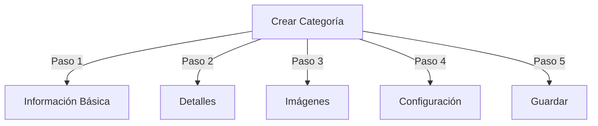

# Gestionar Categorías en Publisher

> Guía completa para crear, organizar jerarquías y gestionar categorías en el módulo Publisher.

---

## Conceptos Básicos de Categorías

### ¿Qué son las Categorías?

Las categorías organizan artículos en grupos lógicos:

```
Ejemplo de Estructura:

  Noticias (Categoría Principal)
    ├── Tecnología
    ├── Deportes
    └── Entretenimiento

  Tutoriales (Categoría Principal)
    ├── Fotografía
    │   ├── Básicos
    │   └── Avanzado
    └── Escritura
        └── Blogs
```

### Beneficios de una Buena Estructura de Categoría

```
✓ Mejor navegación del usuario
✓ Contenido organizado
✓ SEO mejorado
✓ Gestión más fácil de contenido
✓ Mejor flujo de trabajo editorial
```

---

## Acceder a la Gestión de Categorías

### Navegación del Panel de Admin

```
Panel de Admin
└── Módulos
    └── Publisher
        └── Categorías
            ├── Crear Nueva
            ├── Editar
            ├── Eliminar
            ├── Permisos
            └── Organizar
```

### Acceso Rápido

1. Inicie sesión como **Administrador**
2. Vaya a **Admin → Módulos**
3. Haga clic en **Publisher → Admin**
4. Haga clic en **Categorías** en menú izquierdo

---

## Crear Categorías

### Formulario de Creación de Categoría



### Paso 1: Información Básica

#### Nombre de la Categoría

```
Campo: Nombre de la Categoría
Tipo: Entrada de texto (obligatorio)
Longitud máxima: 100 caracteres
Unicidad: Debe ser único
Ejemplo: "Fotografía"
```

**Pautas:**
- Descriptivo y singular o plural consistente
- Capitalizado apropiadamente
- Evite caracteres especiales
- Mantenga razonablemente corto

#### Descripción de la Categoría

```
Campo: Descripción
Tipo: Área de texto (opcional)
Longitud máxima: 500 caracteres
Usado en: Páginas de listado de categorías, bloques de categoría
```

**Propósito:**
- Explica contenido de la categoría
- Aparece encima de artículos de categoría
- Ayuda usuarios a entender alcance
- Usado para descripción meta de SEO

**Ejemplo:**
```
"Consejos, tutoriales e inspiración fotográfica para
todos los niveles de habilidad. Desde conceptos básicos de composición
hasta técnicas de iluminación avanzadas, domina tu arte."
```

### Paso 2: Categoría Principal

#### Crear Jerarquía

```
Campo: Categoría Principal
Tipo: Menú desplegable
Opciones: Ninguna (raíz), o categorías existentes
```

**Ejemplos de Jerarquía:**

```
Estructura Plana:
  Noticias
  Tutoriales
  Reseñas

Estructura Anidada:
  Noticias
    Tecnología
    Negocios
    Deportes
  Tutoriales
    Fotografía
      Básicos
      Avanzado
    Escritura
```

**Crear Subcategoría:**

1. Haga clic en menú desplegable **Categoría Principal**
2. Seleccione principal (p. ej., "Noticias")
3. Complete nombre de categoría
4. Guardar
5. Nueva categoría aparece como hijo

### Paso 3: Imagen de Categoría

#### Cargar Imagen de Categoría

```
Campo: Imagen de Categoría
Tipo: Carga de imagen (opcional)
Formato: JPG, PNG, GIF, WebP
Tamaño máximo: 5 MB
Recomendado: 300x200 px (o tamaño de su tema)
```

**Para Cargar:**

1. Haga clic en botón **Cargar Imagen**
2. Seleccione imagen de la computadora
3. Recorte/redimensione si es necesario
4. Haga clic en **Usar Esta Imagen**

**Dónde Se Usa:**
- Página de listado de categorías
- Encabezado de bloque de categoría
- Ruta de navegación (algunos temas)
- Compartición en redes sociales

### Paso 4: Configuración de Categoría

#### Configuración de Visualización

```yaml
Estado:
  - Habilitado: Sí/No
  - Oculto: Sí/No (oculto de menús, aún accesible)

Opciones de Visualización:
  - Mostrar descripción: Sí/No
  - Mostrar imagen: Sí/No
  - Mostrar contador de artículos: Sí/No
  - Mostrar subcategorías: Sí/No

Diseño:
  - Elementos por página: 10-50
  - Orden de visualización: Fecha/Título/Autor
  - Dirección de visualización: Ascendente/Descendente
```

#### Permisos de Categoría

```yaml
Quién Puede Ver:
  - Anónimo: Sí/No
  - Registrado: Sí/No
  - Grupos específicos: Configurar por grupo

Quién Puede Enviar:
  - Registrado: Sí/No
  - Grupos específicos: Configurar por grupo
  - Autor debe tener: Permiso "enviar artículos"
```

### Paso 5: Configuración de SEO

#### Etiquetas Meta

```
Campo: Descripción Meta
Tipo: Texto (160 caracteres)
Propósito: Descripción de motor de búsqueda

Campo: Palabras Clave Meta
Tipo: Lista separada por comas
Ejemplo: fotografía, tutoriales, consejos, técnicas
```

#### Configuración de URL

```
Campo: Slug de URL
Tipo: Texto
Auto-generada desde nombre de categoría
Ejemplo: "fotografía" desde "Fotografía"
Puede personalizarse antes de guardar
```

### Guardar Categoría

1. Complete los campos obligatorios:
   - Nombre de la Categoría ✓
   - Descripción (recomendado)
2. Opcional: Cargue imagen, establezca SEO
3. Haga clic en **Guardar Categoría**
4. Aparece mensaje de confirmación
5. La categoría ahora está disponible

---

## Jerarquía de Categorías

### Crear Estructura Anidada

```
Ejemplo paso a paso: Crear Noticias → subcategoría Tecnología

1. Vaya a admin de Categorías
2. Haga clic en "Agregar Categoría"
3. Nombre: "Noticias"
4. Principal: (dejar en blanco - esto es raíz)
5. Guardar
6. Haga clic en "Agregar Categoría" de nuevo
7. Nombre: "Tecnología"
8. Principal: "Noticias" (seleccionar de menú desplegable)
9. Guardar
```

### Ver Árbol de Jerarquía

```
La vista de Categorías muestra estructura de árbol:

📁 Noticias
  📄 Tecnología
  📄 Deportes
  📄 Entretenimiento
📁 Tutoriales
  📄 Fotografía
    📄 Básicos
    📄 Avanzado
  📄 Escritura
```

Haga clic en flechas de expansión para mostrar/ocultar subcategorías.

### Reorganizar Categorías

#### Mover Categoría

1. Vaya a lista de Categorías
2. Haga clic en **Editar** de la categoría
3. Cambie **Categoría Principal**
4. Haga clic en **Guardar**
5. La categoría se mueve a nueva posición

#### Reordenar Categorías

Si está disponible, use arrastrar y soltar:

1. Vaya a lista de Categorías
2. Haga clic y arrastre categoría
3. Suelte en nueva posición
4. El orden se guarda automáticamente

#### Eliminar Categoría

**Opción 1: Eliminación Suave (Ocultar)**

1. Edite categoría
2. Establezca **Estado**: Deshabilitado
3. Haga clic en **Guardar**
4. La categoría está oculta pero no eliminada

**Opción 2: Eliminación Permanente**

1. Vaya a lista de Categorías
2. Haga clic en **Eliminar** de la categoría
3. Elija acción para artículos:
   ```
   ☐ Mover artículos a categoría principal
   ☐ Mover artículos a raíz (Noticias)
   ☐ Eliminar todos los artículos en categoría
   ```
4. Confirme eliminación

---

## Operaciones de Categoría

### Editar Categoría

1. Vaya a **Admin → Publisher → Categorías**
2. Haga clic en **Editar** de la categoría
3. Modifique campos:
   - Nombre
   - Descripción
   - Categoría principal
   - Imagen
   - Configuración
4. Haga clic en **Guardar**

### Editar Permisos de Categoría

1. Vaya a Categorías
2. Haga clic en **Permisos** de la categoría (o haga clic en categoría luego haga clic en Permisos)
3. Configure grupos:

```
Para cada grupo:
  ☐ Ver artículos en esta categoría
  ☐ Enviar artículos a esta categoría
  ☐ Editar propios artículos
  ☐ Editar todos los artículos
  ☐ Aprobar/Moderar artículos
  ☐ Gestionar categoría
```

4. Haga clic en **Guardar Permisos**

### Establecer Imagen de Categoría

**Cargar imagen nueva:**

1. Edite categoría
2. Haga clic en **Cambiar Imagen**
3. Cargue o seleccione imagen
4. Recorte/redimensione
5. Haga clic en **Usar Imagen**
6. Haga clic en **Guardar Categoría**

**Eliminar imagen:**

1. Edite categoría
2. Haga clic en **Eliminar Imagen** (si está disponible)
3. Haga clic en **Guardar Categoría**

---

## Permisos de Categoría

### Matriz de Permisos

```
                 Anónimo  Registrado  Editor  Admin
Ver categoría        ✓         ✓         ✓       ✓
Enviar artículo      ✗         ✓         ✓       ✓
Editar propio artículo ✗       ✓         ✓       ✓
Editar todos artículos ✗       ✗         ✓       ✓
Moderar artículos    ✗         ✗         ✓       ✓
Gestionar categoría  ✗         ✗         ✗       ✓
```

### Establecer Permisos a Nivel de Categoría

#### Control de Acceso Por Categoría

1. Vaya a lista de **Categorías**
2. Seleccione una categoría
3. Haga clic en **Permisos**
4. Para cada grupo, seleccione permisos:

```
Ejemplo: Categoría Noticias
  Anónimo:   Solo ver
  Registrado: Enviar artículos
  Editores:  Aprobar artículos
  Admins:    Control total
```

5. Haga clic en **Guardar**

#### Permisos a Nivel de Campo

Controle qué campos de formulario pueden ver/editar usuarios:

```
Ejemplo: Limitar visibilidad de campo para usuarios Registrados

Los usuarios Registrados pueden ver/editar:
  ✓ Título
  ✓ Descripción
  ✓ Contenido
  ✗ Autor (auto-establecido al usuario actual)
  ✗ Fecha Programada (solo editores)
  ✗ Destacado (solo admins)
```

**Configurar en:**
- Permisos de Categoría
- Busque sección "Visibilidad de Campo"

---

## Mejores Prácticas para Categorías

### Estructura de Categoría

```
✓ Mantener jerarquía 2-3 niveles profunda
✗ No crear demasiadas categorías de nivel superior
✗ No crear categorías con un solo artículo

✓ Usar nombres consistentes (plural o singular)
✗ No usar nombres vagos ("Cosas", "Otro")

✓ Crear categorías para artículos que existen
✗ No crear categorías vacías por adelantado
```

### Pautas de Nombres

```
Nombres buenos:
  "Fotografía"
  "Desarrollo Web"
  "Consejos de Viaje"
  "Noticias de Negocios"

Evitar:
  "Artículos" (demasiado vago)
  "Contenido" (redundante)
  "Noticias&Actualizaciones" (inconsistente)
  "FOTOGRAFÍA COSAS" (formato)
```

### Consejos de Organización

```
Por Tema:
  Noticias
    Tecnología
    Deportes
    Entretenimiento

Por Tipo:
  Tutoriales
    Video
    Texto
    Interactivo

Por Audiencia:
  Para Principiantes
  Para Expertos
  Estudios de Caso

Geográfico:
  América del Norte
    Estados Unidos
    Canadá
  Europa
```

---

## Bloques de Categoría

### Bloque de Categoría de Publisher

Mostrar listados de categorías en su sitio:

1. Vaya a **Admin → Bloques**
2. Encuentre **Publisher - Categorías**
3. Haga clic en **Editar**
4. Configure:

```
Título de Bloque: "Categorías de Noticias"
Mostrar subcategorías: Sí/No
Mostrar contador de artículos: Sí/No
Altura: (píxeles o automático)
```

5. Haga clic en **Guardar**

### Bloque de Artículos de Categoría

Mostrar artículos recientes de categoría específica:

1. Vaya a **Admin → Bloques**
2. Encuentre **Publisher - Artículos de Categoría**
3. Haga clic en **Editar**
4. Seleccione:

```
Categoría: Noticias (o categoría específica)
Número de artículos: 5
Mostrar imágenes: Sí/No
Mostrar descripción: Sí/No
```

5. Haga clic en **Guardar**

---

## Analítica de Categoría

### Ver Estadísticas de Categoría

Desde admin de Categorías:

```
Cada categoría muestra:
  - Total de artículos: 45
  - Publicado: 42
  - Borrador: 2
  - Aprobación pendiente: 1
  - Total de vistas: 5,234
  - Último artículo: hace 2 horas
```

### Ver Tráfico de Categoría

Si analítica está habilitada:

1. Haga clic en nombre de categoría
2. Haga clic en pestaña **Estadísticas**
3. Vea:
   - Vistas de página
   - Artículos populares
   - Tendencias de tráfico
   - Términos de búsqueda utilizados

---

## Plantillas de Categoría

### Personalizar Visualización de Categoría

Si usa plantillas personalizadas, cada categoría puede anular:

```
publisher_category.tpl
  ├── Encabezado de categoría
  ├── Descripción de categoría
  ├── Imagen de categoría
  ├── Listado de artículos
  └── Paginación
```

**Para personalizar:**

1. Copie archivo de plantilla
2. Modifique HTML/CSS
3. Asigne a categoría en admin
4. La categoría usa plantilla personalizada

---

## Tareas Comunes

### Crear Jerarquía de Noticias

```
Admin → Publisher → Categorías
1. Crear "Noticias" (principal)
2. Crear "Tecnología" (principal: Noticias)
3. Crear "Deportes" (principal: Noticias)
4. Crear "Entretenimiento" (principal: Noticias)
```

### Mover Artículos Entre Categorías

1. Vaya a admin de **Artículos**
2. Seleccione artículos (casillas de verificación)
3. Seleccione **"Cambiar Categoría"** del menú desplegable de acciones en lote
4. Elija categoría nueva
5. Haga clic en **Actualizar Todo**

### Ocultar Categoría Sin Eliminar

1. Edite categoría
2. Establezca **Estado**: Deshabilitado/Oculto
3. Guardar
4. La categoría no se muestra en menús (aún accesible vía URL)

### Crear Categoría para Borradores

```
Mejor Práctica:

Crear categoría "En Revisión"
  ├── Propósito: Artículos esperando aprobación
  ├── Permisos: Oculto del público
  ├── Solo admins/editores pueden ver
  ├── Mover artículos aquí hasta aprobación
  └── Mover a "Noticias" cuando se publique
```

---

## Importar/Exportar Categorías

### Exportar Categorías

Si está disponible:

1. Vaya a admin de **Categorías**
2. Haga clic en **Exportar**
3. Seleccione formato: CSV/JSON/XML
4. Descargue archivo
5. Copia de seguridad guardada

### Importar Categorías

Si está disponible:

1. Prepare archivo con categorías
2. Vaya a admin de **Categorías**
3. Haga clic en **Importar**
4. Cargue archivo
5. Elija estrategia de actualización:
   - Crear solo nuevas
   - Actualizar existentes
   - Reemplazar todo
6. Haga clic en **Importar**

---

## Solución de Problemas de Categorías

### Problema: Subcategorías no se muestran

**Solución:**
```
1. Verifique estado de categoría principal es "Habilitado"
2. Compruebe permisos permiten ver
3. Verifique subcategorías tienen estado "Habilitado"
4. Limpie caché: Admin → Herramientas → Limpiar Caché
5. Compruebe tema muestra subcategorías
```

### Problema: No puede eliminar categoría

**Solución:**
```
1. La categoría debe no tener artículos
2. Mueva o elimine artículos primero:
   Admin → Artículos
   Seleccione artículos en categoría
   Cambie categoría a otra
3. Luego elimine categoría vacía
4. O elija opción "mover artículos" al eliminar
```

### Problema: La imagen de categoría no se muestra

**Solución:**
```
1. Verifique imagen se cargó exitosamente
2. Compruebe formato de archivo de imagen (JPG, PNG)
3. Verifique permisos del directorio de carga
4. Compruebe tema muestra imágenes de categoría
5. Intente recargar imagen
6. Limpie caché del navegador
```

### Problema: Los permisos no entran en efecto

**Solución:**
```
1. Compruebe permisos de grupo en Categoría
2. Compruebe permisos globales de Publisher
3. Compruebe usuario pertenece a grupo configurado
4. Limpie caché de sesión
5. Cierre sesión e inicie sesión de nuevo
6. Compruebe módulos de permisos están instalados
```

---

## Lista de Verificación de Mejores Prácticas de Categorías

Antes de desplegar categorías:

- [ ] La jerarquía es 2-3 niveles profunda
- [ ] Cada categoría tiene 5+ artículos
- [ ] Nombres de categoría son consistentes
- [ ] Los permisos son apropiados
- [ ] Las imágenes de categoría están optimizadas
- [ ] Las descripciones están completas
- [ ] Los metadatos de SEO están rellenados
- [ ] Las URLs son amigables
- [ ] Las categorías se prueban en front-end
- [ ] La documentación se actualiza

---

## Guías Relacionadas

- Creación de Artículos
- Gestión de Permisos
- Configuración del Módulo
- Guía de Instalación

---

## Próximos Pasos

- Crear Artículos en categorías
- Configurar Permisos
- Personalizar con Plantillas Personalizadas

---

#publisher #categories #organization #hierarchy #management #xoops

