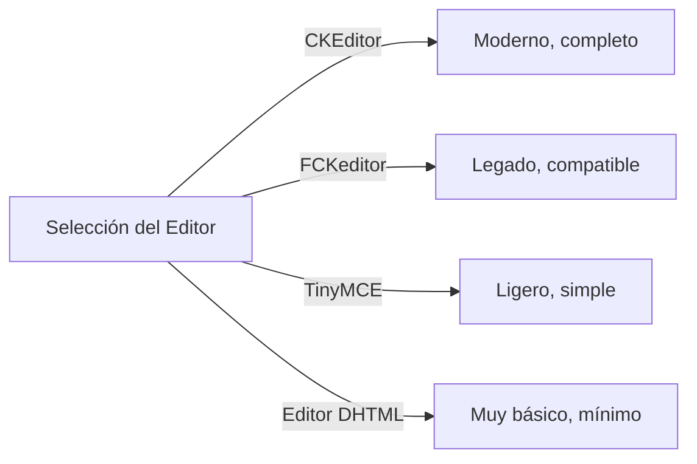
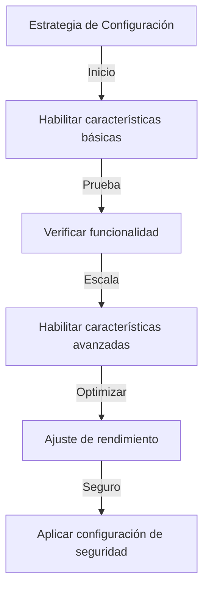

# Configuración Básica de Publisher

> Configure las opciones y preferencias del módulo Publisher para su instalación XOOPS.

---

## Acceder a la Configuración

### Navegación del Panel de Admin

```
Panel de Admin XOOPS
└── Módulos
    └── Publisher
        ├── Preferencias
        ├── Configuración
        └── Ajustes
```

1. Inicie sesión como **Administrador**
2. Vaya a **Panel de Admin → Módulos**
3. Encuentre módulo **Publisher**
4. Haga clic en enlace **Preferencias** o **Admin**

---

## Configuración General

### Acceder a Configuración

```
Panel de Admin → Módulos → Publisher
```

Haga clic en **icono de engranaje** o **Configuración** para estas opciones:

#### Opciones de Visualización

| Configuración | Opciones | Predeterminado | Descripción |
|---------|---------|---------|-------------|
| **Elementos por página** | 5-50 | 10 | Artículos mostrados en listas |
| **Mostrar ruta de navegación** | Sí/No | Sí | Mostrar pista de navegación |
| **Usar paginación** | Sí/No | Sí | Paginar listas largas |
| **Mostrar fecha** | Sí/No | Sí | Mostrar fecha del artículo |
| **Mostrar categoría** | Sí/No | Sí | Mostrar categoría del artículo |
| **Mostrar autor** | Sí/No | Sí | Mostrar autor del artículo |
| **Mostrar vistas** | Sí/No | Sí | Mostrar contador de vistas del artículo |

**Ejemplo de Configuración:**

```yaml
Elementos Por Página: 15
Mostrar Ruta de Navegación: Sí
Usar Paginación: Sí
Mostrar Fecha: Sí
Mostrar Categoría: Sí
Mostrar Autor: Sí
Mostrar Vistas: Sí
```

#### Opciones de Autor

| Configuración | Predeterminado | Descripción |
|---------|---------|-------------|
| **Mostrar nombre del autor** | Sí | Mostrar nombre real o nombre de usuario |
| **Usar nombre de usuario** | No | Mostrar nombre de usuario en lugar de nombre |
| **Mostrar correo del autor** | No | Mostrar correo de contacto del autor |
| **Mostrar avatar del autor** | Sí | Mostrar avatar del usuario |

---

## Configuración del Editor

### Seleccionar Editor WYSIWYG

Publisher soporta múltiples editores:

#### Editores Disponibles



### CKEditor (Recomendado)

**Mejor para:** La mayoría de usuarios, navegadores modernos, características completas

1. Vaya a **Preferencias**
2. Establezca **Editor**: CKEditor
3. Configure opciones:

```
Editor: CKEditor 4.x
Barra de herramientas: Completa
Altura: 400px
Ancho: 100%
Eliminar plugins: []
Agregar plugins: [mathjax, codesnippet]
```

### FCKeditor

**Mejor para:** Compatibilidad, sistemas antiguos

```
Editor: FCKeditor
Barra de herramientas: Predeterminada
Configuración personalizada: (opcional)
```

### TinyMCE

**Mejor para:** Huella mínima, edición básica

```
Editor: TinyMCE
Plugins: [paste, table, link, image]
Barra de herramientas: mínima
```

---

## Configuración de Archivos y Carga

### Configurar Directorios de Carga

```
Admin → Publisher → Preferencias → Configuración de Carga
```

#### Configuración de Tipos de Archivo

```yaml
Tipos de Archivo Permitidos:
  Imágenes:
    - jpg
    - jpeg
    - gif
    - png
    - webp
  Documentos:
    - pdf
    - doc
    - docx
    - xls
    - xlsx
    - ppt
    - pptx
  Archivos:
    - zip
    - rar
    - 7z
  Medios:
    - mp3
    - mp4
    - webm
    - mov
```

#### Límites de Tamaño de Archivo

| Tipo de Archivo | Tamaño Máximo | Notas |
|-----------|----------|-------|
| **Imágenes** | 5 MB | Por archivo de imagen |
| **Documentos** | 10 MB | Archivos PDF, Office |
| **Medios** | 50 MB | Archivos de video/audio |
| **Todos los archivos** | 100 MB | Total por carga |

**Configuración:**

```
Tamaño Máximo de Carga de Imagen: 5 MB
Tamaño Máximo de Carga de Documento: 10 MB
Tamaño Máximo de Carga de Medios: 50 MB
Tamaño Total de Carga: 100 MB
Máximo de Archivos por Artículo: 5
```

### Redimensionamiento de Imagen

Publisher redimensiona automáticamente imágenes para consistencia:

```yaml
Tamaño de Miniatura:
  Ancho: 150
  Alto: 150
  Modo: Recortar/Redimensionar

Tamaño de Imagen de Categoría:
  Ancho: 300
  Alto: 200
  Modo: Redimensionar

Imagen Destacada del Artículo:
  Ancho: 600
  Alto: 400
  Modo: Redimensionar
```

---

## Configuración de Comentarios e Interacción

### Configuración de Comentarios

```
Preferencias → Sección de Comentarios
```

#### Opciones de Comentarios

```yaml
Permitir Comentarios:
  - Habilitado: Sí/No
  - Predeterminado: Sí
  - Anulación por artículo: Sí

Moderación de Comentarios:
  - Moderar comentarios: Sí/No
  - Moderar solo comentarios de invitados: Sí/No
  - Filtro de spam: Habilitado
  - Máximo de comentarios por día: (ilimitado)

Visualización de Comentarios:
  - Formato de visualización: Enhebrado/Plano
  - Comentarios por página: 10
  - Formato de fecha: Fecha completa/Hace tiempo
  - Mostrar contador de comentarios: Sí/No
```

### Configuración de Calificaciones

```yaml
Permitir Calificaciones:
  - Habilitado: Sí/No
  - Predeterminado: Sí
  - Anulación por artículo: Sí

Opciones de Calificación:
  - Escala de calificación: 5 estrellas (predeterminado)
  - Permitir al usuario calificar lo suyo: No
  - Mostrar calificación promedio: Sí
  - Mostrar contador de calificación: Sí
```

---

## Configuración de SEO y URL

### Optimización de Motor de Búsqueda

```
Preferencias → Configuración de SEO
```

#### Configuración de URL

```yaml
URLs de SEO:
  - Habilitado: No (establecer en Sí para URLs de SEO)
  - Reescritura de URL: Ninguna/Apache mod_rewrite/Reescritura IIS

Formato de URL:
  - Categoría: /category/news
  - Artículo: /article/welcome-to-site
  - Archivo: /archive/2024/01

Descripción Meta:
  - Auto-generar: Sí
  - Longitud máxima: 160 caracteres

Palabras Clave Meta:
  - Auto-generar: Sí
  - Desde: Etiquetas de artículo, título
```

### Habilitar URLs de SEO (Avanzado)

**Requisitos previos:**
- Apache con `mod_rewrite` habilitado
- Soporte de `.htaccess` habilitado

**Pasos de Configuración:**

1. Vaya a **Preferencias → Configuración de SEO**
2. Establezca **URLs de SEO**: Sí
3. Establezca **Reescritura de URL**: Apache mod_rewrite
4. Verifique que archivo `.htaccess` existe en carpeta de Publisher

**Configuración de .htaccess:**

```apache
<IfModule mod_rewrite.c>
    RewriteEngine On
    RewriteBase /modules/publisher/

    # Reescrituras de categoría
    RewriteRule ^category/([0-9]+)-(.*)\.html$ index.php?op=showcategory&categoryid=$1 [L,QSA]

    # Reescrituras de artículo
    RewriteRule ^article/([0-9]+)-(.*)\.html$ index.php?op=showitem&itemid=$1 [L,QSA]

    # Reescrituras de archivo
    RewriteRule ^archive/([0-9]+)/([0-9]+)/$ index.php?op=archive&year=$1&month=$2 [L,QSA]
</IfModule>
```

---

## Caché y Rendimiento

### Configuración de Caché

```
Preferencias → Configuración de Caché
```

```yaml
Habilitar Caché:
  - Habilitado: Sí
  - Tipo de caché: Archivo (o Memcache)

Vida Útil del Caché:
  - Listados de categoría: 3600 segundos (1 hora)
  - Listados de artículos: 1800 segundos (30 minutos)
  - Artículo único: 7200 segundos (2 horas)
  - Bloque de artículos recientes: 900 segundos (15 minutos)

Limpiar Caché:
  - Limpiar manual: Disponible en admin
  - Limpiar automático al guardar artículo: Sí
  - Limpiar al cambiar categoría: Sí
```

### Limpiar Caché

**Limpiar Caché Manual:**

1. Vaya a **Admin → Publisher → Herramientas**
2. Haga clic en **Limpiar Caché**
3. Seleccione tipos de caché a limpiar:
   - [ ] Caché de categoría
   - [ ] Caché de artículos
   - [ ] Caché de bloques
   - [ ] Todo el caché
4. Haga clic en **Limpiar Seleccionados**

**Línea de Comandos:**

```bash
# Limpiar todo caché de Publisher
php /path/to/xoops/admin/cache_manage.php publisher

# O eliminar directamente archivos de caché
rm -rf /path/to/xoops/var/cache/publisher/*
```

---

## Notificación y Flujo de Trabajo

### Notificaciones por Correo Electrónico

```
Preferencias → Notificaciones
```

```yaml
Notificar Administrador de Nuevo Artículo:
  - Habilitado: Sí
  - Destinatario: Correo del admin
  - Incluir resumen: Sí

Notificar Moderadores:
  - Habilitado: Sí
  - De nuevo envío: Sí
  - De artículos pendientes: Sí

Notificar Autor:
  - De aprobación: Sí
  - De rechazo: Sí
  - De comentario: No (opcional)
```

### Flujo de Trabajo de Envío

```yaml
Requerir Aprobación:
  - Habilitado: Sí
  - Aprobación del editor: Sí
  - Aprobación del admin: No

Guardado de Borrador:
  - Intervalo de auto-guardado: 60 segundos
  - Guardar versiones locales: Sí
  - Historial de revisiones: Últimas 5 versiones
```

---

## Configuración de Contenido

### Valores Predeterminados de Publicación

```
Preferencias → Configuración de Contenido
```

```yaml
Estado de Artículo Predeterminado:
  - Borrador/Publicado: Borrador
  - Destacado por predeterminado: No
  - Tiempo de auto-publicación: Ninguno

Visibilidad Predeterminada:
  - Público/Privado: Público
  - Mostrar en primera página: Sí
  - Mostrar en categorías: Sí

Publicación Programada:
  - Habilitado: Sí
  - Permitir por artículo: Sí

Expiración de Contenido:
  - Habilitado: No
  - Archivo automático antiguo: No
  - Archivo después de días: (ilimitado)
```

### Opciones de Contenido WYSIWYG

```yaml
Permitir HTML:
  - En artículos: Sí
  - En comentarios: No

Permitir Medios Integrados:
  - Videos (iframe): Sí
  - Imágenes: Sí
  - Plugins: No

Filtrado de Contenido:
  - Despojar etiquetas: No
  - Filtro XSS: Sí (recomendado)
```

---

## Configuración de Motor de Búsqueda

### Configurar Integración de Búsqueda

```
Preferencias → Configuración de Búsqueda
```

```yaml
Habilitar Indexación de Artículos:
  - Incluir en búsqueda de sitio: Sí
  - Tipo de índice: Texto completo/Solo título

Opciones de Búsqueda:
  - Buscar en títulos: Sí
  - Buscar en contenido: Sí
  - Buscar en comentarios: Sí

Etiquetas Meta:
  - Auto-generar: Sí
  - Etiquetas OG (redes sociales): Sí
  - Tarjetas de Twitter: Sí
```

---

## Configuración Avanzada

### Modo de Depuración (Solo Desarrollo)

```
Preferencias → Avanzado
```

```yaml
Modo de Depuración:
  - Habilitado: No (¡solo para desarrollo!)

Características de Desarrollo:
  - Mostrar consultas SQL: No
  - Registrar errores: Sí
  - Correo de error: admin@example.com
```

### Optimización de Base de Datos

```
Admin → Herramientas → Optimizar Base de Datos
```

```bash
# Optimización manual
mysql> OPTIMIZE TABLE publisher_items;
mysql> OPTIMIZE TABLE publisher_categories;
mysql> OPTIMIZE TABLE publisher_comments;
```

---

## Personalización del Módulo

### Plantillas de Tema

```
Preferencias → Visualización → Plantillas
```

Seleccione conjunto de plantillas:
- Predeterminado
- Clásico
- Moderno
- Oscuro
- Personalizado

Cada plantilla controla:
- Diseño del artículo
- Listado de categorías
- Visualización de archivo
- Visualización de comentarios

---

## Consejos de Configuración

### Mejores Prácticas



1. **Comenzar Simple** - Habilite características principales primero
2. **Prueba Cada Cambio** - Verificar antes de continuar
3. **Habilitar Caché** - Mejora rendimiento
4. **Copia de Seguridad Primero** - Exporte configuración antes de cambios importantes
5. **Monitoree Registros** - Compruebe registros de error regularmente

### Optimización de Rendimiento

```yaml
Para Mejor Rendimiento:
  - Habilitar caché: Sí
  - Vida útil del caché: 3600 segundos
  - Limitar elementos por página: 10-15
  - Comprimir imágenes: Sí
  - Minificar CSS/JS: Sí (si está disponible)
```

### Fortalecimiento de Seguridad

```yaml
Para Mejor Seguridad:
  - Moderar comentarios: Sí
  - Deshabilitar HTML en comentarios: Sí
  - Filtrado XSS: Sí
  - Lista blanca de tipo de archivo: Estricto
  - Tamaño máximo de carga: Límite razonable
```

---

## Exportar/Importar Configuración

### Copia de Seguridad de Configuración

```
Admin → Herramientas → Exportar Configuración
```

**Para hacer copia de seguridad de configuración actual:**

1. Haga clic en **Exportar Configuración**
2. Guarde archivo `.cfg` descargado
3. Almacene en lugar seguro

**Para restaurar:**

1. Haga clic en **Importar Configuración**
2. Seleccione archivo `.cfg`
3. Haga clic en **Restaurar**

---

## Guías de Configuración Relacionadas

- Gestión de Categorías
- Creación de Artículos
- Configuración de Permisos
- Guía de Instalación

---

## Solución de Problemas de Configuración

### La Configuración No Se Guarda

**Solución:**
1. Compruebe permisos de directorio en `/var/config/`
2. Verifique acceso de escritura de PHP
3. Compruebe registro de errores de PHP para problemas
4. Limpie caché del navegador e intente de nuevo

### El Editor No Aparece

**Solución:**
1. Verifique que plugin del editor está instalado
2. Compruebe configuración del editor XOOPS
3. Intente opción de editor diferente
4. Compruebe consola del navegador para errores de JavaScript

### Problemas de Rendimiento

**Solución:**
1. Habilite caché
2. Reduzca elementos por página
3. Comprima imágenes
4. Compruebe optimización de base de datos
5. Revise registro de consulta lenta

---

## Próximos Pasos

- Configurar Permisos de Grupo
- Crear su Primer Artículo
- Configurar Categorías
- Revisar Plantillas Personalizadas

---

#publisher #configuration #preferences #settings #xoops

