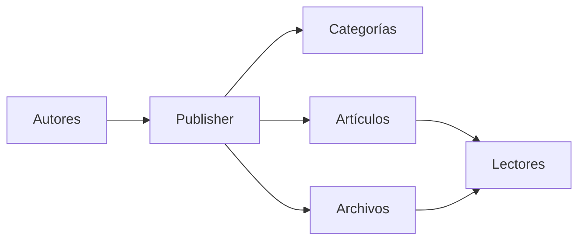
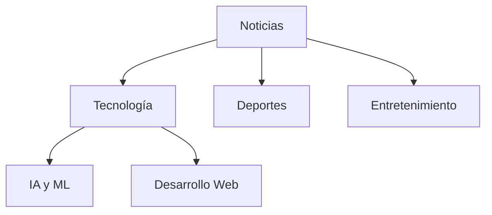
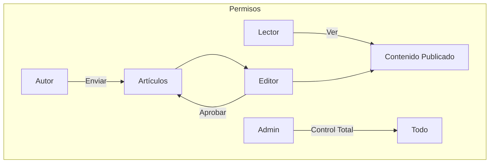
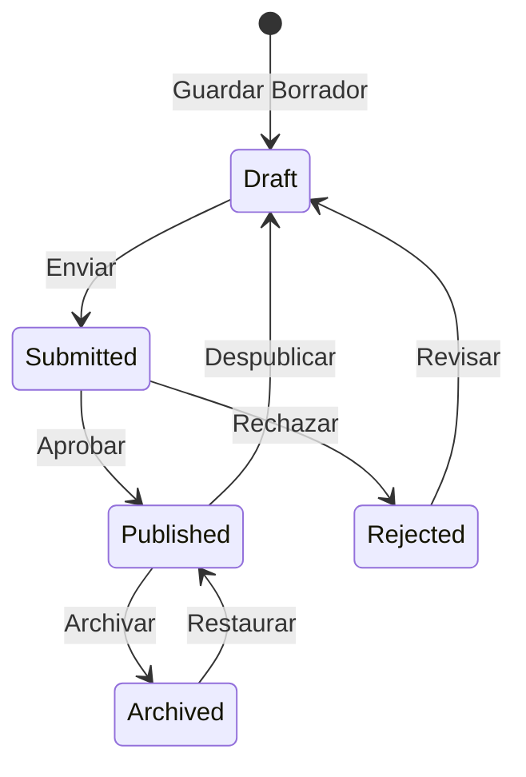

# Comenzar con Publisher

> Una guía paso a paso para configurar y usar el módulo de noticias/blog Publisher.

---

## ¿Qué es Publisher?

Publisher es el módulo premier de gestión de contenido para XOOPS, diseñado para:

- **Sitios de Noticias** - Publique artículos con categorías
- **Blogs** - Blogs personales o multi-autor
- **Documentación** - Bases de conocimiento organizadas
- **Portales de Contenido** - Contenido multimedia mixto



---

## Configuración Rápida

### Paso 1: Instalar Publisher

1. Descargue desde [GitHub](https://github.com/XoopsModules25x/publisher)
2. Cargue a `modules/publisher/`
3. Vaya a Admin → Módulos → Instalar

### Paso 2: Crear Categorías



1. Admin → Publisher → Categorías
2. Haga clic en "Agregar Categoría"
3. Complete:
   - **Nombre**: Nombre de categoría
   - **Descripción**: Lo que contiene esta categoría
   - **Imagen**: Imagen de categoría opcional
4. Establezca permisos (quién puede enviar/ver)
5. Guardar

### Paso 3: Configurar Ajustes

1. Admin → Publisher → Preferencias
2. Configuraciones clave a configurar:

| Ajuste | Recomendado | Descripción |
|---------|-------------|-------------|
| Elementos por página | 10-20 | Artículos en índice |
| Editor | TinyMCE/CKEditor | Editor de texto enriquecido |
| Permitir calificaciones | Sí | Retroalimentación del lector |
| Permitir comentarios | Sí | Discusiones |
| Auto-aprobar | No | Control editorial |

### Paso 4: Crear Su Primer Artículo

1. Menú principal → Publisher → Enviar Artículo
2. Complete el formulario:
   - **Título**: Titular del artículo
   - **Categoría**: A dónde pertenece
   - **Resumen**: Descripción corta
   - **Cuerpo**: Contenido completo del artículo
3. Agregue elementos opcionales:
   - Imagen destacada
   - Archivos adjuntos
   - Configuración de SEO
4. Envíe para revisión o publique

---

## Roles de Usuario



### Lector
- Ver artículos publicados
- Calificar y comentar
- Buscar contenido

### Autor
- Enviar nuevos artículos
- Editar propios artículos
- Adjuntar archivos

### Editor
- Aprobar/rechazar envíos
- Editar cualquier artículo
- Gestionar categorías

### Administrador
- Control completo del módulo
- Configurar ajustes
- Gestionar permisos

---

## Escribir Artículos

### Editor de Artículos

```
┌─────────────────────────────────────────────────────┐
│ Título: [Título de Su Artículo                    ] │
├─────────────────────────────────────────────────────┤
│ Categoría: [Seleccionar Categoría          ▼]      │
├─────────────────────────────────────────────────────┤
│ Resumen:                                            │
│ ┌─────────────────────────────────────────────────┐ │
│ │ Breve descripción mostrada en listados...      │ │
│ └─────────────────────────────────────────────────┘ │
├─────────────────────────────────────────────────────┤
│ Cuerpo:                                             │
│ ┌─────────────────────────────────────────────────┐ │
│ │ [B] [I] [U] [Enlace] [Imagen] [Código]          │ │
│ ├─────────────────────────────────────────────────┤ │
│ │                                                  │ │
│ │ El contenido del artículo completo va aquí...   │ │
│ │                                                  │ │
│ └─────────────────────────────────────────────────┘ │
├─────────────────────────────────────────────────────┤
│ [Enviar] [Vista Previa] [Guardar Borrador]          │
└─────────────────────────────────────────────────────┘
```

### Mejores Prácticas

1. **Títulos Atractivos** - Titulares claros y atractivos
2. **Buenos Resúmenes** - Atraiga a los lectores a hacer clic
3. **Contenido Estructurado** - Use encabezados, listas, imágenes
4. **Categorización Apropiada** - Ayude a los lectores a encontrar contenido
5. **Optimización de SEO** - Palabras clave en título y contenido

---

## Gestionar Contenido

### Flujo de Estado del Artículo



### Descripciones de Estado

| Estado | Descripción |
|--------|-------------|
| Borrador | Trabajo en curso |
| Enviado | Esperando revisión |
| Publicado | En vivo en el sitio |
| Expirado | Pasó fecha de expiración |
| Rechazado | Necesita revisión |
| Archivado | Removido de listados |

---

## Navegación

### Acceder a Publisher

- **Menú Principal** → Publisher
- **URL Directa**: `yoursite.com/modules/publisher/`

### Páginas Clave

| Página | URL | Propósito |
|------|-----|---------|
| Índice | `/modules/publisher/` | Listados de artículos |
| Categoría | `/modules/publisher/category.php?id=X` | Artículos de categoría |
| Artículo | `/modules/publisher/item.php?itemid=X` | Artículo individual |
| Enviar | `/modules/publisher/submit.php` | Nuevo artículo |
| Búsqueda | `/modules/publisher/search.php` | Encontrar artículos |

---

## Bloques

Publisher proporciona varios bloques para su sitio:

### Artículos Recientes
Muestra artículos publicados recientemente

### Menú de Categorías
Navegación por categoría

### Artículos Populares
Contenido más visto

### Artículo Aleatorio
Mostrar contenido aleatorio

### Destacado
Artículos destacados

---

## Documentación Relacionada

- Creación y Edición de Artículos
- Gestión de Categorías
- Extensión de Publisher

---

#xoops #publisher #user-guide #getting-started #cms

