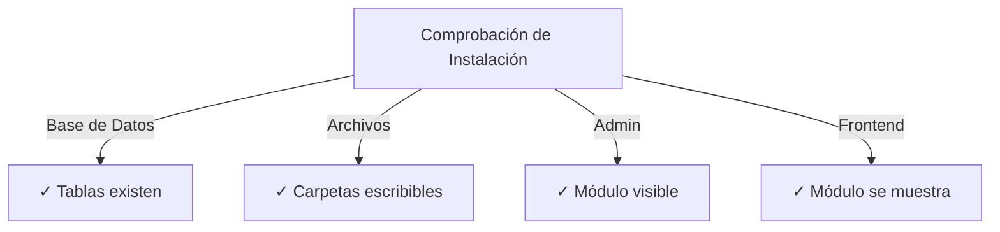

# Guía de Instalación de Publisher

> Instrucciones completas para instalar y configurar el módulo Publisher para XOOPS CMS.

---

## Requisitos del Sistema

### Requisitos Mínimos

| Requisito | Versión | Notas |
|-------------|---------|-------|
| XOOPS | 2.5.10+ | Plataforma CMS central |
| PHP | 7.1+ | Se recomienda PHP 8.x |
| MySQL | 5.7+ | Servidor de base de datos |
| Servidor Web | Apache/Nginx | Con soporte de reescritura |

### Extensiones PHP

```
- PDO (Objetos de Datos de PHP)
- pdo_mysql o mysqli
- mb_string (cadenas multibyte)
- curl (para contenido externo)
- json
- gd (procesamiento de imágenes)
```

### Espacio en Disco

- **Archivos del módulo**: ~5 MB
- **Directorio de caché**: 50+ MB recomendado
- **Directorio de carga**: Según sea necesario para contenido

---

## Lista de Verificación Previa a la Instalación

Antes de instalar Publisher, verifique:

- [ ] El núcleo XOOPS está instalado y funcionando
- [ ] La cuenta de administrador tiene permisos de gestión de módulos
- [ ] Se ha creado copia de seguridad de base de datos
- [ ] Los permisos de archivo permiten acceso de escritura al directorio `/modules/`
- [ ] El límite de memoria PHP es de al menos 128 MB
- [ ] Los límites de tamaño de carga de archivo son apropiados (mín. 10 MB)

---

## Pasos de Instalación

### Paso 1: Descargar Publisher

#### Opción A: Desde GitHub (Recomendado)

```bash
# Navegue al directorio de módulos
cd /path/to/xoops/htdocs/modules/

# Clone el repositorio
git clone https://github.com/XoopsModules25x/publisher.git

# Verifique la descarga
ls -la publisher/
```

#### Opción B: Descarga Manual

1. Visite [GitHub Publisher Releases](https://github.com/XoopsModules25x/publisher/releases)
2. Descargue el archivo `.zip` más reciente
3. Extraiga a `modules/publisher/`

### Paso 2: Establecer Permisos de Archivo

```bash
# Establezca la propiedad apropiada
chown -R www-data:www-data /path/to/xoops/htdocs/modules/publisher

# Establezca permisos de directorio (755)
find publisher -type d -exec chmod 755 {} \;

# Establezca permisos de archivo (644)
find publisher -type f -exec chmod 644 {} \;

# Haga los scripts ejecutables
chmod 755 publisher/admin/index.php
chmod 755 publisher/index.php
```

### Paso 3: Instalar vía Admin de XOOPS

1. Inicie sesión en **Panel de Admin de XOOPS** como administrador
2. Navegue a **Sistema → Módulos**
3. Haga clic en **Instalar Módulo**
4. Encuentre **Publisher** en la lista
5. Haga clic en botón **Instalar**
6. Espere a que se complete la instalación (muestra tablas de base de datos creadas)

```
Progreso de Instalación:
✓ Tablas creadas
✓ Configuración inicializada
✓ Permisos establecidos
✓ Caché limpiado
¡Instalación Completada!
```

---

## Configuración Inicial

### Paso 1: Acceder a Admin de Publisher

1. Vaya a **Panel de Admin → Módulos**
2. Encuentre módulo **Publisher**
3. Haga clic en enlace **Admin**
4. Ahora está en Administración de Publisher

### Paso 2: Configurar Preferencias del Módulo

1. Haga clic en **Preferencias** en menú izquierdo
2. Configure configuración básica:

```
Configuración General:
- Editor: Seleccione su editor WYSIWYG
- Elementos por página: 10
- Mostrar ruta de navegación: Sí
- Permitir comentarios: Sí
- Permitir calificaciones: Sí

Configuración de SEO:
- URLs de SEO: No (habilitar después si es necesario)
- Reescritura de URL: Ninguna

Configuración de Carga:
- Tamaño máximo de carga: 5 MB
- Tipos de archivo permitidos: jpg, png, gif, pdf, doc, docx
```

3. Haga clic en **Guardar Configuración**

### Paso 3: Crear Primera Categoría

1. Haga clic en **Categorías** en menú izquierdo
2. Haga clic en **Agregar Categoría**
3. Complete el formulario:

```
Nombre de Categoría: Noticias
Descripción: Últimas noticias y actualizaciones
Imagen: (opcional) Cargue imagen de categoría
Categoría Principal: (deje en blanco para nivel superior)
Estado: Habilitado
```

4. Haga clic en **Guardar Categoría**

### Paso 4: Verificar Instalación

Compruebe estos indicadores:



#### Comprobación de Base de Datos

```bash
mysql -u xoops_user -p xoops_database
mysql> SHOW TABLES LIKE 'publisher%';

# Debe mostrar tablas:
# - publisher_categories
# - publisher_items
# - publisher_comments
# - publisher_files
```

#### Comprobación de Front-End

1. Visite su página de inicio XOOPS
2. Busque bloque **Publisher** o **Noticias**
3. Debe mostrar artículos recientes

---

## Configuración Después de la Instalación

### Selección de Editor

Publisher soporta múltiples editores WYSIWYG:

| Editor | Ventajas | Desventajas |
|--------|------|------|
| FCKeditor | Rico en características | Antiguo, más grande |
| CKEditor | Estándar moderno | Complejidad de configuración |
| TinyMCE | Ligero | Características limitadas |
| Editor DHTML | Básico | Muy básico |

**Para cambiar editor:**

1. Vaya a **Preferencias**
2. Desplácese a configuración de **Editor**
3. Seleccione del menú desplegable
4. Guarde y pruebe

### Configuración de Directorio de Carga

```bash
# Cree directorios de carga
mkdir -p /path/to/xoops/uploads/publisher/
mkdir -p /path/to/xoops/uploads/publisher/categories/
mkdir -p /path/to/xoops/uploads/publisher/images/
mkdir -p /path/to/xoops/uploads/publisher/files/

# Establezca permisos
chmod 755 /path/to/xoops/uploads/publisher/
chmod 755 /path/to/xoops/uploads/publisher/*
```

### Configurar Tamaños de Imagen

En Preferencias, establezca tamaños de miniatura:

```
Tamaño de imagen de categoría: 300 x 200 px
Tamaño de imagen de artículo: 600 x 400 px
Tamaño de miniatura: 150 x 100 px
```

---

## Pasos Posteriores a la Instalación

### 1. Establecer Permisos de Grupo

1. Vaya a **Permisos** en menú de admin
2. Configure acceso para grupos:
   - Anónimo: Solo ver
   - Usuarios Registrados: Enviar artículos
   - Editores: Aprobar/editar artículos
   - Admins: Acceso total

### 2. Configurar Visibilidad del Módulo

1. Vaya a **Bloques** en admin de XOOPS
2. Encuentre bloques de Publisher:
   - Publisher - Últimos Artículos
   - Publisher - Categorías
   - Publisher - Archivos
3. Configure visibilidad de bloques por página

### 3. Importar Contenido de Prueba (Opcional)

Para pruebas, importe artículos de ejemplo:

1. Vaya a **Admin de Publisher → Importar**
2. Seleccione **Contenido de Ejemplo**
3. Haga clic en **Importar**

### 4. Habilitar URLs de SEO (Opcional)

Para URLs amigables para búsqueda:

1. Vaya a **Preferencias**
2. Establezca **URLs de SEO**: Sí
3. Habilite reescritura de **.htaccess**
4. Verifique que archivo `.htaccess` existe en carpeta de Publisher

```apache
# Ejemplo de .htaccess
<IfModule mod_rewrite.c>
    RewriteEngine On
    RewriteBase /modules/publisher/
    RewriteRule ^category/([0-9]+)-(.*)\.html$ index.php?op=showcategory&categoryid=$1 [L]
    RewriteRule ^article/([0-9]+)-(.*)\.html$ index.php?op=showitem&itemid=$1 [L]
</IfModule>
```

---

## Solución de Problemas de Instalación

### Problema: El módulo no aparece en admin

**Solución:**
```bash
# Compruebe permisos de archivo
ls -la /path/to/xoops/modules/publisher/

# Compruebe que xoops_version.php existe
ls /path/to/xoops/modules/publisher/xoops_version.php

# Verifique sintaxis de PHP
php -l /path/to/xoops/modules/publisher/xoops_version.php
```

### Problema: Las tablas de base de datos no se crean

**Solución:**
1. Compruebe que usuario MySQL tiene privilegio CREATE TABLE
2. Compruebe registro de error de base de datos:
   ```bash
   mysql> SHOW WARNINGS;
   ```
3. Importe SQL manualmente:
   ```bash
   mysql -u user -p database < modules/publisher/sql/mysql.sql
   ```

### Problema: La carga de archivo falla

**Solución:**
```bash
# Compruebe que directorio existe y es escribible
stat /path/to/xoops/uploads/publisher/

# Corrija permisos
chmod 777 /path/to/xoops/uploads/publisher/

# Verifique configuración de PHP
php -i | grep upload_max_filesize
```

### Problema: Errores "Página no encontrada"

**Solución:**
1. Compruebe que archivo `.htaccess` está presente
2. Verifique que Apache `mod_rewrite` está habilitado:
   ```bash
   a2enmod rewrite
   systemctl restart apache2
   ```
3. Compruebe `AllowOverride All` en configuración de Apache

---

## Actualizar desde Versiones Anteriores

### De Publisher 1.x a 2.x

1. **Haga copia de seguridad de instalación actual:**
   ```bash
   cp -r modules/publisher/ modules/publisher-backup/
   mysqldump -u user -p database > publisher-backup.sql
   ```

2. **Descargue Publisher 2.x**

3. **Sobrescriba archivos:**
   ```bash
   rm -rf modules/publisher/
   unzip publisher-2.0.zip -d modules/
   ```

4. **Ejecute actualización:**
   - Vaya a **Admin → Publisher → Actualizar**
   - Haga clic en **Actualizar Base de Datos**
   - Espere completación

5. **Verifique:**
   - Compruebe que todos los artículos se muestran correctamente
   - Verifique que los permisos están intactos
   - Pruebe cargas de archivo

---

## Consideraciones de Seguridad

### Permisos de Archivo

```
- Archivos principales: 644 (legibles por servidor web)
- Directorios: 755 (navegables por servidor web)
- Directorios de carga: 755 o 777
- Archivos de configuración: 600 (no legibles por web)
```

### Deshabilitar Acceso Directo a Archivos Sensibles

Cree `.htaccess` en directorios de carga:

```apache
<FilesMatch "\.(php|phtml|php3|php4|php5|phtml)$">
    Deny from all
</FilesMatch>
```

### Seguridad de Base de Datos

```bash
# Use contraseña fuerte
ALTER USER 'publisher_user'@'localhost' IDENTIFIED BY 'strong_password_here';

# Otorgue permisos mínimos
GRANT SELECT, INSERT, UPDATE, DELETE ON publisher_db.* TO 'publisher_user'@'localhost';
FLUSH PRIVILEGES;
```

---

## Lista de Verificación de Verificación

Después de la instalación, verifique:

- [ ] El módulo aparece en la lista de módulos de admin
- [ ] Puede acceder a la sección de admin de Publisher
- [ ] Puede crear categorías
- [ ] Puede crear artículos
- [ ] Los artículos se muestran en el front-end
- [ ] Las cargas de archivo funcionan
- [ ] Las imágenes se muestran correctamente
- [ ] Los permisos se aplican correctamente
- [ ] Se crearon tablas de base de datos
- [ ] El directorio de caché es escribible

---

## Próximos Pasos

Después de una instalación exitosa:

1. Lea Guía de Configuración Básica
2. Cree su Primer Artículo
3. Configure Permisos de Grupo
4. Revise Gestión de Categorías

---

## Soporte y Recursos

- **Problemas de GitHub**: [Problemas de Publisher](https://github.com/XoopsModules25x/publisher/issues)
- **Foro XOOPS**: [Soporte de la Comunidad](https://www.xoops.org/modules/newbb/)
- **Wiki de GitHub**: [Ayuda de Instalación](https://github.com/XoopsModules25x/publisher/wiki)

---

#publisher #installation #setup #xoops #module #configuration

