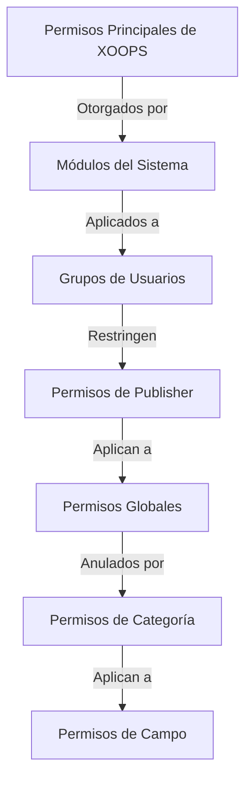

# Configuración de Permisos de Publisher

> Guía completa para configurar permisos de grupo, control de acceso y gestión de acceso de usuarios en Publisher.

---

## Conceptos Básicos de Permisos

### ¿Qué son los Permisos?

Los permisos controlan lo que diferentes grupos de usuarios pueden hacer en Publisher:

```
Quién puede:
  - Ver artículos
  - Enviar artículos
  - Editar artículos
  - Aprobar artículos
  - Gestionar categorías
  - Configurar ajustes
```

### Niveles de Permiso

```
Anónimo
  └── Solo ver artículos publicados

Usuarios Registrados
  ├── Ver artículos
  ├── Enviar artículos (aprobación pendiente)
  └── Editar propios artículos

Editores/Moderadores
  ├── Todos los permisos registrados
  ├── Aprobar artículos
  ├── Editar todos los artículos
  └── Gestionar algunas categorías

Administradores
  └── Acceso completo a todo
```

---

## Gestión de Permisos de Acceso

### Navegue a Permisos

```
Panel de Admin
└── Módulos
    └── Publisher
        ├── Permisos
        ├── Permisos de Categoría
        └── Gestión de Grupos
```

### Acceso Rápido

1. Inicie sesión como **Administrador**
2. Vaya a **Admin → Módulos**
3. Haga clic en **Publisher → Admin**
4. Haga clic en **Permisos** en menú izquierdo

---

## Permisos Globales

### Permisos a Nivel del Módulo

Controle el acceso al módulo Publisher y características:

```
Vista de configuración de permisos:
┌─────────────────────────────────────┐
│ Permiso             │ Anón │ Reg │ Editor │ Admin │
├────────────────────┼──────┼─────┼────────┼───────┤
│ Ver artículos          │  ✓   │  ✓  │   ✓    │  ✓   │
│ Enviar artículos       │  ✗   │  ✓  │   ✓    │  ✓   │
│ Editar propios artículos │  ✗   │  ✓  │   ✓    │  ✓   │
│ Editar todos los artículos │  ✗   │  ✗  │   ✓    │  ✓   │
│ Aprobar artículos      │  ✗   │  ✗  │   ✓    │  ✓   │
│ Gestionar categorías   │  ✗   │  ✗  │   ✗    │  ✓   │
│ Acceso al panel de admin │  ✗   │  ✗  │   ✓    │  ✓   │
└─────────────────────────────────────┘
```

### Descripciones de Permisos

| Permiso | Usuarios | Efecto |
|------------|-------|--------|
| **Ver artículos** | Todos los grupos | Pueden ver artículos publicados en front-end |
| **Enviar artículos** | Registrados+ | Pueden crear nuevos artículos (aprobación pendiente) |
| **Editar propios artículos** | Registrados+ | Pueden editar/eliminar sus propios artículos |
| **Editar todos los artículos** | Editores+ | Pueden editar artículos de cualquier usuario |
| **Eliminar propios artículos** | Registrados+ | Pueden eliminar sus propios artículos no publicados |
| **Eliminar todos los artículos** | Editores+ | Pueden eliminar cualquier artículo |
| **Aprobar artículos** | Editores+ | Pueden publicar artículos pendientes |
| **Gestionar categorías** | Admins | Crear, editar, eliminar categorías |
| **Acceso de admin** | Editores+ | Acceder a interfaz de admin |

---

## Configurar Permisos Globales

### Paso 1: Acceder a Configuración de Permisos

1. Vaya a **Admin → Módulos**
2. Encuentre **Publisher**
3. Haga clic en **Permisos** (o enlace Admin luego Permisos)
4. Vea matriz de permisos

### Paso 2: Establecer Permisos de Grupo

Para cada grupo, configure lo que pueden hacer:

#### Usuarios Anónimos

```yaml
Permisos del Grupo Anónimo:
  Ver artículos: ✓ SÍ
  Enviar artículos: ✗ NO
  Editar artículos: ✗ NO
  Eliminar artículos: ✗ NO
  Aprobar artículos: ✗ NO
  Gestionar categorías: ✗ NO
  Acceso de admin: ✗ NO

Resultado: Los usuarios anónimos solo pueden ver contenido publicado
```

#### Usuarios Registrados

```yaml
Permisos del Grupo Registrado:
  Ver artículos: ✓ SÍ
  Enviar artículos: ✓ SÍ (aprobación requerida)
  Editar propios artículos: ✓ SÍ
  Editar todos los artículos: ✗ NO
  Eliminar propios artículos: ✓ SÍ (solo borradores)
  Eliminar todos los artículos: ✗ NO
  Aprobar artículos: ✗ NO
  Gestionar categorías: ✗ NO
  Acceso de admin: ✗ NO

Resultado: Los usuarios registrados pueden contribuir contenido después de aprobación
```

#### Grupo Editores

```yaml
Permisos del Grupo de Editores:
  Ver artículos: ✓ SÍ
  Enviar artículos: ✓ SÍ
  Editar propios artículos: ✓ SÍ
  Editar todos los artículos: ✓ SÍ
  Eliminar propios artículos: ✓ SÍ
  Eliminar todos los artículos: ✓ SÍ
  Aprobar artículos: ✓ SÍ
  Gestionar categorías: ✓ LIMITADO
  Acceso de admin: ✓ SÍ
  Configurar ajustes: ✗ NO

Resultado: Los editores gestionan contenido pero no ajustes
```

#### Administradores

```yaml
Permisos del Grupo de Admins:
  ✓ ACCESO COMPLETO a todas las características

  - Todos los permisos de editor
  - Gestionar todas las categorías
  - Configurar todos los ajustes
  - Gestionar permisos
  - Instalar/desinstalar
```

### Paso 3: Guardar Permisos

1. Configure permisos de cada grupo
2. Marque casillas para acciones permitidas
3. Desmarque casillas para acciones denegadas
4. Haga clic en **Guardar Permisos**
5. Aparece mensaje de confirmación

---

## Permisos a Nivel de Categoría

### Establecer Acceso de Categoría

Controle quién puede ver/enviar a categorías específicas:

```
Admin → Publisher → Categorías
→ Seleccione categoría → Permisos
```

### Matriz de Permisos de Categoría

```
                 Anónimo  Registrado  Editor  Admin
Ver categoría        ✓         ✓         ✓       ✓
Enviar a categoría   ✗         ✓         ✓       ✓
Editar propio en categoría ✗ ✓         ✓       ✓
Editar todos en categoría ✗ ✗         ✓       ✓
Aprobar en categoría  ✗         ✗         ✓       ✓
Gestionar categoría  ✗         ✗         ✗       ✓
```

### Configurar Permisos de Categoría

1. Vaya a admin de **Categorías**
2. Encuentre categoría
3. Haga clic en botón **Permisos**
4. Para cada grupo, seleccione:
   - [ ] Ver esta categoría
   - [ ] Enviar artículos
   - [ ] Editar propios artículos
   - [ ] Editar todos los artículos
   - [ ] Aprobar artículos
   - [ ] Gestionar categoría
5. Haga clic en **Guardar**

### Ejemplos de Permisos de Categoría

#### Categoría Pública de Noticias

```
Anónimo: Solo ver
Registrado: Ver + Enviar (aprobación pendiente)
Editores: Aprobar + Editar
Admins: Control total
```

#### Categoría de Actualizaciones Internas

```
Anónimo: Sin acceso
Registrado: Solo ver
Editores: Enviar + Aprobar
Admins: Control total
```

#### Categoría de Blog de Invitados

```
Anónimo: Solo ver
Registrado: Enviar (aprobación pendiente)
Editores: Aprobar
Admins: Control total
```

---

## Permisos a Nivel de Campo

### Controlar Visibilidad de Campo de Formulario

Restrinja qué campos de formulario pueden ver/editar los usuarios:

```
Admin → Publisher → Permisos → Campos
```

### Opciones de Campo

```yaml
Campos Visibles para Usuarios Registrados:
  ✓ Título
  ✓ Descripción
  ✓ Contenido (cuerpo)
  ✓ Imagen destacada
  ✓ Categoría
  ✓ Etiquetas
  ✗ Autor (auto-establecido)
  ✗ Fecha de publicación (solo editores)
  ✗ Fecha programada (solo editores)
  ✗ Bandera destacada (solo editores)
  ✗ Permisos (solo admins)
```

### Ejemplos

#### Envío Limitado para Registrados

Los usuarios registrados ven menos opciones:

```
Campos disponibles:
  - Título ✓
  - Descripción ✓
  - Contenido ✓
  - Imagen destacada ✓
  - Categoría ✓

Campos ocultos:
  - Autor (auto-usuario actual)
  - Fecha de publicación (los editores deciden)
  - Fecha programada (solo admins)
  - Estado destacado (editores eligen)
```

#### Formulario Completo para Editores

Los editores ven todas las opciones:

```
Campos disponibles:
  - Todos los campos básicos
  - Todos los metadatos
  - Selección de autor ✓
  - Fecha/hora de publicación ✓
  - Fecha programada ✓
  - Estado destacado ✓
  - Fecha de expiración ✓
  - Permisos ✓
```

---

## Configuración de Grupo de Usuarios

### Crear Grupo Personalizado

1. Vaya a **Admin → Usuarios → Grupos**
2. Haga clic en **Crear Grupo**
3. Ingrese detalles de grupo:

```
Nombre del Grupo: "Bloggers de Comunidad"
Descripción del Grupo: "Usuarios que contribuyen contenido de blog"
Tipo: Grupo regular
```

4. Haga clic en **Guardar Grupo**
5. Vuelva a permisos de Publisher
6. Establezca permisos para nuevo grupo

### Ejemplos de Grupo

```
Grupos Sugeridos para Publisher:

Grupo: Colaboradores
  - Miembros regulares que envían artículos
  - Pueden editar propios artículos
  - No pueden aprobar artículos

Grupo: Revisores
  - Pueden ver artículos enviados
  - Pueden aprobar/rechazar artículos
  - No pueden eliminar artículos de otros

Grupo: Editores
  - Pueden editar cualquier artículo
  - Pueden aprobar artículos
  - Pueden moderar comentarios
  - Pueden gestionar algunas categorías

Grupo: Publicadores
  - Pueden editar cualquier artículo
  - Pueden publicar directamente (sin aprobación)
  - Pueden gestionar todas las categorías
  - Pueden configurar ajustes
```

---

## Jerarquías de Permiso

### Flujo de Permiso



### Herencia de Permiso

```
Base: Permisos del módulo global
  ↓
Categoría: Anulaciones para categorías específicas
  ↓
Campo: Restringe aún más campos disponibles
  ↓
Usuario: Tiene permiso si TODOS los niveles lo permiten
```

**Ejemplo:**

```
El usuario quiere editar artículo:
1. El grupo de usuario debe tener permiso "editar artículos" (global)
2. La categoría debe permitir edición (nivel de categoría)
3. Las restricciones de campo deben permitir (si aplica)
4. El usuario debe ser autor O editor (para propio vs todos)

Si ALGÚN nivel deniega → Permiso denegado
```

---

## Permisos de Flujo de Trabajo de Aprobación

### Configurar Aprobación de Envío

Controle si los artículos necesitan aprobación:

```
Admin → Publisher → Preferencias → Flujo de Trabajo
```

#### Opciones de Aprobación

```yaml
Flujo de Trabajo de Envío:
  Requerir Aprobación: Sí

  Para Usuarios Registrados:
    - Nuevos artículos: Borrador (aprobación pendiente)
    - Los editores deben aprobar
    - El usuario puede editar mientras esté pendiente
    - Después de aprobación: El usuario aún puede editar

  Para Editores:
    - Nuevos artículos: Publicar directamente (opcional)
    - Omitir cola de aprobación
    - O siempre requerir aprobación
```

#### Configurar Por Grupo

1. Vaya a Preferencias
2. Encuentre "Flujo de Trabajo de Envío"
3. Para cada grupo, establezca:

```
Grupo: Usuarios Registrados
  Requerir aprobación: ✓ SÍ
  Estado predeterminado: Borrador
  Puede modificar mientras está pendiente: ✓ SÍ

Grupo: Editores
  Requerir aprobación: ✗ NO
  Estado predeterminado: Publicado
  Puede modificar publicado: ✓ SÍ
```

4. Haga clic en **Guardar**

---

## Moderar Artículos

### Aprobar Artículos Pendientes

Para usuarios con permiso "aprobar artículos":

1. Vaya a **Admin → Publisher → Artículos**
2. Filtre por **Estado**: Pendiente
3. Haga clic en artículo para revisar
4. Compruebe la calidad del contenido
5. Establezca **Estado**: Publicado
6. Opcional: Agregue notas editoriales
7. Haga clic en **Guardar**

### Rechazar Artículos

Si el artículo no cumple con estándares:

1. Abra artículo
2. Establezca **Estado**: Borrador
3. Agregue razón de rechazo (en comentario o correo)
4. Haga clic en **Guardar**
5. Envíe mensaje al autor explicando el rechazo

### Moderar Comentarios

Si modifica comentarios:

1. Vaya a **Admin → Publisher → Comentarios**
2. Filtre por **Estado**: Pendiente
3. Revise comentario
4. Opciones:
   - Aprobar: Haga clic en **Aprobar**
   - Rechazar: Haga clic en **Eliminar**
   - Editar: Haga clic en **Editar**, corrija, guarde
5. Haga clic en **Guardar**

---

## Gestionar Acceso de Usuario

### Ver Grupos de Usuarios

Vea qué usuarios pertenecen a grupos:

```
Admin → Usuarios → Grupos de Usuarios

Para cada usuario:
  - Grupo principal (uno)
  - Grupos secundarios (múltiples)

Los permisos se aplican desde todos los grupos (unión)
```

### Agregar Usuario a Grupo

1. Vaya a **Admin → Usuarios**
2. Encuentre usuario
3. Haga clic en **Editar**
4. Bajo **Grupos**, marque grupos para agregar
5. Haga clic en **Guardar**

### Cambiar Permisos de Usuario

Para usuarios individuales (si es compatible):

1. Vaya a admin de usuario
2. Encuentre usuario
3. Haga clic en **Editar**
4. Busque anulación de permisos individuales
5. Configure según sea necesario
6. Haga clic en **Guardar**

---

## Escenarios Comunes de Permiso

### Escenario 1: Blog Abierto

Permita que cualquiera envíe:

```
Anónimo: Ver
Registrado: Enviar, editar propio, eliminar propio
Editores: Aprobar, editar todos, eliminar todos
Admins: Control total

Resultado: Blog de comunidad abierto
```

### Escenario 2: Sitio de Noticias Moderado

Proceso de aprobación estricto:

```
Anónimo: Solo ver
Registrado: No puede enviar
Editores: Enviar, aprobar otros
Admins: Control total

Resultado: Solo profesionales aprobados publican
```

### Escenario 3: Blog de Personal

Los empleados pueden contribuir:

```
Crear grupo: "Personal"
Anónimo: Ver
Registrado: Solo ver (no personal)
Personal: Enviar, editar propio, publicar directamente
Admins: Control total

Resultado: Blog de autoría de personal
```

### Escenario 4: Multi-Categoría con Diferentes Editores

Diferentes editores para diferentes categorías:

```
Categoría Noticias:
  Grupo de Editores A: Control total

Categoría Reseñas:
  Grupo de Editores B: Control total

Categoría Tutoriales:
  Grupo de Editores C: Control total

Resultado: Control editorial descentralizado
```

---

## Prueba de Permiso

### Verificar que los Permisos Funcionan

1. Cree usuario de prueba en cada grupo
2. Inicie sesión como cada usuario de prueba
3. Intente:
   - Ver artículos
   - Enviar artículo (debe crear borrador si se permite)
   - Editar artículo (propio y otros)
   - Eliminar artículo
   - Acceder al panel de admin
   - Acceder a categorías

4. Verifique que los resultados coincidan con permisos esperados

### Casos de Prueba Comunes

```
Caso de Prueba 1: Usuario anónimo
  [ ] Puede ver artículos publicados: ✓
  [ ] No puede enviar artículos: ✓
  [ ] No puede acceder a admin: ✓

Caso de Prueba 2: Usuario registrado
  [ ] Puede enviar artículos: ✓
  [ ] Los artículos van a Borrador: ✓
  [ ] Puede editar propios artículos: ✓
  [ ] No puede editar otros: ✓
  [ ] No puede acceder a admin: ✓

Caso de Prueba 3: Editor
  [ ] Puede aprobar artículos: ✓
  [ ] Puede editar cualquier artículo: ✓
  [ ] Puede acceder a admin: ✓
  [ ] No puede eliminar todos: ✓ (u otro si se permite)

Caso de Prueba 4: Admin
  [ ] Puede hacer todo: ✓
```

---

## Solución de Problemas de Permisos

### Problema: El usuario no puede enviar artículos

**Compruebe:**
```
1. El grupo de usuario tiene permiso "enviar artículos"
   Admin → Publisher → Permisos

2. El usuario pertenece a grupo permitido
   Admin → Usuarios → Editar usuario → Grupos

3. La categoría permite envío del grupo del usuario
   Admin → Publisher → Categorías → Permisos

4. El usuario es registrado (no anónimo)
```

**Solución:**
```bash
1. Verifique que el grupo de usuario registrado tiene permiso de envío
2. Agregue usuario a grupo apropiado
3. Compruebe permisos de categoría
4. Limpie caché de sesión
```

### Problema: El editor no puede aprobar artículos

**Compruebe:**
```
1. El grupo editor tiene permiso "aprobar artículos"
2. Los artículos existen con estado "Pendiente"
3. El editor está en grupo correcto
4. La categoría permite aprobación del grupo editor
```

**Solución:**
```bash
1. Vaya a Permisos, compruebe "aprobar artículos" está marcado para grupo editor
2. Cree artículo de prueba, establezca en Borrador
3. Intente aprobar como editor
4. Compruebe mensajes de error en registro del sistema
```

### Problema: Puede ver artículos pero no puede acceder a categoría

**Compruebe:**
```
1. La categoría no está deshabilitada/oculta
2. Los permisos de categoría permiten ver
3. El grupo del usuario tiene permiso para ver categoría
4. La categoría está publicada
```

**Solución:**
```bash
1. Vaya a Categorías, compruebe estado de categoría es "Habilitado"
2. Compruebe permisos de categoría están establecidos
3. Agregue grupo del usuario al permiso de ver de categoría
```

### Problema: Los permisos cambiaron pero no toman efecto

**Solución:**
```bash
1. Limpie caché: Admin → Herramientas → Limpiar Caché
2. Limpie sesión: Cierre sesión e inicie sesión de nuevo
3. Compruebe registro del sistema para errores
4. Verifique que los permisos realmente se guardaron
5. Intente navegador diferente/ventana incógnita
```

---

## Copia de Seguridad de Permisos y Exportación

### Exportar Permisos

Algunos sistemas permiten exportación:

1. Vaya a **Admin → Publisher → Herramientas**
2. Haga clic en **Exportar Permisos**
3. Guarde archivo `.xml` o `.json`
4. Mantenga como copia de seguridad

### Importar Permisos

Restaure desde copia de seguridad:

1. Vaya a **Admin → Publisher → Herramientas**
2. Haga clic en **Importar Permisos**
3. Seleccione archivo de copia de seguridad
4. Revise cambios
5. Haga clic en **Importar**

---

## Mejores Prácticas

### Lista de Verificación de Configuración de Permiso

- [ ] Decida sobre grupos de usuario
- [ ] Asigne nombres claros a grupos
- [ ] Establezca permisos base para cada grupo
- [ ] Pruebe cada nivel de permiso
- [ ] Documente estructura de permiso
- [ ] Cree flujo de trabajo de aprobación
- [ ] Entrene editores sobre moderación
- [ ] Monitoree uso de permiso
- [ ] Revise permisos trimestralmente
- [ ] Haga copia de seguridad de configuración de permisos

### Mejores Prácticas de Seguridad

```
✓ Principio de Menor Privilegio
  - Otorgue permisos mínimos necesarios

✓ Acceso Basado en Rol
  - Use grupos para roles (editor, moderador, etc)

✓ Audite Permisos
  - Revise quién tiene qué acceso

✓ Separe Deberes
  - El remitente, aprobador, publicador son diferentes

✓ Revisión Regular
  - Compruebe permisos trimestralmente
  - Elimine acceso cuando usuarios se van
  - Actualice para nuevos requisitos
```

---

## Guías Relacionadas

- Creación de Artículos
- Gestión de Categorías
- Configuración Básica
- Instalación

---

## Próximos Pasos

- Configure Permisos para su flujo de trabajo
- Cree Artículos con permisos apropiados
- Configure Categorías con permisos
- Entrene usuarios sobre creación de artículos

---

#publisher #permissions #groups #access-control #security #moderation #xoops

