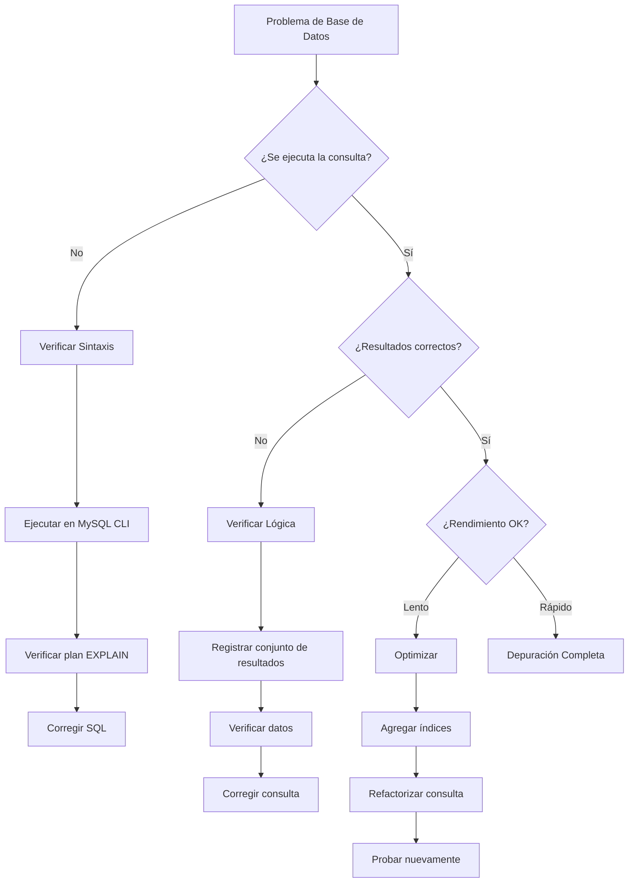
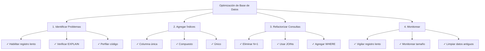

# Técnicas de Depuración de Base de Datos

> Métodos y herramientas para depurar consultas SQL y problemas de base de datos en aplicaciones XOOPS.

---

## Diagrama de Flujo de Diagnóstico



---

## Habilitar Registro de Consultas

### Método 1: Modo de Depuración de XOOPS

```php
<?php
// En mainfile.php
define('XOOPS_DEBUG_LEVEL', 2);

// Ahora todas las consultas aparecen en la tabla xoops_log
// O en archivos: xoops_data/logs/
?>
```

Verificar resultados:
```bash
# Ver registros
tail -100 xoops_data/logs/*.log

# O consultar base de datos
SELECT * FROM xoops_log ORDER BY created DESC LIMIT 20;
```

---

### Método 2: Registro de Consultas Lenta de MySQL

Habilitar en `/etc/mysql/my.cnf`:

```ini
[mysqld]
# Habilitar registro de consultas lentas
slow_query_log = 1
slow_query_log_file = /var/log/mysql/slow.log
long_query_time = 1          # Registrar consultas > 1 segundo
log_queries_not_using_indexes = 1
```

Reiniciar MySQL:
```bash
sudo systemctl restart mysql
# o
sudo systemctl restart mariadb
```

Ver registro:
```bash
tail -100 /var/log/mysql/slow.log

# O analizar con mysqldumpslow
mysqldumpslow -s t -t 10 /var/log/mysql/slow.log
```

---

### Método 3: Registro de Consultas General

Habilitar para todas las consultas (cuidado: archivos de registro grandes):

```sql
-- Habilitar
SET GLOBAL general_log = 'ON';
SET GLOBAL log_output = 'FILE';
SET GLOBAL general_log_file = '/var/log/mysql/general.log';

-- Deshabilitar
SET GLOBAL general_log = 'OFF';

-- Ver
SHOW VARIABLES LIKE 'general_log%';
```

---

## Depuración SQL en Código

### Registrar Ejecución de Consulta

```php
<?php
require_once 'mainfile.php';

$ray = ray();  // Si usa el depurador Ray

// Ejecutar consulta
$query = "SELECT u.uid, u.uname, COUNT(a.id) as total_articles
          FROM xoops_users u
          LEFT JOIN xoops_articles a ON u.uid = a.author_id
          GROUP BY u.uid
          ORDER BY total_articles DESC";

$ray->label('Consulta')->info($query);

$result = $GLOBALS['xoopsDB']->query($query);

if (!$result) {
    $ray->error("Error SQL: " . $GLOBALS['xoopsDB']->error);
    exit;
}

// Registrar resultados
$data = [];
while ($row = $result->fetch_assoc()) {
    $data[] = $row;
}

$ray->label('Resultados')->dump($data);
$ray->info("Se encontraron " . count($data) . " filas");
?>
```

---

### Medir Rendimiento de Consulta

```php
<?php
$db = $GLOBALS['xoopsDB'];
$ray = ray();

// Medir tiempo de ejecución
$start = microtime(true);

$query = "SELECT * FROM xoops_articles LIMIT 1000";
$result = $db->query($query);

$exec_time = (microtime(true) - $start) * 1000;  // milisegundos

$ray->info("Consulta ejecutada en: {$exec_time}ms");

// Registrar consultas lentas
if ($exec_time > 100) {  // Alerta si > 100ms
    $ray->warning("Consulta lenta detectada: {$exec_time}ms");
    $ray->info($query);
}
?>
```

---

### Verificar Resultados de Consulta

```php
<?php
$db = $GLOBALS['xoopsDB'];
$ray = ray();

$query = "SELECT * FROM xoops_articles WHERE author_id = 5";
$result = $db->query($query);

// Verificar si la consulta fue exitosa
if (!$result) {
    $ray->error("Consulta fallida: " . $db->error);
    exit;
}

// Obtener conteo de filas
$count = $result->num_rows;
$ray->info("Consulta retornó: $count filas");

// Obtener resultados
$articles = [];
while ($row = $result->fetch_assoc()) {
    $articles[] = $row;
}

// Verificar datos
if (empty($articles)) {
    $ray->warning("No se encontraron artículos para el autor 5");
} else {
    $ray->success("Se encontraron " . count($articles) . " artículos");
    $ray->dump($articles);
}
?>
```

---

## Analizar Rendimiento de Consulta

### Comando EXPLAIN

Use EXPLAIN para analizar ejecución de consulta:

```sql
-- Analizar una consulta
EXPLAIN SELECT * FROM xoops_articles WHERE author_id = 5;

-- Con información extendida
EXPLAIN EXTENDED SELECT * FROM xoops_articles WHERE author_id = 5;

-- Formato JSON (muestra más detalles)
EXPLAIN FORMAT=JSON SELECT * FROM xoops_articles WHERE author_id = 5\G
```

**Campos Clave a Verificar:**

```
type: ALL           (malo) - Escaneo de tabla completa
      INDEX         (bien) - Escaneo de índice
      ref/const     (bueno) - Búsqueda de índice directa
      range         (bien) - Escaneo de rango usando índice

possible_keys:      Índices disponibles
key:                Índice realmente usado
key_len:            Longitud del índice usado
rows:               Filas estimadas examinadas
Extra:              Información adicional (Using where, Using index, etc.)
```

### Ejemplo de Análisis

```sql
-- Consulta lenta sin índice
EXPLAIN SELECT * FROM xoops_articles WHERE author_id = 5;

+----+-------------+----------+------+---------------+------+---------+------+-------+-------------+
| id | select_type | table    | type | possible_keys | key  | key_len | rows | Extra |
+----+-------------+----------+------+---------------+------+---------+------+-------+-------------+
|  1 | SIMPLE      | articles | ALL  | NULL          | NULL | NULL    | 1000 | Using where |
+----+-------------+----------+------+---------------+------+-------+------+-------+-------------+
                                      ↑
                          ¡Sin índice disponible!

-- Después de agregar índice
ALTER TABLE xoops_articles ADD INDEX (author_id);

EXPLAIN SELECT * FROM xoops_articles WHERE author_id = 5;

+----+-------------+----------+------+---------------+-----------+---------+-------+------+
| id | select_type | table    | type | possible_keys | key       | key_len | rows  | Extra|
+----+-------------+----------+------+---------------+-----------+---------+-------+------+
|  1 | SIMPLE      | articles | ref  | author_id     | author_id | 4       | 10    |
+----+-------------+----------+------+---------------+-----------+---------+-------+------+
                                                              ↑
                                      ¡Usando índice - mucho más rápido!
```

---

## Problemas SQL Comunes

### 1. Problema N+1

**Problema:**
```php
<?php
// INCORRECTO: Múltiples consultas en bucle
$authors = $db->query("SELECT uid FROM xoops_users LIMIT 100");
while ($author = $authors->fetch_assoc()) {
    // ¡Esto se ejecuta 100 veces!
    $articles = $db->query(
        "SELECT COUNT(*) FROM xoops_articles WHERE author_id = " . $author['uid']
    );
    echo $articles->fetch_row()[0];
}
?>
```

**Solución: Usar JOIN**
```php
<?php
// CORRECTO: Una consulta
$result = $db->query("
    SELECT u.uid, u.uname, COUNT(a.id) as total
    FROM xoops_users u
    LEFT JOIN xoops_articles a ON u.uid = a.author_id
    GROUP BY u.uid
    LIMIT 100
");

while ($row = $result->fetch_assoc()) {
    echo $row['total'];
}
?>
```

---

### 2. Índices Faltantes

**Identificar:**
```sql
-- Buscar consultas que escaneen todas las filas
SELECT * FROM xoops_log
WHERE info LIKE '%type: ALL%'
ORDER BY created DESC;
```

**Agregar Índices:**
```sql
-- Índice de columna única
ALTER TABLE xoops_articles ADD INDEX (author_id);
ALTER TABLE xoops_articles ADD INDEX (created);

-- Índice compuesto
ALTER TABLE xoops_articles ADD INDEX (author_id, created);

-- Índice único
ALTER TABLE xoops_articles ADD UNIQUE INDEX (slug);
```

---

### 3. Condiciones WHERE Ineficientes

**Problema:**
```sql
-- Incorrecto: Funciones previenen el uso de índice
SELECT * FROM xoops_articles
WHERE YEAR(created) = 2024;

-- Incorrecto: OR con diferentes columnas
SELECT * FROM xoops_articles
WHERE category = 'tech' OR author_id = 5;
```

**Solución:**
```sql
-- Correcto: Usar rango
SELECT * FROM xoops_articles
WHERE created >= '2024-01-01' AND created < '2025-01-01';

-- Correcto: Usar UNION para diferentes columnas
SELECT * FROM xoops_articles WHERE category = 'tech'
UNION
SELECT * FROM xoops_articles WHERE author_id = 5;
```

---

## Depuración de Problemas Específicos

### Problema: Consulta Retorna Resultados Incorrectos

```php
<?php
$ray = ray();

// Probar con datos de ejemplo
$author_id = 5;
$ray->info("Buscando author_id = $author_id");

$query = "SELECT * FROM xoops_articles WHERE author_id = ?";
$stmt = $db->prepare($query);
$stmt->bind_param("i", $author_id);
$stmt->execute();

$result = $stmt->get_result();
$count = $result->num_rows;

$ray->info("Encontrado: $count artículos");

// Verificar si la consulta parametrizada ayuda
if ($count == 0) {
    // Intentar sin parámetro para depuración
    $debug_query = "SELECT * FROM xoops_articles WHERE author_id = $author_id";
    $ray->warning("Consulta de depuración: $debug_query");
}

// Descargar primer resultado
if ($row = $result->fetch_assoc()) {
    $ray->label('Primer Resultado')->dump($row);
}
?>
```

---

### Problema: Consulta JOIN Lenta

```php
<?php
$ray = ray();

$query = "
    SELECT a.id, a.title, u.uname, u.email
    FROM xoops_articles a
    LEFT JOIN xoops_users u ON a.author_id = u.uid
    WHERE a.status = 1
    ORDER BY a.created DESC
    LIMIT 50
";

$ray->info("Ejecutando consulta join");
$ray->measure(function() use ($query) {
    $result = $GLOBALS['xoopsDB']->query($query);
    return $result;
});

// Analizar con EXPLAIN
$ray->label('Análisis de Consulta')->info($query);
?>
```

Ejecutar EXPLAIN:
```sql
EXPLAIN SELECT a.id, a.title, u.uname, u.email
FROM xoops_articles a
LEFT JOIN xoops_users u ON a.author_id = u.uid
WHERE a.status = 1
ORDER BY a.created DESC
LIMIT 50\G

-- Buscar:
-- - type: ALL (necesita índice)
-- - Extra: Using temporary; Using filesort (ineficiente)
-- Solución: Agregar índice compuesto
ALTER TABLE xoops_articles ADD INDEX (status, created);
```

---

## Crear Registro de Depuración de Consultas

```php
<?php
// Crear modules/yourmodule/QueryLogger.php

class QueryLogger {
    private static $queries = [];
    private static $times = [];

    public static function log($query) {
        self::$queries[] = $query;
        self::$times[] = microtime(true);
    }

    public static function execute($query) {
        $start = microtime(true);
        $result = $GLOBALS['xoopsDB']->query($query);
        $time = (microtime(true) - $start) * 1000;

        self::log($query);
        self::$times[count(self::$times) - 1] = $time;

        return $result;
    }

    public static function report() {
        echo "<h1>Reporte de Consultas</h1>";
        echo "<table>";
        echo "<tr><th>Consulta</th><th>Tiempo (ms)</th></tr>";

        foreach (self::$queries as $i => $query) {
            $time = self::$times[$i] ?? 0;
            echo "<tr>";
            echo "<td><pre>" . htmlspecialchars(substr($query, 0, 100)) . "</pre></td>";
            echo "<td>" . number_format($time, 2) . "</td>";
            echo "</tr>";
        }

        echo "</table>";
    }

    public static function getTotalQueries() {
        return count(self::$queries);
    }

    public static function getTotalTime() {
        return array_sum(self::$times);
    }
}
?>
```

Uso:
```php
<?php
require_once 'QueryLogger.php';

$result = QueryLogger::execute("SELECT * FROM xoops_articles");

// Después...
echo "Consultas totales: " . QueryLogger::getTotalQueries();
echo "Tiempo total: " . QueryLogger::getTotalTime() . "ms";
QueryLogger::report();
?>
```

---

## Lista de Verificación de Optimización de Base de Datos



---

## Consultas MySQL Útiles

```sql
-- Encontrar tablas lentas
SELECT * FROM xoops_log
WHERE info LIKE '%type: ALL%'
ORDER BY created DESC LIMIT 20;

-- Listar todos los índices
SHOW INDEX FROM xoops_articles;

-- Encontrar índices duplicados
SELECT a.table_name, a.index_name, a.seq_in_index, a.column_name
FROM information_schema.statistics a
JOIN information_schema.statistics b
  ON a.table_name = b.table_name
  AND a.seq_in_index = b.seq_in_index
  AND a.column_name = b.column_name
  AND a.index_name != b.index_name
WHERE a.table_name LIKE 'xoops_%';

-- Tamaños de tabla
SELECT table_name,
       ROUND(((data_length + index_length) / 1024 / 1024), 2) AS size_mb
FROM information_schema.tables
WHERE table_schema = 'xoops_db'
ORDER BY size_mb DESC;

-- Encontrar índices no usados
SELECT * FROM performance_schema.table_io_waits_summary_by_index_usage
WHERE object_schema != 'mysql'
AND count_star = 0
ORDER BY object_name;
```

---

## Documentación Relacionada

- Habilitar Modo de Depuración
- Usar Depurador Ray
- FAQ de Rendimiento
- Fundamentos de Base de Datos

---

#xoops #base_de_datos #depuración #sql #optimización #mysql
