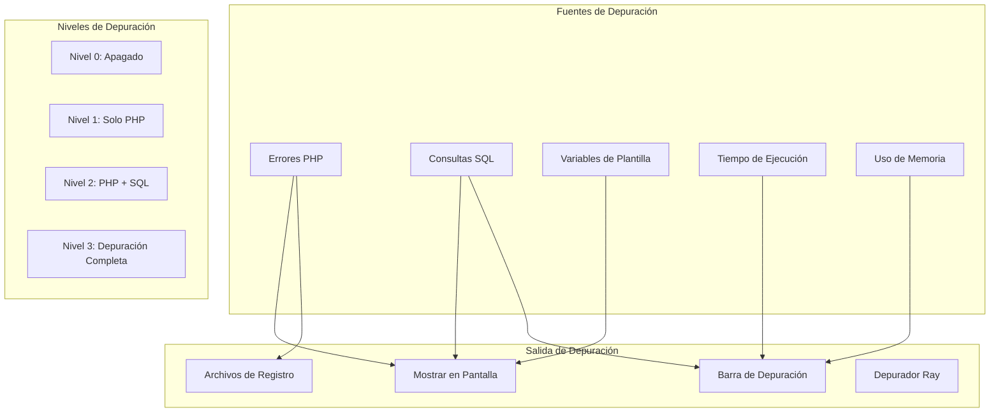
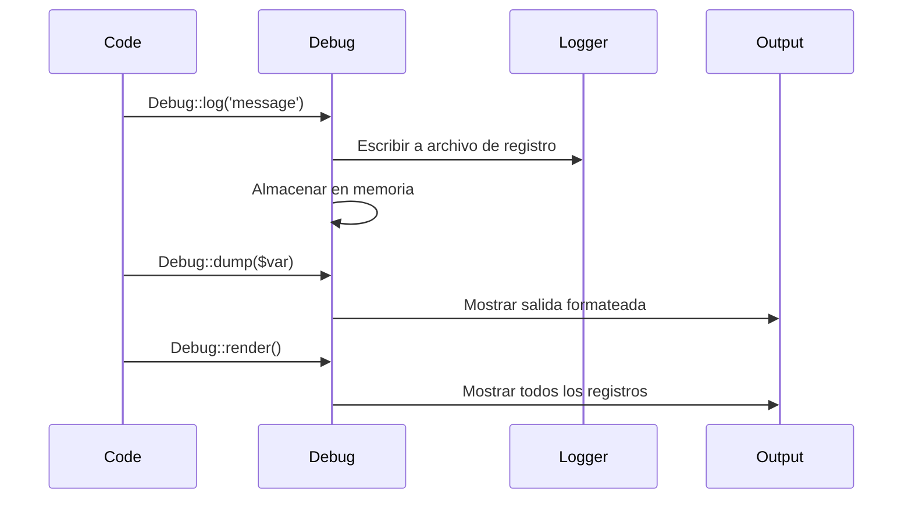

> Guía completa de las características y herramientas de depuración de XOOPS.

---

## Arquitectura de Depuración



---

## Niveles de Depuración de XOOPS

### Habilitar en mainfile.php

```php
<?php
// Configuración de nivel de depuración
define('XOOPS_DEBUG_LEVEL', 2);

// Nivel 0: Depuración apagada (producción)
// Nivel 1: Solo depuración PHP
// Nivel 2: PHP + consultas SQL
// Nivel 3: PHP + SQL + plantillas Smarty
```

### Detalles de Nivel

| Nivel | Errores PHP | Consultas SQL | Variables de Plantilla | Recomendado para |
|-------|------------|-------------|---------------|-----------------|
| 0 | Ocultos | No | No | Producción |
| 1 | Mostrados | No | No | Verificaciones rápidas |
| 2 | Mostrados | Registrados | No | Desarrollo |
| 3 | Mostrados | Registrados | Mostrados | Depuración profunda |

---

## Mostrar Errores PHP

### Configuración de Desarrollo

```php
// Agregar a mainfile.php para desarrollo
error_reporting(E_ALL);
ini_set('display_errors', '1');
ini_set('display_startup_errors', '1');
ini_set('log_errors', '1');
ini_set('error_log', XOOPS_VAR_PATH . '/logs/php_errors.log');
```

### Configuración de Producción

```php
// Configuración segura para producción
error_reporting(E_ALL & ~E_NOTICE & ~E_DEPRECATED);
ini_set('display_errors', '0');
ini_set('log_errors', '1');
ini_set('error_log', XOOPS_VAR_PATH . '/logs/php_errors.log');
```

---

## Depuración de Consultas SQL

### Ver Consultas en Modo de Depuración

Con `XOOPS_DEBUG_LEVEL` configurado a 2 o 3, las consultas SQL aparecen al pie de las páginas.

### Registro Manual de Consultas

```php
// Registrar consulta específica
$sql = "SELECT * FROM " . $GLOBALS['xoopsDB']->prefix('mymodule_items');

// Antes de ejecutar
error_log("Consulta SQL: " . $sql);

$result = $GLOBALS['xoopsDB']->query($sql);

// Registrar tiempo de consulta
$start = microtime(true);
$result = $GLOBALS['xoopsDB']->query($sql);
$time = microtime(true) - $start;
error_log("Consulta tomó: " . number_format($time * 1000, 2) . "ms");
```

### Usar XoopsLogger

```php
// Acceder al registrador
$logger = $GLOBALS['xoopsLogger'];

// Obtener todas las consultas
$queries = $logger->queries;
foreach ($queries as $query) {
    echo "SQL: " . $query['sql'] . "\n";
    echo "Tiempo: " . $query['time'] . "s\n";
    echo "---\n";
}

// Registrar mensaje personalizado
$logger->addExtra('Mi Depuración', 'Mensaje de depuración personalizado');
```

---

## Depuración de Plantillas Smarty

### Habilitar Consola de Depuración de Smarty

```php
// En su módulo o plantilla
{debug}

// O en PHP
$GLOBALS['xoopsTpl']->debugging = true;
$GLOBALS['xoopsTpl']->debugging_ctrl = 'URL';  // Agregar SMARTY_DEBUG a la URL
```

### Ver Variables Asignadas

```smarty
{* En plantilla, mostrar todas las variables asignadas *}
<pre>
{$smarty.template_object->tpl_vars|print_r}
</pre>

{* Mostrar variable específica *}
{$myvar|@debug_print_var}
```

### Depuración en PHP

```php
// Antes de mostrar plantilla
echo "<pre>";
print_r($GLOBALS['xoopsTpl']->getTemplateVars());
echo "</pre>";
```

---

## Integración del Depurador Ray

### Instalación

```bash
composer require spatie/ray --dev
```

### Configuración

```php
// ray.php en la raíz de XOOPS
return [
    'enable' => true,
    'host' => 'localhost',
    'port' => 23517,
    'remote_path' => null,
    'local_path' => null,
];
```

### Ejemplos de Uso

```php
// Salida básica
ray('Hola desde XOOPS');

// Inspección de variables
ray($item)->label('Objeto Item');

// Vista expandida
ray($complexArray)->expand();

// Medir tiempo de ejecución
ray()->measure();
// ... código a medir ...
ray()->measure();

// Consultas SQL
ray()->showQueries();

// Codificación por colores
ray('Error ocurrió')->red();
ray('¡Éxito!')->green();
ray('Advertencia')->orange();

// Rastreo de pila
ray()->trace();

// Pausar ejecución (como un punto de quiebre)
ray()->pause();
```

### Depuración de Consultas de Base de Datos

```php
// Registrar todas las consultas
ray()->showQueries();

// O consulta específica
$sql = "SELECT * FROM items WHERE status = 'active'";
ray($sql)->label('Consulta');

$result = $db->query($sql);
ray($result)->label('Resultado');
```

---

## Barra de Depuración PHP

### Instalación

```bash
composer require maximebf/debugbar
```

### Integración

```php
<?php
// include/debugbar.php

use DebugBar\StandardDebugBar;

$debugbar = new StandardDebugBar();
$debugbarRenderer = $debugbar->getJavascriptRenderer();

// Agregar al encabezado
echo $debugbarRenderer->renderHead();

// Registrar mensajes
$debugbar['messages']->addMessage('¡Hola Mundo!');

// Registrar excepciones
$debugbar['exceptions']->addException(new Exception('Prueba'));

// Cronometrar operaciones
$debugbar['time']->startMeasure('operation', 'Mi Operación');
// ... código ...
$debugbar['time']->stopMeasure('operation');

// Agregar al pie
echo $debugbarRenderer->render();
```

---

## Asistente de Depuración Personalizado

```php
<?php
// class/Debug.php

namespace XoopsModules\MyModule;

class Debug
{
    private static bool $enabled = true;
    private static array $logs = [];
    private static float $startTime;

    public static function init(): void
    {
        self::$startTime = microtime(true);
        self::$enabled = (defined('XOOPS_DEBUG_LEVEL') && XOOPS_DEBUG_LEVEL > 0);
    }

    public static function log(string $message, string $level = 'info'): void
    {
        if (!self::$enabled) return;

        self::$logs[] = [
            'time' => microtime(true) - self::$startTime,
            'level' => $level,
            'message' => $message,
            'memory' => memory_get_usage(true)
        ];

        // También escribir a archivo
        $logFile = XOOPS_VAR_PATH . '/logs/debug_' . date('Y-m-d') . '.log';
        $logMessage = sprintf(
            "[%s] [%s] [%.4fs] [%s MB] %s\n",
            date('H:i:s'),
            strtoupper($level),
            microtime(true) - self::$startTime,
            round(memory_get_usage(true) / 1024 / 1024, 2),
            $message
        );
        error_log($logMessage, 3, $logFile);
    }

    public static function dump($var, string $label = ''): void
    {
        if (!self::$enabled) return;

        $output = $label ? "$label: " : '';
        $output .= print_r($var, true);
        self::log($output, 'dump');

        if (php_sapi_name() !== 'cli') {
            echo "<pre style='background:#f5f5f5;padding:10px;margin:10px;border:1px solid #ddd;'>";
            if ($label) echo "<strong>$label:</strong>\n";
            var_dump($var);
            echo "</pre>";
        }
    }

    public static function time(string $label): callable
    {
        $start = microtime(true);
        return function() use ($start, $label) {
            $elapsed = microtime(true) - $start;
            self::log("$label: " . number_format($elapsed * 1000, 2) . "ms", 'timing');
        };
    }

    public static function render(): string
    {
        if (!self::$enabled || empty(self::$logs)) return '';

        $html = '<div style="background:#333;color:#fff;padding:20px;margin:20px;font-family:monospace;font-size:12px;">';
        $html .= '<h3 style="margin-top:0;">Registro de Depuración</h3>';
        $html .= '<table style="width:100%;border-collapse:collapse;">';

        foreach (self::$logs as $log) {
            $color = match($log['level']) {
                'error' => '#ff6b6b',
                'warning' => '#ffd93d',
                'dump' => '#6bcb77',
                'timing' => '#4d96ff',
                default => '#fff'
            };

            $html .= sprintf(
                '<tr style="border-bottom:1px solid #555;">
                    <td style="padding:5px;width:80px;">%.4fs</td>
                    <td style="padding:5px;width:80px;color:%s">%s</td>
                    <td style="padding:5px;">%s</td>
                    <td style="padding:5px;width:100px;">%s MB</td>
                </tr>',
                $log['time'],
                $color,
                strtoupper($log['level']),
                htmlspecialchars($log['message']),
                round($log['memory'] / 1024 / 1024, 2)
            );
        }

        $html .= '</table></div>';
        return $html;
    }
}

// Uso
Debug::init();
Debug::log('Página iniciada');
$timer = Debug::time('Consulta de base de datos');
// ... consulta ...
$timer();
Debug::dump($result, 'Resultado de Consulta');
echo Debug::render();
```

---

## Flujo de Salida de Depuración



---

## Documentación Relacionada

- Pantalla Blanca de la Muerte
- Usar Depurador Ray
- Mejores Prácticas de Seguridad

---

#xoops #depuración #solución_de_problemas #desarrollo #registro
