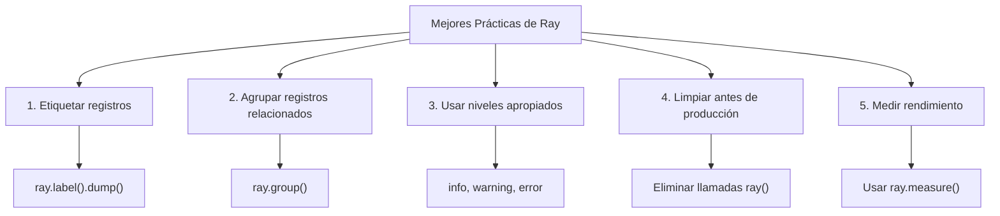

# Usar Depurador Ray en XOOPS

> Depuración moderna con Ray: inspeccionar variables, registrar mensajes, rastrear consultas SQL y perfilar rendimiento en su aplicación XOOPS.

---

## ¿Qué es Ray?

Ray es una herramienta de depuración ligera que le ayuda a inspeccionar el estado de la aplicación sin detener la ejecución ni usar puntos de quiebre. Es perfecto para desarrollo en XOOPS.

**Características:**
- Registrar mensajes y variables
- Inspeccionar consultas SQL
- Rastrear rendimiento
- Perfilar código
- Agrupar registros relacionados
- Línea de tiempo visual

**Requisitos:**
- PHP 7.4+
- Aplicación Ray (versión gratuita disponible)
- Composer

---

## Instalación

### Paso 1: Instalar Paquete Ray

```bash
cd /path/to/xoops

# Instalar Ray via Composer
composer require spatie/ray

# O instalar globalmente
composer global require spatie/ray
```

### Paso 2: Descargar Aplicación Ray

Descargar desde [ray.so](https://ray.so):
- Mac: Ray.app
- Windows: Ray.exe
- Linux: ray (AppImage)

### Paso 3: Configurar Firewall (si es necesario)

Ray usa puerto 23517 por defecto:

```bash
# UFW
sudo ufw allow 23517/udp

# iptables
sudo iptables -A INPUT -p udp --dport 23517 -j ACCEPT
```

---

## Uso Básico

### Registro Simple

```php
<?php
require_once 'mainfile.php';
require 'vendor/autoload.php';

// Inicializar Ray
$ray = ray();

// Registrar un mensaje simple
$ray->info('Página cargada');

// Registrar una variable
$user = ['name' => 'John', 'email' => 'john@example.com'];
$ray->dump($user);

// Registrar con etiqueta
$ray->label('Datos de Usuario')->dump($user);
?>
```

**Salida en aplicación Ray:**
```
ℹ Página cargada
👁 Datos de Usuario: ['name' => 'John', 'email' => 'john@example.com']
```

---

### Diferentes Niveles de Registro

```php
<?php
$ray = ray();

// Información
$ray->info('Mensaje informativo');

// Éxito
$ray->success('Operación completada');

// Advertencia
$ray->warning('Problema potencial');

// Error
$ray->error('Ocurrió un error');

// Depuración
$ray->debug('Información de depuración');

// Aviso
$ray->notice('Mensaje de aviso');
?>
```

---

### Descargar Variables

```php
<?php
$ray = ray();

// Descarga simple
$ray->dump($variable);

// Múltiples descargas
$ray->dump($var1, $var2, $var3);

// Con etiquetas
$ray->label('Usuario')->dump($user);
$ray->label('Publicación')->dump($post);

// Descargar matriz con formato
$config = [
    'debug' => true,
    'cache' => 'redis',
    'db_host' => 'localhost'
];
$ray->label('Configuración')->dump($config);
?>
```

---

## Características Avanzadas

### 1. Rastreo de Consultas SQL

```php
<?php
$ray = ray();

// Registrar consulta de base de datos
$ray->notice('Ejecutando consulta');
$result = $GLOBALS['xoopsDB']->query("SELECT * FROM xoops_users LIMIT 10");

// Registrar resultado
while ($row = $result->fetch_assoc()) {
    $ray->dump($row);
}

// O registrar con etiqueta
$query = "SELECT COUNT(*) as total FROM xoops_articles";
$ray->label('Consulta de Conteo de Artículos')->info($query);
$result = $GLOBALS['xoopsDB']->query($query);
?>
```

### 2. Perfilado de Rendimiento

```php
<?php
$ray = ray();

// Iniciar un perfil
$ray->showQueries();  // Mostrar todas las consultas

// Su código
$start = microtime(true);
expensive_operation();
$end = microtime(true);

$ray->label('Tiempo de Ejecución')->info(($end - $start) . ' segundos');

// O medir directamente
$ray->measure(function() {
    expensive_operation();
});
?>
```

### 3. Depuración Condicional

```php
<?php
$ray = ray();

// Solo en desarrollo
if (defined('XOOPS_DEBUG_LEVEL') && XOOPS_DEBUG_LEVEL > 0) {
    $ray->debug('Modo de depuración habilitado');
}

// Solo para usuario específico
if ($xoopsUser && $xoopsUser->getVar('uid') == 1) {
    $ray->dump($sensitive_data);
}

// Solo en sección específica
if ($_GET['debug'] == 'module') {
    $ray->label('Depuración de Módulo')->dump($_GET);
}
?>
```

### 4. Agrupar Registros Relacionados

```php
<?php
$ray = ray();

// Iniciar un grupo
$ray->group('Autenticación de Usuario');
    $ray->info('Verificando credenciales');
    $ray->info('Contraseña verificada');
    $ray->success('Usuario autenticado');
$ray->groupEnd();

// O usar cierre
$ray->group('Operaciones de Base de Datos', function($ray) {
    $ray->info('Conectando a base de datos');
    $ray->info('Ejecutando consultas');
    $ray->success('Operaciones completadas');
});
?>
```

---

## Depuración Específica de XOOPS

### Depuración de Módulo

```php
<?php
// modules/mymodule/index.php
require_once '../../mainfile.php';
require_once XOOPS_ROOT_PATH . '/vendor/autoload.php';

$ray = ray();

// Registrar inicialización del módulo
$ray->group('Inicialización de Módulo');
    $ray->info('Módulo: ' . XOOPS_MODULE_NAME);

    // Verificar que el módulo esté activo
    if (is_object($xoopsModule)) {
        $ray->success('Módulo cargado');
        $ray->dump($xoopsModule->getValues());
    }

    // Verificar permisos del usuario
    if (xoops_isUser()) {
        $ray->info('Usuario: ' . $xoopsUser->getVar('uname'));
    } else {
        $ray->warning('Usuario anónimo');
    }
$ray->groupEnd();

// Obtener configuración del módulo
$config_handler = xoops_getHandler('config');
$module = xoops_getHandler('module')->getByDirname(XOOPS_MODULE_NAME);
$settings = $config_handler->getConfigsByCat(0, $module->mid());

$ray->label('Configuración del Módulo')->dump($settings);
?>
```

### Depuración de Plantilla

```php
<?php
// En plantilla o código PHP
$ray = ray();

// Registrar variables asignadas
$tpl = new XoopsTpl();
$ray->label('Variables de Plantilla')->dump($tpl->get_template_vars());

// Registrar variables específicas
$ray->label('Variable de Usuario')->dump($tpl->get_template_vars('user'));

// Registrar estado del motor Smarty
$ray->label('Configuración de Smarty')->dump([
    'compile_dir' => $tpl->getCompileDir(),
    'cache_dir' => $tpl->getCacheDir(),
    'debugging' => $tpl->debugging
]);
?>
```

### Depuración de Base de Datos

```php
<?php
$ray = ray();

// Registrar operaciones de base de datos
$ray->group('Operaciones de Base de Datos');

// Contar consultas
$ray->info('Prefijo de Base de Datos: ' . XOOPS_DB_PREFIX);

// Listar tablas
$result = $GLOBALS['xoopsDB']->query("SHOW TABLES");
$tables = [];
while ($row = $result->fetch_row()) {
    $tables[] = $row[0];
}
$ray->label('Tablas')->dump($tables);

// Verificar conexión
if ($GLOBALS['xoopsDB']) {
    $ray->success('Base de datos conectada');
} else {
    $ray->error('Fallo en conexión de base de datos');
}

$ray->groupEnd();
?>
```

---

## Funciones Personalizadas de Ray

### Crear Funciones Auxiliares

```php
<?php
// Crear archivo: class/rayhelper.php

class RayHelper {
    public static function init() {
        return ray();
    }

    public static function module($module_name) {
        $ray = ray();
        $module = xoops_getHandler('module')->getByDirname($module_name);

        if (!$module) {
            $ray->error("Módulo '$module_name' no encontrado");
            return;
        }

        $ray->group("Módulo: $module_name");
        $ray->dump([
            'name' => $module->getVar('name'),
            'version' => $module->getVar('version'),
            'active' => $module->getVar('isactive'),
            'mid' => $module->getVar('mid')
        ]);
        $ray->groupEnd();
    }

    public static function user() {
        global $xoopsUser;
        $ray = ray();

        if (!$xoopsUser) {
            $ray->info('Usuario anónimo');
            return;
        }

        $ray->group('Información de Usuario');
        $ray->dump([
            'uname' => $xoopsUser->getVar('uname'),
            'uid' => $xoopsUser->getVar('uid'),
            'email' => $xoopsUser->getVar('email'),
            'admin' => $xoopsUser->isAdmin()
        ]);
        $ray->groupEnd();
    }

    public static function config($module_name) {
        $ray = ray();

        $module = xoops_getHandler('module')->getByDirname($module_name);
        if (!$module) {
            $ray->error("Módulo '$module_name' no encontrado");
            return;
        }

        $config_handler = xoops_getHandler('config');
        $settings = $config_handler->getConfigsByCat(0, $module->mid());

        $ray->label("Configuración de $module_name")->dump($settings);
    }
}
?>
```

Uso:
```php
<?php
require 'class/rayhelper.php';

RayHelper::user();
RayHelper::module('mymodule');
RayHelper::config('mymodule');
?>
```

---

## Monitoreo de Rendimiento

### Rendimiento de Consulta

```php
<?php
$ray = ray();

// Medir tiempo de consulta
$ray->group('Rendimiento de Consulta');

$queries = [
    "SELECT COUNT(*) FROM xoops_users",
    "SELECT * FROM xoops_articles LIMIT 1000",
    "SELECT a.*, u.uname FROM xoops_articles a JOIN xoops_users u"
];

foreach ($queries as $query) {
    $start = microtime(true);
    $result = $GLOBALS['xoopsDB']->query($query);
    $time = (microtime(true) - $start) * 1000;  // ms

    $ray->label(substr($query, 0, 40) . '...')->info("${time}ms");
}

$ray->groupEnd();
?>
```

### Rendimiento de Solicitud

```php
<?php
$ray = ray();

// Medir tiempo total de solicitud
$ray->group('Métricas de Solicitud');

// Uso de memoria
$memory = memory_get_usage() / 1024 / 1024;
$peak = memory_get_peak_usage() / 1024 / 1024;
$ray->info("Memoria: {$memory}MB / Pico: {$peak}MB");

// Verificar tiempo de ejecución
if (function_exists('microtime')) {
    $elapsed = isset($_SERVER['REQUEST_TIME_FLOAT'])
        ? microtime(true) - $_SERVER['REQUEST_TIME_FLOAT']
        : 0;
    $ray->info("Tiempo de ejecución: {$elapsed}s");
}

// Conteo de inclusiones de archivo
if (function_exists('get_included_files')) {
    $files = count(get_included_files());
    $ray->info("Archivos incluidos: $files");
}

$ray->groupEnd();
?>
```

---

## Flujos de Trabajo de Depuración

### Depuración de Instalación de Módulo

```php
<?php
// Crear modules/mymodule/debug_install.php
require_once '../../mainfile.php';
require_once XOOPS_ROOT_PATH . '/vendor/autoload.php';

$ray = ray();

$ray->group('Depuración de Instalación de Módulo');

// Verificar xoopsversion.php
$version_file = __DIR__ . '/xoopsversion.php';
if (file_exists($version_file)) {
    $modversion = [];
    include $version_file;
    $ray->label('xoopsversion.php')->dump($modversion);
} else {
    $ray->error('xoopsversion.php no encontrado');
}

// Verificar archivos de idioma
$lang_files = glob(__DIR__ . '/language/*/');
$ray->label('Archivos de idioma')->info("Se encontraron " . count($lang_files) . " idioma(s)");

// Verificar tablas de base de datos
$module = xoops_getHandler('module')->getByDirname(basename(__DIR__));
if ($module) {
    $ray->label('ID de Módulo')->info($module->mid());
} else {
    $ray->warning('Módulo no en base de datos');
}

$ray->groupEnd();

echo "Información de depuración enviada a Ray";
?>
```

### Depuración de Error de Plantilla

```php
<?php
// Verificar renderizado de plantilla
$ray = ray();

$tpl = new XoopsTpl();

$ray->group('Depuración de Plantilla');

// Registrar variables
$vars = $tpl->get_template_vars();
$ray->label('Variables Disponibles')->dump(array_keys($vars));

// Verificar que plantilla existe
$template = 'file:templates/page.html';
$ray->info("Plantilla: $template");

// Verificar compilación
$compile_dir = $tpl->getCompileDir();
$files = glob($compile_dir . '*.php');
$ray->label('Plantillas Compiladas')->info(count($files) . " plantillas compiladas");

$ray->groupEnd();
?>
```

---

## Mejores Prácticas



### Script de Limpieza

```php
<?php
// Eliminar Ray de producción
// Crear script para eliminar llamadas a Ray

function remove_ray_calls($file) {
    $content = file_get_contents($file);

    // Eliminar llamadas a ray()
    $content = preg_replace('/\$ray\s*=\s*ray\(\);/', '', $content);
    $content = preg_replace('/\$?ray\->[a-zA-Z_][a-zA-Z0-9_]*\([^)]*\);?/', '', $content);
    $content = preg_replace('/ray\(\)->[a-zA-Z_][a-zA-Z0-9_]*\([^)]*\);?/', '', $content);

    file_put_contents($file, $content);
}

// Encontrar todos los archivos PHP con ray() y eliminar
$files = glob('modules/**/*.php', GLOB_RECURSIVE);
foreach ($files as $file) {
    if (strpos(file_get_contents($file), 'ray()') !== false) {
        remove_ray_calls($file);
        echo "Limpiado: $file\n";
    }
}
?>
```

---

## Solución de Problemas de Ray

### P: Ray no recibe mensajes

**R:**
1. Verificar que aplicación Ray esté ejecutándose
2. Verificar que firewall permita puerto 23517
3. Verificar que Ray esté instalado:
```bash
composer require spatie/ray
```

### P: No puedo ver consultas SQL

**R:**
```php
<?php
// Registrar consultas manualmente
$ray = ray();

$query = "SELECT * FROM xoops_users";
$ray->info("Consulta: $query");

$result = $GLOBALS['xoopsDB']->query($query);

if (!$result) {
    $ray->error($GLOBALS['xoopsDB']->error);
}
?>
```

### P: Impacto de rendimiento de Ray

**R:** Ray tiene overhead mínimo. Para producción, elimine llamadas a Ray o deshabilite:
```php
<?php
// Deshabilitar Ray en producción
if (defined('ENVIRONMENT') && ENVIRONMENT == 'production') {
    function ray(...$args) {
        return new class {
            public function __call($name, $args) { return $this; }
        };
    }
}
?>
```

---

## Documentación Relacionada

- Habilitar Modo de Depuración
- Depuración de Base de Datos
- FAQ de Rendimiento
- Guía de Solución de Problemas

---

#xoops #depuración #ray #perfilado #monitoreo
