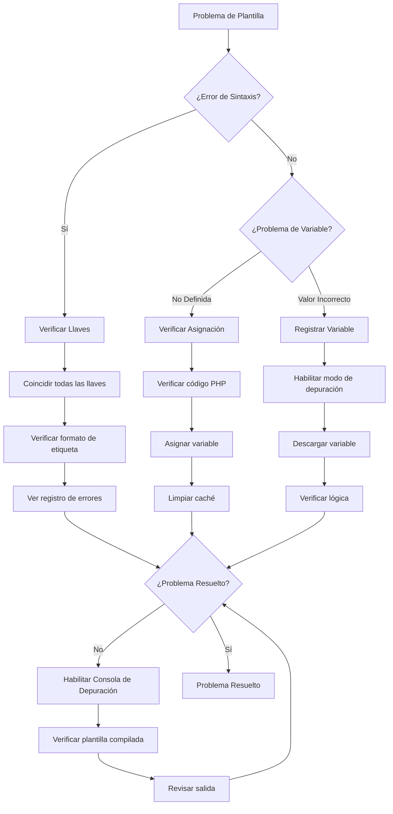
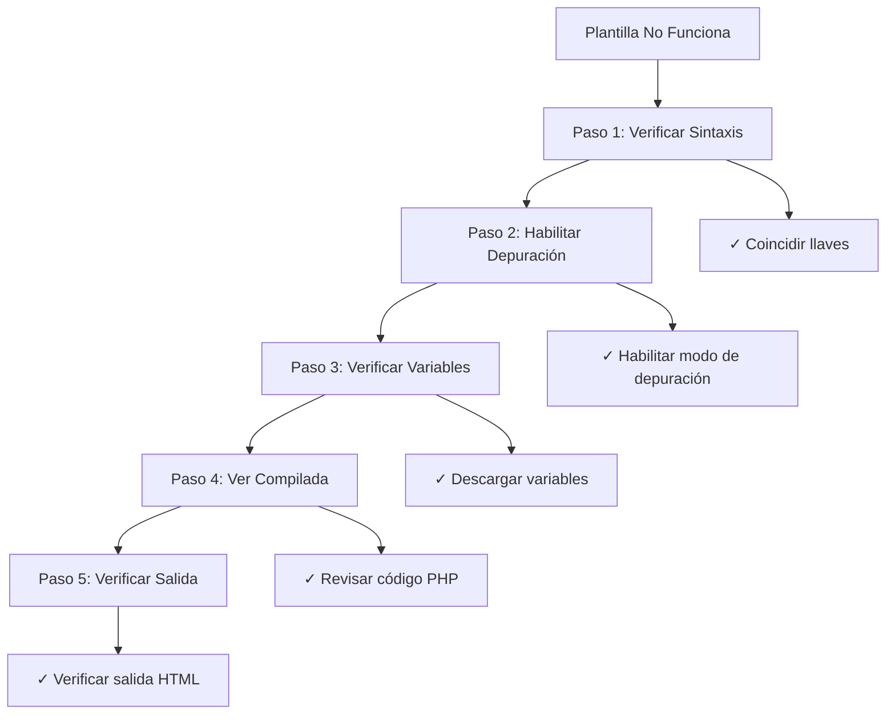

> Técnicas avanzadas para depurar plantillas Smarty en temas y módulos de XOOPS.

---

## Diagrama de Flujo de Diagnóstico



---

## Habilitar Modo de Depuración de Smarty

### Método 1: Panel de Administración

XOOPS Admin > Configuración > Rendimiento:
- Habilitar "Salida de Depuración"
- Establecer "Nivel de Depuración" a 2

---

### Método 2: Configuración de Código

```php
<?php
// En mainfile.php o código de módulo
require_once XOOPS_ROOT_PATH . '/class/smarty/Smarty.class.php';

$tpl = new XoopsTpl();

// Habilitar modo de depuración
$tpl->debugging = true;

// Opcional: Establecer plantilla de depuración personalizada
$tpl->debug_tpl = XOOPS_ROOT_PATH . '/class/smarty/debug.tpl';

// Renderizar plantilla
$tpl->display('file:template.html');
?>
```

---

### Método 3: Depuración Emergente en Navegador

```smarty
{* Agregar a plantilla para habilitar depuración en pie de página *}
{debug}
```

Esto muestra una ventana emergente con todas las variables asignadas.

---

## Técnicas Comunes de Depuración de Smarty

### Descargar Todas las Variables

```php
<?php
// En código PHP
$tpl = new XoopsTpl();

// Obtener todas las variables asignadas
$variables = $tpl->get_template_vars();

echo "<pre>";
print_r($variables);
echo "</pre>";
?>
```

En plantilla:
```smarty
{* Mostrar información de depuración *}
<div style="border: 1px red solid; background: #ffffcc; padding: 10px;">
    <h3>Información de Depuración</h3>
    {debug}
</div>
```

---

### Registrar Variable Específica

```php
<?php
$tpl = new XoopsTpl();

// Verificar si variable existe
$user = $tpl->get_template_var('user');

if ($user === null) {
    error_log("Variable 'user' no asignada a plantilla");
} else {
    error_log("Datos de usuario: " . json_encode($user));
}
?>
```

---

### Verificar Variable en Plantilla

```smarty
{* Descargar variable para depuración *}
<pre>
{$variable|print_r}
</pre>

{* O con etiqueta *}
<pre>
Datos de Usuario:
{$user|print_r}
</pre>

{* Verificar si variable existe *}
{if isset($user)}
    <p>Usuario: {$user.name}</p>
{else}
    <p style="color: red;">ERROR: variable user no establecida</p>
{/if}
```

---

## Ver Plantillas Compiladas

Smarty compila plantillas a PHP para rendimiento. Depuración viendo código compilado:

```bash
# Encontrar plantillas compiladas
ls -la xoops_data/caches/smarty_compile/

# Ver plantilla compilada
cat xoops_data/caches/smarty_compile/filename.php
```

```php
<?php
// Crear script de depuración para ver última plantilla compilada
$compile_dir = XOOPS_CACHE_PATH . '/smarty_compile';

// Obtener último archivo compilado
$files = glob($compile_dir . '/*.php');
usort($files, function($a, $b) {
    return filemtime($b) - filemtime($a);
});

if ($files) {
    echo "<h1>Última Plantilla Compilada</h1>";
    echo "<pre>";
    echo htmlspecialchars(file_get_contents($files[0]));
    echo "</pre>";
}
?>
```

---

## Analizar Compilación de Plantilla

```php
<?php
// Crear modules/yourmodule/debug_smarty.php

require_once '../../mainfile.php';
require_once XOOPS_ROOT_PATH . '/vendor/autoload.php';

$tpl = new XoopsTpl();
$ray = ray();  // Si usa depurador Ray

$ray->group('Configuración de Smarty');

// Obtener rutas de Smarty
$ray->label('Directorio de Compilación')->info($tpl->getCompileDir());
$ray->label('Directorio de Caché')->info($tpl->getCacheDir());
$ray->label('Directorios de Plantilla')->dump($tpl->getTemplateDir());

// Verificar plantillas compiladas
$compile_dir = $tpl->getCompileDir();
$compiled_files = glob($compile_dir . '*.php');
$ray->label('Plantillas Compiladas')->info(count($compiled_files) . " archivos");

// Mostrar estadísticas de compilación
$total_size = 0;
foreach ($compiled_files as $file) {
    $total_size += filesize($file);
}
$ray->label('Tamaño de Caché Compilado')->info(round($total_size / 1024 / 1024, 2) . " MB");

// Verificar directorio de caché
$cache_dir = $tpl->getCacheDir();
$cache_files = glob($cache_dir . '*.php');
$ray->label('Plantillas en Caché')->info(count($cache_files) . " archivos");

$ray->groupEnd();
?>
```

---

## Depuración de Problemas Específicos

### Problema 1: Variable Muestra Vacía

```php
<?php
$tpl = new XoopsTpl();

// Verificar qué está asignado
$user = $tpl->get_template_var('user');

if ($user === null) {
    error_log("ERROR: 'user' no asignada");
} elseif (empty($user)) {
    error_log("ADVERTENCIA: 'user' está vacía");
} else {
    error_log("datos de user: " . json_encode($user));
}

// También verificar en plantilla
?>
```

Depuración de plantilla:
```smarty
{if !isset($user)}
    <span style="color: red;">ERROR: variable user no establecida</span>
{elseif empty($user)}
    <span style="color: orange;">ADVERTENCIA: user está vacía</span>
{else}
    <p>Usuario: {$user.name}</p>
{/if}
```

---

### Problema 2: Clave de Matriz No Encontrada

```smarty
{* Usar acceso seguro a matriz *}

{* INCORRECTO - causa aviso de índice no definido *}
{$array.key}

{* CORRECTO - verificar primero *}
{if isset($array.key)}
    {$array.key}
{else}
    <span style="color: red;">Clave 'key' no encontrada en matriz</span>
{/if}

{* O usar valor predeterminado *}
{$array.key|default:'clave no encontrada'}
```

Depuración en PHP:
```php
<?php
$array = $tpl->get_template_var('array');

if (!isset($array['key'])) {
    error_log("Clave faltante en matriz: " . json_encode(array_keys($array)));
}
?>
```

---

### Problema 3: Complemento/Modificador No Encontrado

```php
<?php
// Crear modificador personalizado: plugins/modifier.debug.php

function smarty_modifier_debug($var) {
    return '<pre style="background: #ffffcc; border: 1px solid red;">' .
           htmlspecialchars(json_encode($var, JSON_PRETTY_PRINT)) .
           '</pre>';
}
?>
```

Registrar en código:
```php
<?php
$tpl = new XoopsTpl();
$tpl->addPluginDir(XOOPS_ROOT_PATH . '/modules/yourmodule/plugins');
$tpl->register_modifier('debug', 'smarty_modifier_debug');
?>
```

Usar en plantilla:
```smarty
{$data|debug}
```

---

### Problema 4: Mostrar Matriz Anidada

```smarty
{* Depuración de matrices anidadas *}
<div style="background: #f5f5f5; padding: 10px; border: 1px solid #ccc;">
    <h3>Depuración de Datos</h3>
    <pre>{$data|@json_encode}</pre>
</div>

{* O iterar y mostrar *}
<h3>Datos de Usuario:</h3>
{foreach $user as $key => $value}
    <p><strong>{$key}:</strong> {$value|escape}</p>
{/foreach}

{* Verificar claves específicas *}
<h3>Verificación:</h3>
<ul>
    <li>Tiene 'name': {if isset($user.name)}✓{else}✗{/if}</li>
    <li>Tiene 'email': {if isset($user.email)}✓{else}✗{/if}</li>
    <li>Tiene 'id': {if isset($user.id)}✓{else}✗{/if}</li>
</ul>
```

---

## Crear Plantilla de Depuración

```smarty
{* Crear themes/mytheme/debug.html *}
{strip}

<div style="background: #fff3cd; border: 2px solid #ff0000; padding: 20px; margin: 20px 0;">
    <h2 style="color: #ff0000;">MODO DE DEPURACIÓN DE SMARTY</h2>

    <h3>Variables Asignadas:</h3>
    <div style="background: white; padding: 10px; border: 1px solid #999; overflow-x: auto; max-height: 400px;">
        {* Mostrar todas las variables *}
        {debug output='html'}
    </div>

    <h3>Información de Plantilla:</h3>
    <table style="width: 100%; border-collapse: collapse;">
        <tr>
            <td style="border: 1px solid #999; padding: 5px;"><strong>Plantilla Actual:</strong></td>
            <td style="border: 1px solid #999; padding: 5px;">{$smarty.template}</td>
        </tr>
        <tr>
            <td style="border: 1px solid #999; padding: 5px;"><strong>Versión de Smarty:</strong></td>
            <td style="border: 1px solid #999; padding: 5px;">{$smarty.version}</td>
        </tr>
        <tr>
            <td style="border: 1px solid #999; padding: 5px;"><strong>Hora Actual:</strong></td>
            <td style="border: 1px solid #999; padding: 5px;">{$smarty.now|date_format:"%Y-%m-%d %H:%M:%S"}</td>
        </tr>
    </table>

    <p style="color: #ff0000;"><strong>ADVERTENCIA: ¡Elimine este código de depuración antes de ir a producción!</strong></p>
</div>

{/strip}
```

---

## Depuración de Rendimiento

### Medir Renderizado de Plantilla

```php
<?php
$start = microtime(true);

$tpl->display('file:template.html');

$render_time = (microtime(true) - $start) * 1000;

error_log("Plantilla renderizada en: {$render_time}ms");

if ($render_time > 100) {
    error_log("ADVERTENCIA: Renderizado lento de plantilla");
}
?>
```

### Verificar Efectividad de Caché

```php
<?php
$compile_dir = XOOPS_CACHE_PATH . '/smarty_compile';
$cache_dir = XOOPS_CACHE_PATH . '/smarty_cache';

// Contar archivos
$compiled = count(glob($compile_dir . '*.php'));
$cached = count(glob($cache_dir . '*.php'));

// Tamaño
$compile_size = 0;
foreach (glob($compile_dir . '*') as $file) {
    $compile_size += filesize($file);
}

$cache_size = 0;
foreach (glob($cache_dir . '*') as $file) {
    $cache_size += filesize($file);
}

echo "Compiladas: $compiled archivos (" . round($compile_size/1024/1024, 2) . "MB)";
echo "En Caché: $cached archivos (" . round($cache_size/1024/1024, 2) . "MB)";

// Antigüedad de archivos
$oldest_compile = min(array_map('filemtime', glob($compile_dir . '*')));
$oldest_cache = min(array_map('filemtime', glob($cache_dir . '*')));

echo "Compilación más antigua: " . date('Y-m-d H:i:s', $oldest_compile);
echo "En caché más antigua: " . date('Y-m-d H:i:s', $oldest_cache);
?>
```

---

## Limpiar y Reconstruir Caché

```php
<?php
// Forzar reconstrucción de todas las plantillas

$tpl = new XoopsTpl();

// Limpiar caché
$tpl->clearCache();
$tpl->clearCompiledTemplate();

// Forzar recompilación
$tpl->force_compile = true;

// Renderizar todas las plantillas de módulo
$modules = ['mymodule', 'publisher', 'downloads'];

foreach ($modules as $module) {
    $template = "file:" . XOOPS_ROOT_PATH . "/modules/$module/templates/index.html";

    try {
        $tpl->display($template);
        error_log("Compilada: $module");
    } catch (Exception $e) {
        error_log("Error compilando $module: " . $e->getMessage());
    }
}

// Deshabilitar compilación forzada después
$tpl->force_compile = false;
?>
```

---

## Flujo de Trabajo de Depuración

### Proceso de Depuración Paso a Paso



---

## Funciones Auxiliares de Depuración

```php
<?php
// Crear class/TemplateDebugger.php

class TemplateDebugger {
    private static $tpl = null;
    private static $debug_info = [];

    public static function init(&$smarty) {
        self::$tpl = $smarty;
    }

    public static function dumpVar($name) {
        $var = self::$tpl->get_template_var($name);

        if ($var === null) {
            self::$debug_info[] = "Variable '$name' no encontrada";
            return;
        }

        self::$debug_info[] = "$name: " . json_encode($var);
    }

    public static function checkVar($name, $keys = []) {
        $var = self::$tpl->get_template_var($name);

        if ($var === null) {
            return "ERROR: Variable '$name' no asignada";
        }

        if (!is_array($var)) {
            return "$name no es una matriz";
        }

        $missing = [];
        foreach ($keys as $key) {
            if (!isset($var[$key])) {
                $missing[] = $key;
            }
        }

        if ($missing) {
            return "Claves faltantes en '$name': " . implode(', ', $missing);
        }

        return "OK: Variable '$name' tiene todas las claves requeridas";
    }

    public static function getReport() {
        return implode("\n", self::$debug_info);
    }

    public static function logAll() {
        $vars = self::$tpl->get_template_vars();
        error_log("Variables de Plantilla: " . json_encode($vars));
    }
}
?>
```

Uso:
```php
<?php
TemplateDebugger::init($tpl);
TemplateDebugger::dumpVar('user');
TemplateDebugger::checkVar('articles', ['id', 'title', 'author']);
error_log(TemplateDebugger::getReport());
?>
```

---

## Documentación Relacionada

- Habilitar Modo de Depuración
- Errores de Plantilla
- Usar Depurador Ray
- Plantillas Smarty

---

#xoops #plantillas #smarty #depuración #solución_de_problemas
