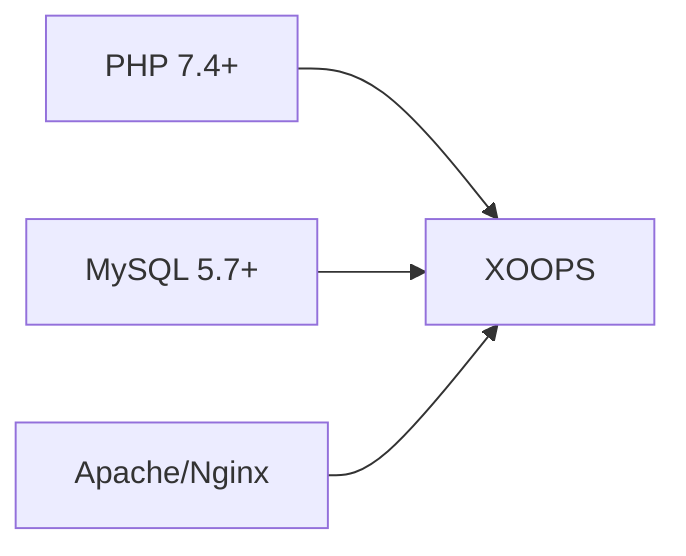
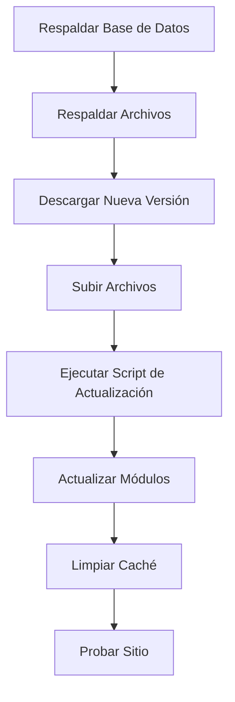

> Preguntas comunes y respuestas sobre la instalación de XOOPS.

---

## Pre-Instalación

### P: ¿Cuáles son los requisitos mínimos del servidor?

**R:** XOOPS 2.5.x requiere:
- PHP 7.4 o superior (se recomienda PHP 8.x)
- MySQL 5.7+ o MariaDB 10.3+
- Apache con mod_rewrite o Nginx
- Al menos 64MB de límite de memoria de PHP (se recomiendan 128MB+)



### P: ¿Puedo instalar XOOPS en hosting compartido?

**R:** Sí, XOOPS funciona bien en la mayoría de hosting compartido que cumple los requisitos. Verifique que su proveedor proporcione:
- PHP con extensiones requeridas (mysqli, gd, curl, json, mbstring)
- Acceso a base de datos MySQL
- Capacidad de subida de archivos
- Soporte para .htaccess (para Apache)

### P: ¿Cuáles son las extensiones PHP requeridas?

**R:** Extensiones requeridas:
- `mysqli` - Conectividad de base de datos
- `gd` - Procesamiento de imágenes
- `json` - Manejo de JSON
- `mbstring` - Soporte de cadenas multibyte

Recomendadas:
- `curl` - Llamadas a API externos
- `zip` - Instalación de módulos
- `intl` - Internacionalización

---

## Proceso de Instalación

### P: El asistente de instalación muestra una página en blanco

**R:** Esto es generalmente un error de PHP. Intente:

1. Habilitar muestra de errores temporalmente:
```php
// Agregar a htdocs/install/index.php al inicio
error_reporting(E_ALL);
ini_set('display_errors', 1);
```

2. Verificar el registro de errores de PHP
3. Verificar compatibilidad de versión de PHP
4. Asegurarse de que todas las extensiones requeridas estén cargadas

### P: Recibo "No se puede escribir en mainfile.php"

**R:** Establecer permisos de escritura antes de la instalación:

```bash
chmod 666 mainfile.php
# Después de la instalación, asegurarla:
chmod 444 mainfile.php
```

### P: Las tablas de base de datos no se están creando

**R:** Verificar:

1. El usuario de MySQL tiene privilegios CREATE TABLE:
```sql
GRANT ALL PRIVILEGES ON xoopsdb.* TO 'xoopsuser'@'localhost';
FLUSH PRIVILEGES;
```

2. La base de datos existe:
```sql
CREATE DATABASE xoopsdb CHARACTER SET utf8mb4 COLLATE utf8mb4_unicode_ci;
```

3. Las credenciales en el asistente coinciden con la configuración de base de datos

### P: La instalación se completa pero el sitio muestra errores

**R:** Correcciones comunes post-instalación:

1. Eliminar o renombrar directorio de instalación:
```bash
mv htdocs/install htdocs/install.bak
```

2. Establecer permisos correctos:
```bash
chmod -R 755 htdocs/
chmod -R 777 xoops_data/
chmod 444 mainfile.php
```

3. Limpiar caché:
```bash
rm -rf xoops_data/caches/smarty_cache/*
rm -rf xoops_data/caches/smarty_compile/*
```

---

## Configuración

### P: ¿Dónde está el archivo de configuración?

**R:** La configuración principal está en `mainfile.php` en la raíz de XOOPS. Configuración clave:

```php
define('XOOPS_ROOT_PATH', '/path/to/htdocs');
define('XOOPS_VAR_PATH', '/path/to/xoops_data');
define('XOOPS_URL', 'https://yoursite.com');
define('XOOPS_DB_HOST', 'localhost');
define('XOOPS_DB_USER', 'username');
define('XOOPS_DB_PASS', 'password');
define('XOOPS_DB_NAME', 'database');
define('XOOPS_DB_PREFIX', 'xoops');
```

### P: ¿Cómo cambio la URL del sitio?

**R:** Editar `mainfile.php`:

```php
define('XOOPS_URL', 'https://newdomain.com');
```

Luego limpiar caché y actualizar cualquier URL codificado en la base de datos.

### P: ¿Cómo muevo XOOPS a un directorio diferente?

**R:**

1. Mover archivos a nueva ubicación
2. Actualizar rutas en `mainfile.php`:
```php
define('XOOPS_ROOT_PATH', '/new/path/to/htdocs');
define('XOOPS_VAR_PATH', '/new/path/to/xoops_data');
```
3. Actualizar base de datos si es necesario
4. Limpiar todos los cachés

---

## Actualizaciones

### P: ¿Cómo actualizo XOOPS?

**R:**



1. **Respaldar todo** (base de datos + archivos)
2. Descargar nueva versión de XOOPS
3. Subir archivos (no sobrescribir `mainfile.php`)
4. Ejecutar `htdocs/upgrade/` si se proporciona
5. Actualizar módulos vía panel de administración
6. Limpiar todos los cachés
7. Probar exhaustivamente

### P: ¿Puedo saltar versiones al actualizar?

**R:** Generalmente no. Actualizar secuencialmente a través de versiones principales para asegurar que se ejecuten correctamente las migraciones de base de datos. Verificar las notas de lanzamiento para orientación específica.

### P: Mis módulos dejaron de funcionar después de la actualización

**R:**

1. Verificar compatibilidad del módulo con nueva versión de XOOPS
2. Actualizar módulos a las últimas versiones
3. Regenerar plantillas: Admin → Sistema → Mantenimiento → Plantillas
4. Limpiar todos los cachés
5. Verificar registros de errores PHP para errores específicos

---

## Solución de Problemas

### P: Olvidé la contraseña de administrador

**R:** Restablecer vía base de datos:

```sql
-- Generar nuevo hash de contraseña
UPDATE xoops_users
SET pass = MD5('newpassword')
WHERE uname = 'admin';
```

O usar la función de restablecimiento de contraseña si el correo está configurado.

### P: El sitio es muy lento después de la instalación

**R:**

1. Habilitar almacenamiento en caché en Admin → Sistema → Preferencias
2. Optimizar base de datos:
```sql
OPTIMIZE TABLE xoops_session;
OPTIMIZE TABLE xoops_online;
```
3. Verificar consultas lentas en modo de depuración
4. Habilitar PHP OpCache

### P: Las imágenes/CSS no se cargan

**R:**

1. Verificar permisos de archivo (644 para archivos, 755 para directorios)
2. Verificar que `XOOPS_URL` sea correcto en `mainfile.php`
3. Verificar .htaccess para conflictos de reescritura
4. Inspeccionar consola del navegador para errores 404

---

## Documentación Relacionada

- Guía de Instalación
- Configuración Básica
- Pantalla Blanca de la Muerte

---

#xoops #faq #instalación #solución_de_problemas
