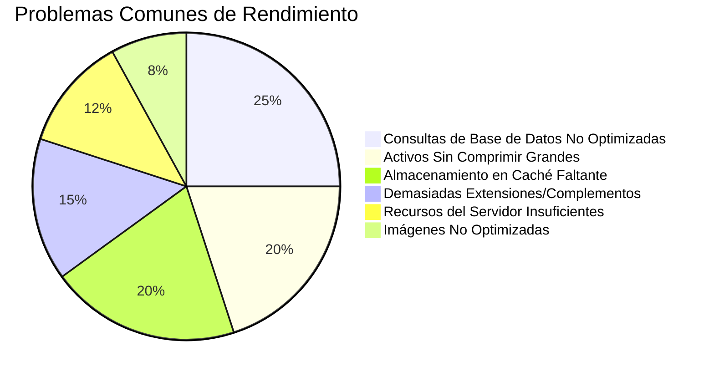
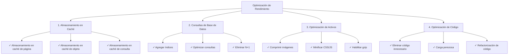

# Preguntas Frecuentes sobre Rendimiento

> Preguntas comunes y respuestas sobre optimización de rendimiento de XOOPS y diagnóstico de sitios lentos.

---

## Rendimiento General

### P: ¿Cómo puedo saber si mi sitio XOOPS es lento?

**R:** Usar estas herramientas y métricas:

1. **Tiempo de Carga de Página**:
```bash
# Usar curl para medir tiempo de respuesta
curl -w "@curl-format.txt" -o /dev/null -s https://yoursite.com

# O usar herramientas en línea
# - PageSpeed Insights (Google)
# - GTmetrix
# - WebPageTest
```

2. **Métricas Objetivo**:
- Primer Contentful Paint (FCP): < 1.8s
- Largest Contentful Paint (LCP): < 2.5s
- Time to First Byte (TTFB): < 0.6s
- Tamaño total de página: < 2-3 MB

3. **Verificar Registros del Servidor**:
```bash
# Apache
tail -100 /var/log/apache2/access.log

# Nginx
tail -100 /var/log/nginx/access.log

# Buscar solicitudes lentas (> 1 segundo)
```

---

### P: ¿Cuáles son los problemas de rendimiento más comunes?

**R:**


---

### P: ¿Dónde debo enfocarm mis esfuerzos de optimización?

**R:** Seguir la prioridad de optimización:



---

## Almacenamiento en Caché

### P: ¿Cómo habilito almacenamiento en caché en XOOPS?

**R:** XOOPS tiene almacenamiento en caché integrado. Configurar en Admin > Configuración > Rendimiento:

```php
<?php
// Verificar configuración de caché en mainfile.php o admin
// Tipos de caché comunes:
// 1. file - Caché basado en archivo (predeterminado)
// 2. memcache - Memcached (si está instalado)
// 3. redis - Redis (si está instalado)

// En código, usar caché:
$cache = xoops_cache_handler::getInstance();

// Leer del caché
$data = $cache->read('cache_key');

if ($data === false) {
    // No en caché, obtener de fuente
    $data = expensive_operation();

    // Escribir en caché (3600 = 1 hora)
    $cache->write('cache_key', $data, 3600);
}
?>
```

---

### P: ¿Qué tipo de almacenamiento en caché debería usar?

**R:**
- **File Cache**: Predeterminado, simple, sin configuración extra. Bueno para sitios pequeños.
- **Memcache**: Más rápido, basado en memoria. Mejor para sitios de alto tráfico.
- **Redis**: Más potente, soporta más tipos de datos. Mejor para escalar.

Instalar y habilitar:
```bash
# Instalar Memcached
sudo apt-get install memcached php-memcached

# O instalar Redis
sudo apt-get install redis-server php-redis

# Reiniciar PHP-FPM o Apache
sudo systemctl restart php-fpm
sudo systemctl restart apache2
```

Luego habilitar en administración de XOOPS.

---

### P: ¿Cómo limpio el caché de XOOPS?

**R:**
```bash
# Limpiar todo el caché
rm -rf xoops_data/caches/*

# Limpiar caché de Smarty específicamente
rm -rf xoops_data/caches/smarty_cache/*
rm -rf xoops_data/caches/smarty_compile/*

# O en panel de administración
Ir a Admin > Sistema > Mantenimiento > Limpiar Caché
```

En código:
```php
<?php
$cache = xoops_cache_handler::getInstance();
$cache->deleteAll();

// O limpiar claves específicas
$cache->delete('cache_key');
?>
```

---

### P: ¿Cuánto tiempo debo almacenar datos en caché?

**R:** Depende de los requisitos de frescura de datos:

```php
<?php
// 5 minutos - Datos que cambian frecuentemente
$cache->write('key', $data, 300);

// 1 hora - Datos semi-estáticos
$cache->write('key', $data, 3600);

// 24 horas - Datos estáticos, imágenes, etc.
$cache->write('key', $data, 86400);

// Sin expiración (hasta limpiar manualmente)
$cache->write('key', $data, 0);

// Caché solo durante solicitud actual
$cache->write('key', $data, 1);
?>
```

---

## Optimización de Base de Datos

### P: ¿Cómo encontro consultas lentas en la base de datos?

**R:** Habilitar registro de consultas:

```php
<?php
// En mainfile.php
define('XOOPS_DB_DEBUGMODE', true);
define('XOOPS_SQL_DEBUG', true);

// Luego verificar tabla xoops_log
SELECT * FROM xoops_log WHERE logid > SOME_NUMBER
ORDER BY created DESC LIMIT 20;
?>
```

O usar registro de consultas lentas de MySQL:
```bash
# Habilitar en /etc/mysql/my.cnf
[mysqld]
slow_query_log = 1
slow_query_log_file = /var/log/mysql/slow.log
long_query_time = 1  # Registrar consultas > 1 segundo

# Ver consultas lentas
tail -100 /var/log/mysql/slow.log
```

---

### P: ¿Cómo optimizo las consultas de base de datos?

**R:** Seguir estos pasos:

**1. Agregar Índices de Base de Datos**
```sql
-- Agregar índice a columnas buscadas frecuentemente
ALTER TABLE `xoops_articles` ADD INDEX `author_id` (`author_id`);
ALTER TABLE `xoops_articles` ADD INDEX `created` (`created`);

-- Verificar si índice ayuda
ANALYZE TABLE `xoops_articles`;
EXPLAIN SELECT * FROM xoops_articles WHERE author_id = 5;
```

**2. Usar LIMIT y Paginación**
```php
<?php
// INCORRECTO - Obtiene todos los registros
$result = $db->query("SELECT * FROM xoops_articles");

// CORRECTO - Obtiene 10 registros comenzando en desplazamiento
$limit = 10;
$offset = 0;  // Cambiar con paginación
$result = $db->query(
    "SELECT * FROM xoops_articles LIMIT $limit OFFSET $offset"
);
?>
```

**3. Seleccionar Solo Columnas Necesarias**
```php
<?php
// INCORRECTO
$result = $db->query("SELECT * FROM xoops_articles");

// CORRECTO
$result = $db->query(
    "SELECT id, title, author_id, created FROM xoops_articles"
);
?>
```

**4. Evitar Consultas N+1**
```php
<?php
// INCORRECTO - Problema N+1
$articles = $db->query("SELECT * FROM xoops_articles");
while ($article = $articles->fetch_assoc()) {
    // ¡Esta consulta se ejecuta una vez por artículo!
    $author = $db->query(
        "SELECT * FROM xoops_users WHERE uid = " . $article['author_id']
    );
}

// CORRECTO - Usar JOIN
$result = $db->query("
    SELECT a.*, u.uname, u.email
    FROM xoops_articles a
    JOIN xoops_users u ON a.author_id = u.uid
");

while ($row = $result->fetch_assoc()) {
    echo $row['title'] . " por " . $row['uname'];
}
?>
```

**5. Usar EXPLAIN para Analizar Consultas**
```sql
EXPLAIN SELECT * FROM xoops_articles WHERE author_id = 5 AND status = 1;

-- Buscar:
-- - type: ALL (malo), INDEX (bien), const/ref (bueno)
-- - possible_keys: Debería mostrar índices disponibles
-- - key: Debería usar mejor índice
-- - rows: Debería ser número bajo
```

---

### P: ¿Cómo reduzco la carga de la base de datos?

**R:**
1. **Almacenar en caché resultados de consultas**:
```php
<?php
$cache = xoops_cache_handler::getInstance();
$articles = $cache->read('all_articles');

if ($articles === false) {
    $result = $db->query("SELECT * FROM xoops_articles");
    $articles = $result->fetch_all();
    $cache->write('all_articles', $articles, 3600);
}
?>
```

2. **Archivar datos antiguos** en tablas separadas
3. **Limpiar registros** regularmente:
```bash
# Eliminar entradas de registro más antiguas de 30 días
DELETE FROM xoops_log WHERE created < NOW() - INTERVAL 30 DAY;
```

4. **Habilitar caché de consulta** (MySQL):
```sql
SET GLOBAL query_cache_type = 1;
SET GLOBAL query_cache_size = 268435456;  -- 256 MB
```

---

## Optimización de Activos

### P: ¿Cómo optimizo CSS y JavaScript?

**R:**

**1. Minificar Archivos**:
```bash
# Usar herramientas en línea
# - cssminifier.com
# - javascript-minifier.com
# - minify.org

# O herramientas de línea de comandos
sudo apt-get install yui-compressor closure-compiler
yui-compressor file.css -o file.min.css
```

**2. Combinar Archivos Relacionados**:
```html
{* En lugar de muchos archivos *}
<link rel="stylesheet" href="{$xoops_url}/themes/{$xoops_theme}/style1.css">
<link rel="stylesheet" href="{$xoops_url}/themes/{$xoops_theme}/style2.css">
<link rel="stylesheet" href="{$xoops_url}/themes/{$xoops_theme}/style3.css">

{* Combinar en uno *}
<link rel="stylesheet" href="{$xoops_url}/themes/{$xoops_theme}/style.css">
```

**3. Diferir JavaScript No Crítico**:
```html
{* JS crítico - cargar inmediatamente *}
<script src="critical.js"></script>

{* JS no crítico - cargar después de página *}
<script src="analytics.js" defer></script>
<script src="ads.js" async></script>
```

**4. Habilitar Compresión Gzip** (.htaccess):
```apache
<IfModule mod_deflate.c>
    AddOutputFilterByType DEFLATE text/html
    AddOutputFilterByType DEFLATE text/plain
    AddOutputFilterByType DEFLATE text/xml
    AddOutputFilterByType DEFLATE text/css
    AddOutputFilterByType DEFLATE text/javascript
    AddOutputFilterByType DEFLATE application/javascript
    AddOutputFilterByType DEFLATE application/xml
</IfModule>
```

---

### P: ¿Cómo optimizo imágenes?

**R:**

**1. Elegir Formato Correcto**:
- JPG: Fotos e imágenes complejas
- PNG: Gráficos e imágenes con transparencia
- WebP: Navegadores modernos, mejor compresión
- AVIF: Nuevo, mejor compresión

**2. Comprimir Imágenes**:
```bash
# Usando ImageMagick
convert image.jpg -quality 85 image-compressed.jpg

# Usando ImageOptim
imageoptim image.jpg

# Herramientas en línea
# - imagecompressor.com
# - tinypng.com
```

**3. Servir Imágenes Responsivas**:
```html
{* Servir diferentes tamaños *}
<picture>
    <source srcset="image-large.webp" type="image/webp" media="(min-width: 1200px)">
    <source srcset="image-medium.webp" type="image/webp" media="(min-width: 768px)">
    <source srcset="image-small.webp" type="image/webp">
    
</picture>
```

**4. Cargar Imágenes de Forma Perezosa**:
```html
{* Carga nativa perezosa *}


{* O con biblioteca JavaScript *}
<script src="https://cdn.jsdelivr.net/npm/lazysizes@5/lazysizes.min.js"></script>

```

---

## Configuración del Servidor

### P: ¿Cómo verifico el rendimiento del servidor?

**R:**

```bash
# CPU y Memoria
top -b -n 1 | head -20
free -h
df -h

# Verificar procesos de PHP-FPM
ps aux | grep php-fpm

# Verificar conexiones Apache/Nginx
netstat -an | grep ESTABLISHED | wc -l

# Monitorear en tiempo real
watch 'free -h && echo "---" && df -h'
```

---

### P: ¿Cómo optimizo PHP para XOOPS?

**R:** Editar `/etc/php/8.x/fpm/php.ini`:

```ini
; Aumentar límites para XOOPS
max_execution_time = 300         ; 30 segundos predeterminado
memory_limit = 512M              ; 128MB predeterminado
upload_max_filesize = 100M       ; 2MB predeterminado
post_max_size = 100M             ; 8MB predeterminado

; Habilitar opcache para rendimiento
opcache.enable = 1
opcache.memory_consumption = 256
opcache.max_accelerated_files = 20000
opcache.validate_timestamps = 0   ; Producción: 0 (recargar al reiniciar)
opcache.revalidate_freq = 0       ; Producción: 0 o número alto

; Base de datos
default_socket_timeout = 60
mysqli.default_socket = /run/mysqld/mysqld.sock
```

Luego reiniciar PHP:
```bash
sudo systemctl restart php8.2-fpm
# o
sudo systemctl restart apache2
```

---

### P: ¿Cómo habilito HTTP/2 y compresión?

**R:** Para Apache (.htaccess):
```apache
# Habilitar HTTPS (requerido para HTTP/2)
<IfModule mod_ssl.c>
    Protocols h2 http/1.1
</IfModule>

# Habilitar compresión
<IfModule mod_deflate.c>
    AddOutputFilterByType DEFLATE text/html text/plain text/css text/javascript application/javascript
</IfModule>

# Habilitar almacenamiento en caché del navegador
<IfModule mod_expires.c>
    ExpiresActive On
    ExpiresByType image/jpeg "access plus 1 year"
    ExpiresByType image/png "access plus 1 year"
    ExpiresByType text/css "access plus 1 month"
    ExpiresByType text/javascript "access plus 1 month"
</IfModule>
```

Para Nginx (nginx.conf):
```nginx
http {
    # Habilitar gzip
    gzip on;
    gzip_types text/plain text/css text/javascript application/json;
    gzip_min_length 1000;

    # Habilitar HTTP/2
    listen 443 ssl http2;

    # Almacenamiento en caché del navegador
    expires 1y;
    add_header Cache-Control "public, immutable";
}
```

---

## Monitoreo y Diagnósticos

### P: ¿Cómo monitoreo el rendimiento de XOOPS a lo largo del tiempo?

**R:**

**1. Usar Google Analytics**:
- Estadísticas Vitales Principales
- Tiempos de carga de página
- Comportamiento de usuario

**2. Usar Herramientas de Monitoreo del Servidor**:
```bash
# Instalar Glances (monitor del sistema)
sudo apt-get install glances
glances

# O usar New Relic, DataDog, etc.
```

**3. Registrar y Analizar Solicitudes**:
```bash
# Obtener tiempo de respuesta promedio
grep "GET /index.php" /var/log/apache2/access.log | \
  awk '{print $NF}' | \
  sort -n | \
  awk '{sum+=$1; count++} END {print "Promedio: " sum/count " ms"}'
```

---

### P: ¿Cómo identifico fugas de memoria?

**R:**

```php
<?php
// En código, rastrear uso de memoria
$start_memory = memory_get_usage();

// Hacer operaciones
for ($i = 0; $i < 1000; $i++) {
    $array[] = expensive_operation();
}

$end_memory = memory_get_usage();
$used = ($end_memory - $start_memory) / 1024 / 1024;

if ($used > 50) {  // Alerta si > 50MB
    error_log("Fuga de memoria detectada: " . $used . " MB");
}

// Verificar memoria pico
$peak = memory_get_peak_usage();
echo "Memoria pico: " . ($peak / 1024 / 1024) . " MB";
?>
```

---

## Lista de Verificación de Rendimiento

```mermaid
graph TD
    A[Lista de Verificación de Optimización de Rendimiento] --> B["Infraestructura"]
    A --> C["Almacenamiento en Caché"]
    A --> D["Base de Datos"]
    A --> E["Activos"]

    B --> B1["✓ PHP 8.x instalado"]
    B --> B2["✓ Opcache habilitado"]
    B --> B3["✓ RAM suficiente"]
    B --> B4["✓ Almacenamiento SSD"]

    C --> C1["✓ Almacenamiento en caché de página habilitado"]
    C --> C2["✓ Almacenamiento en caché de objeto habilitado"]
    C --> C3["✓ Almacenamiento en caché del navegador configurado"]
    C --> C4["✓ CDN configurado"]

    D --> D1["✓ Índices agregados"]
    D --> D2["✓ Consultas lentas corregidas"]
    D --> D3["✓ Datos antiguos archivados"]
    D --> D4["✓ Registros de consulta limpios"]

    E --> E1["✓ CSS minificado"]
    E --> E2["✓ JS minificado"]
    E --> E3["✓ Imágenes optimizadas"]
    E --> E4["✓ Gzip habilitado"]
```



---

## Documentación Relacionada

- Depuración de Base de Datos
- Habilitar Modo de Depuración
- FAQ de Módulos
- Optimización de Rendimiento

---

#xoops #rendimiento #optimización #faq #solución_de_problemas #almacenamiento_en_caché
