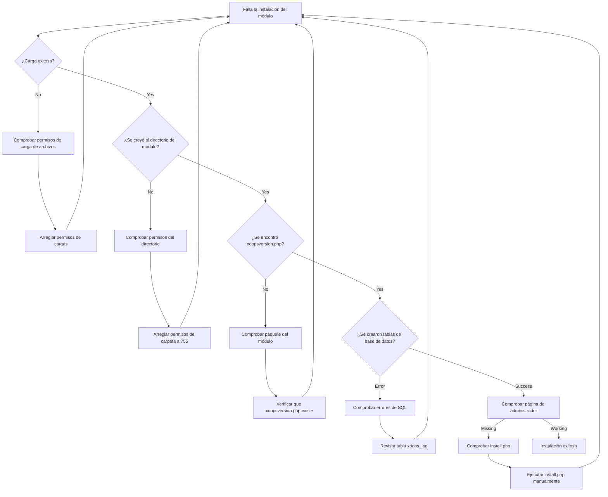
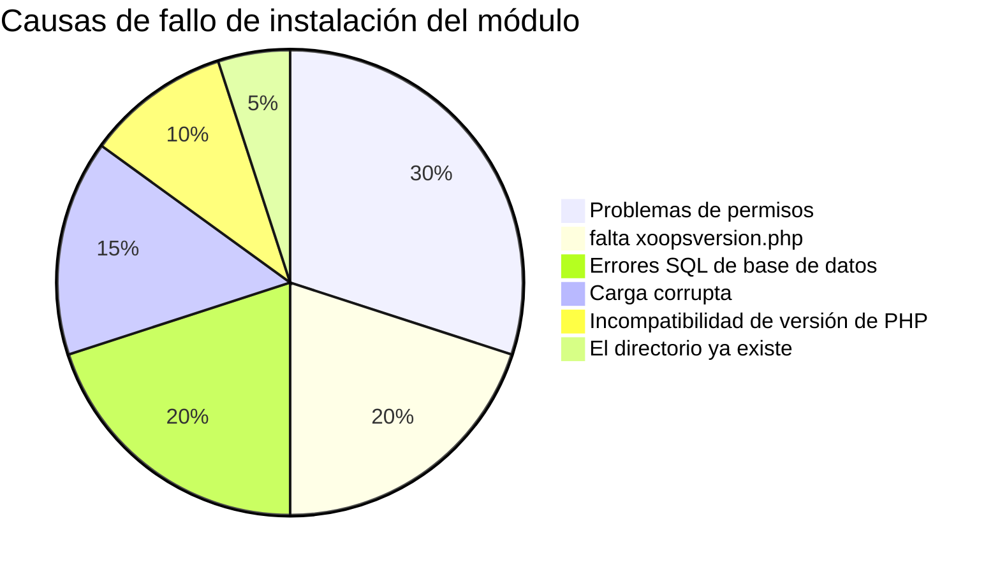

> Problemas comunes y soluciones para resolver problemas de instalación de módulos en XOOPS.

---

## Diagrama de flujo de diagnóstico



---

## Causas comunes y soluciones



---

## 1. Carga de archivo - Permiso denegado

**Síntomas:**
- La carga falla con "Permiso denegado"
- No se crea la carpeta del módulo
- No se puede escribir en el directorio de módulos

**Mensajes de error:**
```
Warning: move_uploaded_file(): Unable to move file
Permission denied (13)
```

**Soluciones:**

```bash
# Comprobar permisos actuales
ls -ld /path/to/xoops/modules
ls -ld /path/to/xoops/uploads

# Arreglar permisos del directorio de módulos
chmod 755 /path/to/xoops/modules

# Arreglar directorio de carga temporal
chmod 777 /path/to/xoops/uploads
chmod 777 /tmp  # si es necesario

# Arreglar propiedad (si se ejecuta como usuario diferente)
chown -R www-data:www-data /path/to/xoops/modules
chown -R www-data:www-data /path/to/xoops/uploads
```

---

## 2. Falta xoopsversion.php

**Síntomas:**
- El módulo aparece en la lista pero no se activa
- La instalación comienza y se detiene
- No se crea página de administrador

**Error en xoops_log:**
```
Module xoopsversion.php not found
```

**Soluciones:**

Verifique la estructura del paquete del módulo:

```bash
# Extraer y comprobar contenido del módulo
unzip module.zip
ls -la mymodule/

# Debe contener:
# - xoopsversion.php
# - language/
# - sql/
# - admin/ (opcional pero recomendado)
```

**Estructura válida de xoopsversion.php:**

```php
<?php
$modversion['name'] = 'My Module';
$modversion['version'] = '1.0.0';
$modversion['description'] = 'Module description';
$modversion['author'] = 'Author Name';
$modversion['author_mail'] = 'author@example.com';
$modversion['author_website_url'] = 'https://example.com';
$modversion['credits'] = 'Credits';
$modversion['license'] = 'GPL 2.0 or later';
$modversion['official'] = 0;
$modversion['image'] = 'images/icon.png';
$modversion['dirname'] = basename(__DIR__);
$modversion['modpath'] = __DIR__;

// Core module info
$modversion['hasMain'] = 1;
$modversion['hasAdmin'] = 1;
$modversion['hasSearch'] = 0;
$modversion['hasNotification'] = 0;

// Database tables
$modversion['sqlfile']['mysql'] = 'sql/mysql.sql';
$modversion['tables'] = ['table_name'];
```

---

## 3. Errores de ejecución de SQL en base de datos

**Síntomas:**
- La carga es exitosa pero las tablas de base de datos no se crean
- La página de administración no se carga
- Errores "Tabla no existe"

**Mensajes de error:**
```
SQL Error: Table 'xoops_module_table' already exists
Syntax error in SQL statement
```

**Soluciones:**

### Comprobar sintaxis del archivo SQL

```bash
# Ver el archivo SQL
cat modules/mymodule/sql/mysql.sql

# Comprobar problemas de sintaxis
# Verificar:
# - Todas las instrucciones CREATE TABLE terminan con ;
# - Acentos graves apropiados para identificadores
# - Tipos de campo válidos (INT, VARCHAR, TEXT, etc.)
```

**Formato SQL correcto:**

```sql
CREATE TABLE `xoops_module_table` (
  `id` INT(11) NOT NULL AUTO_INCREMENT,
  `name` VARCHAR(255) NOT NULL,
  `description` TEXT,
  `created` INT(11) NOT NULL,
  `updated` INT(11) NOT NULL,
  PRIMARY KEY (`id`)
) ENGINE=InnoDB DEFAULT CHARSET=utf8mb4;
```

### Ejecutar SQL manualmente

```php
<?php
// Crear archivo: modules/mymodule/test_sql.php
require_once '../../mainfile.php';

$sql_file = __DIR__ . '/sql/mysql.sql';
$sql_content = file_get_contents($sql_file);

// Dividir instrucciones
$statements = array_filter(array_map('trim', explode(';', $sql_content)));

foreach ($statements as $statement) {
    if (empty($statement)) continue;

    try {
        $GLOBALS['xoopsDB']->query($statement);
        echo "✓ Ejecutado: " . substr($statement, 0, 50) . "...<br>";
    } catch (Exception $e) {
        echo "✗ Error: " . $e->getMessage() . "<br>";
        echo "Instrucción: " . substr($statement, 0, 100) . "...<br>";
    }
}
?>
```

---

## 4. Carga de módulo corrupta

**Síntomas:**
- Archivos parcialmente cargados
- Faltan archivos .php aleatorios
- El módulo se vuelve inestable después de la instalación

**Soluciones:**

```bash
# Recargar copia fresca
rm -rf /path/to/xoops/modules/mymodule

# Verificar suma de comprobación si se proporciona
md5sum -c mymodule.md5

# Verificar integridad del archivo antes de extraer
unzip -t mymodule.zip

# Extraer a temp, verificar, luego mover
unzip -d /tmp mymodule.zip
find /tmp/mymodule -name "*.php" | wc -l
# Debería mostrar el número esperado de archivos
```

---

## 5. Incompatibilidad de versión de PHP

**Síntomas:**
- La instalación falla inmediatamente
- Errores de análisis en xoopsversion.php
- Errores "Token inesperado"

**Mensajes de error:**
```
Parse error: syntax error, unexpected 'fn' (T_FN)
```

**Soluciones:**

```bash
# Comprobar versión de PHP compatible con XOOPS
grep -r "php_require" /path/to/xoops/

# Comprobar requisitos del módulo
grep -i "php\|version" modules/mymodule/xoopsversion.php

# Comprobar versión de PHP en el servidor
php --version
```

**Prueba de compatibilidad del módulo:**

```php
<?php
// Crear modules/mymodule/check_compat.php
$required_php = '7.4.0';
$current_php = PHP_VERSION;

echo "PHP requerido: $required_php<br>";
echo "PHP actual: $current_php<br>";

if (version_compare(PHP_VERSION, $required_php, '<')) {
    echo "✗ Versión de PHP demasiado antigua<br>";
} else {
    echo "✓ Versión de PHP compatible<br>";
}

// Comprobar extensiones requeridas
$required_ext = ['mysqli', 'json', 'mb_string'];
foreach ($required_ext as $ext) {
    echo extension_loaded($ext) ? "✓" : "✗";
    echo " $ext<br>";
}
?>
```

---

## 6. El directorio del módulo ya existe

**Síntomas:**
- La instalación falla cuando ya existe el directorio del módulo
- No se puede reinstalar o actualizar el módulo
- Error "El directorio ya existe"

**Mensajes de error:**
```
The specified directory already exists
```

**Soluciones:**

```bash
# Hacer copia de seguridad del módulo existente
cp -r modules/mymodule modules/mymodule.backup

# Eliminar instalación anterior completamente
rm -rf modules/mymodule

# Borrar cualquier caché relacionado con el módulo
rm -rf xoops_data/caches/*

# Ahora reintentar la instalación a través del panel de administración
```

---

## 7. Error en la generación de la página de administrador

**Síntomas:**
- El módulo se instala pero falta la página de administrador
- El panel de administración no muestra el módulo
- No se puede acceder a la configuración del módulo

**Soluciones:**

```php
<?php
// Crear modules/mymodule/admin/index.php
<?php
/**
 * Índice de administración del módulo
 */

include_once XOOPS_ROOT_PATH . '/kernel/module.php';

if (!is_object($xoopsModule) || !is_object($xoopsUser) || !$xoopsUser->isAdmin($xoopsModule->mid())) {
    exit("Acceso denegado");
}

// Incluir encabezado de administración
xoops_cp_header();

// Agregar contenido de administración
echo "<h1>Administración de módulos</h1>";
echo "<p>Bienvenido a la administración del módulo</p>";

// Incluir pie de página de administración
xoops_cp_footer();
?>
```

---

## 8. Faltan archivos de idioma

**Síntomas:**
- El módulo se muestra con nombres de variables en lugar de texto
- Las páginas de administración muestran texto de estilo "[LANG_CONSTANT]"
- La instalación se completa pero la interfaz está rota

**Soluciones:**

```bash
# Verificar estructura del archivo de idioma
ls -la modules/mymodule/language/

# Debe contener:
# english/ (como mínimo)
#   admin.php
#   index.php
#   modinfo.php
```

**Crear archivo de idioma:**

```php
<?php
// modules/mymodule/language/english/index.php
<?php
define('_AM_MYMODULE_INSTALLED', 'Módulo instalado exitosamente');
define('_AM_MYMODULE_UPDATED', 'Módulo actualizado exitosamente');
define('_AM_MYMODULE_ERROR', 'Ocurrió un error');
?>
```

---

## Installation Checklist

```mermaid
graph TD
    A[Installation Checklist] --> B["1. Verify Module Structure"]
    A --> C["2. Check Permissions"]
    A --> D["3. Test SQL File"]
    A --> E["4. Verify xoopsversion.php"]
    A --> F["5. Check Language Files"]
    A --> G["6. Test Installation"]
    A --> H["7. Verify in Admin"]

    B --> B1["✓ Contains xoopsversion.php"]
    B --> B2["✓ SQL files present"]
    B --> B3["✓ Language files present"]

    C --> C1["✓ modules/ is 755"]
    C --> C2["✓ uploads/ is 777"]
    C --> C3["✓ Web server can write"]

    D --> D1["✓ SQL syntax valid"]
    D --> D2["✓ No duplicate tables"]

    E --> E1["✓ Valid PHP syntax"]
    E --> E2["✓ Required fields present"]

    F --> F1["✓ english/ folder exists"]
    F --> F2["✓ .php files present"]

    G --> G1["✓ Uploads successfully"]
    G --> G2["✓ Database creates"]

    H --> H1["✓ Visible in module list"]
    H --> H2["✓ Admin page accessible"]
```



---

## Debug Script

Create `modules/mymodule/debug_install.php`:

```php
<?php
/**
 * Module Installation Debugger
 * Delete after troubleshooting!
 */

require_once '../../mainfile.php';

echo "<h1>Module Installation Debug</h1>";

// 1. Check file structure
echo "<h2>1. File Structure</h2>";
$required_files = [
    'xoopsversion.php',
    'language/english/modinfo.php',
    'language/english/index.php',
    'language/english/admin.php'
];

foreach ($required_files as $file) {
    $path = __DIR__ . '/' . $file;
    echo file_exists($path) ? "✓" : "✗";
    echo " $file<br>";
}

// 2. Check xoopsversion.php
echo "<h2>2. xoopsversion.php Content</h2>";
$version_file = __DIR__ . '/xoopsversion.php';
if (file_exists($version_file)) {
    $modversion = [];
    include $version_file;
    echo "<pre>";
    echo "Name: " . ($modversion['name'] ?? 'NOT SET') . "\n";
    echo "Version: " . ($modversion['version'] ?? 'NOT SET') . "\n";
    echo "Dirname: " . ($modversion['dirname'] ?? 'NOT SET') . "\n";
    echo "Has SQL: " . (isset($modversion['sqlfile']) ? "YES" : "NO") . "\n";
    echo "Has Tables: " . (isset($modversion['tables']) ? count($modversion['tables']) : 0) . "\n";
    echo "</pre>";
}

// 3. Check SQL file
echo "<h2>3. SQL File</h2>";
$sql_file = __DIR__ . '/sql/mysql.sql';
if (file_exists($sql_file)) {
    $content = file_get_contents($sql_file);
    $tables = substr_count($content, 'CREATE TABLE');
    echo "✓ SQL file exists<br>";
    echo "✓ Contains $tables CREATE TABLE statements<br>";
    echo "<pre>" . htmlspecialchars(substr($content, 0, 300)) . "...</pre>";
} else {
    echo "✗ SQL file not found<br>";
}

// 4. Check language files
echo "<h2>4. Language Files</h2>";
$lang_files = [
    'language/english/modinfo.php',
    'language/english/index.php',
    'language/english/admin.php'
];

foreach ($lang_files as $file) {
    $path = __DIR__ . '/' . $file;
    if (file_exists($path)) {
        $size = filesize($path);
        echo "✓ $file ($size bytes)<br>";
    } else {
        echo "✗ $file MISSING<br>";
    }
}

// 5. Check permissions
echo "<h2>5. Directory Permissions</h2>";
echo "Module dir: " . substr(sprintf('%o', fileperms(__DIR__)), -4) . "<br>";

// 6. Test database connection
echo "<h2>6. Database Connection</h2>";
if (is_object($GLOBALS['xoopsDB'])) {
    echo "✓ Database connected<br>";

    // Try to create test table
    $test_sql = "CREATE TEMPORARY TABLE test_install (id INT PRIMARY KEY)";
    if ($GLOBALS['xoopsDB']->query($test_sql)) {
        echo "✓ Can create tables<br>";
    } else {
        echo "✗ Cannot create tables: " . $GLOBALS['xoopsDB']->error . "<br>";
    }
} else {
    echo "✗ Database not connected<br>";
}

echo "<p><strong>Delete this file after testing!</strong></p>";
?>
```

---

## Prevención y mejores prácticas

1. **Siempre hacer copia de seguridad** antes de instalar nuevos módulos
2. **Probar localmente** antes de implementar en producción
3. **Verificar estructura del módulo** antes de cargar
4. **Comprobar permisos** inmediatamente después de la carga
5. **Revisar tabla xoops_log** para errores de instalación
6. **Mantener copias de seguridad** de versiones de módulos funcionando

---

## Documentación relacionada

- Habilitar modo de depuración
- FAQ del módulo
- Estructura del módulo
- Errores de conexión a base de datos

---

#xoops #troubleshooting #modules #installation #debugging
