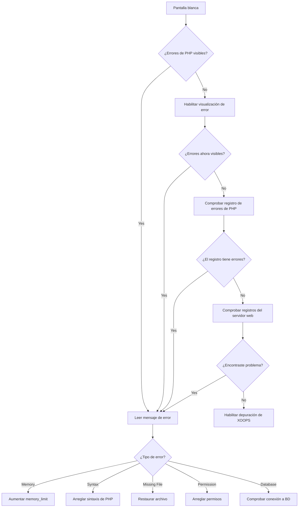
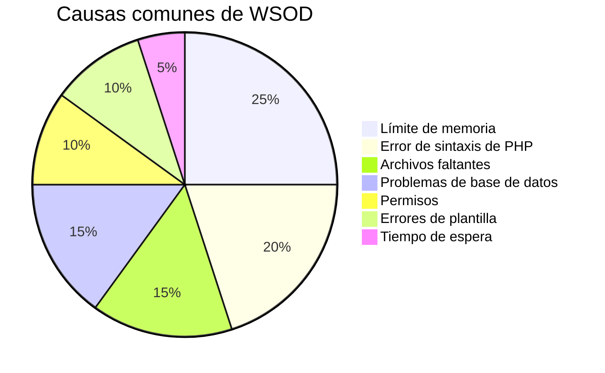
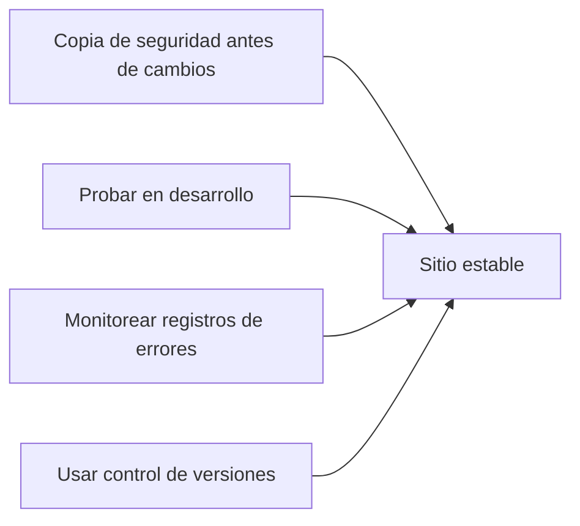

> Cómo diagnosticar y reparar páginas en blanco en XOOPS.

---

## Diagrama de flujo de diagnóstico



---

## Diagnóstico rápido

### Paso 1: Habilitar visualización de errores de PHP

Agregue a `mainfile.php` temporalmente:

```php
<?php
// Agregar en la parte superior, después de <?php
error_reporting(E_ALL);
ini_set('display_errors', '1');
ini_set('display_startup_errors', '1');
```

### Paso 2: Comprobar registro de errores de PHP

```bash
# Ubicaciones comunes del registro
tail -100 /var/log/php/error.log
tail -100 /var/log/apache2/error.log
tail -100 /var/log/nginx/error.log

# O comprobar información de PHP para la ubicación del registro
php -i | grep error_log
```

### Paso 3: Habilitar depuración de XOOPS

```php
// En mainfile.php
define('XOOPS_DEBUG_LEVEL', 2);
```

---

## Causas comunes y soluciones



### 1. Límite de memoria excedido

**Síntomas:**
- Página en blanco en operaciones grandes
- Funciona para datos pequeños, falla para grandes

**Error:**
```
Fatal error: Allowed memory size of 134217728 bytes exhausted
```

**Soluciones:**

```php
// En mainfile.php
ini_set('memory_limit', '256M');

// O en .htaccess
php_value memory_limit 256M

// O en php.ini
memory_limit = 256M
```

### 2. Error de sintaxis de PHP

**Síntomas:**
- WSOD después de editar archivo PHP
- Página específica falla, otras funcionan

**Error:**
```
Parse error: syntax error, unexpected '}' in /path/file.php on line 123
```

**Soluciones:**

```bash
# Comprobar archivo para errores de sintaxis
php -l /path/to/file.php

# Comprobar todos los archivos PHP en el módulo
find modules/mymodule -name "*.php" -exec php -l {} \;
```

### 3. Archivo requerido faltante

**Síntomas:**
- WSOD después de carga/migración
- Páginas aleatorias fallan

**Error:**
```
Fatal error: require_once(): Failed opening required 'class/Helper.php'
```

**Soluciones:**

```bash
# Recargar archivos faltantes
# Comparar con instalación fresca
diff -r /path/to/xoops /path/to/fresh-xoops

# Comprobar permisos de archivo
ls -la class/
```

### 4. Error de conexión a base de datos

**Síntomas:**
- Todas las páginas muestran WSOD
- Los archivos estáticos (imágenes, CSS) funcionan

**Error:**
```
Warning: mysqli_connect(): Access denied for user
```

**Soluciones:**

```php
// Verificar credenciales en mainfile.php
define('XOOPS_DB_HOST', 'localhost');
define('XOOPS_DB_USER', 'su_usuario');
define('XOOPS_DB_PASS', 'su_contraseña');
define('XOOPS_DB_NAME', 'su_base_de_datos');

// Probar conexión manualmente
<?php
$conn = new mysqli('localhost', 'user', 'pass', 'database');
if ($conn->connect_error) {
    die("Error de conexión: " . $conn->connect_error);
}
echo "Conectado exitosamente";
```

### 5. Problemas de permisos

**Síntomas:**
- WSOD al escribir archivos
- Errores de caché/compilación

**Soluciones:**

```bash
# Arreglar permisos de directorio
chmod -R 755 htdocs/
chmod -R 777 xoops_data/
chmod -R 777 uploads/

# Arreglar propiedad
chown -R www-data:www-data /path/to/xoops
```

### 6. Error de plantilla de Smarty

**Síntomas:**
- WSOD en páginas específicas
- Funciona después de borrar caché

**Soluciones:**

```bash
# Borrar caché de Smarty
rm -rf xoops_data/caches/smarty_cache/*
rm -rf xoops_data/caches/smarty_compile/*

# Comprobar sintaxis de plantilla
```

### 7. Tiempo máximo de ejecución

**Síntomas:**
- WSOD después de ~30 segundos
- Las operaciones largas fallan

**Error:**
```
Fatal error: Maximum execution time of 30 seconds exceeded
```

**Soluciones:**

```php
// En mainfile.php
set_time_limit(300);

// O en .htaccess
php_value max_execution_time 300
```

---

## Debug Script

Create `debug.php` in XOOPS root:

```php
<?php
/**
 * XOOPS Debug Script
 * Delete after troubleshooting!
 */

error_reporting(E_ALL);
ini_set('display_errors', '1');

echo "<h1>XOOPS Debug</h1>";

// Check PHP version
echo "<h2>PHP Version</h2>";
echo "PHP " . PHP_VERSION . "<br>";

// Check required extensions
echo "<h2>Required Extensions</h2>";
$required = ['mysqli', 'gd', 'curl', 'json', 'mbstring'];
foreach ($required as $ext) {
    $status = extension_loaded($ext) ? '✓' : '✗';
    echo "$status $ext<br>";
}

// Check file permissions
echo "<h2>Directory Permissions</h2>";
$dirs = [
    'xoops_data' => 'xoops_data',
    'uploads' => 'uploads',
    'cache' => 'xoops_data/caches'
];
foreach ($dirs as $name => $path) {
    $writable = is_writable($path) ? '✓ Writable' : '✗ Not writable';
    echo "$name: $writable<br>";
}

// Test database connection
echo "<h2>Database Connection</h2>";
if (file_exists('mainfile.php')) {
    // Extract credentials (simple regex, not production safe)
    $mainfile = file_get_contents('mainfile.php');
    preg_match("/XOOPS_DB_HOST.*'(.+?)'/", $mainfile, $host);
    preg_match("/XOOPS_DB_USER.*'(.+?)'/", $mainfile, $user);
    preg_match("/XOOPS_DB_PASS.*'(.+?)'/", $mainfile, $pass);
    preg_match("/XOOPS_DB_NAME.*'(.+?)'/", $mainfile, $name);

    if (!empty($host[1])) {
        $conn = @new mysqli($host[1], $user[1], $pass[1], $name[1]);
        if ($conn->connect_error) {
            echo "✗ Connection failed: " . $conn->connect_error;
        } else {
            echo "✓ Connected to database";
            $conn->close();
        }
    }
} else {
    echo "mainfile.php not found";
}

// Memory info
echo "<h2>Memory</h2>";
echo "Memory Limit: " . ini_get('memory_limit') . "<br>";
echo "Current Usage: " . round(memory_get_usage() / 1024 / 1024, 2) . " MB<br>";

// Check error log location
echo "<h2>Error Log</h2>";
echo "Location: " . ini_get('error_log');
```

---

## Prevención



1. **Siempre hacer copia de seguridad** antes de hacer cambios
2. **Probar localmente** antes de implementar
3. **Monitorear registros de errores** regularmente
4. **Usar git** para rastrear cambios
5. **Mantener PHP actualizado** dentro de versiones compatibles

---

## Documentación relacionada

- Errores de conexión a base de datos
- Errores de permiso denegado
- Habilitar modo de depuración

---

#xoops #troubleshooting #wsod #debugging #errors
