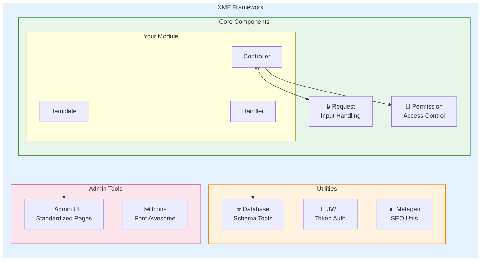
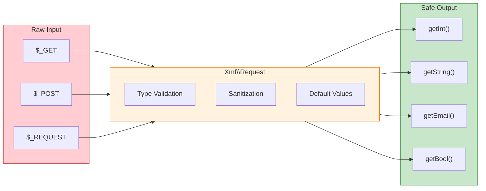

<span class="version-badge version-25x">2.5.x ✅</span> <span class="version-badge version-40x">4.0.x ✅</span>

:::tip[El Puente a XOOPS Moderno]
XMF funciona en **tanto XOOPS 2.5.x como XOOPS 4.0.x**. Es la forma recomendada de modernizar sus módulos hoy mientras se prepara para XOOPS 4.0. XMF proporciona autocarga PSR-4, espacios de nombres y ayudantes que suavizan la transición.
:::

El **Marco de Módulo de XOOPS (XMF)** es una biblioteca poderosa diseñada para simplificar y estandarizar el desarrollo de módulos de XOOPS. XMF proporciona prácticas modernas de PHP incluyendo espacios de nombres, autocarga y un conjunto completo de clases auxiliares que reducen el código repetitivo y mejoran la mantenibilidad.

## ¿Qué es XMF?

XMF es una colección de clases y utilidades que proporcionan:

- **Soporte PHP Moderno** - Soporte completo de espacios de nombres con autocarga PSR-4
- **Manejo de Solicitudes** - Validación segura de entrada y sanitización
- **Ayudantes de Módulo** - Acceso simplificado a configuraciones y objetos de módulo
- **Sistema de Permisos** - Gestión de permisos fácil de usar
- **Utilidades de Base de Datos** - Herramientas de migración de esquema y gestión de tablas
- **Soporte JWT** - Implementación de Token Web JSON para autenticación segura
- **Generación de metadatos** - Utilidades de SEO y extracción de contenido
- **Interfaz de administración** - Páginas de administración de módulo estandarizadas

### Descripción general de componentes XMF



## Características principales

### Espacios de nombres y autocarga

Todas las clases XMF residen en el espacio de nombres `Xmf`. Las clases se cargan automáticamente cuando se hace referencia a ellas - no se requieren inclusiones manuales.

```php
use Xmf\Request;
use Xmf\Module\Helper;

// Classes load automatically when used
$input = Request::getString('input', '');
$helper = Helper::getHelper('mymodule');
```

### Manejo seguro de solicitudes

La [clase Request](../05-XMF-Framework/Basics/XMF-Request.md) proporciona acceso seguro de tipo a datos de solicitud HTTP con sanitización integrada:



```php
use Xmf\Request;

$id = Request::getInt('id', 0);
$name = Request::getString('name', '');
$email = Request::getEmail('email', '');
```

### Sistema de ayudantes de módulo

El [Ayudante de módulo](../05-XMF-Framework/Basics/XMF-Module-Helper.md) proporciona acceso conveniente a funcionalidad relacionada con módulos:

```php
$helper = \Xmf\Module\Helper::getHelper('mymodule');

// Access module configuration
$configValue = $helper->getConfig('setting_name', 'default');

// Get module object
$module = $helper->getModule();

// Access handlers
$handler = $helper->getHandler('items');
```

### Gestión de permisos

El [Ayudante de permisos](../05-XMF-Framework/Recipes/Permission-Helper.md) simplifica el manejo de permisos de XOOPS:

```php
$permHelper = new \Xmf\Module\Helper\Permission();

// Check user permission
if ($permHelper->checkPermission('view', $itemId)) {
    // User has permission
}
```

## Estructura de documentación

### Conceptos básicos

- [Getting-Started-with-XMF](../05-XMF-Framework/Basics/Getting-Started-with-XMF.md) - Instalación y uso básico
- [XMF-Request](../05-XMF-Framework/Basics/XMF-Request.md) - Manejo de solicitudes y validación de entrada
- [XMF-Module-Helper](../05-XMF-Framework/Basics/XMF-Module-Helper.md) - Uso de la clase auxiliar de módulo

### Recetas

- [Permission-Helper](../05-XMF-Framework/Recipes/Permission-Helper.md) - Trabajar con permisos
- [Module-Admin-Pages](../05-XMF-Framework/Recipes/Module-Admin-Pages.md) - Creación de interfaces de administración estandarizadas

### Referencia

- [JWT](../05-XMF-Framework/Reference/JWT.md) - Implementación de Token Web JSON
- [Database](../05-XMF-Framework/Reference/Database.md) - Utilidades de base de datos y gestión de esquema
- [Metagen](Reference/Metagen.md) - Utilidades de metadatos y SEO

## Requisitos

- XOOPS 2.5.8 o posterior
- PHP 7.2 o posterior (PHP 8.x recomendado)

## Instalación

XMF se incluye con XOOPS 2.5.8 y versiones posteriores. Para versiones anteriores o instalación manual:

1. Descargue el paquete XMF desde el repositorio de XOOPS
2. Extraiga a su directorio XOOPS `/class/xmf/`
3. El cargador automático manejará la carga de clases automáticamente

## Ejemplo de inicio rápido

Aquí hay un ejemplo completo que muestra patrones de uso comunes de XMF:

```php
<?php
use Xmf\Request;
use Xmf\Module\Helper;
use Xmf\Module\Helper\Permission;

// Get module helper
$helper = Helper::getHelper('mymodule');

// Get configuration values
$itemsPerPage = $helper->getConfig('items_per_page', 10);

// Handle request input
$op = Request::getCmd('op', 'list');
$id = Request::getInt('id', 0);

// Check permissions
$permHelper = new Permission();
if (!$permHelper->checkPermission('view', $id)) {
    redirect_header('index.php', 3, 'Access denied');
}

// Process based on operation
switch ($op) {
    case 'view':
        $handler = $helper->getHandler('items');
        $item = $handler->get($id);
        // ... display item
        break;
    case 'list':
    default:
        // ... list items
        break;
}
```

## Recursos

- [Repositorio GitHub de XMF](https://github.com/XOOPS/XMF)
- [Sitio web del Proyecto XOOPS](https://xoops.org)

---

#xmf #xoops #framework #php #module-development
