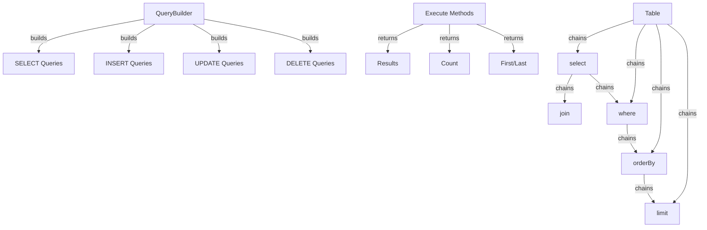

XOOPS Query Builder یک رابط مدرن و روان برای ساخت پرس و جوهای SQL فراهم می کند. این به جلوگیری از تزریق SQL کمک می کند، خوانایی را بهبود می بخشد و انتزاع پایگاه داده را برای سیستم های پایگاه داده چندگانه فراهم می کند.

## Query Builder Architecture



## کلاس QueryBuilder

کلاس سازنده پرس و جو اصلی با رابط روان.

### مرور کلی کلاس

```php
namespace XOOPS\Database;

class QueryBuilder
{
    protected string $table = '';
    protected string $type = 'SELECT';
    protected array $selects = [];
    protected array $joins = [];
    protected array $wheres = [];
    protected array $orders = [];
    protected int $limit = 0;
    protected int $offset = 0;
    protected array $bindings = [];
}
```

### روشهای استاتیک

جدول ####

یک سازنده کوئری جدید برای جدول ایجاد می کند.

```php
public static function table(string $table): QueryBuilder
```

**پارامترها:**

| پارامتر | نوع | توضیحات |
|-----------|------|-------------|
| `$table` | رشته | نام جدول (با یا بدون پیشوند) |

**بازگشت:** `QueryBuilder` - نمونه سازنده Query

**مثال:**
```php
$query = QueryBuilder::table('users');
$query = QueryBuilder::table('xoops_users'); // With prefix
```

## پرس و جوها را انتخاب کنید

### را انتخاب کنید

ستون هایی را برای انتخاب مشخص می کند.

```php
public function select(...$columns): self
```

**پارامترها:**

| پارامتر | نوع | توضیحات |
|-----------|------|-------------|
| `...$columns` | آرایه | نام یا عبارات ستون |

**بازگشت:** `self` - برای زنجیره روش

**مثال:**
```php
// Simple select
QueryBuilder::table('users')
    ->select('id', 'username', 'email')
    ->get();

// Select with aliases
QueryBuilder::table('users')
    ->select('id as user_id', 'username as name')
    ->get();

// Select all columns
QueryBuilder::table('users')
    ->select('*')
    ->get();

// Select with expressions
QueryBuilder::table('orders')
    ->select('id', 'COUNT(*) as total_items')
    ->groupBy('id')
    ->get();
```

### کجا

یک شرط WHERE اضافه می کند.

```php
public function where(string $column, string $operator = '=', mixed $value = null): self
```

**پارامترها:**

| پارامتر | نوع | توضیحات |
|-----------|------|-------------|
| `$column` | رشته | نام ستون |
| `$operator` | رشته | عملگر مقایسه |
| `$value` | مخلوط | ارزش قابل مقایسه |

**بازگشت:** `self` - برای زنجیره روش

**اپراتورها:**

| اپراتور | توضیحات | مثال |
|----------|-------------|---------|
| `=` | برابر | `->where('status', '=', 'active')` |
| `!=` یا `<>` | برابر نیست | `->where('status', '!=', 'deleted')` |
| `>` | بزرگتر از | `->where('price', '>', 100)` |
| `<` | کمتر از | `->where('price', '<', 100)` |
| `>=` | بزرگتر یا مساوی | `->where('age', '>=', 18)` |
| `<=` | کمتر یا مساوی | `->where('age', '<=', 65)` |
| `LIKE` | مطابقت الگو | `->where('name', 'LIKE', '%john%')` |
| `IN` | در لیست | `->where('status', 'IN', ['active', 'pending'])` |
| `NOT IN` | در لیست نیست | `->where('id', 'NOT IN', [1, 2, 3])` |
| `BETWEEN` | محدوده | `->where('age', 'BETWEEN', [18, 65])` |
| `IS NULL` | پوچ است | `->where('deleted_at', 'IS NULL')` |
| `IS NOT NULL` | پوچ نیست | `->where('deleted_at', 'IS NOT NULL')` |

**مثال:**
```php
// Single condition
QueryBuilder::table('users')
    ->select('*')
    ->where('status', '=', 'active')
    ->get();

// Multiple conditions (AND)
QueryBuilder::table('users')
    ->select('*')
    ->where('status', '=', 'active')
    ->where('age', '>=', 18)
    ->get();

// IN operator
QueryBuilder::table('products')
    ->select('*')
    ->where('category_id', 'IN', [1, 2, 3])
    ->get();

// LIKE operator
QueryBuilder::table('users')
    ->select('*')
    ->where('email', 'LIKE', '%@example.com')
    ->get();

// NULL check
QueryBuilder::table('users')
    ->select('*')
    ->where('deleted_at', 'IS NULL')
    ->get();
```

### یا کجا

یک شرط OR اضافه می کند.

```php
public function orWhere(string $column, string $operator = '=', mixed $value = null): self
```

**مثال:**
```php
QueryBuilder::table('users')
    ->select('*')
    ->where('status', '=', 'active')
    ->orWhere('premium', '=', 1)
    ->get();
    // SELECT * FROM users WHERE status = 'active' OR premium = 1
```

### WhereIn / WhereNotIn

روش های آسان برای IN/NOT IN.

```php
public function whereIn(string $column, array $values): self
public function whereNotIn(string $column, array $values): self
```

**مثال:**
```php
QueryBuilder::table('posts')
    ->select('*')
    ->whereIn('status', ['published', 'scheduled'])
    ->get();

QueryBuilder::table('comments')
    ->select('*')
    ->whereNotIn('spam_score', [8, 9, 10])
    ->get();
```

### WhereNull / WhereNotNull

روش های آسان برای چک های NULL.

```php
public function whereNull(string $column): self
public function whereNotNull(string $column): self
```

**مثال:**
```php
QueryBuilder::table('users')
    ->select('*')
    ->whereNotNull('verified_at')
    ->get();
```

### کجا بین

بررسی می کند که آیا مقدار بین دو مقدار است یا خیر.

```php
public function whereBetween(string $column, array $values): self
```

**مثال:**
```php
QueryBuilder::table('products')
    ->select('*')
    ->whereBetween('price', [10, 100])
    ->get();

QueryBuilder::table('orders')
    ->select('*')
    ->whereBetween('created_at', ['2024-01-01', '2024-12-31'])
    ->get();
```

### بپیوندید

یک NJOIN داخلی اضافه می کند.

```php
public function join(
    string $table,
    string $first,
    string $operator = '=',
    string $second = null
): self
```

**مثال:**
```php
QueryBuilder::table('posts')
    ->select('posts.*', 'users.username', 'categories.name')
    ->join('users', 'posts.user_id', '=', 'users.id')
    ->join('categories', 'posts.category_id', '=', 'categories.id')
    ->where('posts.published', '=', 1)
    ->get();
```

### leftJoin / rightJoin

انواع اتصالات جایگزین

```php
public function leftJoin(
    string $table,
    string $first,
    string $operator = '=',
    string $second = null
): self

public function rightJoin(
    string $table,
    string $first,
    string $operator = '=',
    string $second = null
): self
```

**مثال:**
```php
QueryBuilder::table('users')
    ->select('users.*', 'COUNT(posts.id) as post_count')
    ->leftJoin('posts', 'users.id', '=', 'posts.user_id')
    ->groupBy('users.id')
    ->get();
```

### groupBy

نتایج را بر اساس ستون(ها) گروه بندی می کند.

```php
public function groupBy(...$columns): self
```

**مثال:**
```php
QueryBuilder::table('orders')
    ->select('user_id', 'COUNT(*) as order_count', 'SUM(total) as total_spent')
    ->groupBy('user_id')
    ->get();

QueryBuilder::table('sales')
    ->select('department', 'region', 'SUM(amount) as total')
    ->groupBy('department', 'region')
    ->get();
```

### داشتن

یک شرط HAVING را اضافه می کند.

```php
public function having(string $column, string $operator = '=', mixed $value = null): self
```

**مثال:**
```php
QueryBuilder::table('orders')
    ->select('user_id', 'COUNT(*) as order_count')
    ->groupBy('user_id')
    ->having('order_count', '>', 5)
    ->get();
```

### سفارش توسط

نتایج سفارشات

```php
public function orderBy(string $column, string $direction = 'ASC'): self
```

**پارامترها:**

| پارامتر | نوع | توضیحات |
|-----------|------|-------------|
| `$column` | رشته | ستون به سفارش |
| `$direction` | رشته | `ASC` یا `DESC` |

**مثال:**
```php
// Single order
QueryBuilder::table('users')
    ->select('*')
    ->orderBy('created_at', 'DESC')
    ->get();

// Multiple orders
QueryBuilder::table('posts')
    ->select('*')
    ->orderBy('category_id', 'ASC')
    ->orderBy('created_at', 'DESC')
    ->get();

// Random order
QueryBuilder::table('quotes')
    ->select('*')
    ->orderBy('RAND()')
    ->get();
```

### محدودیت / افست

نتایج را محدود و جبران می کند.

```php
public function limit(int $limit): self
public function offset(int $offset): self
```

**مثال:**
```php
// Simple limit
QueryBuilder::table('posts')
    ->select('*')
    ->limit(10)
    ->get();

// Pagination
$page = 2;
$perPage = 20;
$offset = ($page - 1) * $perPage;

QueryBuilder::table('posts')
    ->select('*')
    ->limit($perPage)
    ->offset($offset)
    ->get();
```

## روش های اجرا

### دریافت کنید

پرس و جو را اجرا می کند و همه نتایج را برمی گرداند.

```php
public function get(): array
```

**برمی‌گرداند:** `array` - آرایه‌ای از ردیف‌های نتیجه

**مثال:**
```php
$users = QueryBuilder::table('users')
    ->select('id', 'username', 'email')
    ->where('status', '=', 'active')
    ->orderBy('username')
    ->get();

foreach ($users as $user) {
    echo $user['username'] . ' (' . $user['email'] . ')' . "\n";
}
```

اول ###

اولین نتیجه را می گیرد.

```php
public function first(): ?array
```

**برگرداندن:** `?array` - ردیف اول یا پوچ

**مثال:**
```php
$user = QueryBuilder::table('users')
    ->select('*')
    ->where('id', '=', 123)
    ->first();

if ($user) {
    echo 'Found: ' . $user['username'];
}
```

### آخرین

آخرین نتیجه را می گیرد.

```php
public function last(): ?array
```

**مثال:**
```php
$latestPost = QueryBuilder::table('posts')
    ->select('*')
    ->orderBy('created_at', 'DESC')
    ->last();
```

### شمارش

تعداد نتایج را دریافت می کند.

```php
public function count(): int
```

**برگرداندن:** `int` - تعداد ردیف**مثال:**
```php
$activeUsers = QueryBuilder::table('users')
    ->where('status', '=', 'active')
    ->count();

echo "Active users: $activeUsers";
```

### وجود دارد

بررسی می کند که آیا پرس و جو نتایجی را برمی گرداند.

```php
public function exists(): bool
```

**برگرداندن:** `bool` - در صورت وجود نتایج صحیح است

**مثال:**
```php
if (QueryBuilder::table('users')->where('email', '=', 'test@example.com')->exists()) {
    echo 'User already exists';
}
```

### مجموع

مقادیر کل را دریافت می کند.

```php
public function aggregate(string $function, string $column): mixed
```

**مثال:**
```php
$maxPrice = QueryBuilder::table('products')
    ->aggregate('MAX', 'price');

$avgAge = QueryBuilder::table('users')
    ->aggregate('AVG', 'age');

$totalSales = QueryBuilder::table('orders')
    ->aggregate('SUM', 'total');
```

## پرس و جوها را درج کنید

### درج کنید

یک ردیف را درج می کند.

```php
public function insert(array $values): bool
```

**مثال:**
```php
QueryBuilder::table('users')->insert([
    'username' => 'john',
    'email' => 'john@example.com',
    'password' => password_hash('secret', PASSWORD_BCRYPT),
    'created_at' => date('Y-m-d H:i:s')
]);
```

### درج بسیاری از

چندین ردیف را درج می کند.

```php
public function insertMany(array $rows): bool
```

**مثال:**
```php
QueryBuilder::table('log_entries')->insertMany([
    ['action' => 'login', 'user_id' => 1, 'timestamp' => time()],
    ['action' => 'logout', 'user_id' => 2, 'timestamp' => time()],
    ['action' => 'update', 'user_id' => 3, 'timestamp' => time()]
]);
```

## درخواست ها را به روز کنید

### به روز رسانی

ردیف ها را به روز می کند.

```php
public function update(array $values): int
```

**برگرداندن:** `int` - تعداد ردیف های تحت تأثیر

**مثال:**
```php
// Update single user
QueryBuilder::table('users')
    ->where('id', '=', 123)
    ->update([
        'email' => 'newemail@example.com',
        'updated_at' => date('Y-m-d H:i:s')
    ]);

// Update multiple rows
QueryBuilder::table('posts')
    ->where('status', '=', 'draft')
    ->where('created_at', '<', date('Y-m-d', strtotime('-30 days')))
    ->update([
        'status' => 'archived'
    ]);
```

### افزایش / کاهش

یک ستون را افزایش یا کاهش می دهد.

```php
public function increment(string $column, int $amount = 1): int
public function decrement(string $column, int $amount = 1): int
```

**مثال:**
```php
// Increment view count
QueryBuilder::table('posts')
    ->where('id', '=', 123)
    ->increment('views');

// Decrement stock
QueryBuilder::table('products')
    ->where('id', '=', 456)
    ->decrement('stock', 5);
```

## پرس و جوها را حذف کنید

### حذف کنید

ردیف ها را حذف می کند.

```php
public function delete(): int
```

**برگرداندن:** `int` - تعداد ردیف های حذف شده

**مثال:**
```php
// Delete single record
QueryBuilder::table('comments')
    ->where('id', '=', 789)
    ->delete();

// Delete multiple records
QueryBuilder::table('log_entries')
    ->where('created_at', '<', date('Y-m-d', strtotime('-30 days')))
    ->delete();
```

### کوتاه کردن

تمام سطرها را از جدول حذف می کند.

```php
public function truncate(): bool
```

**مثال:**
```php
// Clear all sessions
QueryBuilder::table('sessions')->truncate();
```

## ویژگی های پیشرفته

### عبارات خام

```php
QueryBuilder::table('products')
    ->select('id', 'name', QueryBuilder::raw('price * quantity as total'))
    ->get();
```

### سوالات فرعی

```php
$recentPostIds = QueryBuilder::table('posts')
    ->select('id')
    ->where('created_at', '>', date('Y-m-d', strtotime('-7 days')))
    ->toSql();

$comments = QueryBuilder::table('comments')
    ->select('*')
    ->whereIn('post_id', $recentPostIds)
    ->get();
```

### دریافت SQL

```php
public function toSql(): string
```

**مثال:**
```php
$sql = QueryBuilder::table('users')
    ->select('id', 'username')
    ->where('status', '=', 'active')
    ->toSql();

echo $sql;
// SELECT id, username FROM xoops_users WHERE status = ?
```

## مثال های کامل

### Complex Select with Joins

```php
<?php
/**
 * Get posts with author and category info
 */

$posts = QueryBuilder::table('posts')
    ->select(
        'posts.id',
        'posts.title',
        'posts.content',
        'posts.created_at',
        'users.username as author',
        'categories.name as category'
    )
    ->join('users', 'posts.user_id', '=', 'users.id')
    ->join('categories', 'posts.category_id', '=', 'categories.id')
    ->where('posts.published', '=', 1)
    ->orderBy('posts.created_at', 'DESC')
    ->limit(10)
    ->get();

foreach ($posts as $post) {
    echo '<article>';
    echo '<h2>' . htmlspecialchars($post['title']) . '</h2>';
    echo '<p class="meta">By ' . htmlspecialchars($post['author']) . ' in ' . htmlspecialchars($post['category']) . '</p>';
    echo '<p>' . htmlspecialchars($post['content']) . '</p>';
    echo '</article>';
}
```

### صفحه بندی با QueryBuilder

```php
<?php
/**
 * Paginated results
 */

$page = isset($_GET['page']) ? (int)$_GET['page'] : 1;
$perPage = 20;
$offset = ($page - 1) * $perPage;

// Get total count
$total = QueryBuilder::table('articles')
    ->where('status', '=', 'published')
    ->count();

// Get page results
$articles = QueryBuilder::table('articles')
    ->select('*')
    ->where('status', '=', 'published')
    ->orderBy('created_at', 'DESC')
    ->limit($perPage)
    ->offset($offset)
    ->get();

// Calculate pagination
$pages = ceil($total / $perPage);

// Display results
foreach ($articles as $article) {
    echo '<div class="article">' . htmlspecialchars($article['title']) . '</div>';
}

// Display pagination links
if ($pages > 1) {
    echo '<nav class="pagination">';
    for ($i = 1; $i <= $pages; $i++) {
        if ($i == $page) {
            echo '<span class="current">' . $i . '</span>';
        } else {
            echo '<a href="?page=' . $i . '">' . $i . '</a>';
        }
    }
    echo '</nav>';
}
```

### تجزیه و تحلیل داده ها با مصالح

```php
<?php
/**
 * Sales analysis
 */

// Total sales by region
$regionSales = QueryBuilder::table('orders')
    ->select('region', QueryBuilder::raw('SUM(total) as total_sales'), QueryBuilder::raw('COUNT(*) as order_count'))
    ->groupBy('region')
    ->orderBy('total_sales', 'DESC')
    ->get();

foreach ($regionSales as $region) {
    echo $region['region'] . ': $' . number_format($region['total_sales'], 2) . ' (' . $region['order_count'] . ' orders)' . "\n";
}

// Average order value
$avgOrderValue = QueryBuilder::table('orders')
    ->aggregate('AVG', 'total');

echo 'Average order value: $' . number_format($avgOrderValue, 2);
```

## بهترین شیوه ها

1. **از پرس و جوهای پارامتری استفاده کنید** - QueryBuilder به طور خودکار اتصال پارامترها را کنترل می کند
2. ** روش های زنجیره ای ** - اهرم رابط روان برای کد قابل خواندن
3. **تست خروجی SQL** - از `toSql()` برای تأیید پرس و جوهای ایجاد شده استفاده کنید
4. **از شاخص ها استفاده کنید** - مطمئن شوید که ستون هایی که اغلب درخواست می شوند نمایه می شوند
5. **محدود کردن نتایج** - همیشه از `limit()` برای مجموعه داده های بزرگ استفاده کنید
6. **استفاده از Aggregates** - اجازه دهید پایگاه داده به جای PHP counting/summing را انجام دهد
7. **خروجی Escape** - همیشه از داده های نمایش داده شده با `htmlspecialchars()` فرار کنید
8. **عملکرد شاخص** - پرس و جوهای کند را زیر نظر بگیرید و بر اساس آن بهینه سازی کنید

## مستندات مرتبط

- XoopsDatabase - لایه پایگاه داده و اتصالات
- معیارها - سیستم پرس و جو مبتنی بر معیارهای میراث
- ../Core/XoopsObject - پایداری شی داده
- ../Module/Module-System - عملیات پایگاه داده ماژول

---

*همچنین ببینید: [XOOPS Database API](https://github.com/XOOPS/XoopsCore27/tree/master/htdocs/class)*