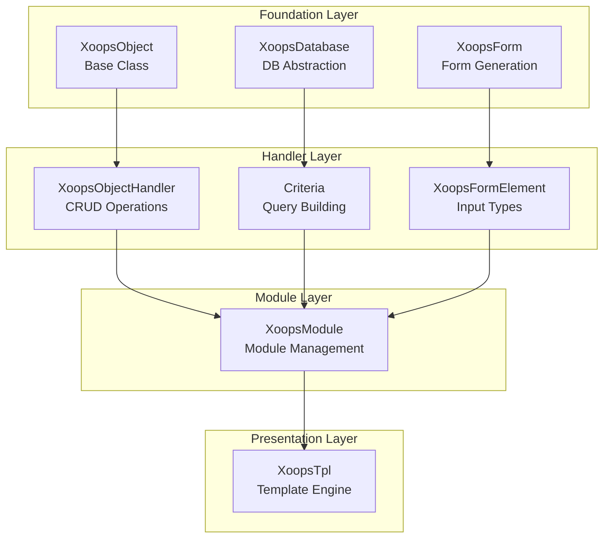
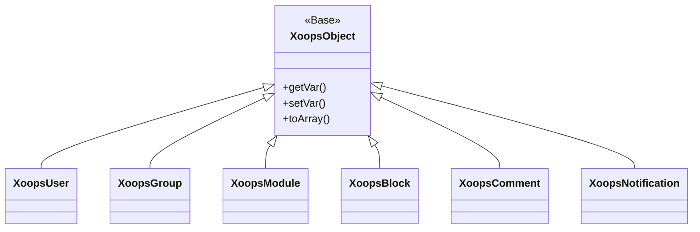
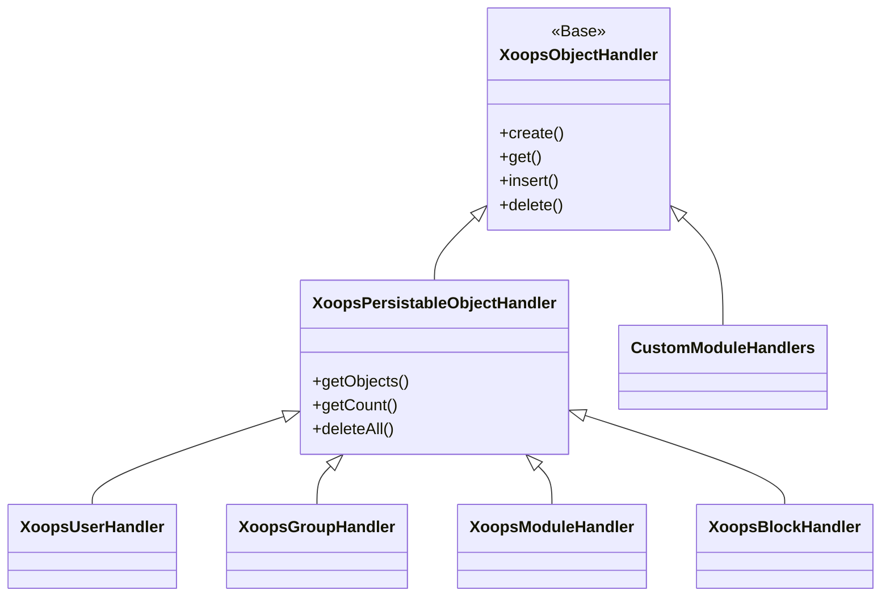
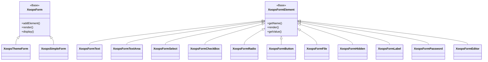

به مستندات مرجع جامع XOOPS API خوش آمدید. این بخش مستندات دقیقی را برای تمام کلاس‌های اصلی، روش‌ها و سیستم‌هایی که سیستم مدیریت محتوای XOOPS را تشکیل می‌دهند، ارائه می‌کند.

## بررسی اجمالی

XOOPS API در چندین زیرسیستم اصلی سازماندهی شده است که هر کدام مسئول جنبه خاصی از عملکرد CMS هستند. درک این API ها برای توسعه ماژول ها، تم ها و برنامه های افزودنی برای XOOPS ضروری است.

## بخش های API

### کلاس های اصلی

کلاس های پایه ای که تمام اجزای دیگر XOOPS بر آن ساخته شده اند.

| مستندات | توضیحات |
|--------------|-------------|
| XoopsObject | کلاس پایه برای تمام اشیاء داده در XOOPS |
| XoopsObjectHandler | الگوی هندلر برای عملیات CRUD |

### لایه پایگاه داده

ابزارهای انتزاعی پایگاه داده و ساخت پرس و جو.

| مستندات | توضیحات |
|--------------|-------------|
| XoopsDatabase | لایه انتزاعی پایگاه داده |
| سیستم معیار | معیارها و شرایط استعلام |
| QueryBuilder | ساختمان پرس و جوی روان مدرن |

### سیستم فرم

تولید فرم HTML و اعتبار سنجی

| مستندات | توضیحات |
|--------------|-------------|
| XoopsForm | ظرف فرم و رندر |
| عناصر فرم | همه انواع عناصر فرم موجود |

### کلاس های هسته

اجزای اصلی سیستم و خدمات.

| مستندات | توضیحات |
|--------------|-------------|
| کلاس های هسته | هسته سیستم و اجزای اصلی |

### سیستم ماژول

مدیریت ماژول و چرخه عمر.

| مستندات | توضیحات |
|--------------|-------------|
| سیستم ماژول | بارگذاری، نصب و مدیریت ماژول |

### سیستم قالب

ادغام قالب هوشمند.

| مستندات | توضیحات |
|--------------|-------------|
| سیستم قالب | ادغام هوشمند و مدیریت قالب |

### سیستم کاربر

مدیریت کاربر و احراز هویت

| مستندات | توضیحات |
|--------------|-------------|
| سیستم کاربر | حساب های کاربری، گروه ها و مجوزها |

## مروری بر معماری



## سلسله مراتب کلاس

### مدل شی



### مدل هندلر



### مدل فرم



## الگوهای طراحی

XOOPS API چندین الگوی طراحی شناخته شده را پیاده سازی می کند:

### الگوی تک تن
برای سرویس های جهانی مانند اتصالات پایگاه داده و نمونه های کانتینر استفاده می شود.

```php
$db = XoopsDatabase::getInstance();
$container = XoopsContainer::getInstance();
```

### الگوی کارخانه
کنترل‌کننده‌های شیء، اشیاء دامنه را به طور مداوم ایجاد می‌کنند.

```php
$handler = xoops_getHandler('user');
$user = $handler->create();
```

### الگوی ترکیبی
فرم ها شامل چندین عنصر فرم هستند. معیارها می توانند شامل معیارهای تو در تو باشند.

```php
$criteria = new CriteriaCompo();
$criteria->add(new Criteria('status', 1));
$criteria->add(new CriteriaCompo(...)); // Nested
```

### الگوی مشاهده گر
سیستم رویداد امکان اتصال آزاد بین ماژول ها را فراهم می کند.

```php
$dispatcher->addListener('module.news.article_published', $callback);
```

## مثال های شروع سریع

### ایجاد و ذخیره یک شی

```php
// Get the handler
$handler = xoops_getHandler('user');

// Create a new object
$user = $handler->create();
$user->setVar('uname', 'newuser');
$user->setVar('email', 'user@example.com');

// Save to database
$handler->insert($user);
```

### پرس و جو با معیارها

```php
// Build criteria
$criteria = new CriteriaCompo();
$criteria->add(new Criteria('level', 0, '>'));
$criteria->setSort('uname');
$criteria->setOrder('ASC');
$criteria->setLimit(10);

// Get objects
$handler = xoops_getHandler('user');
$users = $handler->getObjects($criteria);
```

### ایجاد یک فرم

```php
$form = new XoopsThemeForm('User Profile', 'userform', 'save.php', 'post', true);
$form->addElement(new XoopsFormText('Username', 'uname', 50, 255, $user->getVar('uname')));
$form->addElement(new XoopsFormTextArea('Bio', 'bio', $user->getVar('bio')));
$form->addElement(new XoopsFormButton('', 'submit', _SUBMIT, 'submit'));
echo $form->render();
```

## قراردادهای API

### قراردادهای نامگذاری

| نوع | کنوانسیون | مثال |
|------|-----------|---------|
| کلاس ها | PascalCase | `XoopsUser`, `CriteriaCompo` |
| روش ها | شتر مورد | `getVar()`, `setVar()` |
| خواص | CamelCase (محافظت شده) | `$_vars`, `$_handler` |
| ثابت ها | UPPER_SNAKE_CASE | `XOBJ_DTYPE_INT` |
| جداول پایگاه داده | مار_مورد | `users`, `groups_users_link` |

### انواع داده

XOOPS انواع داده های استاندارد را برای متغیرهای شی تعریف می کند:| ثابت | نوع | توضیحات |
|----------|------|-------------|
| `XOBJ_DTYPE_TXTBOX` | رشته | ورودی متن (عفونی شده) |
| `XOBJ_DTYPE_TXTAREA` | رشته | محتوای Textarea |
| `XOBJ_DTYPE_INT` | عدد صحیح | مقادیر عددی |
| `XOBJ_DTYPE_URL` | رشته | اعتبار سنجی URL |
| `XOBJ_DTYPE_EMAIL` | رشته | اعتبار سنجی ایمیل |
| `XOBJ_DTYPE_ARRAY` | آرایه | آرایه های سریالی |
| `XOBJ_DTYPE_OTHER` | مختلط | مدیریت سفارشی |
| `XOBJ_DTYPE_SOURCE` | رشته | کد منبع (حداقل پاکسازی) |
| `XOBJ_DTYPE_STIME` | عدد صحیح | مُهر زمانی کوتاه |
| `XOBJ_DTYPE_MTIME` | عدد صحیح | مهر زمانی متوسط ​​|
| `XOBJ_DTYPE_LTIME` | عدد صحیح | مهر زمانی طولانی |

## روش های احراز هویت

API از چندین روش احراز هویت پشتیبانی می کند:

### احراز هویت کلید API
```
X-API-Key: your-api-key
```

### OAuth Bearer Token
```
Authorization: Bearer your-oauth-token
```

### احراز هویت مبتنی بر جلسه
هنگام ورود به سیستم از جلسه XOOPS موجود استفاده می کند.

## REST API نقاط پایانی

وقتی REST API فعال است:

| نقطه پایانی | روش | توضیحات |
|----------|--------|-------------|
| `/api.php/rest/users` | دریافت | لیست کاربران |
| `/api.php/rest/users/{id}` | دریافت | دریافت کاربر با شناسه |
| `/api.php/rest/users` | پست | ایجاد کاربر |
| `/api.php/rest/users/{id}` | قرار دادن | به روز رسانی کاربر |
| `/api.php/rest/users/{id}` | حذف | حذف کاربر |
| `/api.php/rest/modules` | دریافت | لیست ماژول ها |

## مستندات مرتبط

- راهنمای توسعه ماژول
- راهنمای توسعه تم
- پیکربندی سیستم
- بهترین شیوه های امنیتی

## تاریخچه نسخه

| نسخه | تغییرات |
|---------|---------|
| 2.5.11 | انتشار پایدار فعلی |
| 2.5.10 | اضافه شدن پشتیبانی GraphQL API |
| 2.5.9 | سیستم معیارهای پیشرفته |
| 2.5.8 | پشتیبانی از بارگیری خودکار PSR-4 |

---

*این مستند بخشی از پایگاه دانش XOOPS است. برای آخرین به‌روزرسانی‌ها، از [مخزن XOOPS GitHub](https://github.com/XOOPS) دیدن کنید.*