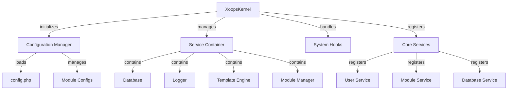

هسته XOOPS چارچوبی اساسی برای راه‌اندازی سیستم، مدیریت پیکربندی‌ها، مدیریت رویدادهای سیستم و ارائه ابزارهای اصلی فراهم می‌کند. این کلاس ها ستون فقرات برنامه XOOPS را تشکیل می دهند.

## معماری سیستم



## کلاس XoopsKernel

کلاس هسته اصلی که سیستم XOOPS را مقداردهی اولیه و مدیریت می کند.

### مرور کلی کلاس

```php
namespace XOOPS;

class XoopsKernel
{
    private static ?XoopsKernel $instance = null;
    protected ServiceContainer $services;
    protected ConfigurationManager $config;
    protected array $modules = [];
    protected bool $isLoaded = false;
}
```

### سازنده

```php
private function __construct()
```

سازنده خصوصی الگوی تکی را اجرا می کند.

### getInstance

نمونه هسته تک تن را بازیابی می کند.

```php
public static function getInstance(): XoopsKernel
```

**بازگشت:** `XoopsKernel` - نمونه هسته تک تن

**مثال:**
```php
$kernel = XoopsKernel::getInstance();
```

### فرآیند بوت

فرآیند بوت هسته این مراحل را دنبال می کند:

1. **Initialization ** - تنظیم کننده های خطا را تنظیم کنید، ثابت ها را تعریف کنید
2. **پیکربندی** - بارگذاری فایل های پیکربندی
3. ** ثبت خدمات ** - ثبت خدمات اصلی
4. **تشخیص ماژول** - ماژول های فعال را اسکن و شناسایی کنید
5. ** راه اندازی پایگاه داده ** - اتصال به پایگاه داده
6. **پاکسازی** - برای رسیدگی به درخواست آماده شوید

```php
public function boot(): void
```

**مثال:**
```php
$kernel = XoopsKernel::getInstance();
$kernel->boot();
```

### روش های کانتینر سرویس

#### ثبت سرویس

یک سرویس را در کانتینر سرویس ثبت می کند.

```php
public function registerService(
    string $name,
    callable|object $definition
): void
```

**پارامترها:**

| پارامتر | نوع | توضیحات |
|-----------|------|-------------|
| `$name` | رشته | شناسه خدمات |
| `$definition` | قابل فراخوان\|شیء | کارخانه یا نمونه خدمات |

**مثال:**
```php
$kernel->registerService('custom.handler', function($c) {
    return new CustomHandler();
});
```

#### دریافت سرویس

یک سرویس ثبت شده را بازیابی می کند.

```php
public function getService(string $name): mixed
```

**پارامترها:**

| پارامتر | نوع | توضیحات |
|-----------|------|-------------|
| `$name` | رشته | شناسه خدمات |

**بازگشت:** `mixed` - سرویس درخواستی

**مثال:**
```php
$database = $kernel->getService('database');
$logger = $kernel->getService('logger');
```

#### سرویس دارد

بررسی می کند که آیا سرویسی ثبت شده است یا خیر.

```php
public function hasService(string $name): bool
```

**مثال:**
```php
if ($kernel->hasService('cache')) {
    $cache = $kernel->getService('cache');
}
```

## مدیر پیکربندی

پیکربندی برنامه و تنظیمات ماژول را مدیریت می کند.

### مرور کلی کلاس

```php
namespace XOOPS\Core;

class ConfigurationManager
{
    protected array $config = [];
    protected array $defaults = [];
    protected string $configPath;
}
```

### روش ها

#### بارگذاری

پیکربندی را از فایل یا آرایه بارگیری می کند.

```php
public function load(string|array $source): void
```

**پارامترها:**

| پارامتر | نوع | توضیحات |
|-----------|------|-------------|
| `$source` | رشته\|آرایه | مسیر یا آرایه فایل پیکربندی |

**مثال:**
```php
$config = $kernel->getService('config');
$config->load(XOOPS_ROOT_PATH . '/include/config.php');
$config->load(['sitename' => 'My Site', 'admin_email' => 'admin@example.com']);
```

#### دریافت کنید

یک مقدار پیکربندی را بازیابی می کند.

```php
public function get(string $key, mixed $default = null): mixed
```

**پارامترها:**

| پارامتر | نوع | توضیحات |
|-----------|------|-------------|
| `$key` | رشته | کلید پیکربندی (نقطه نویسی) |
| `$default` | مخلوط | مقدار پیش فرض در صورت یافت نشد |

**برگرداند:** `mixed` - مقدار پیکربندی

**مثال:**
```php
$siteName = $config->get('sitename');
$adminEmail = $config->get('admin.email', 'admin@example.com');
```

مجموعه ####

یک مقدار پیکربندی را تنظیم می کند.

```php
public function set(string $key, mixed $value): void
```

**پارامترها:**

| پارامتر | نوع | توضیحات |
|-----------|------|-------------|
| `$key` | رشته | کلید پیکربندی |
| `$value` | مخلوط | مقدار پیکربندی |

**مثال:**
```php
$config->set('sitename', 'New Site Name');
$config->set('features.cache_enabled', true);
```

#### getModuleConfig

پیکربندی یک ماژول خاص را دریافت می کند.

```php
public function getModuleConfig(
    string $moduleName
): array
```

**پارامترها:**

| پارامتر | نوع | توضیحات |
|-----------|------|-------------|
| `$moduleName` | رشته | نام دایرکتوری ماژول |

**برگرداندن:** `array` - آرایه پیکربندی ماژول

**مثال:**
```php
$publisherConfig = $config->getModuleConfig('publisher');
```

## قلاب های سیستم

قلاب‌های سیستم به ماژول‌ها و افزونه‌ها اجازه می‌دهند تا کد را در نقاط خاصی از چرخه عمر برنامه اجرا کنند.

### کلاس HookManager

```php
namespace XOOPS\Core;

class HookManager
{
    protected array $hooks = [];
    protected array $listeners = [];
}
```

### روش ها

#### addhook

یک نقطه قلاب را ثبت می کند.

```php
public function addHook(string $name): void
```

**پارامترها:**

| پارامتر | نوع | توضیحات |
|-----------|------|-------------|
| `$name` | رشته | شناسه هوک |

**مثال:**
```php
$hooks = $kernel->getService('hooks');
$hooks->addHook('system.startup');
$hooks->addHook('user.login');
$hooks->addHook('module.install');
```

#### گوش کن

شنونده را به یک قلاب متصل می کند.

```php
public function listen(
    string $hookName,
    callable $callback,
    int $priority = 10
): void
```

**پارامترها:**| پارامتر | نوع | توضیحات |
|-----------|------|-------------|
| `$hookName` | رشته | شناسه هوک |
| `$callback` | قابل تماس | تابع برای اجرا |
| `$priority` | int | اولویت اجرا (اول اجراهای بالاتر) |

**مثال:**
```php
$hooks->listen('user.login', function($user) {
    error_log('User ' . $user->uname . ' logged in');
}, 10);

$hooks->listen('module.install', function($module) {
    // Custom module installation logic
    echo "Installing " . $module->getName();
}, 5);
```

#### ماشه

همه شنوندگان را برای یک هوک اجرا می کند.

```php
public function trigger(
    string $hookName,
    mixed $arguments = null
): array
```

**پارامترها:**

| پارامتر | نوع | توضیحات |
|-----------|------|-------------|
| `$hookName` | رشته | شناسه هوک |
| `$arguments` | مخلوط | داده ها برای انتقال به شنوندگان |

**بازگشت:** `array` - نتایج از همه شنوندگان

**مثال:**
```php
$results = $hooks->trigger('system.startup');
$results = $hooks->trigger('user.created', $newUser);
```

## بررسی اجمالی خدمات اصلی

کرنل چندین سرویس اصلی را در هنگام بوت ثبت می کند:

| خدمات | کلاس | هدف |
|---------|-------|---------|
| `database` | XoopsDatabase | لایه انتزاعی پایگاه داده |
| `config` | ConfigurationManager | مدیریت پیکربندی |
| `logger` | چوبگیر | ثبت برنامه |
| `template` | XoopsTpl | موتور قالب |
| `user` | UserManager | سرویس مدیریت کاربر |
| `module` | ModuleManager | مدیریت ماژول |
| `cache` | CacheManager | لایه ذخیره |
| `hooks` | HookManager | قلاب رویداد سیستم |

## مثال استفاده کامل

```php
<?php
/**
 * Custom module boot process utilizing kernel
 */

// Get kernel instance
$kernel = XoopsKernel::getInstance();

// Boot the system
$kernel->boot();

// Get services
$config = $kernel->getService('config');
$database = $kernel->getService('database');
$logger = $kernel->getService('logger');
$hooks = $kernel->getService('hooks');

// Access configuration
$siteName = $config->get('sitename');
$adminEmail = $config->get('admin.email');

// Register module-specific hooks
$hooks->listen('user.login', function($user) {
    // Log user login
    $logger->info('User login: ' . $user->uname);

    // Track in database
    $database->query(
        'INSERT INTO ' . $database->prefix('event_log') .
        ' (type, user_id, message, timestamp) VALUES (?, ?, ?, ?)',
        ['login', $user->uid(), 'User login', time()]
    );
});

$hooks->listen('module.install', function($module) {
    $logger->info('Module installed: ' . $module->getName());
});

// Trigger hooks
$hooks->trigger('system.startup');

// Use database service
$result = $database->query(
    'SELECT * FROM ' . $database->prefix('users') .
    ' LIMIT 10'
);

while ($row = $database->fetchArray($result)) {
    echo "User: " . htmlspecialchars($row['uname']) . "\n";
}

// Register custom service
$kernel->registerService('custom.repository', function($c) {
    return new CustomRepository($c->getService('database'));
});

// Later access custom service
$repo = $kernel->getService('custom.repository');
```

## ثابت های اصلی

هسته چندین ثابت مهم را در هنگام بوت تعریف می کند:

```php
// System paths
define('XOOPS_ROOT_PATH', '/var/www/xoops');
define('XOOPS_HTDOCS_PATH', XOOPS_ROOT_PATH . '/htdocs');
define('XOOPS_MODULES_PATH', XOOPS_ROOT_PATH . '/htdocs/modules');
define('XOOPS_THEMES_PATH', XOOPS_ROOT_PATH . '/htdocs/themes');

// Web paths
define('XOOPS_URL', 'http://example.com');
define('XOOPS_HTDOCS_URL', XOOPS_URL . '/htdocs');

// Database
define('XOOPS_DB_PREFIX', 'xoops_');
```

## رسیدگی به خطا

کرنل کنترل کننده های خطا را در هنگام بوت تنظیم می کند:

```php
// Set custom error handler
set_error_handler(function($errno, $errstr, $errfile, $errline) {
    $kernel->getService('logger')->error(
        "Error: $errstr in $errfile:$errline"
    );
});

// Set exception handler
set_exception_handler(function($exception) {
    $kernel->getService('logger')->critical(
        "Exception: " . $exception->getMessage()
    );
});
```

## بهترین شیوه ها

1. **Single Boot** - فقط یک بار در طول راه اندازی برنامه با `boot()` تماس بگیرید
2. **استفاده از سرویس Container** - خدمات را از طریق هسته ثبت و بازیابی کنید
3. **به زودی قلاب ها را کنترل کنید ** - قبل از فعال کردن شنوندگان قلاب ثبت نام کنید
4. ** ثبت رویدادهای مهم ** - از سرویس لاگر برای اشکال زدایی استفاده کنید
5. **پیکربندی کش** - پیکربندی را یک بار بارگیری کرده و مجددا استفاده کنید
6. ** رسیدگی به خطاها ** - همیشه قبل از پردازش درخواست ها، کنترل کننده های خطا را تنظیم کنید

## مستندات مرتبط

- ../Module/Module-System - سیستم ماژول و چرخه حیات
- ../Template/Template-System - یکپارچه سازی موتور الگو
- ../User/User-System - احراز هویت و مدیریت کاربر
- ../Database/XoopsDatabase - لایه پایگاه داده

---

*همچنین ببینید: [منبع هسته XOOPS](https://github.com/XOOPS/XoopsCore27/tree/master/htdocs/class)*