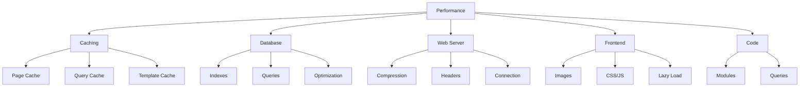

# بهینه سازی عملکرد XOOPS

راهنمای جامع بهینه سازی XOOPS برای حداکثر سرعت و کارایی.

## بررسی اجمالی بهینه سازی عملکرد



## پیکربندی کش

کش کردن سریعترین راه برای بهبود عملکرد است.

### ذخیره سازی سطح صفحه

فعال کردن کش کامل صفحه در XOOPS:

**پنل مدیریت > سیستم > تنظیمات برگزیده > تنظیمات حافظه پنهان **

```
Enable Caching: Yes
Cache Type: File Cache (or APCu/Memcache)
Cache Lifetime: 3600 seconds (1 hour)
Cache Module Lists: Yes
Cache Configuration: Yes
Cache Search Results: Yes
```

### کش مبتنی بر فایل

پیکربندی مکان کش فایل:

```bash
# Create cache directory outside web root (more secure)
mkdir -p /var/cache/xoops
chown www-data:www-data /var/cache/xoops
chmod 755 /var/cache/xoops

# Edit mainfile.php
define('XOOPS_CACHE_PATH', '/var/cache/xoops/');
```

### APCu Caching

APCu کش در حافظه را فراهم می کند (بسیار سریع):

```bash
# Install APCu
apt-get install php-apcu

# Verify installation
php -m | grep apcu

# Configure in php.ini
apc.enabled = 1
apc.memory_size = 128M
apc.ttl = 0
apc.user_ttl = 3600
apc.shm_size = 128
```

فعال کردن در XOOPS:

**پنل مدیریت > سیستم > تنظیمات برگزیده > تنظیمات حافظه پنهان **

```
Cache Type: APCu
```

### Memcache/Redis ذخیره سازی

حافظه پنهان توزیع شده برای سایت های پر ترافیک:

**نصب Memcache:**

```bash
# Install Memcache server
apt-get install memcached

# Start service
systemctl start memcached
systemctl enable memcached

# Verify running
netstat -tlnp | grep memcached
# Should show listening on port 11211
```

**پیکربندی در XOOPS:**

ویرایش mainfile.php:

```php
// Memcache configuration
define('XOOPS_CACHE_TYPE', 'memcache');
define('XOOPS_CACHE_HOST', 'localhost');
define('XOOPS_CACHE_PORT', 11211);
define('XOOPS_CACHE_TIMEOUT', 0);
```

یا در پنل مدیریت:

```
Cache Type: Memcache
Memcache Host: localhost:11211
```

### ذخیره الگو

کامپایل و کش قالب های XOOPS:

```bash
# Ensure templates_c is writable
chmod 777 /var/www/html/xoops/templates_c/

# Clear old cached templates
rm -rf /var/www/html/xoops/templates_c/*
```

پیکربندی در موضوع:

```html
<!-- In theme xoops_version.php -->
{smarty.const.XOOPS_VAR_PATH|constant}
<{$xoops_meta}>

<!-- Templates use caching -->
{cache}
    [Cached content here]
{/cache}
```

## بهینه سازی پایگاه داده

### فهرست های پایگاه داده را اضافه کنید

پایگاه‌های داده‌ای که به‌درستی فهرست‌بندی شده‌اند، سریع‌تر پرس‌وجو می‌کنند.

```sql
-- Check current indexes
SHOW INDEXES FROM xoops_users;

-- Common indexes to add
ALTER TABLE xoops_users ADD INDEX idx_uname (uname);
ALTER TABLE xoops_users ADD INDEX idx_email (email);
ALTER TABLE xoops_users ADD INDEX idx_uid_active (uid, user_actkey);

-- Add indexes to posts/content tables
ALTER TABLE xoops_posts ADD INDEX idx_post_published (post_published);
ALTER TABLE xoops_posts ADD INDEX idx_post_uid (post_uid);
ALTER TABLE xoops_posts ADD INDEX idx_post_created (post_created);

-- Verify indexes created
SHOW INDEXES FROM xoops_users\G
```

### جداول را بهینه کنید

بهینه سازی منظم جدول عملکرد را بهبود می بخشد:

```sql
-- Optimize all tables
OPTIMIZE TABLE xoops_users;
OPTIMIZE TABLE xoops_posts;
OPTIMIZE TABLE xoops_config;
OPTIMIZE TABLE xoops_comments;

-- Or optimize all at once
REPAIR TABLE xoops_users;
OPTIMIZE TABLE xoops_users;
REPAIR TABLE xoops_posts;
OPTIMIZE TABLE xoops_posts;
```

ایجاد اسکریپت بهینه سازی خودکار:

```bash
#!/bin/bash
# Database optimization script

echo "Optimizing XOOPS database..."

mysql -u xoops_user -p xoops_db << EOF
-- Optimize all tables
OPTIMIZE TABLE xoops_users;
OPTIMIZE TABLE xoops_posts;
OPTIMIZE TABLE xoops_config;
OPTIMIZE TABLE xoops_comments;
OPTIMIZE TABLE xoops_users_online;

-- Show database size
SELECT table_schema,
       ROUND(SUM(data_length + index_length) / 1024 / 1024, 2) as total_mb
FROM information_schema.tables
WHERE table_schema = 'xoops_db'
GROUP BY table_schema;
EOF

echo "Database optimization completed!"
```

برنامه ریزی با cron:

```bash
# Weekly optimization
crontab -e
# Add: 0 3 * * 0 /usr/local/bin/optimize-xoops-db.sh
```

### بهینه سازی پرس و جو

بررسی سوالات کند:

```sql
-- Enable slow query log
SET GLOBAL slow_query_log = 'ON';
SET GLOBAL long_query_time = 2;

-- View slow queries
SELECT * FROM mysql.slow_log;

-- Or check slow log file
tail -100 /var/log/mysql/slow.log
```

تکنیک های رایج بهینه سازی:

```php
// SLOW - Avoid unnecessary queries in loops
foreach ($users as $user) {
    $profile = getUserProfile($user['uid']);  // Query in loop!
    echo $profile['name'];
}

// FAST - Get all data at once
$profiles = getAllUserProfiles($user_ids);
foreach ($users as $user) {
    echo $profiles[$user['uid']]['name'];
}
```

### افزایش بافر Pool

MySQL را برای کش کردن بهتر پیکربندی کنید:

ویرایش `/etc/mysql/mysql.conf.d/mysqld.cnf`:

```ini
# InnoDB Buffer Pool (50-80% of system RAM)
innodb_buffer_pool_size = 1G

# Query Cache (optional, can be disabled in MySQL 5.7+)
query_cache_size = 64M
query_cache_type = 1

# Max Connections
max_connections = 500

# Max Allowed Packet
max_allowed_packet = 256M

# Connection timeout
connect_timeout = 10
```

MySQL را مجدداً راه اندازی کنید:

```bash
systemctl restart mysql
```

## بهینه سازی وب سرور

### فشرده سازی Gzip را فعال کنید

فشرده سازی پاسخ ها برای کاهش پهنای باند:

**پیکربندی آپاچی:**

```apache
<IfModule mod_deflate.c>
    AddOutputFilterByType DEFLATE text/html text/plain text/xml text/css text/javascript application/javascript application/json

    # Don't compress images and already compressed files
    SetEnvIfNoCase Request_URI \.(jpg|jpeg|png|gif|zip|gzip)$ no-gzip dont-vary

    # Log compressed responses
    DeflateBufferSize 8096
</IfModule>
```

**پیکربندی Nginx:**

```nginx
gzip on;
gzip_types text/html text/plain text/css text/javascript application/javascript application/json;
gzip_min_length 1000;
gzip_vary on;
gzip_comp_level 6;

# Don't compress already compressed formats
gzip_disable "msie6";
```

بررسی فشرده سازی:

```bash
# Check if response is gzipped
curl -I -H "Accept-Encoding: gzip" http://your-domain.com/xoops/

# Should show:
# Content-Encoding: gzip
```

### سرصفحه های ذخیره مرورگر

تنظیم انقضای حافظه پنهان برای دارایی های استاتیک:

**آپاچی:**

```apache
<IfModule mod_expires.c>
    ExpiresActive On

    # Cache images for 30 days
    ExpiresByType image/jpeg "access plus 30 days"
    ExpiresByType image/gif "access plus 30 days"
    ExpiresByType image/png "access plus 30 days"
    ExpiresByType image/svg+xml "access plus 30 days"

    # Cache CSS/JS for 30 days
    ExpiresByType text/css "access plus 30 days"
    ExpiresByType application/javascript "access plus 30 days"
    ExpiresByType text/javascript "access plus 30 days"

    # Cache fonts for 1 year
    ExpiresByType font/eot "access plus 1 year"
    ExpiresByType font/ttf "access plus 1 year"
    ExpiresByType font/woff "access plus 1 year"
    ExpiresByType font/woff2 "access plus 1 year"

    # Don't cache HTML
    ExpiresByType text/html "access plus 1 hour"
</IfModule>
```

**Nginx:**

```nginx
location ~* \.(jpg|jpeg|png|gif|ico|svg|woff|woff2|ttf|eot)$ {
    expires 30d;
    add_header Cache-Control "public, immutable";
}

location ~* \.(css|js)$ {
    expires 30d;
    add_header Cache-Control "public";
}

location ~ \.html$ {
    expires 1h;
    add_header Cache-Control "public";
}
```

### اتصال Keep-Alive

اتصالات HTTP دائمی را فعال کنید:

**آپاچی:**

```apache
<IfModule mod_http.c>
    KeepAlive On
    KeepAliveTimeout 15
    MaxKeepAliveRequests 100
</IfModule>
```

**Nginx:**

```nginx
keepalive_timeout 15s;
keepalive_requests 100;
```

## بهینه سازی Frontend

### تصاویر را بهینه کنید

کاهش اندازه فایل های تصویری:

```bash
# Batch compress JPEG images
for img in *.jpg; do
    convert "$img" -quality 85 "optimized_$img"
done

# Batch compress PNG images
for img in *.png; do
    optipng -o2 "$img"
done

# Or use imagemin CLI
npm install -g imagemin-cli
imagemin images/ --out-dir=images-optimized
```

### CSS و جاوا اسکریپت را کوچک کنید

کاهش اندازه فایل CSS/JS:

**استفاده از ابزار Node.js:**

```bash
# Install minifiers
npm install -g uglify-js clean-css-cli

# Minify JavaScript
uglifyjs script.js -o script.min.js

# Minify CSS
cleancss style.css -o style.min.css
```

**استفاده از ابزارهای آنلاین:**
- CSS Minifier: https://cssminifier.com/
- Minifier جاوا اسکریپت: https://www.minifycode.com/javascript-minifier/

### تصاویر بارگذاری تنبل

بارگیری تصاویر فقط در صورت نیاز:

```html
<!-- Add loading="lazy" attribute -->


<!-- Or use JavaScript library for older browsers -->


<script src="https://cdnjs.cloudflare.com/ajax/libs/vanilla-lazyload/17.1.2/lazyload.min.js"></script>
<script>
    var lazyLoad = new LazyLoad({
        elements_selector: ".lazy"
    });
</script>
```

### منابع مسدودکننده رندر را کاهش دهید

بارگذاری استراتژیک CSS/JS:

```html
<!-- Load critical CSS inline -->
<style>
    /* Critical styles for above-the-fold */
</style>

<!-- Defer non-critical CSS -->
<link rel="stylesheet" href="style.css" media="print" onload="this.media='all'">

<!-- Defer JavaScript -->
<script src="script.js" defer></script>

<!-- Or use async for non-critical scripts -->
<script src="analytics.js" async></script>
```

## یکپارچه سازی CDN

از یک شبکه تحویل محتوا برای دسترسی جهانی سریعتر استفاده کنید.

### CDN های محبوب

| CDN | هزینه | ویژگی ها |
|---|---|---|
| Cloudflare | Free/Paid | DDoS، DNS، Cache، Analytics |
| AWS CloudFront | پرداخت شده | عملکرد بالا، جهانی |
| بانی CDN | مقرون به صرفه | ذخیره سازی، ویدئو، کش |
| jsDelivr | رایگان | کتابخانه های جاوا اسکریپت |
| cdnjs | رایگان | کتابخانه های محبوب |

### راه اندازی Cloudflare

1. در https://www.cloudflare.com/ ثبت نام کنید
2. دامنه خود را اضافه کنید
3. سرورهای نام را با Cloudflare به روز کنید
4. گزینه های کش را فعال کنید:
   - سطح حافظه پنهان: تهاجمی
   - ذخیره روی همه چیز: روشن
   - ذخیره مرورگر TTL: 1 ماه

5. در XOOPS، دامنه خود را برای استفاده از Cloudflare DNS به روز کنید

### CDN را در XOOPS پیکربندی کنید

URL های تصویر را به CDN به روز کنید:

ویرایش قالب تم:

```html
<!-- Original -->


<!-- With CDN -->

```

یا در PHP تنظیم کنید:

```php
// In mainfile.php or config
define('XOOPS_CDN_URL', 'https://cdn.your-domain.com');

// In template

```

## نظارت بر عملکرد

### تست بینش سرعت صفحه

عملکرد سایت خود را تست کنید:

1. از Google PageSpeed Insights دیدن کنید: https://pagespeed.web.dev/
2. URL XOOPS خود را وارد کنید
3. توصیه ها را مرور کنید
4. بهبودهای پیشنهادی را اجرا کنید

### نظارت بر عملکرد سرور

نظارت بر معیارهای سرور بلادرنگ:

```bash
# Install monitoring tools
apt-get install htop iotop nethogs

# Monitor CPU and memory
htop

# Monitor disk I/O
iotop

# Monitor network
nethogs
```

### پروفایل عملکرد PHP

کدهای کند PHP را شناسایی کنید:

```php
<?php
// Use Xdebug for profiling
xdebug_start_trace('profile');

// Your code here
$result = someExpensiveFunction();

xdebug_stop_trace();
?>
```

### نظارت بر پرس و جو MySQL

پیگیری درخواست‌های کند:

```bash
# Enable query logging
mysql -u root -p

SET GLOBAL general_log = 'ON';
SET GLOBAL log_output = 'FILE';
SET GLOBAL general_log_file = '/var/log/mysql/query.log';

# Review slow queries
tail -f /var/log/mysql/slow.log

# Analyze query with EXPLAIN
EXPLAIN SELECT * FROM xoops_users WHERE uid = 1\G
```

## چک لیست بهینه سازی عملکردبرای بهترین عملکرد این موارد را اجرا کنید:

- [ ] **ذخیره سازی:** ذخیره سازی file/APCu/Memcache را فعال کنید
- [ ] **پایگاه داده:** فهرست ها را اضافه کنید، جداول را بهینه کنید
- [ ] ** فشرده سازی: ** فشرده سازی Gzip را فعال کنید
- [ ] ** کش مرورگر: ** تنظیم سرصفحه های کش
- [ ] **تصاویر:** بهینه سازی و فشرده سازی
- [ ] **CSS/JS:** کوچک کردن فایل ها
- [ ] ** بارگذاری تنبل:** برای تصاویر پیاده سازی کنید
- [ ] **CDN:** برای دارایی های ثابت استفاده کنید
- [ ] **Keep-Alive:** اتصالات مداوم را فعال کنید
- [ ] **ماژول ها:** ماژول های استفاده نشده را غیرفعال کنید
- [ ] **موضوع:** از تم های سبک و بهینه استفاده کنید
- [ ] ** نظارت: ** معیارهای عملکرد را پیگیری کنید
- [ ] ** تعمیر و نگهداری منظم: ** حافظه پنهان را پاک کنید، DB را بهینه کنید

## اسکریپت بهینه سازی عملکرد

بهینه سازی خودکار:

```bash
#!/bin/bash
# Performance optimization script

echo "=== XOOPS Performance Optimization ==="

# Clear cache
echo "Clearing cache..."
rm -rf /var/www/html/xoops/cache/*
rm -rf /var/www/html/xoops/templates_c/*

# Optimize database
echo "Optimizing database..."
mysql -u xoops_user -p xoops_db << EOF
OPTIMIZE TABLE xoops_users;
OPTIMIZE TABLE xoops_posts;
OPTIMIZE TABLE xoops_config;
OPTIMIZE TABLE xoops_comments;
EOF

# Check file permissions
echo "Verifying file permissions..."
find /var/www/html/xoops -type f -exec chmod 644 {} \;
find /var/www/html/xoops -type d -exec chmod 755 {} \;
chmod 777 /var/www/html/xoops/cache
chmod 777 /var/www/html/xoops/templates_c
chmod 777 /var/www/html/xoops/uploads
chmod 777 /var/www/html/xoops/var

# Generate performance report
echo "Performance Optimization Complete!"
echo ""
echo "Next steps:"
echo "1. Test site at https://pagespeed.web.dev/"
echo "2. Monitor performance in admin panel"
echo "3. Consider CDN for static assets"
echo "4. Review slow queries in MySQL"
```

## معیارهای قبل و بعد

پیشرفت های مسیر:

```
Before Optimization:
- Page Load Time: 3.5 seconds
- Database Queries: 45
- Cache Hit Rate: 0%
- Database Size: 250MB

After Optimization:
- Page Load Time: 0.8 seconds (77% faster)
- Database Queries: 8 (cached)
- Cache Hit Rate: 85%
- Database Size: 120MB (optimized)
```

## مراحل بعدی

1. تنظیمات اولیه را مرور کنید
2. تدابیر امنیتی را تضمین کنید
3. کش را پیاده سازی کنید
4. نظارت بر عملکرد با ابزار
5. بر اساس معیارها تنظیم کنید

---

**برچسب ها:** #عملکرد #بهینه سازی #کش #پایگاه داده #cdn

**مقالات مرتبط:**
- ../../06-Publisher-Module/User-Guide/Basic-Configuration
- تنظیمات سیستم
- امنیت-پیکربندی
- ../Installation/Server-Requirements