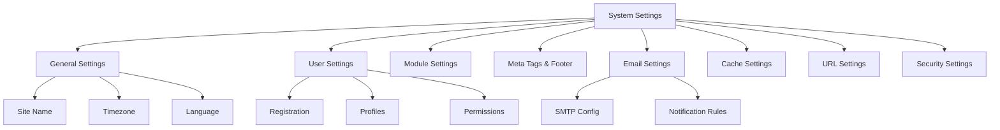

# تنظیمات سیستم XOOPS

این راهنما تنظیمات کامل سیستم موجود در پنل مدیریت XOOPS را که بر اساس دسته بندی سازماندهی شده است، پوشش می دهد.

## معماری تنظیمات سیستم



## دسترسی به تنظیمات سیستم

### مکان

**پنل مدیریت > سیستم > تنظیمات برگزیده**

یا مستقیماً پیمایش کنید:

```
http://your-domain.com/xoops/admin/index.php?fct=preferences
```

### الزامات مجوز

- فقط مدیران (وب مسترها) می توانند به تنظیمات سیستم دسترسی داشته باشند
- تغییرات کل سایت را تحت تاثیر قرار می دهد
- اکثر تغییرات بلافاصله اعمال می شوند

## تنظیمات عمومی

پیکربندی اساسی برای نصب XOOPS شما.

### اطلاعات اولیه

```
Site Name: [Your Site Name]
Default Description: [Brief description of your site]
Site Slogan: [Catchy slogan]
Admin Email: admin@your-domain.com
Webmaster Name: Administrator Name
Webmaster Email: admin@your-domain.com
```

### تنظیمات ظاهر

```
Default Theme: [Select theme]
Default Language: English (or preferred language)
Items Per Page: 15 (typically 10-25)
Words in Snippet: 25 (for search results)
Theme Upload Permission: Disabled (security)
```

### تنظیمات منطقه ای

```
Default Timezone: [Your timezone]
Date Format: %Y-%m-%d (YYYY-MM-DD format)
Time Format: %H:%M:%S (HH:MM:SS format)
Daylight Saving Time: [Auto/Manual/None]
```

**جدول فرمت منطقه زمانی:**

| منطقه | منطقه زمانی | UTC Offset |
|---|---|---|
| ایالات متحده شرقی | America/New_York | -5 / -4 |
| مرکزی ایالات متحده | America/Chicago | -6 / -5 |
| کوه ایالات متحده | America/Denver | -7 / -6 |
| اقیانوس آرام ایالات متحده | America/Los_Angeles | -8 / -7 |
| UK/London | Europe/London | 0 / +1 |
| France/Germany | Europe/Paris | +1 / +2 |
| ژاپن | Asia/Tokyo | +9 |
| چین | Asia/Shanghai | +8 |
| Australia/Sydney | Australia/Sydney | +10 / +11 |

### پیکربندی جستجو

```
Enable Search: Yes
Search Admin Pages: Yes/No
Search Archives: Yes
Default Search Type: All / Pages only
Words Excluded from Search: [Comma-separated list]
```

**کلمات حذف شده رایج:**، a، an، و یا، اما، در، در، در، توسط، به، از

## تنظیمات کاربر

رفتار حساب کاربری و فرآیند ثبت نام را کنترل کنید.

### ثبت نام کاربر

```
Allow User Registration: Yes/No
Registration Type:
  ☐ Auto-activate (Instant access)
  ☐ Admin approval (Admin must approve)
  ☐ Email verification (User must verify email)

Notification to Users: Yes/No
User Email Verification: Required/Optional
```

### پیکربندی کاربر جدید

```
Auto-login New Users: Yes/No
Assign Default User Group: Yes
Default User Group: [Select group]
Create User Avatar: Yes/No
Initial User Avatar: [Select default]
```

### تنظیمات نمایه کاربر

```
Allow User Profiles: Yes
Show Member List: Yes
Show User Statistics: Yes
Show Last Online Time: Yes
Allow User Avatar: Yes
Avatar Max File Size: 100KB
Avatar Dimensions: 100x100 pixels
```

### تنظیمات ایمیل کاربر

```
Allow Users to Hide Email: Yes
Show Email on Profile: Yes
Notification Email Interval: Immediately/Daily/Weekly/Never
```

### ردیابی فعالیت کاربر

```
Track User Activity: Yes
Log User Logins: Yes
Log Failed Logins: Yes
Track IP Address: Yes
Clear Activity Logs Older Than: 90 days
```

### محدودیت های حساب

```
Allow Duplicate Email: No
Minimum Username Length: 3 characters
Maximum Username Length: 15 characters
Minimum Password Length: 6 characters
Require Special Characters: Yes
Require Numbers: Yes
Password Expiration: 90 days (or Never)
Accounts Inactive Days to Delete: 365 days
```

## تنظیمات ماژول

رفتار ماژول فردی را پیکربندی کنید.

### گزینه های ماژول مشترک

برای هر ماژول نصب شده، می توانید تنظیم کنید:

```
Module Status: Active/Inactive
Display in Menu: Yes/No
Module Weight: [1-999](higher = lower in display)
Homepage Default: This module shows when visiting /
Admin Access: [Allowed user groups]
User Access: [Allowed user groups]
```

### تنظیمات ماژول سیستم

```
Show Homepage as: Portal / Module / Static Page
Default Homepage Module: [Select module]
Show Footer Menu: Yes
Footer Color: [Color selector]
Show System Stats: Yes
Show Memory Usage: Yes
```

### پیکربندی در هر ماژول

هر ماژول می تواند تنظیمات مخصوص ماژول را داشته باشد:

**مثال - ماژول صفحه:**
```
Enable Comments: Yes/No
Moderate Comments: Yes/No
Comments Per Page: 10
Enable Ratings: Yes
Allow Anonymous Ratings: Yes
```

**مثال - ماژول کاربر:**
```
Avatar Upload Folder: ./uploads/
Maximum Upload Size: 100KB
Allow File Upload: Yes
Allowed File Types: jpg, gif, png
```

دسترسی به تنظیمات ماژول خاص:
- **Admin > Modules > [Module Name] > Preferences**

## متا تگ ها و تنظیمات سئو

متا تگ ها را برای بهینه سازی موتور جستجو پیکربندی کنید.

### متا تگ های جهانی

```
Meta Keywords: xoops, cms, content management system
Meta Description: A powerful content management system for building dynamic websites
Meta Author: Your Name
Meta Copyright: Copyright 2025, Your Company
Meta Robots: index, follow
Meta Revisit: 30 days
```

### بهترین روش های متا تگ

| برچسب | هدف | توصیه |
|---|---|---|
| کلمات کلیدی | عبارات جستجو | 5-10 کلمه کلیدی مرتبط، جدا شده با کاما |
| توضیحات | جستجوی لیست | 150-160 کاراکتر |
| نویسنده | سازنده صفحه | نام یا شرکت شما |
| حق چاپ | حقوقی | اعلامیه حق چاپ شما |
| ربات ها | دستورالعمل خزنده | index, follow (اجازه نمایه سازی) |

### تنظیمات پاورقی

```
Show Footer: Yes
Footer Color: Dark/Light
Footer Background: [Color code]
Footer Text: [HTML allowed]
Additional Footer Links: [URL and text pairs]
```

**نمونه HTML پاورقی:**
```html
<p>Copyright &copy; 2025 Your Company. All rights reserved.</p>
<p><a href="/privacy">Privacy Policy</a> | <a href="/terms">Terms of Use</a></p>
```

### متا تگ های اجتماعی (گراف باز)

```
Enable Open Graph: Yes
Facebook App ID: [App ID]
Twitter Card Type: summary / summary_large_image / player
Default Share Image: [Image URL]
```

## تنظیمات ایمیل

پیکربندی سیستم ارسال ایمیل و اطلاع رسانی

### روش ارسال ایمیل

```
Use SMTP: Yes/No

If SMTP:
  SMTP Host: smtp.gmail.com
  SMTP Port: 587 (TLS) or 465 (SSL)
  SMTP Security: TLS / SSL / None
  SMTP Username: [email@example.com]
  SMTP Password: [password]
  SMTP Authentication: Yes/No
  SMTP Timeout: 10 seconds

If PHP mail():
  Sendmail Path: /usr/sbin/sendmail -t -i
```

### پیکربندی ایمیل

```
From Address: noreply@your-domain.com
From Name: Your Site Name
Reply-To Address: support@your-domain.com
BCC Admin Emails: Yes/No
```

### تنظیمات اعلان

```
Send Welcome Email: Yes/No
Welcome Email Subject: Welcome to [Site Name]
Welcome Email Body: [Custom message]

Send Password Reset Email: Yes/No
Include Random Password: Yes/No
Token Expiration: 24 hours
```

### اطلاعیه های مدیریت

```
Notify Admin on Registration: Yes
Notify Admin on Comments: Yes
Notify Admin on Submissions: Yes
Notify Admin on Errors: Yes
```

### اطلاعیه های کاربر

```
Notify User on Registration: Yes
Notify User on Comments: Yes
Notify User on Private Messages: Yes
Allow Users to Disable Notifications: Yes
Default Notification Frequency: Immediately
```

### الگوهای ایمیل

سفارشی کردن ایمیل های اعلان در پنل مدیریت:

**مسیر:** سیستم > الگوهای ایمیل

قالب های موجود:
- ثبت نام کاربر
- بازنشانی رمز عبور
- اعلام نظر
- پیام خصوصی
- هشدارهای سیستم
- ایمیل های مخصوص ماژول

## تنظیمات کش

بهینه سازی عملکرد از طریق کش

### پیکربندی کش

```
Enable Caching: Yes/No
Cache Type:
  ☐ File Cache
  ☐ APCu (Alternative PHP Cache)
  ☐ Memcache (Distributed caching)
  ☐ Redis (Advanced caching)

Cache Lifetime: 3600 seconds (1 hour)
```

### گزینه های کش بر اساس نوع

**کش فایل:**
```
Cache Directory: /var/www/html/xoops/cache/
Clear Interval: Daily
Maximum Cache Files: 1000
```

**کش APCu:**
```
Memory Allocation: 128MB
Fragmentation Level: Low
```

**Memcache/Redis:**
```
Server Host: localhost
Server Port: 11211 (Memcache) / 6379 (Redis)
Persistent Connection: Yes
```

### آنچه در حافظه پنهان می شود

```
Cache Module Lists: Yes
Cache Configuration Data: Yes
Cache Template Data: Yes
Cache User Session Data: Yes
Cache Search Results: Yes
Cache Database Queries: Yes
Cache RSS Feeds: Yes
Cache Images: Yes
```

## تنظیمات URL

بازنویسی و قالب بندی URL را پیکربندی کنید.

### تنظیمات URL دوستانه

```
Enable Friendly URLs: Yes/No
Friendly URL Type:
  ☐ Path Info: /page/about
  ☐ Query String: /index.php?p=about

Trailing Slash: Include / Omit
URL Case: Lower case / Case sensitive
```

### قوانین بازنویسی URL

```
.htaccess Rules: [Display current]
Nginx Rules: [Display current if Nginx]
IIS Rules: [Display current if IIS]
```

## تنظیمات امنیتی

پیکربندی مرتبط با امنیت را کنترل کنید.

### امنیت رمز عبور

```
Password Policy:
  ☐ Require uppercase letters
  ☐ Require lowercase letters
  ☐ Require numbers
  ☐ Require special characters

Minimum Password Length: 8 characters
Password Expiration: 90 days
Password History: Remember last 5 passwords
Force Password Change: On next login
```

### امنیت ورود

```
Lock Account After Failed Attempts: 5 attempts
Lock Duration: 15 minutes
Log All Login Attempts: Yes
Log Failed Logins: Yes
Admin Login Alert: Send email on admin login
Two-Factor Authentication: Disabled/Enabled
```

### امنیت آپلود فایل
```
Allow File Uploads: Yes/No
Maximum File Size: 128MB
Allowed File Types: jpg, gif, png, pdf, zip, doc, docx
Scan Uploads for Malware: Yes (if available)
Quarantine Suspicious Files: Yes
```

### امنیت جلسه

```
Session Management: Database/Files
Session Timeout: 1800 seconds (30 min)
Session Cookie Lifetime: 0 (until browser closes)
Secure Cookie: Yes (HTTPS only)
HTTP Only Cookie: Yes (prevent JavaScript access)
```

### تنظیمات CORS

```
Allow Cross-Origin Requests: No
Allowed Origins: [List domains]
Allow Credentials: No
Allowed Methods: GET, POST
```

## تنظیمات پیشرفته

گزینه های پیکربندی اضافی برای کاربران پیشرفته.

### حالت اشکال زدایی

```
Debug Mode: Disabled/Enabled
Log Level: Error / Warning / Info / Debug
Debug Log File: /var/log/xoops_debug.log
Display Errors: Disabled (production)
```

### تنظیم عملکرد

```
Optimize Database Queries: Yes
Use Query Cache: Yes
Compress Output: Yes
Minify CSS/JavaScript: Yes
Lazy Load Images: Yes
```

### تنظیمات محتوا

```
Allow HTML in Posts: Yes/No
Allowed HTML Tags: [Configure]
Strip Harmful Code: Yes
Allow Embed: Yes/No
Content Moderation: Automatic/Manual
Spam Detection: Yes
```

## تنظیمات Export/Import

### تنظیمات پشتیبان گیری

صادرات تنظیمات فعلی:

**پنل مدیریت > سیستم > ابزار > تنظیمات صادرات**

```bash
# Settings exported as JSON file
# Download and store securely
```

### تنظیمات را بازیابی کنید

وارد کردن تنظیمات صادر شده قبلی:

**پنل مدیریت > سیستم > ابزار > تنظیمات واردات **

```bash
# Upload JSON file
# Verify changes before confirming
```

## سلسله مراتب پیکربندی

سلسله مراتب تنظیمات XOOPS (از بالا به پایین - اولین بازی برنده):

```
1. mainfile.php (Constants)
2. Module-specific config
3. Admin System Settings
4. Theme configuration
5. User preferences (for user-specific settings)
```

## تنظیمات اسکریپت پشتیبان گیری

یک نسخه پشتیبان از تنظیمات فعلی ایجاد کنید:

```php
<?php
// Backup script: /var/www/html/xoops/backup-settings.php
require_once __DIR__ . '/mainfile.php';

$config_handler = xoops_getHandler('config');
$configs = $config_handler->getConfigs();

$backup = [
    'exported_date' => date('Y-m-d H:i:s'),
    'xoops_version' => XOOPS_VERSION,
    'php_version' => PHP_VERSION,
    'settings' => []
];

foreach ($configs as $config) {
    $backup['settings'][$config->getVar('conf_name')] = [
        'value' => $config->getVar('conf_value'),
        'description' => $config->getVar('conf_desc'),
        'type' => $config->getVar('conf_type'),
    ];
}

// Save to JSON file
file_put_contents(
    '/backups/xoops_settings_' . date('YmdHis') . '.json',
    json_encode($backup, JSON_PRETTY_PRINT)
);

echo "Settings backed up successfully!";
?>
```

## تنظیمات رایج تغییرات

### نام سایت را تغییر دهید

1. Admin > System > Preferences > General Settings
2. "نام سایت" را تغییر دهید
3. روی «ذخیره» کلیک کنید

### ثبت نام Enable/Disable

1. Admin > System > Preferences > User Settings
2. گزینه "Allow User Registration" را تغییر دهید
3. نوع ثبت نام را انتخاب کنید
4. روی «ذخیره» کلیک کنید

### تم پیش فرض را تغییر دهید

1. Admin > System > Preferences > General Settings
2. "طرح پیش فرض" را انتخاب کنید
3. روی «ذخیره» کلیک کنید
4. کش را برای اعمال تغییرات پاک کنید

### ایمیل تماس را به روز کنید

1. Admin > System > Preferences > General Settings
2. "ایمیل مدیر" را تغییر دهید
3. «ایمیل وب مستر» را تغییر دهید
4. روی «ذخیره» کلیک کنید

## چک لیست تأیید

پس از پیکربندی تنظیمات سیستم، بررسی کنید:

- [ ] نام سایت به درستی نمایش داده می شود
- [ ] منطقه زمانی زمان صحیح را نشان می دهد
- [ ] اعلان های ایمیل به درستی ارسال می شوند
- [ ] ثبت نام کاربر طبق پیکربندی کار می کند
- [ ] صفحه اصلی پیش فرض انتخاب شده را نمایش می دهد
- [ ] قابلیت جستجو کار می کند
- [ ] کش زمان بارگذاری صفحه را بهبود می بخشد
- [ ] URL های دوستانه کار می کنند (در صورت فعال بودن)
- [ ] متا تگ ها در منبع صفحه ظاهر می شوند
- [ ] اعلان‌های مدیریت دریافت شد
- [ ] تنظیمات امنیتی اعمال شد

## تنظیمات عیب یابی

### تنظیمات ذخیره نمی‌شوند

**راه حل:**
```bash
# Check file permissions on config directory
chmod 755 /var/www/html/xoops/var/

# Verify database writable
# Try saving again in admin panel
```

### تغییرات اعمال نمی شود

**راه حل:**
```bash
# Clear cache
rm -rf /var/www/html/xoops/cache/*
rm -rf /var/www/html/xoops/templates_c/*

# If still not working, restart web server
systemctl restart apache2
```

### ایمیل ارسال نمی شود

**راه حل:**
1. اعتبار SMTP را در تنظیمات ایمیل بررسی کنید
2. با دکمه "ارسال ایمیل آزمایشی" تست کنید
3. گزارش های خطا را بررسی کنید
4. سعی کنید به جای SMTP از PHP mail() استفاده کنید

## مراحل بعدی

پس از پیکربندی تنظیمات سیستم:

1. تنظیمات امنیتی را پیکربندی کنید
2. عملکرد را بهینه کنید
3. ویژگی های پنل مدیریت را کاوش کنید
4. مدیریت کاربر را تنظیم کنید

---

**برچسب ها:** #تنظیمات سیستم #پیکربندی #تنظیمات #پنل مدیریت

**مقالات مرتبط:**
- ../../06-Publisher-Module/User-Guide/Basic-Configuration
- امنیت-پیکربندی
- بهینه سازی عملکرد
- ../First-Steps/Admin-Panel-Overview