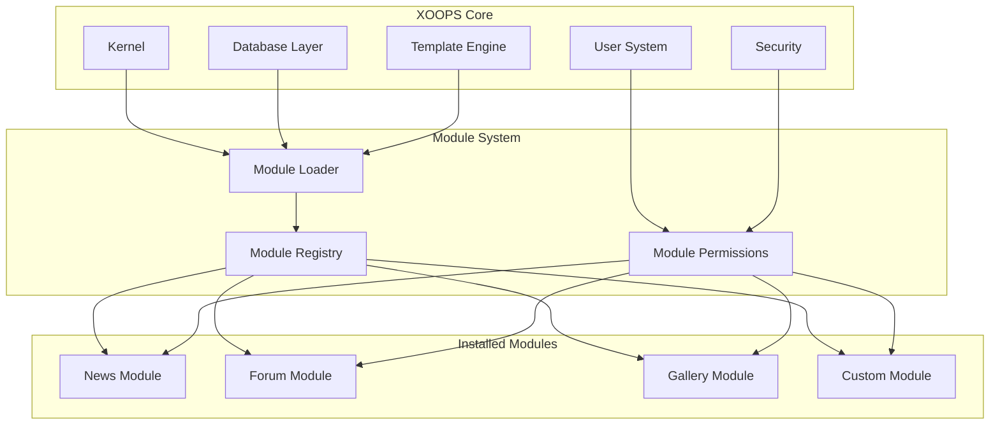
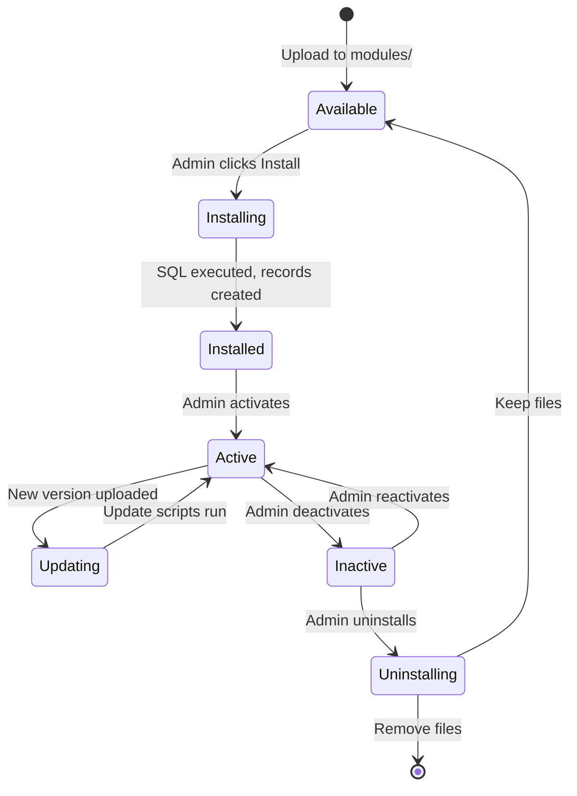

# ADR-001: معماری مدولار

> رکورد تصمیم گیری معماری برای فلسفه طراحی مدولار اصلی XOOPS.

---

## وضعیت

** پذیرفته شده** - تصمیم اساسی از زمان شروع XOOPS

---

## زمینه

XOOPS (سیستم پورتال شی گرا eXtensible) به معماری نیاز داشت که:

1. به توسعه دهندگان شخص ثالث اجازه دهید تا عملکرد را گسترش دهند
2. مدیران سایت را فعال کنید تا بدون کدنویسی شخصی سازی کنند
3. پشتیبانی از توسعه مستقل و به روز رسانی
4. ایجاد انزوا بین ویژگی های مختلف
5. مقیاس از وبلاگ های ساده به پورتال های پیچیده

چشم انداز CMS در اوایل دهه 2000 سیستم های یکپارچه ای را ارائه می کرد که سفارشی سازی و گسترش آنها دشوار بود.

---

## نمودار تصمیم گیری



---

## تصمیم

ما یک **معماری مدولار** را اجرا خواهیم کرد که در آن:

### 1. Core زیرساخت را فراهم می کند
- انتزاع پایگاه داده
- احراز هویت و مجوزهای کاربر
- رندر قالب (Smarty)
- ابزارهای امنیتی
- تولید فرم
- خدمات عمومی

### 2. ماژول ها خودکفا هستند
هر ماژول:
- ساختار دایرکتوری خود را دارد
- شامل کلاس ها، قالب ها، SQL خود است
- پیکربندی خود را تعریف می کند
- می تواند به طور مستقل installed/uninstalled باشد
- دارای ردیابی نسخه

### 3. ساختار ماژول استاندارد
```
modules/modulename/
├── admin/                  # Admin interface
│   ├── index.php
│   └── menu.php
├── class/                  # PHP classes
├── include/                # Include files
├── language/               # Translations
├── sql/                    # Database schema
├── templates/              # Smarty templates
├── blocks/                 # Block definitions
├── xoops_version.php       # Module manifest
├── index.php               # Entry point
└── header.php              # Module bootstrap
```

### 4. مانیفست ماژول (xoops_version.php)
```php
<?php
$modversion['name']        = 'Module Name';
$modversion['version']     = '1.0.0';
$modversion['description'] = 'Module description';
$modversion['dirname']     = basename(__DIR__);
$modversion['hasMain']     = 1;
$modversion['hasAdmin']    = 1;
$modversion['sqlfile']['mysql'] = 'sql/mysql.sql';
$modversion['tables']      = ['modulename_table1'];
$modversion['templates']   = [...];
$modversion['config']      = [...];
$modversion['blocks']      = [...];
```

### 5. ارتباط ماژول
- از طریق APIهای اصلی (هندلرها، رویدادها)
- روابط پایگاه داده
- قلاب ها را از قبل بارگیری کنید
- خدمات مشترک

---

## چرخه عمر ماژول



---

## عواقب

### مثبت

1. ** توسعه پذیری **: هزاران ماژول ایجاد شده توسط انجمن
2. ** استقلال **: ماژول ها را می توان به طور جداگانه توسعه داد
3. **انعطاف پذیری**: سایت ها می توانند ویژگی ها را با هم ترکیب کرده و مطابقت دهند
4. **قابلیت نگهداری**: به روز رسانی ها روی ماژول های دیگر تاثیری ندارند
5. ** بازار **: اکوسیستم ماژول پدید آمد
6. **منحنی یادگیری**: توسعه دهندگان یک الگو را یاد می گیرند

### منفی

1. **سربار **: هر ماژول دارای هزینه بوت استرپ است
2. **تکثیر **: کد مشترک ممکن است تکرار شود
3. **ادغام **: ویژگی های متقابل ماژول نیاز به طراحی دقیق دارند
4. **نسخه**: مدیریت سازگاری ماژول مورد نیاز است
5. **تغییر کیفیت**: کیفیت ماژول شخص ثالث متفاوت است

### خنثی

1. **پایگاه داده**: هر ماژول جداول خود را مدیریت می کند
2. **قالب ها**: تم باید ماژول های مختلفی را در خود جای دهد
3. **به روز رسانی **: هسته و ماژول ها به طور مستقل به روز می شوند

---

## جایگزین در نظر گرفته شده است

### 1. معماری یکپارچه
**رد شد** - خیلی سفت و سخت، سفارشی کردن آن دشوار است

### 2. معماری پلاگین (به سبک وردپرس)
**تا حدی پذیرفته شده** - بلوک ها و پیش بارگذاری ها قلاب های پلاگین مانندی را در ماژول ها ارائه می دهند

### 3. معماری کامپوننت (به سبک جوملا)
**رد شده** - پیچیده تر، کمتر توسعه دهنده پسند

### 4. میکروسرویس ها
**قابل اجرا نیست** - برای دوران میزبانی مشترک بسیار پیچیده است

---

## تصمیمات مرتبط

- ADR-002: دسترسی به پایگاه داده شی گرا
- ADR-003: Smarty Template Engine
- ADR-005: سیستم مجوز

---

## مراجع

- تاریخچه پروژه XOOPS
- الگوهای معماری برنامه PHP
- مطالعات مقایسه CMS (2001-2005)

---

#xoops #معماری #adr #ماژول ها #طراحی-تصمیم گیری