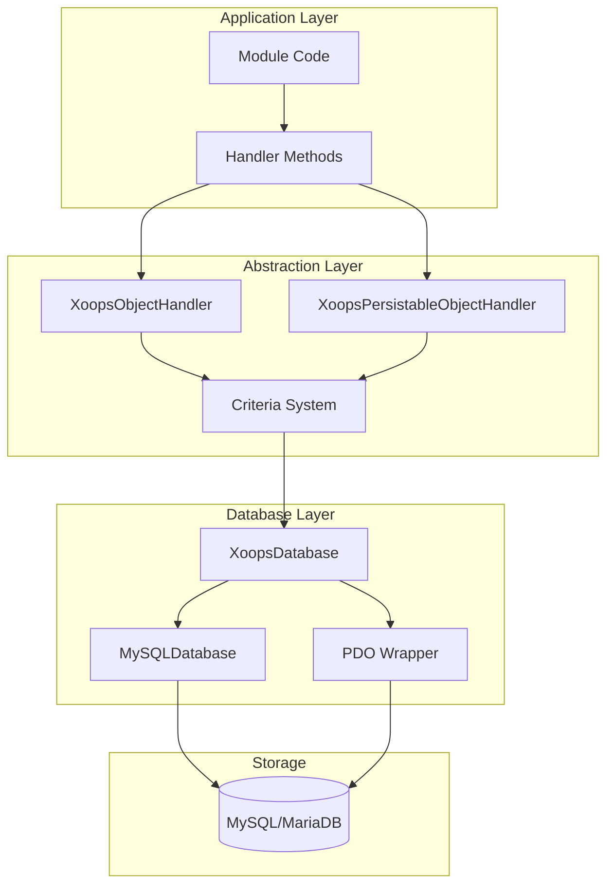
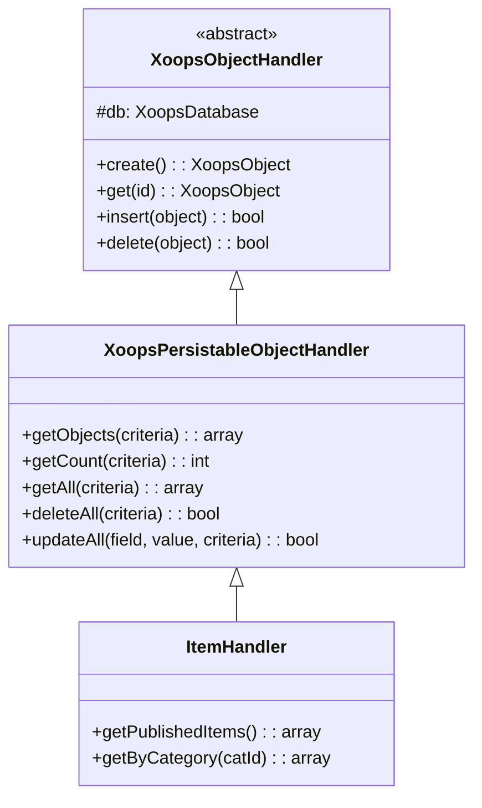
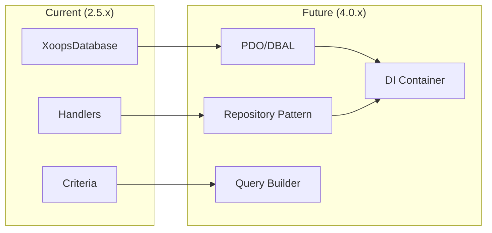

# ADR-002: انتزاع پایگاه داده

> ثبت تصمیم معماری برای الگوی دسترسی به پایگاه داده شی گرا XOOPS.

---

## وضعیت

**پذیرفته شده** - الگوی اصلی از XOOPS 2.0

---

## زمینه

XOOPS به یک استراتژی تعامل با پایگاه داده نیاز داشت که:

1. سینتکس SQL مخصوص پایگاه داده را انتزاع کنید
2. عملیات CRUD منسجم را در همه ماژول ها ارائه دهید
3. پاکسازی و فرار خودکار داده ها را فعال کنید
4. پشتیبانی از تغییرات موتور پایگاه داده آینده
5. عملیات مشترک را برای توسعه دهندگان ساده کنید

جایگزین ها عبارت بودند از:
- SQL خام در سراسر پایگاه کد
- ORM کامل (دکترین، فصیح)
- انتزاع سبک وزن سفارشی

---

## نمودار تصمیم گیری



---

## تصمیم

ما یک **Handler Pattern** را با موارد زیر پیاده سازی خواهیم کرد:

### 1. XoopsObject - ظرف داده

هر موجودیت داده XoopsObject را گسترش می دهد:

```php
class Item extends XoopsObject
{
    public function __construct()
    {
        $this->initVar('id', XOBJ_DTYPE_INT, null, false);
        $this->initVar('title', XOBJ_DTYPE_TXTBOX, '', true, 255);
        $this->initVar('content', XOBJ_DTYPE_TXTAREA, '', false);
        $this->initVar('status', XOBJ_DTYPE_INT, 0, false);
    }
}
```

### 2. Handler - Operations Manager

هر شی دارای یک کنترل کننده مربوطه است:

```php
class ItemHandler extends XoopsPersistableObjectHandler
{
    public function __construct($db)
    {
        parent::__construct($db, 'mymodule_items', Item::class, 'id', 'title');
    }

    // CRUD methods inherited:
    // - create(), get(), insert(), delete()
    // - getObjects(), getCount(), getAll()
}
```

### 3. معیارها - Query Builder

شرایط پرس و جو شی گرا:

```php
$criteria = new CriteriaCompo();
$criteria->add(new Criteria('status', 1));
$criteria->add(new Criteria('created', time() - 86400, '>='));
$criteria->setSort('created');
$criteria->setOrder('DESC');
$criteria->setLimit(10);

$items = $handler->getObjects($criteria);
```

---

## ثابت نوع داده

```php
// Variable types with automatic sanitization
XOBJ_DTYPE_INT       // Integer
XOBJ_DTYPE_TXTBOX    // Single-line text (escaped)
XOBJ_DTYPE_TXTAREA   // Multi-line text (escaped)
XOBJ_DTYPE_EMAIL     // Email validation
XOBJ_DTYPE_URL       // URL validation
XOBJ_DTYPE_ARRAY     // Serialized array
XOBJ_DTYPE_OTHER     // No processing
XOBJ_DTYPE_FLOAT     // Floating point
```

---

## وراثت Handler



---

## عواقب

### مثبت

1. **ثبات **: همه ماژول ها از الگوهای یکسانی استفاده می کنند
2. **امنیت**: فرار خودکار از تزریق SQL جلوگیری می کند
3. **سادگی**: عملیات رایج به حداقل کد نیاز دارد
4. **قابلیت نگهداری**: تغییرات در لایه پایگاه داده بر ماژول ها تأثیر نمی گذارد
5. **آزمایش پذیری**: کنترل کننده ها را می توان برای آزمایش مورد تمسخر قرار داد

### منفی

1. ** عملکرد **: سربار انتزاع اضافی
2. **پیچیدگی**: منحنی یادگیری برای توسعه دهندگان جدید
3. **محدودیت ها**: پرس و جوهای پیچیده ممکن است به SQL خام نیاز داشته باشند
4. ** مشکل N+1 **: بدون بارگیری مشتاق داخلی

### کاهش

- ** عملکرد **: اشیایی که اغلب به آنها دسترسی دارند را در حافظه پنهان ذخیره کنید
- **پرس و جوهای پیچیده**: در صورت نیاز به SQL خام اجازه دهید
- **N+1**: از getAll() با معیارهای مناسب استفاده کنید

---

## تکامل به XOOPS 4.0



برنامه های XOOPS 4.0:
- دکترین DBAL برای انتزاع پایگاه داده
- الگوی مخزن جایگزین کنترلرها
- سازنده پرس و جو برای پرس و جوهای پیچیده
- یکپارچه سازی کامل کانتینر PSR-11

---

## نمونه کد

### CRUD پایه

```php
$helper = Helper::getInstance();
$handler = $helper->getHandler('Item');

// Create
$item = $handler->create();
$item->setVar('title', 'New Item');
$handler->insert($item);

// Read
$item = $handler->get($id);
$title = $item->getVar('title');

// Update
$item->setVar('title', 'Updated Title');
$handler->insert($item);

// Delete
$handler->delete($item);
```

### پرس و جو پیچیده

```php
$criteria = new CriteriaCompo();
$criteria->add(new Criteria('status', 'published'));
$criteria->add(new Criteria('category_id', '(1,2,3)', 'IN'));
$criteria->add(new Criteria('created', strtotime('-30 days'), '>='));
$criteria->setSort('views');
$criteria->setOrder('DESC');
$criteria->setLimit(10);
$criteria->setStart(0);

$items = $handler->getObjects($criteria);
$total = $handler->getCount($criteria);
```

---

## تصمیمات مرتبط

- ADR-001: معماری مدولار
- ADR-003: Smarty Template Engine

---

## مراجع

- مارتین فاولر - الگوهای معماری کاربردی سازمانی
- مفاهیم طراحی دامنه محور
- الگوهای Active Record در مقابل Data Mapper

---

#xoops #معماری #adr #پایگاه داده #هندلر #طراحی-تصمیم