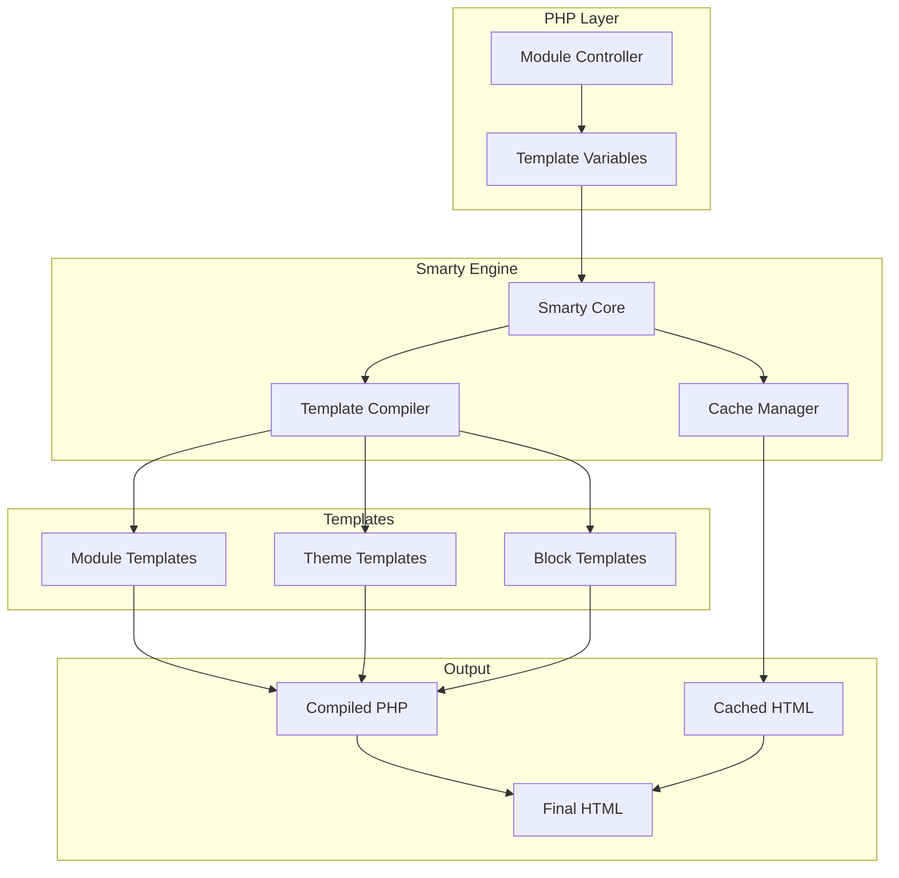
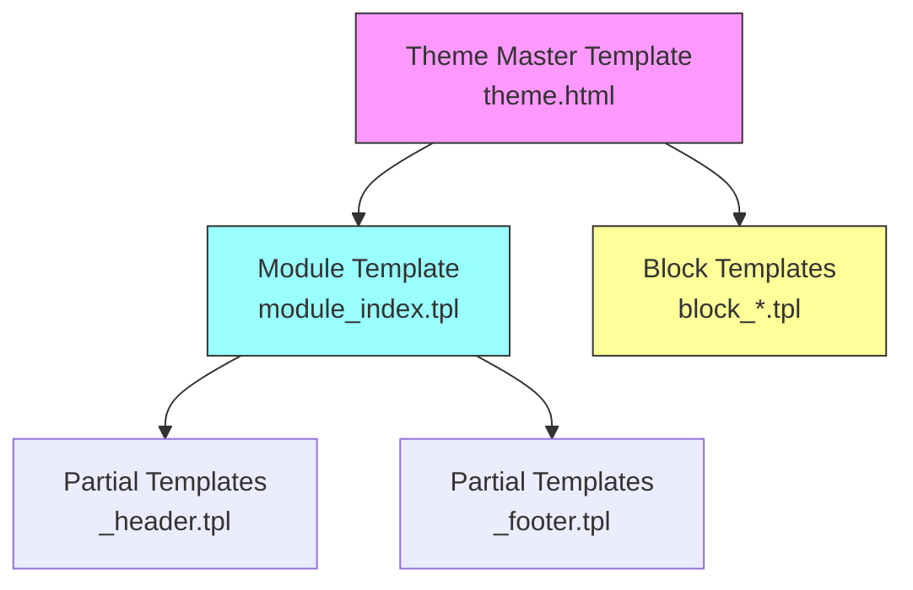
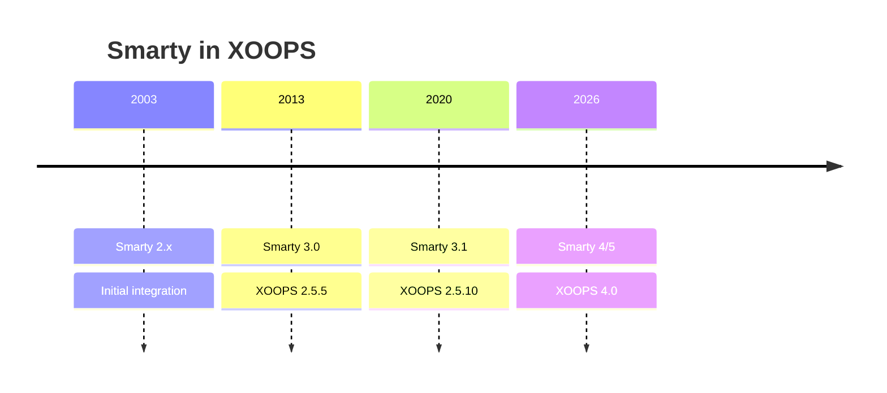

# ADR-003: موتور الگو (هوشمند)

> ثبت تصمیم در معماری برای استفاده XOOPS از موتور قالب Smarty.

---

## وضعیت

**پذیرفته** - تصمیم اصلی از XOOPS 2.0

**در حال تکامل** - مهاجرت به Smarty 4/5 برای XOOPS 4.0 برنامه ریزی شده است

---

## زمینه

XOOPS به یک راه حل قالب نیاز داشت که:

1. ارائه را از منطق تجاری جدا کنید
2. به طراحان تم اجازه دهید بدون دانش PHP کار کنند
3. پشتیبانی از وراثت قالب و شامل
4. ذخیره کش برای عملکرد فراهم کنید
5. قالب های قابل تنظیم توسط کاربر را فعال کنید
6. حمایت از بین المللی

---

## نمودار تصمیم گیری



---

## تصمیم

ما از **Smarty** به عنوان موتور الگو استفاده خواهیم کرد زیرا:

### 1. تفکیک نگرانی ها

```php
// PHP (Controller) - Business logic
$items = $itemHandler->getPublishedItems();
$xoopsTpl->assign('items', $items);

// Smarty (View) - Presentation
// templates/items.tpl
```

```smarty
{* Smarty template - No PHP logic *}
<{foreach item=item from=$items}>
    <article>
        <h2><{$item.title}></h2>
        <p><{$item.summary}></p>
    </article>
<{/foreach}>
```

### 2. XOOPS Delimiters

XOOPS از `<{` و `}>` به جای استاندارد `{` `}` استفاده می کند:

```smarty
{* Standard Smarty *}
{$variable}

{* XOOPS Smarty - Avoids JavaScript conflicts *}
<{$variable}>
```

### 3. سلسله مراتب الگو



### 4. ذخیره سازی الگو

- **پایگاه داده**: الگوهای سفارشی ذخیره شده برای قابلیت برگرداندن
- ** سیستم فایل **: قالب های اصلی در فهرست های ماژول
- ** Cache **: قالب های کامپایل شده برای عملکرد

---

## پیکربندی هوشمند

```php
// XOOPS Smarty initialization
$xoopsTpl = new XoopsTpl();

// Custom delimiters
$xoopsTpl->left_delim = '<{';
$xoopsTpl->right_delim = '}>';

// Caching
$xoopsTpl->caching = XOOPS_TEMPLATE_CACHE;
$xoopsTpl->cache_lifetime = 3600;

// Security
$xoopsTpl->security_policy = new Smarty_Security($xoopsTpl);
$xoopsTpl->security_policy->php_functions = [];
$xoopsTpl->security_policy->php_modifiers = ['escape', 'count'];
```

---

## از ویژگی های قالب استفاده شده است

### متغیرها

```smarty
{* Simple variable *}
<{$title}>

{* Object property *}
<{$item.title}>

{* With modifier *}
<{$content|truncate:200:'...'}>

{* Escaped output *}
<{$userInput|escape:'html'}>
```

### ساختارهای کنترلی

```smarty
{* Conditional *}
<{if $isAdmin}>
    <a href="admin.php">Admin</a>
<{elseif $isUser}>
    <a href="profile.php">Profile</a>
<{else}>
    <a href="login.php">Login</a>
<{/if}>

{* Loop *}
<{foreach item=item from=$items name=itemloop}>
    <{$smarty.foreach.itemloop.index}>: <{$item.title}>
<{/foreach}>
```

### شامل

```smarty
{* Include another template *}
<{include file="db:mymodule_header.tpl"}>

{* Include with variables *}
<{include file="db:mymodule_item.tpl" item=$currentItem}>

{* Include from theme *}
<{include file="file:$theme_path/partials/sidebar.tpl"}>
```

---

## عواقب

### مثبت

1. **طراح پسند**: نحوی شبیه HTML
2. **Caching**: ذخیره سازی قالب داخلی
3. **امنیت**: جداسازی کد PHP
4. **انعطاف **: اصلاح کننده ها، توابع، پلاگین ها
5. ** سفارشی سازی **: کاربران می توانند قالب ها را تغییر دهند
6. **جامعه**: اکوسیستم اسمارتی بزرگ

### منفی

1. ** منحنی یادگیری **: نحو خاص هوشمند
2. **سربار **: مرحله تدوین مورد نیاز است
3. **اشکال زدایی**: خطاهای الگو می توانند مرموز باشند
4. **مشکلات نسخه **: شکستن تغییرات بین نسخه ها

### کاهش

- **یادگیری**: مستندات جامع
- **عملکرد**: ذخیره سازی تهاجمی
- **اشکال زدایی**: کنسول اشکال زدایی، پیام های خطا را پاک کنید
- **نسخه**: لایه سازگاری در XOOPS

---

## تاریخچه نسخه



---

## مهاجرت: Smarty 3 به 4/5

### شکستن تغییرات

```smarty
{* Smarty 3 - Deprecated *}
<{php}>echo date('Y');<{/php}>

{* Smarty 4+ - Use modifiers or assign from PHP *}
<{$current_year}>

{* Smarty 3 - {section} deprecated *}
<{section name=i loop=$items}>
    <{$items[i].title}>
<{/section}>

{* Smarty 4+ - Use {foreach} *}
<{foreach $items as $item}>
    <{$item.title}>
<{/foreach}>
```

### لایه سازگاری

XOOPS یک لایه سازگاری برای انتقال صاف فراهم می کند:

```php
// XoopsTpl extends Smarty with compatibility methods
class XoopsTpl extends Smarty
{
    public function assign($tpl_var, $value = null)
    {
        // Handles both Smarty 3 and 4 syntax
        return parent::assign($tpl_var, $value);
    }
}
```

---

## جایگزین در نظر گرفته شده است

### 1. شاخه
**مزایا**: اکوسیستم مدرن، Symfony
** معایب **: نحو مختلف، تلاش مهاجرت
**تصمیم**: گزینه احتمالی آینده برای XOOPS 3.x

### 2. بلید (لاراول)
** مزایا **: نحو تمیز، محبوب
** معایب **: مخصوص لاراول
**تصمیم**: برای استفاده مستقل مناسب نیست

### 3. قالب های بومی PHP
** مزایا **: بدون منحنی یادگیری، سریع
** معایب **: خطرات امنیتی، بدون جدایی
**تصمیم**: به دلیل قابلیت نگهداری رد شد

---

## تصمیمات مرتبط

- ADR-001: معماری مدولار
- ADR-002: Database Abstraction

---

## مراجع

- مستندات هوشمند: https://www.smarty.net/docs/en/
- راهنمای سیستم قالب XOOPS
- الگوی MVC در برنامه های کاربردی وب

---

#xoops #معماری #adr #هوشمند #قالب #طراحی-تصمیم