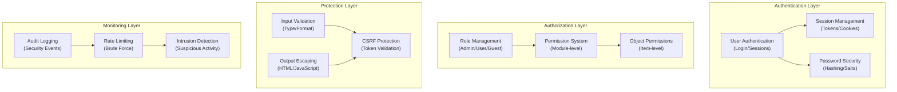

# ADR-004: معماری سیستم امنیتی

> معماری جامع امنیتی برای XOOPS CMS که در برابر تهدیدات مدرن محافظت می کند.

---

## وضعیت

**پذیرفته شده** - لایه امنیتی اصلی از XOOPS 2.5

---

## زمینه

### بیان مشکل

XOOPS به یک سیستم امنیتی قوی نیاز دارد که:

1. **محافظت در برابر آسیب پذیری های رایج وب ** (OWASP Top 10)
2. **کنترل مجوز گرانول** را در سراسر ماژول ها ارائه می دهد
3. ** احراز هویت ایمن کاربر** را با استانداردهای مدرن فعال می کند
4. **جلوگیری از نقض اطلاعات ** و دسترسی غیرمجاز
5. **پشتیبانی از کنترل دسترسی چند سطحی** (ادمین، مدیر، کاربر، مهمان)
6. ** با همه ماژول ها ** یکپارچه ادغام می شود

### تهدیدهای فعلی

حملات وب مدرن عبارتند از:

- ** تزریق SQL ** - SQL مخرب در ورودی کاربر
- **XSS (Scros-Site Scripting)** - جاوا اسکریپت تزریق شده در صفحات
- **CSRF (جعل درخواست بین سایتی)** - ارسال فرم های غیرمجاز
- ** دور زدن احراز هویت ** - مدیریت ضعیف session/password
- ** دور زدن مجوز ** - افزایش امتیاز
- ** قرار گرفتن در معرض داده ها ** - داده های حساس در URL ها، گزارش ها، یا حافظه پنهان

### الزامات امنیتی XOOPS

1. احراز هویت کاربر و مدیریت جلسه
2. کنترل دسترسی مبتنی بر نقش (RBAC)
3. سیستم مجوز برای ماژول ها و اشیاء
4. اعتبار سنجی ورودی و خروجی فرار
5. محافظت در برابر حملات رایج
6. ثبت حسابرسی رویدادهای امنیتی
7. مدیریت رمز عبور ایمن
8. حفاظت توکن CSRF

---

## تصمیم

### معماری اصلی امنیت



---

## اجزای امنیتی

### 1. سیستم احراز هویت

**فرآیند ورود کاربر:**

```php
<?php
// 1. Validate credentials
$user = $userHandler->findByLogin($username);
if (!$user || !password_verify($password, $user->getVar('pass'))) {
    throw new AuthenticationException('Invalid credentials');
}

// 2. Check if account is active
if (!$user->getVar('uactive')) {
    throw new AuthenticationException('Account inactive');
}

// 3. Create secure session
session_regenerate_id(true);
$_SESSION['uid'] = $user->getVar('uid');
$_SESSION['token'] = bin2hex(random_bytes(32));
$_SESSION['created'] = time();

// 4. Log the login
$this->auditLog('USER_LOGIN', $user->getVar('uid'));
```

**امنیت رمز عبور:**

```php
<?php
// Use password_hash (not MD5 or SHA1)
$hashed = password_hash($password, PASSWORD_BCRYPT, [
    'cost' => 12, // High cost = slow brute force
]);

// Verify password
if (!password_verify($inputPassword, $hashed)) {
    throw new Exception('Invalid password');
}

// Rehash if algorithm or cost changed
if (password_needs_rehash($hashed, PASSWORD_BCRYPT, ['cost' => 12])) {
    $newHash = password_hash($password, PASSWORD_BCRYPT, ['cost' => 12]);
    $user->setVar('pass', $newHash);
    $userHandler->insert($user);
}
```

### 2. مدیریت جلسه

**اجرای جلسه ایمن:**

```php
<?php
// Session configuration
ini_set('session.cookie_httponly', true);  // No JS access
ini_set('session.cookie_secure', true);     // HTTPS only
ini_set('session.cookie_samesite', 'Strict'); // CSRF protection
ini_set('session.gc_maxlifetime', 3600);   // 1 hour timeout
ini_set('session.sid_length', 64);         // 64-char session ID

// Validate session
function validateSession() {
    // Check timeout
    if (time() - $_SESSION['created'] > 3600) {
        session_destroy();
        throw new SessionExpiredException();
    }

    // Validate user agent (prevent session hijacking)
    if ($_SESSION['user_agent'] !== $_SERVER['HTTP_USER_AGENT']) {
        throw new SessionInvalidException();
    }

    // Validate IP (optional, can be too strict)
    if (!in_array($_SERVER['REMOTE_ADDR'], $_SESSION['ips'])) {
        $_SESSION['ips'][] = $_SERVER['REMOTE_ADDR'];
    }
}
```

### 3. مجوز (RBAC)

**کنترل دسترسی مبتنی بر نقش:**

```php
<?php
class XoopsUser {
    public function hasPermission(string $permissionName): bool
    {
        // Get user groups
        $groups = $this->getGroups();

        // Check if any group has permission
        foreach ($groups as $groupId) {
            if ($this->checkGroupPermission($groupId, $permissionName)) {
                return true;
            }
        }

        return false;
    }

    /**
     * User groups and their permissions
     * Admin: Full access
     * Moderator: Content management
     * User: Create own content
     * Guest: Read-only access
     */
    private function checkGroupPermission(int $groupId, string $permission): bool
    {
        $permissions = [
            1 => ['admin_access'],                 // Admin group
            2 => ['moderate_content', 'edit_own'], // Moderator group
            3 => ['create_content', 'edit_own'],   // User group
            4 => [],                               // Guest group (no permissions)
        ];

        return in_array($permission, $permissions[$groupId] ?? []);
    }
}
```

### 4. اعتبارسنجی ورودی

**جلوگیری از تزریق SQL و خطاهای نوع:**

```php
<?php
// Always use prepared statements
$sql = 'SELECT * FROM users WHERE id = ?';
$result = $db->query($sql, [$userId]); // ✅ Safe

// Input validation
function validateUserInput(array $data): array
{
    return [
        'email' => filter_var($data['email'] ?? '', FILTER_VALIDATE_EMAIL),
        'age' => filter_var($data['age'] ?? 0, FILTER_VALIDATE_INT),
        'website' => filter_var($data['website'] ?? '', FILTER_VALIDATE_URL),
        'title' => substr(trim($data['title'] ?? ''), 0, 255),
    ];
}

// XOOPS Safe Input class
$safe = \XMF\Request::getHtmlRequest('var_name', '');
$int = \XMF\Request::getInt('page', 1);
```

### 5. خروجی فرار

**جلوگیری از حملات XSS:**

```php
<?php
// In PHP templates
echo htmlspecialchars($userInput, ENT_QUOTES, 'UTF-8');

// In Smarty templates (automatic escaping)
<{$user_input}>  {* Escaped by default *}
<{$html|escape:false}>  {* Only when needed *}

// JavaScript context
<script>
var message = "<{$userMessage|escape:'javascript'}>";
</script>

// URL context
<a href="<{$url|escape:'url'}>">Link</a>
```

### 6. حفاظت CSRF

**جلوگیری از جعل درخواست در سایت:**

```php
<?php
// Generate CSRF token
session_start();
if (empty($_SESSION['csrf_token'])) {
    $_SESSION['csrf_token'] = bin2hex(random_bytes(32));
}

// In forms
<form method="POST">
    <input type="hidden" name="csrf_token" value="<{$csrf_token}>">
    <button type="submit">Submit</button>
</form>

// Validate token
if ($_SERVER['REQUEST_METHOD'] === 'POST') {
    if (hash_equals($_SESSION['csrf_token'], $_POST['csrf_token'] ?? '')) {
        // Process form
    } else {
        throw new InvalidTokenException('CSRF token invalid');
    }
}
```

---

## عواقب

### اثرات مثبت

1. **حفاظت جامع** - کلاس های آسیب پذیری عمده را پوشش می دهد
2. ** امنیت لایه ای ** - چندین لایه دفاعی
3. ** RBAC انعطاف پذیر ** - کنترل مجوز ریز دانه
4. ** مسیر حسابرسی ** - رویدادهای امنیتی را ردیابی کنید
5. **استاندارد صنعت** - با توصیه های OWASP مطابقت دارد
6. **ادغام ماژول** - آسان برای ماژول ها برای استفاده از API های امنیتی

### اثرات منفی

1. **پیچیدگی** - کد و پیکربندی بیشتر مورد نیاز است
2. **عملکرد** - هش و اعتبار سنجی سربار را اضافه می کند
3. ** تجربه کاربر ** - امنیت گاهی اوقات ناخوشایند است
4. **نگهداری** - به به روز رسانی های امنیتی مداوم نیاز دارد
5. **آموزش مورد نیاز ** - توسعه دهندگان باید از شیوه ها پیروی کنند

### خطرات و کاهش

| ریسک | شدت | کاهش |
|------|----------|-----------|
| توسعه دهنده امنیت را نادیده می گیرد | بالا | بررسی کد، آموزش امنیتی |
| آسیب پذیری های جدید کشف شد | متوسط ​​| ممیزی های امنیتی منظم، به روز رسانی |
| تاثیر عملکرد | کم | بهینه سازی مسیرهای داغ، کش |
| مجوزهای بیش از حد پیچیده | متوسط ​​| پاک کردن مستندات، نمونه ها |

---

## بهترین شیوه های امنیتی

### برای توسعه دهندگان ماژول

```php
<?php
// ✅ DO: Use prepared statements
$result = $db->prepare('SELECT * FROM table WHERE id = ?')->execute([$id]);

// ❌ DON'T: Concatenate queries
$result = $db->query("SELECT * FROM table WHERE id = $id");

// ✅ DO: Escape output
echo htmlspecialchars($user_input, ENT_QUOTES, 'UTF-8');

// ❌ DON'T: Output raw user data
echo $user_input;

// ✅ DO: Check permissions
if (!$user->hasPermission('edit_content')) {
    throw new PermissionException();
}

// ❌ DON'T: Trust user roles directly
if ($_POST['is_admin']) {
    // Make user admin - SECURITY HOLE!
}

// ✅ DO: Validate input types
$page = (int)$_GET['page'];

// ❌ DON'T: Use untrusted values directly
$sql .= " LIMIT " . $_GET['limit'];
```

---

## جایگزین در نظر گرفته شده است

### OAuth/OpenID اتصال

**چرا در ابتدا انتخاب نشد:** برای محیط میزبانی مشترک بسیار پیچیده است، اما برای ادغام آینده با سیستم های احراز هویت خارجی خوب است.

### احراز هویت دو مرحله ای (2FA)

**وضعیت:** به عنوان افزونه پذیرفته شده است، نه نیاز اصلی، به ADR-006 مراجعه کنید

### کوکی‌های جلسه فقط با HTTP

**وضعیت:** پیاده سازی شده - از دسترسی جاوا اسکریپت به داده های جلسه جلوگیری می کند

---

## تصمیمات مرتبط

- ADR-001: معماری مدولار - ماژول ها امنیت را پیاده سازی می کنند
- ADR-005: سیستم مجوز ماژول
- ADR-006: احراز هویت دو مرحله ای (آینده)

---

## مراجع

### استانداردهای امنیتی- [OWASP Top 10](https://owasp.org/www-project-top-ten/)
- [چارچوب امنیت سایبری NIST](https://www.nist.gov/cyberframework)
- [CWE Top 25](https://cwe.mitre.org/top25/)

### امنیت PHP

- [راهنمای امنیتی PHP](https://www.php.net/manual/en/security.php)
- اسناد [password_hash()](https://www.php.net/manual/en/function.password-hash.php)
- [امنیت جلسه](https://www.php.net/manual/en/session.security.php)

### ابزار

- [OWASP ZAP](https://www.zaproxy.org/) - تست امنیتی
- [Snyk](https://snyk.io/) - اسکن آسیب‌پذیری
- [SonarQube](https://www.sonarqube.org/) - کیفیت کد

---

## چک لیست پیاده سازی

- [ ] سیستم احراز هویت کاربر
- [ ] مدیریت جلسات
- [ ] هش رمز عبور (bcrypt)
- [ ] کنترل دسترسی مبتنی بر نقش
- [ ] مجوزهای ماژول
- [ ] چارچوب اعتبار سنجی ورودی
- [ ] خروجی فرار (PHP + Smarty)
- [ ] حفاظت توکن CSRF
- [ ] ثبت حسابرسی امنیتی
- [ ] محدود کردن نرخ
- [ ] سرصفحه های امنیتی

---

## تاریخچه نسخه

| نسخه | تاریخ | تغییرات |
|---------|------|---------|
| 1.0.0 | 2024-01-28 | سند اولیه |

---

#xoops #adr #امنیت #معماری #احراز هویت #مجوز #rbac