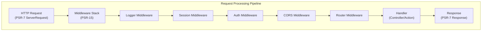

# ADR-005: الگوی میان افزار PSR-15 برای XOOPS 4.0

> برای بهبود خط لوله پردازش درخواست، کنترل‌کننده‌های درخواست سرور HTTP PSR-15 (Middleware) را بپذیرید.

:::caution[پیشنهاد XOOPS 4.0 — در نسخه 2.5.x موجود نیست]
این ADR یک **معماری پیشنهادی برای XOOPS 4.0** را توصیف می کند. میان افزار PSR-15 **در XOOPS 2.5.x** موجود نیست. ماژول های فعلی 2.5.x از الگوی کنترل کننده صفحه با بوت استرپ `mainfile.php` استفاده می کنند. برای چرخه عمر درخواست فعلی به معماری XOOPS مراجعه کنید.
:::

---

## وضعیت

**پیشنهادی** - در حال ارزیابی برای انتشار XOOPS 4.0

---

## زمینه

### رویکرد فعلی

XOOPS 2.5 از یک رویکرد رسیدگی به درخواست یکپارچه استفاده می کند:

```php
// Current: Sequential processing
require_once 'mainfile.php';
// → Kernel initialization
// → User authentication
// → Module loading
// → Page rendering

// All in one flow, mixed concerns
```

### مشکلات با رویکرد فعلی

1. **نگرانی های مختلط ** - احراز هویت، ورود به سیستم، مسیریابی همه در هم تنیده شده اند
2. **آزمایش دشوار** - آزمایش واحد مراحل پردازش درخواست فردی دشوار است
3. **بسط دادن سخت است** - ماژول ها فقط می توانند از طریق preload/events قلاب شوند
4. ** جداسازی ضعیف ** - منطق پردازش درخواست پراکنده در پایگاه کد
5. **غیر قابل ترکیب** - به راحتی نمی توان مراحل پردازش را زنجیره ای کرد یا دوباره ترتیب داد

### PSR-15 Middleware چیست؟

PSR-15 یک رابط استاندارد برای میان افزار HTTP تعریف می کند:

```php
<?php
interface RequestHandlerInterface {
    public function handle(ServerRequestInterface $request): ResponseInterface;
}

interface MiddlewareInterface {
    public function process(
        ServerRequestInterface $request,
        RequestHandlerInterface $handler
    ): ResponseInterface;
}
```

** زنجیره میان افزار:**

```
Request
  ↓
[Logger] → logs request
  ↓
[Auth] → validates user session
  ↓
[CORS] → checks cross-origin
  ↓
[Router] → dispatches to handler
  ↓
[Handler] → generates response
  ↓
Response
```

---

## تصمیم

### پشته میان‌افزار PSR-15 را برای XOOPS 4.0 بپذیرید

یک خط لوله پردازش درخواست مبتنی بر میان افزار را طبق استاندارد PSR-15 پیاده سازی کنید.

### مروری بر معماری



### اجزای میان افزار اصلی

#### 1. میان افزار کاربردی (لایه اصلی)

```php
<?php
declare(strict_types=1);

namespace XoopsCore;

use Psr\Http\Message\ResponseInterface;
use Psr\Http\Message\ServerRequestInterface;
use Psr\Http\Server\MiddlewareInterface;
use Psr\Http\Server\RequestHandlerInterface;

class SessionMiddleware implements MiddlewareInterface
{
    public function process(
        ServerRequestInterface $request,
        RequestHandlerInterface $handler
    ): ResponseInterface {
        // 1. Retrieve session (or start new)
        $sessionId = $request->getCookieParams()['PHPSESSID'] ?? null;
        $session = $this->sessionManager->load($sessionId);

        // 2. Attach session to request
        $request = $request->withAttribute('session', $session);

        // 3. Pass to next middleware
        $response = $handler->handle($request);

        // 4. Set session cookie if needed
        if ($session->isModified()) {
            $response = $response->withAddedHeader(
                'Set-Cookie',
                'PHPSESSID=' . $session->getId() . '; HttpOnly; SameSite=Strict'
            );
        }

        return $response;
    }
}
```

#### 2. میان افزار احراز هویت

```php
<?php
class AuthMiddleware implements MiddlewareInterface
{
    public function process(
        ServerRequestInterface $request,
        RequestHandlerInterface $handler
    ): ResponseInterface {
        // Get session from previous middleware
        $session = $request->getAttribute('session');

        // Authenticate user from session
        $user = $this->authenticate($session);

        // Attach user to request
        $request = $request->withAttribute('user', $user);

        return $handler->handle($request);
    }

    private function authenticate(?Session $session): User
    {
        if ($session && $session->has('uid')) {
            return $this->userRepository->findById($session->get('uid'));
        }

        return new AnonymousUser();
    }
}
```

#### 3. مجوز میان افزار

```php
<?php
class AuthorizationMiddleware implements MiddlewareInterface
{
    public function __construct(private AuthorizationChecker $checker)
    {
    }

    public function process(
        ServerRequestInterface $request,
        RequestHandlerInterface $handler
    ): ResponseInterface {
        $user = $request->getAttribute('user');
        $route = $request->getAttribute('route');

        // Check if user has permission for this route
        if (!$this->checker->isGranted($user, $route)) {
            return new JsonResponse(
                ['error' => 'Unauthorized'],
                403
            );
        }

        return $handler->handle($request);
    }
}
```

#### 4. میان افزار ماژول

```php
<?php
// Modules can provide their own middleware
class PublisherAccessMiddleware implements MiddlewareInterface
{
    public function process(
        ServerRequestInterface $request,
        RequestHandlerInterface $handler
    ): ResponseInterface {
        $user = $request->getAttribute('user');

        // Module-specific access control
        if (!$user->hasPermission('publisher_view')) {
            return new HtmlResponse('Access denied', 403);
        }

        return $handler->handle($request);
    }
}
```

### مثال پیاده سازی

```php
<?php
// bootstrap.php - Application setup

use Psr\Http\Message\ServerRequestInterface;
use Psr\Http\Server\RequestHandlerInterface;
use XOOPS\Core\Middleware\{
    LoggerMiddleware,
    SessionMiddleware,
    AuthMiddleware,
    CorsMiddleware,
    ErrorHandlingMiddleware
};

// Create middleware pipeline
$middlewareStack = [
    // 1. Error handling (outermost)
    new ErrorHandlingMiddleware(),

    // 2. Logging
    new LoggerMiddleware($logger),

    // 3. CORS handling
    new CorsMiddleware($corsConfig),

    // 4. Session management
    new SessionMiddleware($sessionManager),

    // 5. Authentication
    new AuthMiddleware($userRepository),

    // 6. Authorization
    new AuthorizationMiddleware($authChecker),

    // 7. Routing and dispatching
    new RoutingMiddleware($router),

    // 8. Module middleware (dynamic)
    ...$this->loadModuleMiddleware(),
];

// Process request through middleware stack
$request = ServerRequestFactory::fromGlobals();
$dispatcher = new MiddlewareDispatcher($middlewareStack);
$response = $dispatcher->dispatch($request);

// Send response
http_response_code($response->getStatusCode());
foreach ($response->getHeaders() as $name => $values) {
    foreach ($values as $value) {
        header("$name: $value", false);
    }
}
echo $response->getBody();
```

### یکپارچه سازی ماژول

ماژول ها می توانند میان افزار ارائه دهند:

```php
<?php
// Publisher module - xoops_version.php

$modversion['middleware'] = [
    'PublisherAccessMiddleware' => true,      // Auto-load
    'PublisherLogMiddleware' => true,
];

// Or custom:
$modversion['middleware_factory'] = function() {
    return [
        new PublisherCacheMiddleware(),
        new PublisherPermissionMiddleware(),
    ];
};
```

---

## عواقب

### اثرات مثبت

1. ** جداسازی نگرانی ها ** - هر میان افزار یک مسئولیت را بر عهده دارد
2. **تست پذیری** - آسان برای تست واحد اجزای میان افزار فردی
3. **ترکیب پذیری** - میان افزار را می توان مخلوط کرد و مرتب کرد
4. **سازگار با استانداردها** - از استانداردهای PSR-15 و PSR-7 استفاده می کند
5. **توسعه پذیری** - ماژول ها می توانند به راحتی میان افزار سفارشی اضافه کنند
6. **اشکال زدایی** - جریان درخواست را از طریق خط لوله پاک کنید
7. ** عملکرد ** - می تواند لایه های میان افزار خاص را بهینه کند
8. ** قابلیت همکاری ** - می تواند از میان افزار PSR-15 شخص ثالث استفاده کند

### اثرات منفی

1. **منحنی یادگیری** - توسعه دهندگان باید PSR-15 را درک کنند
2. **سربار عملکرد ** - فراخوانی بیشتر تابع در خط لوله
3. **پیچیدگی** - قطعات متحرک بیشتر از رویکرد یکپارچه
4. ** کوشش مهاجرت ** - نیاز به بازسازی کد موجود دارد
5. **وابستگی** - به کتابخانه HTTP PSR-7 نیاز دارد

### خطرات و کاهش

| ریسک | شدت | کاهش |
|------|----------|-----------|
| زنجیره های میان افزار پیچیده | متوسط ​​| پاک کردن مستندات، نمونه ها |
| کاهش عملکرد | متوسط ​​| معیار، بهینه سازی مسیرهای داغ |
| سوء استفاده از برنامه نویس | متوسط ​​| بررسی کد، راهنمای بهترین شیوه ها |
| تغییرات شکست مهاجرت | بالا | دوران استهلاک، مددکاران |
| مسائل مربوط به سفارش میان افزار | متوسط ​​| پاک کردن نمودار وابستگی |

---

## طرح اجرا

### فاز 1: پایه (Q2 2026)

- [ ] پیاده سازی بسته بندی پیام HTTP PSR-7
- [ ] ایجاد MiddlewareDispatcher
- [ ] پیاده سازی میان افزار اصلی (جلسه، احراز هویت)
- [ ] برای استفاده از میان افزار، هسته را به روز کنید

### فاز 2: یکپارچه سازی (Q3 2026)

- [ ] انتقال عملکرد موجود به میان افزار
- [ ] پشتیبانی میان افزار ماژول را اضافه کنید
- [ ] ابزارهای آزمایشی میان افزار را ایجاد کنید
- [ ] مستندات جامع بنویسید

### فاز 3: مهاجرت (Q4 2026)

- [ ] ارائه لایه سازگاری برای کدهای قدیمی
- [ ] به روز رسانی ماژول های راهنما به میان افزار جدید
- [ ] بهینه سازی عملکرد
- [ ] ممیزی امنیتی

### فاز 4: انتشار (Q1 2027)- [ ] XOOPS 4.0 با میان افزار منتشر شد
- [ ] سیستم قدیمی preload/hook را منسوخ کنید
- [ ] بازخورد و به روز رسانی انجمن

---

## معیارهای موفقیت

- [ ] همه عملکردهای اصلی به میان افزار منتقل شدند
- [ ] 90٪ + پوشش تست برای میان افزار
- [ ] مستندات کامل با مثال
- [ ] عملکرد در 10٪ از نسخه قبلی
- [ ] ماژول ها با موفقیت از سیستم میان افزار جدید استفاده می کنند
- [ ] نرخ پذیرش جامعه > 80٪

---

## بهترین شیوه های میان افزار

### انجام دهید

- متمرکز نگه داشتن میان افزار (تک مسئولیت)
- از تغییر ناپذیری استفاده کنید (request/response جدید ایجاد کنید)
- با ظرافت به خطاها رسیدگی کنید
- وابستگی های سند
- اضافه کردن نکات نوع
- تست های میان افزار بنویسید
- از رابط های استاندارد PSR-15 استفاده کنید

### نکن

- اشیاء مشترک request/response را تغییر ندهید
- مستقیماً به جهانی ها دسترسی نداشته باشید
- به ترتیب میان افزارها وابستگی ایجاد نکنید
- همه استثناها را نگیرید
- منطق کسب و کار را با میان افزار مخلوط نکنید
- ابزارهای میان‌افزار را مجبور نکنید زیاد کار کنند

---

## مثالها

### میان افزار سفارشی

```php
<?php
// Example: Rate limiting middleware

use Psr\Http\Message\ResponseInterface;
use Psr\Http\Message\ServerRequestInterface;
use Psr\Http\Server\MiddlewareInterface;
use Psr\Http\Server\RequestHandlerInterface;

class RateLimitMiddleware implements MiddlewareInterface
{
    public function __construct(
        private RateLimiter $limiter,
        private int $limit = 100,
        private int $window = 3600
    ) {
    }

    public function process(
        ServerRequestInterface $request,
        RequestHandlerInterface $handler
    ): ResponseInterface {
        $user = $request->getAttribute('user');
        $identifier = $user->getId() ?? $request->getClientIp();

        // Check rate limit
        $remaining = $this->limiter->check($identifier, $this->limit, $this->window);

        if ($remaining < 0) {
            return new JsonResponse(
                ['error' => 'Rate limit exceeded'],
                429
            );
        }

        // Add rate limit headers
        $response = $handler->handle($request);
        return $response
            ->withAddedHeader('X-RateLimit-Limit', (string)$this->limit)
            ->withAddedHeader('X-RateLimit-Remaining', (string)$remaining);
    }
}
```

---

## تصمیمات مرتبط

- ADR-001: معماری مدولار - بنیاد
- ADR-004: سیستم امنیتی - از میان افزار برای احراز هویت استفاده می کند
- ADR-006: احراز هویت دو عاملی - می تواند میان افزار باشد

---

## مراجع

### استانداردهای PSR

- [PSR-7: رابط پیام HTTP](https://www.php-fig.org/psr/psr-7/)
- [PSR-15: کنترل‌کننده‌های درخواست سرور HTTP](https://www.php-fig.org/psr/psr-15/)

### چارچوب های میان افزار

- [Slim Framework](https://www.slimframework.com/) - نمونه های میان افزار
- [Zend Expressive](https://docs.zendframework.com/zend-expressive/) - چارچوب PSR-15
- [Guzzle](https://docs.guzzlephp.org/) - میان افزار مشتری HTTP

### ابزار

- [RelayPHP](https://relayphp.com/) - کتابخانه Middleware
- [PSR-15 Middleware](https://github.com/middlewares) - مجموعه ای از میان افزارها

---

## تاریخچه نسخه

| نسخه | تاریخ | تغییرات |
|---------|------|---------|
| 1.0.0 | 2024-01-28 | پیشنهاد اولیه |

---

#xoops #adr #psr-15 #middleware #architecture #psr-7