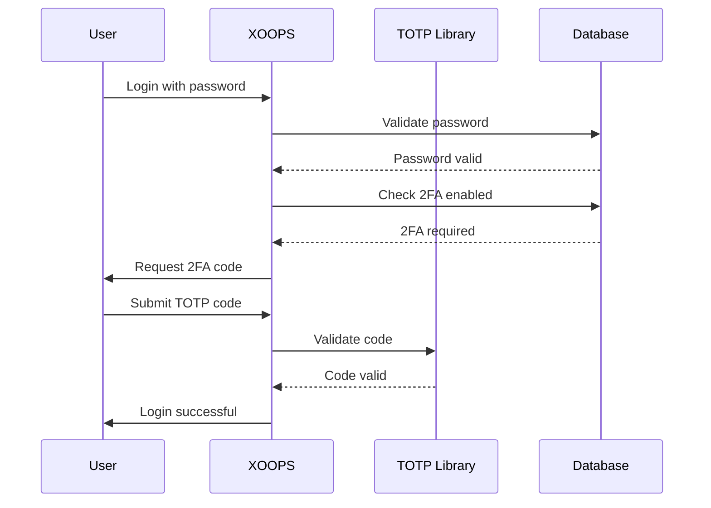

## وضعیت

پیشنهاد شده است

## زمینه

XOOPS برای احراز هویت کاربر به امنیت بیشتری نیاز دارد. احراز هویت دو مرحله ای (2FA) یک لایه امنیتی اضافی فراتر از رمزهای عبور فراهم می کند و از حساب ها حتی در صورت به خطر افتادن رمزهای عبور محافظت می کند.

ملاحظات کلیدی:
- سازگاری به عقب با احراز هویت موجود
- پشتیبانی از چندین روش 2FA
- تجربه کاربری در هنگام راه اندازی و ورود به سیستم
- مکانیسم های بازیابی دستگاه های گم شده
- ادغام با سیستم مجوز موجود

## تصمیم

ما TOTP (گذرواژه یکبار مصرف مبتنی بر زمان) را به عنوان روش اصلی 2FA با پشتیبانی از کدهای پشتیبان پیاده سازی خواهیم کرد.

### رویکرد پیاده سازی



### طرحواره پایگاه داده

```sql
CREATE TABLE `{PREFIX}_users_2fa` (
    `user_id` INT(11) NOT NULL,
    `secret` VARCHAR(32) NOT NULL,
    `enabled` TINYINT(1) DEFAULT 0,
    `backup_codes` TEXT,
    `last_used` INT(11),
    `created` INT(11) NOT NULL,
    PRIMARY KEY (`user_id`),
    FOREIGN KEY (`user_id`) REFERENCES `{PREFIX}_users`(`uid`)
);
```

### رابط سرویس

```php
interface TwoFactorAuthInterface
{
    public function enable(int $userId): TwoFactorSetup;
    public function disable(int $userId): void;
    public function verify(int $userId, string $code): bool;
    public function generateBackupCodes(int $userId): array;
    public function isEnabled(int $userId): bool;
}
```

### یکپارچه سازی میان افزار

```php
class TwoFactorMiddleware implements MiddlewareInterface
{
    public function process(
        ServerRequestInterface $request,
        RequestHandlerInterface $handler
    ): ResponseInterface {
        $session = $request->getAttribute('session');

        if ($session->has('pending_2fa_user_id')) {
            // User needs to complete 2FA
            if ($this->isVerificationRequest($request)) {
                return $handler->handle($request);
            }
            return new RedirectResponse('/2fa/verify');
        }

        return $handler->handle($request);
    }
}
```

## عواقب

### مثبت

- امنیت حساب به طور قابل توجهی بهبود یافته است
- سازگاری با استاندارد TOTP صنعت (Google Authenticator، Authy و غیره)
- کدهای پشتیبان از قفل شدن حساب جلوگیری می کنند
- اختیاری برای هر کاربر - پذیرش را مجبور نمی کند
- میان افزار PSR-15 امکان یکپارچه سازی تمیز را فراهم می کند

### منفی

- مرحله ورود اضافی بر تجربه کاربر تأثیر می گذارد
- کاربران باید برنامه های احراز هویت را مدیریت کنند
- دستگاه های گم شده نیاز به فرآیند بازیابی دارند
- ذخیره سازی پایگاه داده اضافی و نمایش داده شد
- نیاز به وابستگی به کتابخانه رمزنگاری دارد

### مسیر مهاجرت

1. جدول پایگاه داده را برای داده های 2FA اضافه کنید
2. اجرای سرویس TOTP با وابستگی به کتابخانه
3. میان افزار را به زنجیره احراز هویت اضافه کنید
4. رابط کاربری تنظیمات و تأیید را ایجاد کنید
5. گزینه Admin برای نیاز به 2FA برای گروه های خاص

## جایگزین در نظر گرفته شده است

### OTP مبتنی بر پیامک

رد شد به دلیل:
- آسیب پذیری های تعویض سیم کارت
- هزینه درگاه پیامک
- پیچیدگی تأیید شماره تلفن
- نگرانی های مربوط به حریم خصوصی

### کلیدهای امنیتی سخت افزاری (WebAuthn)

به تعویق افتاد برای ADR آینده:
- اجرای پیچیده تر
- پشتیبانی از مرورگر محدود از نظر تاریخی
- هزینه کاربر بالاتر
- می تواند بعداً در کنار TOTP اضافه شود

### OTP مبتنی بر ایمیل

رد شد به دلیل:
- سازش حساب ایمیل هدف را شکست می دهد
- تأخیر در تحویل بر UX تأثیر می گذارد
- مشکلات فیلتر اسپم

## مراجع

- [RFC 6238 - TOTP](https://tools.ietf.org/html/rfc6238)
- [فرمت کلید Google Authenticator](https://github.com/google/google-authenticator/wiki/Key-Uri-Format)
- ../../02-Core-Concepts/Security/Security-Best-Practices - دستورالعمل های امنیتی
- ../../02-Core-Concepts/Users-Permissions/Authentication - اسناد سیستم Auth