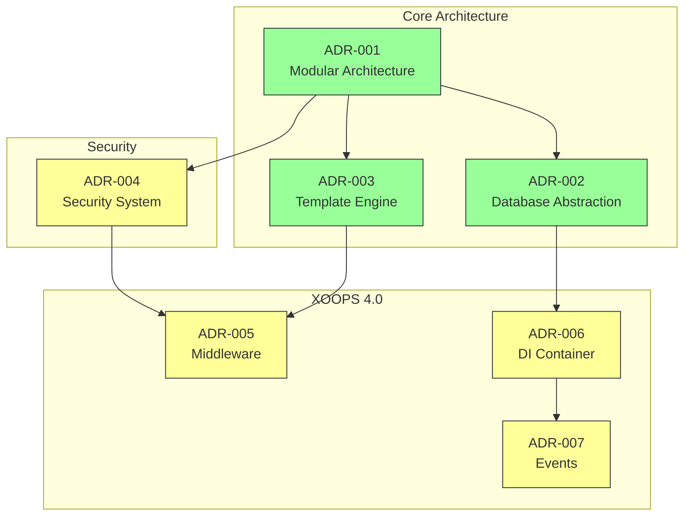
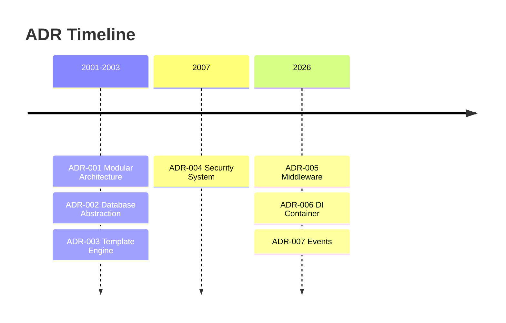

# 📋 فهرست سوابق تصمیم گیری معماری

> فهرست جامع تصمیمات معماری که XOOPS CMS را شکل داد.

---

## ADR ها چیست؟

سوابق تصمیم گیری معماری (ADRs) تصمیمات معماری مهمی را که در طول توسعه XOOPS گرفته شده است را مستند می کند. آنها زمینه، تصمیم و پیامدهای هر انتخاب را در بر می گیرند و زمینه تاریخی ارزشمندی را برای نگهبانان و مشارکت کنندگان فراهم می کنند.

---

## افسانه وضعیت ADR

| وضعیت | معنی |
|--------|---------|
| **پیشنهاد** | در حال بحث، هنوز پذیرفته نشده |
| **پذیرفته** | تصمیم گرفته شد |
| **منسوخ شده** | دیگر توصیه نمی شود |
| **جانشین شد** | جایگزین ADR دیگر |

---

## ADR های فعلی

### تصمیمات اساسی

| ADR | عنوان | وضعیت | تاثیر |
|-----|-------|--------|--------|
| ADR-001 | معماری مدولار | پذیرفته شده | هسته |
| ADR-002 | دسترسی به پایگاه داده شی گرا | پذیرفته شده | هسته |
| ADR-003 | موتور قالب هوشمند | پذیرفته شده | هسته |

### ADR های برنامه ریزی شده (XOOPS 4.0)

| ADR | عنوان | وضعیت | تاثیر |
|-----|-------|--------|--------|
| ADR-004 | طراحی سیستم امنیتی | پیشنهادی | امنیت |
| ADR-005 | PSR-15 Middleware | پیشنهادی | معماری |
| ADR-006 | ظرف تزریق وابستگی | پیشنهادی | معماری |
| ADR-007 | طراحی مجدد سیستم رویداد | پیشنهادی | معماری |

---

## روابط ADR



---

## جدول زمانی



---

## ایجاد ADR های جدید

هنگام پیشنهاد یک تصمیم جدید معماری:

1. الگوی ADR را کپی کنید
2. تمام بخش ها را پر کنید
3. به عنوان درخواست کشش ارسال کنید
4. در مسائل GitHub بحث کنید
5. به روز رسانی وضعیت پس از تصمیم گیری

### ساختار الگوی ADR

```markdown
# ADR-XXX: Title

## Status
Proposed | Accepted | Deprecated | Superseded

## Context
What is the issue motivating this decision?

## Decision
What is the change that we're proposing?

## Consequences
What becomes easier or harder as a result?

## Alternatives Considered
What other options were evaluated?
```

---

## 🔗 مستندات مرتبط

- مفاهیم اصلی
- رهنمودهای کمکی
- نقشه راه XOOPS 4.0

---

#xoops #adr #معماری #شاخص #تصمیمات