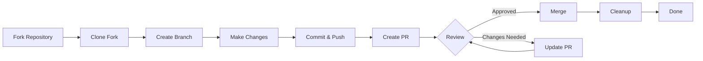

> این راهنما شما را در فرآیند کامل مشارکت در XOOPS، از راه اندازی اولیه تا درخواست کشش ادغام شده، راهنمایی می کند.

---

## پیش نیاز

قبل از شروع مشارکت، مطمئن شوید که:

- **Git** نصب و پیکربندی شد
- **حساب GitHub** (رایگان)
- **PHP 7.4+** برای توسعه XOOPS
- **آهنگساز** برای مدیریت وابستگی
- دانش اولیه از گردش کار Git
- آشنایی با قوانین رفتاری

---

## مرحله 1: مخزن را فورک کنید

### در رابط وب GitHub

1. به مخزن بروید (به عنوان مثال، `XOOPS/XoopsCore27`)
2. روی دکمه **Fork** در گوشه بالا سمت راست کلیک کنید
3. محل فورک (حساب شخصی شما) را انتخاب کنید
4. صبر کنید تا چنگال کامل شود

### چرا فورک؟

- شما نسخه خود را برای کار بر روی آن دریافت می کنید
- نگهبانان نیازی به مدیریت بسیاری از شعب ندارند
- شما کنترل کامل چنگال خود را دارید
- درخواست های کشش به چنگال شما و مخزن بالادستی اشاره دارد

---

## مرحله 2: چنگال خود را به صورت محلی کلون کنید

```bash
# Clone your fork (replace YOUR_USERNAME)
git clone https://github.com/YOUR_USERNAME/XoopsCore27.git
cd XoopsCore27

# Add upstream remote to track original repository
git remote add upstream https://github.com/XOOPS/XoopsCore27.git

# Verify remotes are set correctly
git remote -v
# origin    https://github.com/YOUR_USERNAME/XoopsCore27.git (fetch)
# origin    https://github.com/YOUR_USERNAME/XoopsCore27.git (push)
# upstream  https://github.com/XOOPS/XoopsCore27.git (fetch)
# upstream  https://github.com/XOOPS/XoopsCore27.git (nofetch)
```

---

## مرحله 3: محیط توسعه را تنظیم کنید

### Dependencies را نصب کنید

```bash
# Install Composer dependencies
composer install

# Install development dependencies
composer install --dev

# For module development
cd modules/mymodule
composer install
```

### Git را پیکربندی کنید

```bash
# Set your Git identity
git config user.name "Your Name"
git config user.email "your.email@example.com"

# Optional: Set global Git config
git config --global user.name "Your Name"
git config --global user.email "your.email@example.com"
```

### تست ها را اجرا کنید

```bash
# Make sure tests pass in clean state
./vendor/bin/phpunit

# Run specific test suite
./vendor/bin/phpunit --testsuite unit
```

---

## مرحله 4: شاخه ویژگی ایجاد کنید

### کنوانسیون نامگذاری شعبه

این الگو را دنبال کنید: `<type>/<description>`

**انواع:**
- `feature/` - ویژگی جدید
- `fix/` - رفع اشکال
- `docs/` - فقط مستندات
- `refactor/` - بازسازی کد
- `test/` - تست اضافات
- `chore/` - تعمیر و نگهداری، ابزار

**مثال:**
```bash
# Feature branch
git checkout -b feature/add-two-factor-auth

# Bug fix branch
git checkout -b fix/prevent-xss-in-forms

# Documentation branch
git checkout -b docs/update-api-guide

# Always branch from upstream/main (or develop)
git checkout -b feature/my-feature upstream/main
```

### شعبه را به روز نگه دارید

```bash
# Before you start work, sync with upstream
git fetch upstream
git merge upstream/main

# Later, if upstream has changed
git fetch upstream
git rebase upstream/main
```

---

## مرحله 5: تغییرات خود را ایجاد کنید

### شیوه های توسعه

1. **بنویسید کد** طبق استانداردهای PHP
2. **نوشتن تست** برای عملکرد جدید
3. **به روز رسانی اسناد ** در صورت نیاز
4. **لینترها** و فرمت کننده های کد را اجرا کنید

### بررسی کیفیت کد

```bash
# Run all tests
./vendor/bin/phpunit

# Run with coverage
./vendor/bin/phpunit --coverage-html coverage/

# Run PHP CS Fixer
./vendor/bin/php-cs-fixer fix --dry-run

# Run PHPStan static analysis
./vendor/bin/phpstan analyse class/ src/
```

### تغییرات خوب را انجام دهید

```bash
# Check what you changed
git status
git diff

# Stage specific files
git add class/MyClass.php
git add tests/MyClassTest.php

# Or stage all changes
git add .

# Commit with descriptive message
git commit -m "feat(auth): add two-factor authentication support"
```

---

## مرحله 6: Branch را همگام نگه دارید

در حین کار بر روی ویژگی خود، شاخه اصلی ممکن است پیشرفت کند:

```bash
# Fetch latest changes from upstream
git fetch upstream

# Option A: Rebase (preferred for clean history)
git rebase upstream/main

# Option B: Merge (simpler but adds merge commits)
git merge upstream/main

# If conflicts occur, resolve them then:
git add .
git rebase --continue  # or git merge --continue
```

---

## مرحله 7: به چنگال خود فشار دهید

```bash
# Push your branch to your fork
git push origin feature/my-feature

# On subsequent pushes
git push

# If you rebased, you might need force push (use carefully!)
git push --force-with-lease origin feature/my-feature
```

---

## مرحله 8: درخواست کشش ایجاد کنید

### در رابط وب GitHub

1. به فورک خود در GitHub بروید
2. یک اعلان برای ایجاد روابط عمومی از شعبه خود خواهید دید
3. روی **"Compare & pull request"** کلیک کنید
4. یا به صورت دستی روی **"New pull request"** کلیک کنید و شعبه خود را انتخاب کنید

### عنوان و توضیحات روابط عمومی

**فرمت عنوان:**
```
<type>(<scope>): <subject>
```

مثال ها:
```
feat(auth): add two-factor authentication
fix(forms): prevent XSS in text input
docs: update installation guide
refactor(core): improve performance
```

**قالب توضیحات:**

```markdown
## Description
Brief explanation of what this PR does.

## Changes
- Changed X from A to B
- Added feature Y
- Fixed bug Z

## Type of Change
- [ ] New feature (adds new functionality)
- [ ] Bug fix (fixes an issue)
- [ ] Breaking change (API/behavior change)
- [ ] Documentation update

## Testing
- [ ] Added tests for new functionality
- [ ] All existing tests pass
- [ ] Manual testing performed

## Screenshots (if applicable)
Include before/after screenshots for UI changes.

## Related Issues
Closes #123
Related to #456

## Checklist
- [ ] Code follows style guidelines
- [ ] Self-reviewed own code
- [ ] Commented complex code
- [ ] Updated documentation
- [ ] No new warnings generated
- [ ] Tests pass locally
```

### چک لیست بررسی روابط عمومی

قبل از ارسال، اطمینان حاصل کنید:

- [ ] کد از استانداردهای PHP پیروی می کند
- [ ] آزمون ها گنجانده شده و قبول می شوند
- [ ] اسناد به روز شد (در صورت نیاز)
- [ ] بدون تداخل ادغام
- [ ] پیام های تعهد واضح هستند
- [ ] مسائل مرتبط ارجاع داده شده است
- [ ] توضیحات روابط عمومی مفصل است
- [ ] بدون کد اشکال زدایی یا گزارش های کنسول

---

## مرحله 9: به بازخورد پاسخ دهید

### در طول بررسی کد

1. ** نظرات را با دقت بخوانید ** - بازخورد را درک کنید
2. **سوال بپرسید** - اگر واضح نیست، توضیح بخواهید
3. **درباره گزینه ها بحث کنید** - با احترام در مورد رویکردها بحث کنید
4. **تغییرات درخواستی را ایجاد کنید** - شعبه خود را به روز کنید
5. **تعهدات به روز شده با فشار فشار ** - در صورت بازنویسی تاریخچه

```bash
# Make changes
git add .
git commit --amend  # Modify last commit
git push --force-with-lease origin feature/my-feature

# Or add new commits
git commit -m "Address feedback on PR review"
git push origin feature/my-feature
```

### انتظار تکرار

- بیشتر روابط عمومی ها به چندین دور بررسی نیاز دارند
- صبور و سازنده باشید
- بازخورد را به عنوان فرصت یادگیری مشاهده کنید
- نگهدارنده ها ممکن است Refactors را پیشنهاد کنند

---

## مرحله 10: ادغام و پاکسازی

### پس از تایید

پس از تایید و ادغام نگهبانان:

1. ** GitHub خودکار ادغام می شود ** یا کلیک های نگهدارنده ادغام می شوند
2. **شاخه شما حذف می شود** (معمولاً خودکار)
3. **تغییرات در بالادست است**

### پاکسازی محلی

```bash
# Switch to main branch
git checkout main

# Update main with merged changes
git fetch upstream
git merge upstream/main

# Delete local feature branch
git branch -d feature/my-feature

# Delete from your fork (if not auto-deleted)
git push origin --delete feature/my-feature
```

---

## نمودار گردش کار



---

## سناریوهای رایج

### همگام سازی قبل از شروع

```bash
# Always start fresh
git fetch upstream
git checkout -b feature/new-thing upstream/main
```

### اضافه کردن تعهدات بیشتر

```bash
# Just push again
git add .
git commit -m "feat: additional changes"
git push origin feature/new-thing
```

### رفع اشتباهات

```bash
# Last commit has wrong message
git commit --amend -m "Correct message"
git push --force-with-lease

# Revert to previous state (careful!)
git reset --soft HEAD~1  # Keep changes
git reset --hard HEAD~1  # Discard changes
```

### مدیریت تضادهای ادغام

```bash
# Rebase and resolve conflicts
git fetch upstream
git rebase upstream/main

# Edit conflicted files to resolve
# Then continue
git add .
git rebase --continue
git push --force-with-lease
```

---

## بهترین شیوه ها

### انجام دهید- شعبه ها را روی مسائل تک متمرکز نگه دارید
- تعهدات کوچک و منطقی انجام دهید
- پیام های commit توصیفی بنویسید
- شعبه خود را مرتباً به روز کنید
- قبل از هل دادن تست کنید
- تغییرات سند
- به بازخوردها پاسخگو باشید

### نکن

- مستقیماً روی شاخه main/master کار کنید
- تغییرات نامربوط را در یک PR مخلوط کنید
- فایل های تولید شده یا node_modules را commit کنید
- فشار اجباری پس از عمومی شدن روابط عمومی (استفاده از --force-with-lease)
- بازخورد بررسی کد را نادیده بگیرید
- ایجاد روابط عمومی بزرگ (تقسیم به موارد کوچکتر)
- داده های حساس (کلیدهای API، کلمه عبور)

---

## نکاتی برای موفقیت

### ارتباط برقرار کنید

- قبل از شروع کار در مسائل مطرح کنید
- در مورد تغییرات پیچیده راهنمایی بخواهید
- درباره رویکرد در توضیحات روابط عمومی بحث کنید
- به بازخوردها به سرعت پاسخ دهید

### استانداردها را دنبال کنید

- استانداردهای PHP را مرور کنید
- دستورالعمل های گزارش مشکل را بررسی کنید
- بررسی اجمالی مشارکت را بخوانید
- دستورالعمل های درخواست کشش را دنبال کنید

### Codebase را یاد بگیرید

- الگوهای کد موجود را بخوانید
- پیاده سازی های مشابه را مطالعه کنید
- معماری را درک کنید
- مفاهیم اصلی را بررسی کنید

---

## مستندات مرتبط

- کد رفتار
- دستورالعمل های درخواست را بکشید
- گزارش موضوع
- استانداردهای کدنویسی PHP
- مشارکت در بررسی اجمالی

---

#xoops #git #github #مشارکت #جریان کاری #درخواست کشش