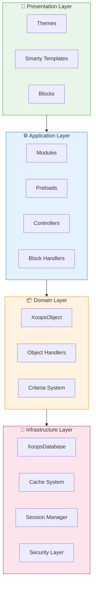
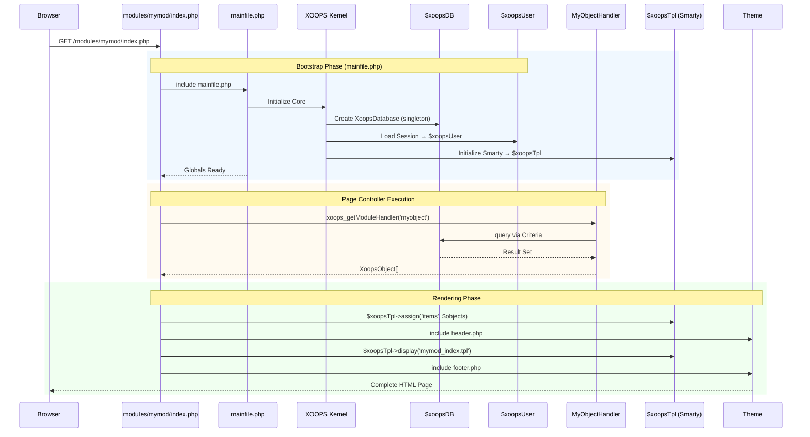

:::note[درباره این سند]
این صفحه **معماری مفهومی** XOOPS را توصیف می کند که برای هر دو نسخه فعلی (2.5.x) و آینده (4.0.x) کاربرد دارد. برخی از نمودارها چشم انداز طراحی لایه ای را نشان می دهند.

**برای جزئیات مربوط به نسخه:**
- **XOOPS 2.5.x امروز:** از `mainfile.php`، جهانی ها (`$xoopsDB`، `$xoopsUser`)، پیش بارگیری ها و الگوی کنترل کننده استفاده می کند
- **هدف XOOPS 4.0:** میان افزار PSR-15، ظرف DI، روتر - به [نقشه راه](../../07-XOOPS-4.0/XOOPS-4.0-Roadmap.md) مراجعه کنید
:::

این سند یک نمای کلی از معماری سیستم XOOPS ارائه می دهد و توضیح می دهد که چگونه اجزای مختلف با هم کار می کنند تا یک سیستم مدیریت محتوای منعطف و توسعه پذیر ایجاد کنند.

## بررسی اجمالی

XOOPS از یک معماری مدولار پیروی می کند که نگرانی ها را به لایه های مجزا جدا می کند. این سیستم بر اساس چندین اصل اصلی ساخته شده است:

- ** ماژولاریت **: عملکرد در ماژول های مستقل و قابل نصب سازماندهی شده است
- **توسعه پذیری**: سیستم را می توان بدون تغییر کد اصلی گسترش داد
- **انتزاع**: پایگاه داده و لایه های ارائه از منطق تجاری انتزاع شده اند
- **امنیت**: مکانیسم های امنیتی داخلی از آسیب پذیری های رایج محافظت می کند

## لایه های سیستم



### 1. لایه ارائه

لایه ارائه رندر رابط کاربری را با استفاده از موتور قالب Smarty انجام می دهد.

** اجزای کلیدی:**
- **موضوعات **: یک ظاهر طراحی و چیدمان بصری
- **قالب های هوشمند**: رندر محتوای پویا
- **بلاک**: ویجت های محتوای قابل استفاده مجدد

### 2. لایه برنامه

لایه برنامه شامل منطق تجاری، کنترلرها و عملکرد ماژول است.

** اجزای کلیدی:**
- ** ماژول ها **: بسته های عملکردی مستقل
- **Handlers**: کلاس های دستکاری داده ها
- **پیش بارگیری**: شنوندگان رویداد و قلاب

### 3. لایه دامنه

لایه دامنه حاوی اشیاء و قوانین تجاری اصلی است.

** اجزای کلیدی:**
- **XoopsObject**: کلاس پایه برای همه اشیاء دامنه
- **Handlers**: عملیات CRUD برای اشیاء دامنه

### 4. لایه زیرساخت

لایه زیرساخت خدمات اصلی مانند دسترسی به پایگاه داده و ذخیره سازی را ارائه می دهد.

## چرخه عمر را درخواست کنید

درک چرخه عمر درخواست برای توسعه موثر XOOPS بسیار مهم است.

### XOOPS 2.5.x جریان کنترل کننده صفحه

XOOPS 2.5.x فعلی از یک الگوی **Page Controller** استفاده می کند که در آن هر فایل PHP درخواست خود را انجام می دهد. گلوبال ها (`$xoopsDB`، `$xoopsUser`، `$xoopsTpl`، و غیره) در طول بوت استرپ مقداردهی اولیه می شوند و در طول اجرا در دسترس هستند.



### کلیدهای جهانی در 2.5.x

| جهانی | نوع | اولیه | هدف |
|--------|------|------------|---------|
| `$xoopsDB` | `XoopsDatabase` | بوت استرپ | اتصال به پایگاه داده (تک صدا) |
| `$xoopsUser` | `XoopsUser\|null` | بار جلسه | کاربر فعلی وارد شده |
| `$xoopsTpl` | `XoopsTpl` | قالب init | موتور قالب هوشمند |
| `$xoopsModule` | `XoopsModule` | بار ماژول | زمینه ماژول فعلی |
| `$xoopsConfig` | `array` | بار پیکربندی | پیکربندی سیستم |

:::note[مقایسه XOOPS 4.0]
در XOOPS 4.0، الگوی Page Controller با **PSR-15 Middleware Pipeline** و دیسپاچینگ مبتنی بر روتر جایگزین شده است. جهانی ها با تزریق وابستگی جایگزین می شوند. برای تضمین سازگاری در طول مهاجرت به [قرارداد حالت ترکیبی](../../07-XOOPS-4.0/Specifications/Hybrid-Mode-Contract.md) مراجعه کنید.
:::

### 1. فاز بوت استرپ

```php
// mainfile.php is the entry point
include_once XOOPS_ROOT_PATH . '/mainfile.php';

// Core initialization
$xoops = XOOPS::getInstance();
$xoops->boot();
```

**مراحل:**
1. پیکربندی بارگذاری (`mainfile.php`)
2. autoloader را راه اندازی کنید
3. مدیریت خطا را تنظیم کنید
4. اتصال پایگاه داده را ایجاد کنید
5. بارگذاری جلسه کاربر
6. راه اندازی موتور قالب Smarty

### 2. فاز مسیریابی

```php
// Request routing to appropriate module
$module = $GLOBALS['xoopsModule'];
$controller = $module->getController();
$controller->dispatch($request);
```

**مراحل:**
1. URL درخواست را تجزیه کنید
2. ماژول هدف را شناسایی کنید
3. بارگذاری پیکربندی ماژول
4. مجوزها را بررسی کنید
5. مسیر به کنترل کننده مناسب

### 3. مرحله اجرا

```php
// Controller execution
$data = $handler->getObjects($criteria);
$xoopsTpl->assign('items', $data);
```**مراحل:**
1. منطق کنترلر را اجرا کنید
2. تعامل با لایه داده
3. قوانین کسب و کار را پردازش کنید
4. داده های مشاهده را آماده کنید

### 4. فاز رندر

```php
// Template rendering
include XOOPS_ROOT_PATH . '/header.php';
$xoopsTpl->display('db:module_template.tpl');
include XOOPS_ROOT_PATH . '/footer.php';
```

**مراحل:**
1. طرح تم را اعمال کنید
2. رندر قالب ماژول
3. بلوک های فرآیند
4. پاسخ خروجی

## اجزای اصلی

### XoopsObject

کلاس پایه برای تمام اشیاء داده در XOOPS.

```php
<?php
class MyModuleItem extends XoopsObject
{
    public function __construct()
    {
        $this->initVar('id', XOBJ_DTYPE_INT, null, false);
        $this->initVar('title', XOBJ_DTYPE_TXTBOX, '', true, 255);
        $this->initVar('content', XOBJ_DTYPE_TXTAREA, '', false);
        $this->initVar('created', XOBJ_DTYPE_INT, time(), false);
    }
}
```

**روش های کلیدی:**
- `initVar()` - خصوصیات شی را تعریف کنید
- `getVar()` - مقادیر دارایی را بازیابی کنید
- `setVar()` - مقادیر ویژگی را تنظیم کنید
- `assignVars()` - تخصیص انبوه از آرایه

### XoopsPersistableObjectHandler

عملیات CRUD را برای نمونه های XoopsObject مدیریت می کند.

```php
<?php
class MyModuleItemHandler extends XoopsPersistableObjectHandler
{
    public function __construct(\XoopsDatabase $db)
    {
        parent::__construct($db, 'mymodule_items', 'MyModuleItem', 'id', 'title');
    }

    public function getActiveItems($limit = 10)
    {
        $criteria = new CriteriaCompo();
        $criteria->add(new Criteria('status', 1));
        $criteria->setSort('created');
        $criteria->setOrder('DESC');
        $criteria->setLimit($limit);

        return $this->getObjects($criteria);
    }
}
```

**روش های کلیدی:**
- `create()` - نمونه شی جدید ایجاد کنید
- `get()` - شیء را با شناسه بازیابی کنید
- `insert()` - ذخیره شی در پایگاه داده
- `delete()` - حذف شی از پایگاه داده
- `getObjects()` - چندین اشیاء را بازیابی کنید
- `getCount()` - شمارش اشیاء تطبیق

### ساختار ماژول

هر ماژول XOOPS از یک ساختار دایرکتوری استاندارد پیروی می کند:

```
modules/mymodule/
├── class/                  # PHP classes
│   ├── MyModuleItem.php
│   └── MyModuleItemHandler.php
├── include/                # Include files
│   ├── common.php
│   └── functions.php
├── templates/              # Smarty templates
│   ├── mymodule_index.tpl
│   └── mymodule_item.tpl
├── admin/                  # Admin area
│   ├── index.php
│   └── menu.php
├── language/               # Translations
│   └── english/
│       ├── main.php
│       └── modinfo.php
├── sql/                    # Database schema
│   └── mysql.sql
├── xoops_version.php       # Module info
├── index.php               # Module entry
└── header.php              # Module header
```

## ظرف تزریق وابستگی

توسعه مدرن XOOPS می تواند از تزریق وابستگی برای آزمایش پذیری بهتر استفاده کند.

### اجرای پایه کانتینر

```php
<?php
class XoopsDependencyContainer
{
    private array $services = [];

    public function register(string $name, callable $factory): void
    {
        $this->services[$name] = $factory;
    }

    public function resolve(string $name): mixed
    {
        if (!isset($this->services[$name])) {
            throw new \InvalidArgumentException("Service not found: $name");
        }

        $factory = $this->services[$name];

        if (is_callable($factory)) {
            return $factory($this);
        }

        return $factory;
    }

    public function has(string $name): bool
    {
        return isset($this->services[$name]);
    }
}
```

### کانتینر سازگار با PSR-11

```php
<?php
namespace XMF\Di;

use Psr\Container\ContainerInterface;

class BasicContainer implements ContainerInterface
{
    protected array $definitions = [];

    public function set(string $id, mixed $value): void
    {
        $this->definitions[$id] = $value;
    }

    public function get(string $id): mixed
    {
        if (!$this->has($id)) {
            throw new \InvalidArgumentException("Service not found: $id");
        }

        $entry = $this->definitions[$id];

        if (is_callable($entry)) {
            return $entry($this);
        }

        return $entry;
    }

    public function has(string $id): bool
    {
        return isset($this->definitions[$id]);
    }
}
```

### مثال استفاده

```php
<?php
// Service registration
$container = new XoopsDependencyContainer();

$container->register('database', function () {
    return XoopsDatabaseFactory::getDatabaseConnection();
});

$container->register('userHandler', function ($c) {
    return new XoopsUserHandler($c->resolve('database'));
});

// Service resolution
$userHandler = $container->resolve('userHandler');
$user = $userHandler->get($userId);
```

## نقاط توسعه

XOOPS چندین مکانیسم توسعه را ارائه می دهد:

### 1. پیش بارگیری ها

پیش بارگذاری به ماژول ها اجازه می دهد تا به رویدادهای اصلی متصل شوند.

```php
<?php
// modules/mymodule/preloads/core.php
class MymoduleCorePreload extends XoopsPreloadItem
{
    public static function eventCoreHeaderEnd($args)
    {
        // Execute when header processing ends
    }

    public static function eventCoreFooterStart($args)
    {
        // Execute when footer processing starts
    }
}
```

### 2. پلاگین ها

پلاگین ها عملکرد خاصی را در ماژول ها گسترش می دهند.

```php
<?php
// modules/mymodule/plugins/notify.php
class MymoduleNotifyPlugin
{
    public function onItemCreate($item)
    {
        // Send notification when item is created
    }
}
```

### 3. فیلترها

فیلترها داده ها را هنگام عبور از سیستم تغییر می دهند.

```php
<?php
// Content filter example
$myts = MyTextSanitizer::getInstance();
$content = $myts->displayTarea($rawContent, 1, 1, 1);
```

## بهترین شیوه ها

### سازمان کد

1. **از namespace** برای کد جدید استفاده کنید:
 
  ```php
   namespace XoopsModules\MyModule;

   class Item extends \XoopsObject
   {
       // Implementation
   }
 
  ```

2. **بارگذاری خودکار PSR-4 را دنبال کنید**:
 
  ```json
   {
       "autoload": {
           "psr-4": {
               "XoopsModules\\MyModule\\": "class/"
           }
       }
   }
 
  ```

3. **نگرانی های جداگانه **:
   - منطق دامنه در `class/`
   - ارائه در `templates/`
   - کنترلرها در ریشه ماژول

### عملکرد

1. **از کش** برای عملیات گران قیمت استفاده کنید
2. **تنبل بار ** منابع در صورت امکان
3. **به حداقل رساندن پرس و جوهای پایگاه داده** با استفاده از دسته بندی معیارها
4. **بهینه سازی قالب** با اجتناب از منطق پیچیده

### امنیت

1. **تأیید تمام ورودی** با استفاده از `XMF\Request`
2. **خروجی خروجی** در قالب ها
3. **از دستورات آماده** برای پرس و جوهای پایگاه داده استفاده کنید
4. **قبل از عملیات حساس، مجوزها را بررسی کنید**

## مستندات مرتبط

- [Design-Patterns](Design-Patterns.md) - الگوهای طراحی مورد استفاده در XOOPS
- [لایه پایگاه داده](../Database/Database-Layer.md) - جزئیات انتزاع پایگاه داده
- [Smarty Basics](../Templates/Smarty-Basics.md) - اسناد سیستم الگو
- [بهترین شیوه های امنیتی](../Security/Security-Best-Practices.md) - دستورالعمل های امنیتی

---

#xoops #معماری #هسته #طراحی #سیستم-طراحی
