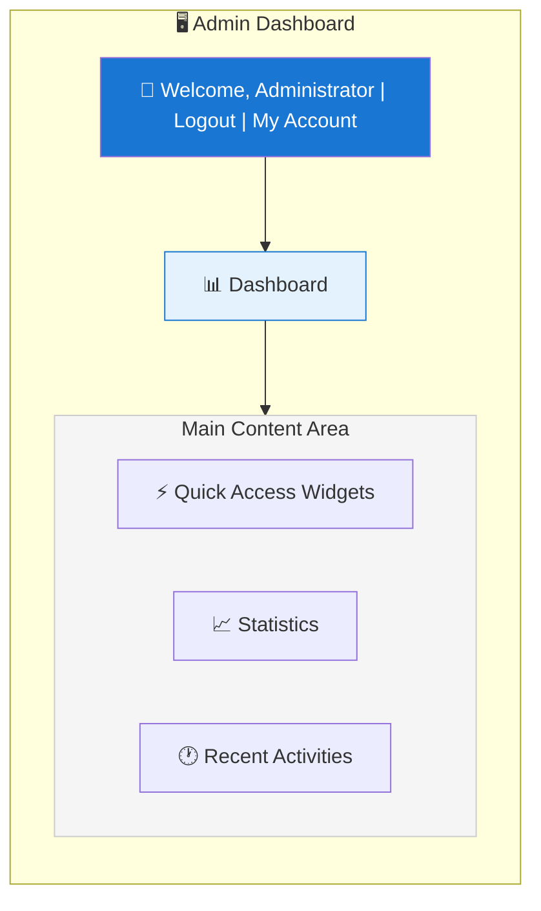
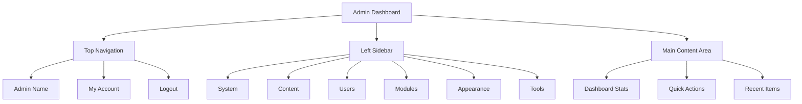

# نمای کلی پنل مدیریت XOOPS

راهنمای کامل برای پیمایش و استفاده از داشبورد مدیر XOOPS.

## دسترسی به پنل مدیریت

### ورود ادمین

مرورگر خود را باز کنید و به مسیر زیر بروید:

```
http://your-domain.com/xoops/admin/
```

یا اگر XOOPS در روت است:

```
http://your-domain.com/admin/
```

اعتبار مدیر خود را وارد کنید:

```
Username: [Your admin username]
Password: [Your admin password]
```

### پس از ورود به سیستم

داشبورد مدیریت اصلی را خواهید دید:



## طرح بندی پنل مدیریت



## اجزای داشبورد

### نوار بالا

نوار بالایی شامل کنترل های ضروری است:

| عنصر | هدف |
|---|---|
| **لوگوی مدیریت ** | برای بازگشت به داشبورد کلیک کنید |
| **پیام خوشامدگویی** | نام مدیر وارد شده را نشان می دهد |
| **حساب من** | ویرایش پروفایل مدیریت و رمز عبور |
| **کمک** | اسناد دسترسی |
| **خروج ** | خروج از پنل مدیریت |

### نوار کناری ناوبری چپ

منوی اصلی سازماندهی شده بر اساس عملکرد:

```
├── System
│   ├── Dashboard
│   ├── Preferences
│   ├── Admin Users
│   ├── Groups
│   ├── Permissions
│   ├── Modules
│   └── Tools
├── Content
│   ├── Pages
│   ├── Categories
│   ├── Comments
│   └── Media Manager
├── Users
│   ├── Users
│   ├── User Requests
│   ├── Online Users
│   └── User Groups
├── Modules
│   ├── Modules
│   ├── Module Settings
│   └── Module Updates
├── Appearance
│   ├── Themes
│   ├── Templates
│   ├── Blocks
│   └── Images
└── Tools
    ├── Maintenance
    ├── Email
    ├── Statistics
    ├── Logs
    └── Backups
```

### منطقه محتوای اصلی

اطلاعات و کنترل های بخش انتخاب شده را نمایش می دهد:

- فرم های پیکربندی
- جداول داده با لیست
- نمودارها و آمار
- دکمه های عمل سریع
- متن راهنما و نکات ابزار

### ویجت های داشبورد

دسترسی سریع به اطلاعات کلیدی:

- **اطلاعات سیستم:** نسخه PHP، نسخه MySQL، نسخه XOOPS
- **آمار سریع:** تعداد کاربر، کل پست ها، ماژول های نصب شده
- **فعالیت اخیر:** آخرین ورود، تغییرات محتوا، خطاها
- ** وضعیت سرور: ** CPU، حافظه، استفاده از دیسک
- ** اطلاعیه ها: ** هشدارهای سیستم، در انتظار به روز رسانی

## توابع مدیریت اصلی

### مدیریت سیستم

**مکان:** سیستم > [گزینه های مختلف]

#### ترجیحات

تنظیمات اولیه سیستم را پیکربندی کنید:

```
System > Preferences > [Settings Category]
```

دسته بندی ها:
- تنظیمات عمومی (نام سایت، منطقه زمانی)
- تنظیمات کاربر (ثبت نام، پروفایل)
- تنظیمات ایمیل (پیکربندی SMTP)
- تنظیمات کش (گزینه های ذخیره سازی)
- تنظیمات URL (URL دوستانه)
- متا تگ ها (تنظیمات سئو)

به تنظیمات اولیه و تنظیمات سیستم مراجعه کنید.

#### کاربران ادمین

مدیریت حساب های سرپرست:

```
System > Admin Users
```

توابع:
- اضافه کردن مدیران جدید
- ویرایش پروفایل های مدیریت
- تغییر رمز عبور مدیریت
- حذف اکانت های مدیریت
- تنظیم مجوزهای مدیریت

### مدیریت محتوا

**مکان:** محتوا > [گزینه های مختلف]

#### Pages/Articles

مدیریت محتوای سایت:

```
Content > Pages (or your module)
```

توابع:
- ایجاد صفحات جدید
- ویرایش محتوای موجود
- حذف صفحات
- Publish/unpublish
- دسته بندی را تنظیم کنید
- ویرایش ها را مدیریت کنید

#### دسته ها

سازماندهی محتوا:

```
Content > Categories
```

توابع:
- ایجاد سلسله مراتب دسته بندی
- ویرایش دسته ها
- حذف دسته ها
- به صفحات اختصاص دهید

#### نظرات

تعدیل نظرات کاربران:

```
Content > Comments
```

توابع:
- مشاهده همه نظرات
- نظرات را تایید کنید
- ویرایش نظرات
- حذف هرزنامه
- نظر دهندگان را مسدود کنید

### مدیریت کاربر

**مکان:** کاربران > [گزینه های مختلف]

#### کاربران

مدیریت حساب های کاربری:

```
Users > Users
```

توابع:
- مشاهده همه کاربران
- ایجاد کاربران جدید
- ویرایش پروفایل های کاربر
- حذف اکانت ها
- بازنشانی رمزهای عبور
- تغییر وضعیت کاربر
- به گروه ها اختصاص دهید

#### کاربران آنلاین

نظارت بر کاربران فعال:

```
Users > Online Users
```

نشان می دهد:
- در حال حاضر کاربران آنلاین
- آخرین زمان فعالیت
- آدرس IP
- مکان کاربر (در صورت پیکربندی)

#### گروه های کاربری

مدیریت نقش‌ها و مجوزهای کاربر:

```
Users > Groups
```

توابع:
- ایجاد گروه های سفارشی
- مجوزهای گروه را تنظیم کنید
- کاربران را به گروه ها اختصاص دهید
- حذف گروه ها

### مدیریت ماژول

**موقعیت مکانی:** ماژول ها > [گزینه های مختلف]

#### ماژول ها

نصب و پیکربندی ماژول ها:

```
Modules > Modules
```

توابع:
- مشاهده ماژول های نصب شده
- ماژول های Enable/disable
- به روز رسانی ماژول ها
- تنظیمات ماژول را پیکربندی کنید
- نصب ماژول های جدید
- مشاهده جزئیات ماژول

#### به‌روزرسانی‌ها را بررسی کنید

```
Modules > Modules > Check for Updates
```

نمایش می دهد:
- به روز رسانی های ماژول موجود
- تغییرات
- گزینه های دانلود و نصب

### مدیریت ظاهر

**مکان:** ظاهر > [گزینه های مختلف]

#### تم ها

مدیریت تم های سایت:

```
Appearance > Themes
```توابع:
- مشاهده تم های نصب شده
- تنظیم تم پیش فرض
- آپلود تم های جدید
- تم ها را حذف کنید
- پیش نمایش تم
- پیکربندی تم

#### بلوک

مدیریت بلوک های محتوا:

```
Appearance > Blocks
```

توابع:
- ایجاد بلوک های سفارشی
- ویرایش محتوای بلوک
- ترتیب بلوک ها در صفحه
- تنظیم دید بلوک
- حذف بلوک ها
- ذخیره بلاک را پیکربندی کنید

#### الگوها

مدیریت قالب ها (پیشرفته):

```
Appearance > Templates
```

برای کاربران و توسعه دهندگان پیشرفته.

### ابزارهای سیستم

**موقعیت مکانی:** سیستم > ابزار

#### حالت نگهداری

جلوگیری از دسترسی کاربر در حین نگهداری:

```
System > Maintenance Mode
```

پیکربندی:
- تعمیر و نگهداری Enable/disable
- پیام تعمیر و نگهداری سفارشی
- آدرس های IP مجاز (برای آزمایش)

#### مدیریت پایگاه داده

```
System > Database
```

توابع:
- سازگاری پایگاه داده را بررسی کنید
- به روز رسانی پایگاه داده را اجرا کنید
- تعمیر میز
- بهینه سازی پایگاه داده
- صادرات ساختار پایگاه داده

#### گزارش های فعالیت

```
System > Logs
```

مانیتور:
- فعالیت کاربر
- اقدامات اداری
- رویدادهای سیستم
- سیاهههای مربوط به خطا

## اقدامات سریع

وظایف متداول قابل دسترسی از داشبورد:

```
Quick Links:
├── Create New Page
├── Add New User
├── Create Content Block
├── Upload Image
├── Send Mass Email
├── Update All Modules
└── Clear Cache
```

## میانبرهای صفحه کلید پنل مدیریت

ناوبری سریع:

| میانبر | اقدام |
|---|---|
| `Ctrl+H` | برو به کمک |
| `Ctrl+D` | رفتن به داشبورد |
| `Ctrl+Q` | جستجوی سریع |
| `Ctrl+L` | خروج |

## مدیریت حساب کاربری

### حساب من

دسترسی به نمایه سرپرست خود:

1. روی "حساب من" در بالا سمت راست کلیک کنید
2. ویرایش اطلاعات نمایه:
   - آدرس ایمیل
   - نام واقعی
   - اطلاعات کاربر
   - آواتار

### رمز عبور را تغییر دهید

رمز عبور مدیریت خود را تغییر دهید:

1. به **حساب من** بروید
2. روی «تغییر رمز عبور» کلیک کنید
3. رمز عبور فعلی را وارد کنید
4. رمز عبور جدید را وارد کنید (دو بار)
5. روی «ذخیره» کلیک کنید

**نکات امنیتی:**
- از رمزهای عبور قوی (16+ کاراکتر) استفاده کنید
- شامل حروف بزرگ، کوچک، اعداد، نمادها
- رمز عبور را هر 90 روز تغییر دهید
- هرگز اعتبار مدیر را به اشتراک نگذارید

### خروج

خروج از پنل مدیریت:

1. روی "خروج" در بالا سمت راست کلیک کنید
2. شما به صفحه ورود هدایت می شوید

## آمار پنل مدیریت

### آمار داشبورد

مروری سریع بر معیارهای سایت:

| متریک | ارزش |
|--------|-------|
| کاربران آنلاین | 12 |
| مجموع کاربران | 256 |
| مجموع پست ها | 1,234 |
| مجموع نظرات | 5,678 |
| مجموع ماژول ها | 8 |

### وضعیت سیستم

اطلاعات سرور و عملکرد:

| جزء | Version/Value |
|-----------|---------------|
| نسخه XOOPS | 2.5.11 |
| نسخه PHP | 8.2.x |
| نسخه MySQL | 8.0.x |
| بار سرور | 0.45، 0.42 |
| آپتایم | 45 روز |

### فعالیت اخیر

جدول زمانی رویدادهای اخیر:

```
12:45 - Admin login
12:30 - New user registered
12:15 - Page published
12:00 - Comment posted
11:45 - Module updated
```

## سیستم اطلاع رسانی

### هشدارهای مدیریت

دریافت اطلاعیه برای:

- ثبت نام کاربران جدید
- نظرات در انتظار تعدیل
- تلاش برای ورود ناموفق
- خطاهای سیستم
- به روز رسانی ماژول در دسترس است
- مشکلات پایگاه داده
- هشدارهای فضای دیسک

پیکربندی هشدارها:

**سیستم > تنظیمات برگزیده > تنظیمات ایمیل**

```
Notify Admin on Registration: Yes
Notify Admin on Comments: Yes
Notify Admin on Errors: Yes
Alert Email: admin@your-domain.com
```

## وظایف معمول مدیریت

### یک صفحه جدید ایجاد کنید

1. به **محتوا > صفحات** (یا ماژول مربوطه) بروید
2. روی «افزودن صفحه جدید» کلیک کنید
3. پر کنید:
   - عنوان
   - محتوا
   - توضیحات
   - دسته بندی
   - فراداده
4. روی «انتشار» کلیک کنید

### مدیریت کاربران

1. به **کاربران > کاربران** بروید
2. مشاهده لیست کاربران با:
   - نام کاربری
   - ایمیل
   - تاریخ ثبت نام
   - آخرین ورود
   - وضعیت

3. روی نام کاربری کلیک کنید تا:
   - ویرایش پروفایل
   - تغییر رمز عبور
   - ویرایش گروه ها
   - کاربر Block/unblock

### پیکربندی ماژول

1. به **Modules > Modules** بروید
2. ماژول را در لیست پیدا کنید
3. روی نام ماژول کلیک کنید
4. روی «تنظیمات» یا «تنظیمات» کلیک کنید
5. گزینه های ماژول را پیکربندی کنید
6. تغییرات را ذخیره کنید

### یک بلوک جدید ایجاد کنید

1. به **ظاهر > بلوک ها** بروید
2. روی «افزودن بلوک جدید» کلیک کنید
3. وارد کنید:
   - عنوان را مسدود کنید
   - مسدود کردن محتوا (HTML مجاز است)
   - موقعیت در صفحه
   - قابلیت مشاهده (همه صفحات یا خاص)
   - ماژول (در صورت وجود)
4. روی «ارسال» کلیک کنید

## راهنمای پنل مدیریت

### مستندات داخلی

دسترسی به کمک از پنل مدیریت:1. روی دکمه "Help" در نوار بالا کلیک کنید
2. کمک حساس به متن برای صفحه فعلی
3. پیوند به اسناد
4. سوالات متداول

### منابع خارجی

- سایت رسمی XOOPS: https://xoops.org/
- انجمن انجمن: https://xoops.org/modules/newbb/
- مخزن ماژول: https://xoops.org/modules/repository/
- Bugs/Issues: https://github.com/XOOPS/XoopsCore/issues

## سفارشی کردن پنل مدیریت

### تم مدیریت

موضوع رابط مدیریت را انتخاب کنید:

**سیستم > تنظیمات برگزیده > تنظیمات عمومی**

```
Admin Theme: [Select theme]
```

تم های موجود:
- پیش فرض (سبک)
- حالت تاریک
- تم های سفارشی

### سفارشی سازی داشبورد

انتخاب کنید کدام ویجت ظاهر می شود:

**داشبورد > سفارشی کردن**

انتخاب کنید:
- اطلاعات سیستم
- آمار
- فعالیت اخیر
- لینک های سریع
- ویجت های سفارشی

## مجوزهای پنل مدیریت

سطوح مختلف مدیریت مجوزهای متفاوتی دارند:

| نقش | قابلیت ها |
|---|---|
| **مستر وب** | دسترسی کامل به تمام عملکردهای مدیریت |
| **ادمین** | توابع مدیریت محدود |
| **مدیر ** | فقط تعدیل محتوا |
| **ویراستار** | تولید و ویرایش محتوا |

مدیریت مجوزها:

**سیستم > مجوزها**

## بهترین شیوه های امنیتی برای پنل مدیریت

1. **رمز عبور قوی:** از رمز عبور 16+ کاراکتری استفاده کنید
2. **تغییرات منظم:** رمز عبور را هر 90 روز تغییر دهید
3. **دسترسی به مانیتور:** گزارش های "کاربران مدیر" را به طور منظم بررسی کنید
4. ** محدود کردن دسترسی: ** تغییر نام پوشه مدیریت برای امنیت بیشتر
5. **از HTTPS استفاده کنید:** همیشه از طریق HTTPS به ادمین دسترسی داشته باشید
6. **لیست سفید IP:** دسترسی ادمین را به IP های خاص محدود کنید
7. **خروج منظم:** پس از اتمام خروج از سیستم خارج شوید
8. **امنیت مرورگر:** کش مرورگر را به طور منظم پاک کنید

تنظیمات امنیتی را ببینید.

## عیب یابی پنل مدیریت

### نمی توان به پنل مدیریت دسترسی پیدا کرد

**راه حل:**
1. اعتبار ورود به سیستم را تأیید کنید
2. کش مرورگر و کوکی ها را پاک کنید
3. مرورگرهای مختلف را امتحان کنید
4. بررسی کنید که آیا مسیر پوشه مدیریت صحیح است یا خیر
5. مجوزهای فایل در پوشه مدیریت را بررسی کنید
6. اتصال پایگاه داده را در mainfile.php بررسی کنید

### صفحه ادمین خالی

**راه حل:**
```bash
# Check PHP errors
tail -f /var/log/apache2/error.log

# Enable debug mode temporarily
sed -i "s/define('XOOPS_DEBUG', 0)/define('XOOPS_DEBUG', 1)/" /var/www/html/xoops/mainfile.php

# Check file permissions
ls -la /var/www/html/xoops/admin/
```

### پنل مدیریت آهسته

**راه حل:**
1. کش را پاک کنید: **سیستم > ابزارها > پاک کردن کش**
2. بهینه سازی پایگاه داده: **سیستم > پایگاه داده > بهینه سازی**
3. بررسی منابع سرور: `htop`
4. پرس و جوهای کند را در MySQL مرور کنید

### ماژول ظاهر نمی شود

**راه حل:**
1. بررسی ماژول نصب شده: **Modules > Modules**
2. فعال بودن ماژول را بررسی کنید
3. مجوزهای اختصاص داده شده را بررسی کنید
4. وجود فایل های ماژول را بررسی کنید
5. گزارش های خطا را بررسی کنید

## مراحل بعدی

پس از آشنایی با پنل مدیریت:

1. اولین صفحه خود را ایجاد کنید
2. گروه های کاربری را تنظیم کنید
3. ماژول های اضافی را نصب کنید
4. تنظیمات اولیه را پیکربندی کنید
5. اجرای امنیت

---

**برچسب ها:** #پنل مدیریت #داشبورد #ناوبری #شروع به کار

**مقالات مرتبط:**
- ../Configuration/Basic-Configuration
- ../Configuration/System-Settings
- ایجاد صفحه اول شما
- مدیریت کاربران
- نصب ماژول ها