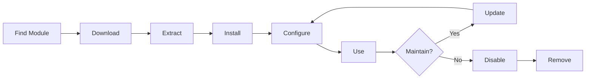

# نصب و مدیریت ماژول های XOOPS

نحوه گسترش عملکرد XOOPS را با نصب و پیکربندی ماژول ها بیاموزید.

## درک ماژول های XOOPS

### ماژول ها چیست؟

ماژول ها افزونه هایی هستند که قابلیت هایی را به XOOPS اضافه می کنند:

| نوع | هدف | مثال ها |
|---|---|---|
| **مطالب** | مدیریت انواع محتوای خاص | اخبار، وبلاگ، بلیط |
| **جامعه** | تعامل کاربر | انجمن، نظرات، نظرات |
| **تجارت الکترونیک** | فروش محصولات | فروشگاه، سبد خرید، پرداخت |
| **رسانه** | دسته files/images | گالری، دانلود، فیلم |
| **کاربردی** | ابزار و کمکی | ایمیل، پشتیبان گیری، تجزیه و تحلیل |

### هسته در مقابل ماژول های اختیاری

| ماژول | نوع | شامل | قابل جابجایی |
|---|---|---|---|
| **سیستم** | هسته | بله | نه |
| **کاربر** | هسته | بله | نه |
| **پروفایل** | توصیه شده | بله | بله |
| **PM (پیام خصوصی)** | توصیه شده | بله | بله |
| **کانال WF** | اختیاری | اغلب | بله |
| **اخبار** | اختیاری | نه | بله |
| ** انجمن ** | اختیاری | نه | بله |

## چرخه عمر ماژول



## یافتن ماژول ها

### مخزن ماژول XOOPS

مخزن رسمی ماژول XOOPS:

**بازدید:** https://xoops.org/modules/repository/

```
Directory > Modules > [Browse Categories]
```

مرور بر اساس دسته بندی:
- مدیریت محتوا
- جامعه
- تجارت الکترونیک
- چند رسانه ای
- توسعه
- مدیریت سایت

### ارزیابی ماژول ها

قبل از نصب، بررسی کنید:

| معیارها | به دنبال چه چیزی باشیم |
|---|---|
| **سازگاری** | با نسخه XOOPS شما کار می کند |
| **رتبه** | نظرات و امتیازات خوب کاربران |
| **به روز رسانی** | اخیرا نگهداری شده |
| **دانلود** | محبوب و پرکاربرد |
| **نیازمندی** | سازگار با سرور شما |
| **مجوز** | GPL یا منبع باز مشابه |
| **پشتیبانی** | توسعه دهنده فعال و جامعه |

### اطلاعات ماژول را بخوانید

لیست هر ماژول نشان می دهد:

```
Module Name: [Name]
Version: [X.X.X]
Requires: XOOPS [Version]
Author: [Name]
Last Update: [Date]
Downloads: [Number]
Rating: [Stars]
Description: [Brief description]
Compatibility: PHP [Version], MySQL [Version]
```

## نصب ماژول ها

### روش 1: نصب پنل مدیریت

**مرحله 1: دسترسی به بخش ماژول**

1. وارد پنل مدیریت شوید
2. به **Modules > Modules** بروید
3. روی **"Install New Module"** یا **"Browse Modules"** کلیک کنید.

**مرحله 2: آپلود ماژول**

گزینه A - آپلود مستقیم:
1. روی **"انتخاب فایل"** کلیک کنید
2. فایل زیپ ماژول را از رایانه انتخاب کنید
3. روی **"آپلود"** کلیک کنید

گزینه B - آپلود URL:
1. URL ماژول را جایگذاری کنید
2. روی **"دانلود و نصب"** کلیک کنید

**مرحله 3: بررسی اطلاعات ماژول**

```
Module Name: [Name shown]
Version: [Version]
Author: [Author info]
Description: [Full description]
Requirements: [PHP/MySQL versions]
```

مرور کنید و روی **"ادامه با نصب"** کلیک کنید

**مرحله 4: نوع نصب را انتخاب کنید**

```
☐ Fresh Install (New installation)
☐ Update (Upgrade existing)
☐ Delete Then Install (Replace existing)
```

گزینه مناسب را انتخاب کنید

**مرحله 5: تایید نصب**

بررسی تایید نهایی:
```
Module will be installed to: /modules/modulename/
Database: xoops_db
Proceed? [Yes] [No]
```

برای تایید روی **"بله"** کلیک کنید.

**مرحله 6: نصب کامل شد**

```
Installation successful!

Module: [Module Name]
Version: [Version]
Tables created: [Number]
Files installed: [Number]

[Go to Module Settings]  [Return to Modules]
```

### روش 2: نصب دستی (پیشرفته)

برای نصب دستی یا عیب یابی:

**مرحله 1: دانلود ماژول**

1. ماژول .zip را از مخزن دانلود کنید
2. به `/var/www/html/xoops/modules/modulename/` استخراج کنید

```bash
# Extract module
unzip module_name.zip
cp -r module_name /var/www/html/xoops/modules/

# Set permissions
chmod -R 755 /var/www/html/xoops/modules/module_name
```

**مرحله 2: اجرای اسکریپت نصب**

```
Visit: http://your-domain.com/xoops/modules/module_name/admin/index.php?op=install
```

یا از طریق پنل مدیریت (System > Modules > Update DB).

**مرحله 3: تأیید نصب**

1. به مسیر **Modules > Modules** در admin بروید
2. به دنبال ماژول خود در لیست بگردید
3. بررسی کنید که به عنوان "فعال" نشان داده شود

## پیکربندی ماژول

### به تنظیمات ماژول دسترسی پیدا کنید

1. به **Modules > Modules** بروید
2. ماژول خود را پیدا کنید
3. روی نام ماژول کلیک کنید
4. روی **"تنظیمات"** یا **"تنظیمات"** کلیک کنید

### تنظیمات ماژول مشترک

اکثر ماژول ها ارائه می دهند:

```
Module Status: [Enabled/Disabled]
Display in Menu: [Yes/No]
Module Weight: [1-999](display order)
Visible To Groups: [Checkboxes for user groups]
```

### گزینه های خاص ماژول

هر ماژول تنظیمات منحصر به فردی دارد. مثال ها:

**ماژول اخبار:**
```
Items Per Page: 10
Show Author: Yes
Allow Comments: Yes
Moderation Required: Yes
```

** ماژول انجمن:**
```
Topics Per Page: 20
Posts Per Page: 15
Maximum Attachment Size: 5MB
Enable Signatures: Yes
```

**ماژول گالری:**
```
Images Per Page: 12
Thumbnail Size: 150x150
Maximum Upload: 10MB
Watermark: Yes/No
```

اسناد ماژول خود را برای گزینه های خاص بررسی کنید.

### پیکربندی را ذخیره کنید

پس از تنظیم تنظیمات:

1. روی **"ارسال"** یا **"ذخیره"** کلیک کنید
2. تأیید را خواهید دید:
 
  ```
   Settings saved successfully!
 
  ```

## مدیریت بلوک های ماژول

بسیاری از ماژول ها "بلوک" ایجاد می کنند - مناطق محتوای ویجت مانند.

### بلوک های ماژول را مشاهده کنید1. به **ظاهر > بلوک ها** بروید
2. به دنبال بلوک های ماژول خود باشید
3. اکثر ماژول ها "[نام ماژول] - [شرح بلوک]" را نشان می دهند.

### بلوک ها را پیکربندی کنید

1. روی نام بلوک کلیک کنید
2. تنظیم کنید:
   - عنوان را مسدود کنید
   - قابلیت مشاهده (همه صفحات یا خاص)
   - موقعیت در صفحه (چپ، مرکز، راست)
   - گروه های کاربری که می توانند ببینند
3. روی **"ارسال"** کلیک کنید

### نمایش بلوک در صفحه اصلی

1. به **ظاهر > بلوک ها** بروید
2. بلوک مورد نظر خود را پیدا کنید
3. روی **"Edit"** کلیک کنید
4. مجموعه:
   - **قابل مشاهده برای: ** گروه ها را انتخاب کنید
   - **موقعیت:** ستون را انتخاب کنید (left/center/right)
   - **صفحات:** صفحه اصلی یا همه صفحات
5. روی **"ارسال"** کلیک کنید

## نصب نمونه‌های ماژول خاص

### نصب ماژول اخبار

** ایده آل برای: ** پست های وبلاگ، اطلاعیه ها

1. ماژول اخبار را از مخزن دانلود کنید
2. آپلود از طریق **Modules > Modules > Install**
3. در **Modules > News > Preferences** پیکربندی کنید:
   - داستان در هر صفحه: 10
   - اجازه نظرات: بله
   - تایید قبل از انتشار: بله
4. ایجاد بلوک برای آخرین اخبار
5. شروع به انتشار داستان کنید!

### نصب ماژول انجمن

** ایده آل برای: ** بحث انجمن

1. دانلود ماژول انجمن
2. از طریق پنل مدیریت نصب کنید
3. دسته های انجمن را در ماژول ایجاد کنید
4. تنظیمات را پیکربندی کنید:
   - Topics/page: 20
   - Posts/page: 15
   - فعال کردن تعدیل: بله
5. مجوزهای گروه های کاربری را اختصاص دهید
6. بلوک هایی برای آخرین موضوعات ایجاد کنید

### نصب ماژول گالری

** ایده آل برای: ** ویترین تصویر

1. دانلود ماژول گالری
2. نصب و پیکربندی کنید
3. آلبوم عکس ایجاد کنید
4. آپلود تصاویر
5. مجوزها را برای viewing/uploading تنظیم کنید
6. نمایش گالری در وب سایت

## به روز رسانی ماژول ها

### به‌روزرسانی‌ها را بررسی کنید

```
Admin Panel > Modules > Modules > Check for Updates
```

این نشان می دهد:
- به روز رسانی های ماژول موجود
- نسخه فعلی در مقابل نسخه جدید
- یادداشت های Changelog/release

### یک ماژول را به روز کنید

1. به **Modules > Modules** بروید
2. روی ماژول با به روز رسانی موجود کلیک کنید
3. روی دکمه **"به روز رسانی"** کلیک کنید
4. **"Update" را از Install Type انتخاب کنید**
5. جادوگر نصب را دنبال کنید
6. ماژول به روز شد!

### نکات مهم به روز رسانی

قبل از به روز رسانی:

- [ ] پایگاه داده پشتیبان
- [ ] فایل های ماژول پشتیبان گیری
- [ ] بررسی تغییرات
- [ ] ابتدا روی سرور مرحله بندی تست کنید
- [ ] به هر گونه تغییر سفارشی توجه کنید

پس از به روز رسانی:
- [ ] بررسی عملکرد
- [ ] تنظیمات ماژول را بررسی کنید
- [ ] بررسی برای warnings/errors
- [ ] کش را پاک کنید

## مجوزهای ماژول

### دسترسی به گروه کاربر را اختصاص دهید

کنترل کنید که کدام گروه های کاربری می توانند به ماژول ها دسترسی داشته باشند:

**موقعیت مکانی:** سیستم > مجوزها

برای هر ماژول، پیکربندی کنید:

```
Module: [Module Name]

Admin Access: [Select groups]
User Access: [Select groups]
Read Permission: [Groups allowed to view]
Write Permission: [Groups allowed to post]
Delete Permission: [Administrators only]
```

### سطوح مجوز مشترک

```
Public Content (News, Pages):
├── Admin Access: Webmaster
├── User Access: All logged-in users
└── Read Permission: Everyone

Community Features (Forum, Comments):
├── Admin Access: Webmaster, Moderators
├── User Access: All logged-in users
└── Write Permission: All logged-in users

Admin Tools:
├── Admin Access: Webmaster only
└── User Access: Disabled
```

## غیرفعال کردن و حذف ماژول ها

### ماژول را غیرفعال کنید (فایل ها را نگه دارید)

ماژول را نگه دارید اما از سایت پنهان شوید:

1. به **Modules > Modules** بروید
2. ماژول را پیدا کنید
3. روی نام ماژول کلیک کنید
4. روی **"غیرفعال کردن"** کلیک کنید یا وضعیت را روی غیرفعال تنظیم کنید
5. ماژول پنهان است اما داده ها حفظ می شوند

فعال کردن مجدد در هر زمان:
1. روی ماژول کلیک کنید
2. روی **"فعال کردن"** کلیک کنید

### ماژول را به طور کامل حذف کنید

حذف ماژول و داده های آن:

1. به **Modules > Modules** بروید
2. ماژول را پیدا کنید
3. روی **"حذف نصب"** یا **"حذف"** کلیک کنید
4. تأیید کنید: "حذف ماژول و همه داده ها؟"
5. برای تایید روی **"بله"** کلیک کنید

**هشدار:** حذف همه داده های ماژول را حذف می کند!

### پس از حذف نصب مجدد

اگر یک ماژول را حذف کنید:
- فایل های ماژول حذف شده است
- جداول پایگاه داده حذف شده است
- همه داده ها از دست رفت
- برای استفاده مجدد باید دوباره نصب کنید
- قابلیت بازیابی از پشتیبان

## عیب یابی نصب ماژول

### ماژول بعد از نصب ظاهر نمی شود

**علائم:** ماژول لیست شده است اما در سایت قابل مشاهده نیست

**راه حل:**
```
1. Check module is "Active" (Modules > Modules)
2. Enable module blocks (Appearance > Blocks)
3. Verify user permissions (System > Permissions)
4. Clear cache (System > Tools > Clear Cache)
5. Check .htaccess doesn't block module
```

### خطای نصب: "جدول از قبل وجود دارد"

** علامت: ** خطا در هنگام نصب ماژول

**راه حل:**
```
1. Module partially installed before
2. Try "Delete then Install" option
3. Or uninstall first, then install fresh
4. Check database for existing tables:
   mysql> SHOW TABLES LIKE 'xoops_module%';
```

### ماژول فاقد وابستگی است

** علامت: ** ماژول نصب نمی شود - به ماژول دیگری نیاز دارد

**راه حل:**
```
1. Note required modules from error message
2. Install required modules first
3. Then install the module
4. Install in correct order
```

### صفحه خالی هنگام دسترسی به ماژول

** علامت: ** ماژول بارگیری می شود اما چیزی نشان نمی دهد

**راه حل:**
```
1. Enable debug mode in mainfile.php:
   define('XOOPS_DEBUG', 1);

2. Check PHP error log:
   tail -f /var/log/php_errors.log

3. Verify file permissions:
   chmod -R 755 /var/www/html/xoops/modules/modulename

4. Check database connection in module config

5. Disable module and reinstall
```

### سایت شکست ماژول**علامت:** نصب ماژول وب سایت را خراب می کند

**راه حل:**
```
1. Disable the problematic module immediately:
   Admin > Modules > [Module] > Disable

2. Clear cache:
   rm -rf /var/www/html/xoops/cache/*
   rm -rf /var/www/html/xoops/templates_c/*

3. Restore from backup if needed

4. Check error logs for root cause

5. Contact module developer
```

## ملاحظات امنیتی ماژول

### فقط از منابع قابل اعتماد نصب کنید

```
✓ Official XOOPS Repository
✓ GitHub official XOOPS modules
✓ Trusted module developers
✗ Unknown websites
✗ Unverified sources
```

### مجوزهای ماژول را بررسی کنید

پس از نصب:

1. کد ماژول را برای فعالیت مشکوک بررسی کنید
2. جداول پایگاه داده را برای ناهنجاری بررسی کنید
3. نظارت بر تغییرات فایل
4. ماژول ها را به روز نگه دارید
5. ماژول های استفاده نشده را حذف کنید

### بهترین روش مجوزها

```
Module directory: 755 (readable, not writable by web server)
Module files: 644 (readable only)
Module data: Protected by database
```

## منابع توسعه ماژول

### توسعه ماژول را بیاموزید

- اسناد رسمی: https://xoops.org/
- مخزن GitHub: https://github.com/XOOPS/
- انجمن انجمن: https://xoops.org/modules/newbb/
- راهنمای توسعه دهنده: موجود در پوشه docs

## بهترین روش ها برای ماژول ها

1. **یک در یک زمان نصب کنید:** نظارت برای درگیری
2. **تست بعد از نصب:** بررسی عملکرد
3. **پیکربندی سفارشی سند:** به تنظیمات خود توجه کنید
4. **به روز نگه دارید:** به روز رسانی های ماژول را به سرعت نصب کنید
5. ** حذف استفاده نشده: ** حذف ماژول های مورد نیاز نیست
6. **قبل از پشتیبان گیری:** همیشه قبل از نصب نسخه پشتیبان تهیه کنید
7. ** خواندن مستندات: ** دستورالعمل های ماژول را بررسی کنید
8. **به انجمن بپیوندید:** در صورت نیاز کمک بخواهید

## چک لیست نصب ماژول

برای نصب هر ماژول:

- [ ] تحقیق کنید و نظرات را بخوانید
- [ ] بررسی سازگاری نسخه XOOPS
- [ ] پشتیبان گیری از پایگاه داده و فایل ها
- [ ] آخرین نسخه را دانلود کنید
- [ ] از طریق پنل مدیریت نصب کنید
- [ ] تنظیمات را پیکربندی کنید
- [ ] بلوک های Create/position
- [ ] مجوزهای کاربر را تنظیم کنید
- [ ] عملکرد تست
- [ ] پیکربندی سند
- [ ] برای به روز رسانی ها برنامه ریزی کنید

## مراحل بعدی

پس از نصب ماژول ها:

1. برای ماژول ها محتوا ایجاد کنید
2. گروه های کاربری را تنظیم کنید
3. ویژگی های مدیریت را کاوش کنید
4. عملکرد را بهینه کنید
5. ماژول های اضافی را در صورت نیاز نصب کنید

---

**برچسب ها:** #ماژول ها #نصب #افزونه #مدیریت

**مقالات مرتبط:**
- پنل مدیریت - نمای کلی
- مدیریت کاربران
- ایجاد صفحه اول شما
- ../Configuration/System-Settings