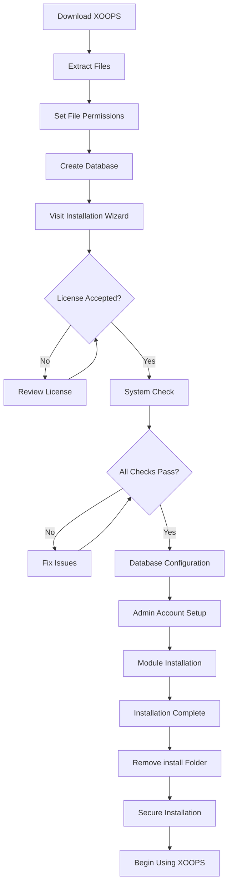

# راهنمای نصب کامل XOOPS

این راهنما یک راهنمای جامع برای نصب XOOPS از ابتدا با استفاده از جادوگر نصب ارائه می دهد.

## پیش نیاز

قبل از شروع نصب، اطمینان حاصل کنید که:

- دسترسی به وب سرور خود از طریق FTP یا SSH
- دسترسی مدیر به سرور پایگاه داده شما
- نام دامنه ثبت شده
- الزامات سرور تأیید شده است
- ابزارهای پشتیبان گیری در دسترس است

## فرآیند نصب



## نصب گام به گام

### مرحله 1: دانلود XOOPS

آخرین نسخه را از [https://xoops.org/](https://xoops.org/) دانلود کنید:

```bash
# Using wget
wget https://xoops.org/download/xoops-2.5.8.zip

# Using curl
curl -O https://xoops.org/download/xoops-2.5.8.zip
```

### مرحله 2: استخراج فایل ها

آرشیو XOOPS را در ریشه وب خود استخراج کنید:

```bash
# Navigate to web root
cd /var/www/html

# Extract XOOPS
unzip xoops-2.5.8.zip

# Rename folder (optional, but recommended)
mv xoops-2.5.8 xoops
cd xoops
```

### مرحله 3: مجوزهای فایل را تنظیم کنید

مجوزهای مناسب را برای فهرست های XOOPS تنظیم کنید:

```bash
# Make directories writable (755 for dirs, 644 for files)
find . -type d -exec chmod 755 {} \;
find . -type f -exec chmod 644 {} \;

# Make specific directories writable by web server
chmod 777 uploads/
chmod 777 templates_c/
chmod 777 var/
chmod 777 cache/

# Secure mainfile.php after installation
chmod 644 mainfile.php
```

### مرحله 4: ایجاد پایگاه داده

ایجاد یک پایگاه داده جدید برای XOOPS با استفاده از MySQL:

```sql
-- Create database
CREATE DATABASE xoops_db CHARACTER SET utf8mb4 COLLATE utf8mb4_unicode_ci;

-- Create user
CREATE USER 'xoops_user'@'localhost' IDENTIFIED BY 'secure_password_here';

-- Grant privileges
GRANT ALL PRIVILEGES ON xoops_db.* TO 'xoops_user'@'localhost';
FLUSH PRIVILEGES;
```

یا از phpMyAdmin استفاده کنید:

1. وارد phpMyAdmin شوید
2. روی برگه «پایگاه‌های داده» کلیک کنید
3. نام پایگاه داده را وارد کنید: `xoops_db`
4. ترکیب "utf8mb4_unicode_ci" را انتخاب کنید
5. روی «ایجاد» کلیک کنید
6. یک کاربر با همان نام پایگاه داده ایجاد کنید
7. اعطای تمام امتیازات

### مرحله 5: جادوگر نصب را اجرا کنید

مرورگر خود را باز کنید و به مسیر زیر بروید:

```
http://your-domain.com/xoops/install/
```

#### مرحله بررسی سیستم

جادوگر پیکربندی سرور شما را بررسی می کند:

- نسخه PHP >= 5.6.0
- MySQL/MariaDB موجود است
- پسوندهای مورد نیاز PHP (GD، PDO و غیره)
- مجوزهای دایرکتوری
- اتصال به پایگاه داده

**در صورت عدم موفقیت چک ها:**

برای راه‌حل‌ها، بخش #مشکلات رایج نصب را ببینید.

#### پیکربندی پایگاه داده

اعتبار پایگاه داده خود را وارد کنید:

```
Database Host: localhost
Database Name: xoops_db
Database User: xoops_user
Database Password: [your_secure_password]
Table Prefix: xoops_
```

**نکات مهم:**
- اگر میزبان پایگاه داده شما با لوکال هاست (مثلاً سرور راه دور) متفاوت است، نام هاست صحیح را وارد کنید.
- پیشوند جدول به اجرای چندین نمونه XOOPS در یک پایگاه داده کمک می کند
- از یک رمز عبور قوی با حروف مختلط، اعداد و نمادها استفاده کنید

#### راه اندازی حساب مدیریت

حساب کاربری خود را ایجاد کنید:

```
Admin Username: admin (or choose custom)
Admin Email: admin@your-domain.com
Admin Password: [strong_unique_password]
Confirm Password: [repeat_password]
```

**بهترین شیوه ها:**
- از یک نام کاربری منحصر به فرد استفاده کنید، نه "admin"
- از یک رمز عبور با بیش از 16 کاراکتر استفاده کنید
- اطلاعات کاربری را در یک مدیریت رمز عبور امن ذخیره کنید
- هرگز اعتبار مدیر را به اشتراک نگذارید

#### نصب ماژول

ماژول های پیش فرض را برای نصب انتخاب کنید:

- ** ماژول سیستم ** (الزامی) - عملکرد هسته XOOPS
- ** ماژول کاربر ** (الزامی) - مدیریت کاربر
- ** ماژول پروفایل ** (توصیه می شود) - پروفایل های کاربر
- ماژول **PM (پیام خصوصی) ** (توصیه می شود) - پیام رسانی داخلی
- ** ماژول WF-Channel ** (اختیاری) - مدیریت محتوا

همه ماژول های توصیه شده را برای نصب کامل انتخاب کنید.

### مرحله 6: نصب کامل

پس از انجام تمام مراحل، یک صفحه تأیید خواهید دید:

```
Installation Complete!

Your XOOPS installation is ready to use.
Admin Panel: http://your-domain.com/xoops/admin/
User Panel: http://your-domain.com/xoops/
```

### مرحله 7: نصب خود را ایمن کنید

#### پوشه نصب را حذف کنید

```bash
# Remove the install directory (CRITICAL for security)
rm -rf /var/www/html/xoops/install/

# Or rename it
mv /var/www/html/xoops/install/ /var/www/html/xoops/install.bak
```

**هشدار:** هرگز پوشه نصب را در زمان تولید در دسترس قرار ندهید!

#### ایمن mainfile.php

```bash
# Make mainfile.php read-only
chmod 644 /var/www/html/xoops/mainfile.php

# Set ownership
chown www-data:www-data /var/www/html/xoops/mainfile.php
```

#### مجوزهای مناسب فایل را تنظیم کنید

```bash
# Recommended production permissions
find . -type f -name "*.php" -exec chmod 644 {} \;
find . -type d -exec chmod 755 {} \;

# Writable directories for web server
chmod 777 uploads/ var/ cache/ templates_c/
```

#### HTTPS/SSL را فعال کنید

SSL را در وب سرور خود (nginx یا Apache) پیکربندی کنید.

**برای آپاچی:**
```apache
<VirtualHost *:443>
    ServerName your-domain.com
    DocumentRoot /var/www/html/xoops

    SSLEngine on
    SSLCertificateFile /etc/ssl/certs/your-cert.crt
    SSLCertificateKeyFile /etc/ssl/private/your-key.key

    # Force HTTPS redirect
    <IfModule mod_rewrite.c>
        RewriteEngine On
        RewriteCond %{HTTPS} off
        RewriteRule ^(.*)$ https://%{HTTP_HOST}%{REQUEST_URI} [L,R=301]
    </IfModule>
</VirtualHost>
```

## پیکربندی پس از نصب

### 1. به پنل مدیریت دسترسی پیدا کنید

پیمایش به:
```
http://your-domain.com/xoops/admin/
```

با اعتبار ادمین خود وارد شوید.

### 2. تنظیمات اولیه را پیکربندی کنید

موارد زیر را پیکربندی کنید:

- نام و توضیحات سایت
- آدرس ایمیل ادمین
- فرمت منطقه زمانی و تاریخ
- بهینه سازی موتورهای جستجو

### 3. نصب آزمایشی

- [ ] از صفحه اصلی بازدید کنید
- [ ] بارگذاری ماژول ها را بررسی کنید
- [ ] بررسی کار ثبت نام کاربر
- [ ] تست عملکرد پنل مدیریت
- [ ] کار SSL/HTTPS را تأیید کنید

### 4. زمانبندی پشتیبان گیری

راه اندازی پشتیبان گیری خودکار:

```bash
# Create backup script (backup.sh)
#!/bin/bash
DATE=$(date +%Y%m%d_%H%M%S)
BACKUP_DIR="/backups/xoops"
XOOPS_DIR="/var/www/html/xoops"

# Backup database
mysqldump -u xoops_user -p[password] xoops_db > $BACKUP_DIR/db_$DATE.sql

# Backup files
tar -czf $BACKUP_DIR/files_$DATE.tar.gz $XOOPS_DIR

echo "Backup completed: $DATE"
```

برنامه ریزی با cron:
```bash
# Daily backup at 2 AM
0 2 * * * /usr/local/bin/backup.sh
```

## مشکلات رایج نصب

### مسئله: خطاهای مجوز رد شده

** علامت: ** "اجازه رد شد" هنگام آپلود یا ایجاد فایل

**راه حل:**
```bash
# Check web server user
ps aux | grep apache  # For Apache
ps aux | grep nginx   # For Nginx

# Fix permissions (replace www-data with your web server user)
chown -R www-data:www-data /var/www/html/xoops
chmod -R 755 /var/www/html/xoops
chmod 777 uploads/ var/ cache/ templates_c/
```

### مشکل: اتصال پایگاه داده انجام نشد** علامت: ** "نمی توان به سرور پایگاه داده متصل شد"

**راه حل:**
1. اعتبار پایگاه داده را در جادوگر نصب بررسی کنید
2. بررسی کنید که MySQL/MariaDB در حال اجرا است:
 
  ```bash
   service mysql status  # or mariadb
 
  ```
3. بررسی وجود پایگاه داده:
 
  ```sql
   SHOW DATABASES;
 
  ```
4. اتصال را از خط فرمان آزمایش کنید:
 
  ```bash
   mysql -h localhost -u xoops_user -p xoops_db
 
  ```

### مسئله: صفحه سفید خالی

**علامت:** بازدید از XOOPS صفحه خالی را نشان می دهد

**راه حل:**
1. گزارش های خطای PHP را بررسی کنید:
 
  ```bash
   tail -f /var/log/apache2/error.log
 
  ```
2. حالت اشکال زدایی را در mainfile.php فعال کنید:
 
  ```php
   define('XOOPS_DEBUG', 1);
 
  ```
3. مجوزهای فایل را در mainfile.php و فایل های پیکربندی بررسی کنید
4. بررسی کنید که پسوند PHP-MySQL نصب شده باشد

### مشکل: نمی توان در فهرست آپلودها نوشت

** علامت: ** ویژگی آپلود ناموفق است، "نمی توان در آپلودها نوشت/"

**راه حل:**
```bash
# Check current permissions
ls -la uploads/

# Fix permissions
chmod 777 uploads/
chown www-data:www-data uploads/

# For specific files
chmod 644 uploads/*
```

### مسئله: پسوندهای PHP از دست رفته است

**علامت:** بررسی سیستم با پسوندهای از دست رفته (GD، MySQL، و غیره) ناموفق است.

**راه حل (Ubuntu/Debian):**
```bash
# Install PHP GD library
apt-get install php-gd

# Install PHP MySQL support
apt-get install php-mysql

# Restart web server
systemctl restart apache2  # or nginx
```

**راه حل (CentOS/RHEL):**
```bash
# Install PHP GD library
yum install php-gd

# Install PHP MySQL support
yum install php-mysql

# Restart web server
systemctl restart httpd
```

### مسئله: فرآیند نصب کند

**علامت:** زمان جادوگر نصب به پایان می رسد یا بسیار کند اجرا می شود

**راه حل:**
1. زمان PHP را در php.ini افزایش دهید:
 
  ```ini
   max_execution_time = 300  # 5 minutes
 
  ```
2. MySQL max_allowed_packet را افزایش دهید:
 
  ```sql
   SET GLOBAL max_allowed_packet = 256M;
 
  ```
3. بررسی منابع سرور:
 
  ```bash
   free -h  # Check RAM
   df -h    # Check disk space
 
  ```

### مشکل: پنل مدیریت در دسترس نیست

**علائم:** پس از نصب امکان دسترسی به پنل مدیریت وجود ندارد

**راه حل:**
1. بررسی کنید که کاربر مدیر در پایگاه داده وجود دارد:
 
  ```sql
   SELECT * FROM xoops_users WHERE uid = 1;
 
  ```
2. کش مرورگر و کوکی ها را پاک کنید
3. بررسی کنید که پوشه sessions قابل نوشتن است یا خیر:
 
  ```bash
   chmod 777 var/
 
  ```
4. بررسی کنید که قوانین htaccess دسترسی ادمین را مسدود نمی کند

## چک لیست تأیید

پس از نصب، بررسی کنید:

- [x] صفحه اصلی XOOPS به درستی بارگیری می شود
- [x] پنل مدیریت در /xoops/admin/ قابل دسترسی است
- [x] SSL/HTTPS کار می کند
- [x] پوشه نصب حذف شده یا غیر قابل دسترسی است
- [x] مجوزهای فایل امن هستند (644 برای فایل ها، 755 برای dir)
- [x] پشتیبان گیری از پایگاه داده برنامه ریزی شده است
- [x] ماژول ها بدون خطا بارگیری می شوند
- [x] سیستم ثبت نام کاربر کار می کند
- [x] قابلیت آپلود فایل کار می کند
- [x] اعلان‌های ایمیل به درستی ارسال می‌شوند

## مراحل بعدی

پس از اتمام نصب:

1. راهنمای تنظیمات اولیه را بخوانید
2. نصب خود را ایمن کنید
3. پنل مدیریت را کاوش کنید
4. ماژول های اضافی را نصب کنید
5. گروه های کاربری و مجوزها را تنظیم کنید

---

**برچسب ها:** #نصب #راه اندازی #شروع #عیب یابی

**مقالات مرتبط:**
- سرور مورد نیاز
- ارتقاء XOOPS
- ../Configuration/Security-Configuration