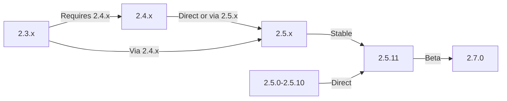

این راهنما ارتقای XOOPS را از نسخه‌های قدیمی‌تر به آخرین نسخه در حالی که داده‌ها و سفارشی‌سازی‌های شما را حفظ می‌کند، پوشش می‌دهد.

> **اطلاعات نسخه**
> - **پایدار:** XOOPS 2.5.11
> - **بتا:** XOOPS 2.7.0 (تست)
> - ** آینده:** XOOPS 4.0 (در حال توسعه - به نقشه راه مراجعه کنید)

## چک لیست قبل از ارتقا

قبل از شروع ارتقا، بررسی کنید:

- [ ] نسخه فعلی XOOPS مستند شده است
- [ ] نسخه هدف XOOPS شناسایی شد
- [ ] پشتیبان گیری کامل سیستم تکمیل شد
- [ ] پشتیبان گیری از پایگاه داده تأیید شد
- [ ] لیست ماژول های نصب شده ثبت شد
- [ ] تغییرات سفارشی مستند شده است
- [ ] محیط تست در دسترس است
- [ ] مسیر ارتقا بررسی شد (برخی نسخه ها از نسخه های میانی صرفنظر می کنند)
- [ ] منابع سرور تأیید شده (فضای دیسک کافی، حافظه)
- [ ] حالت تعمیر و نگهداری فعال است

## راهنمای مسیر ارتقا

مسیرهای ارتقای مختلف بسته به نسخه فعلی:



**مهم:** هرگز نسخه های اصلی را نادیده نگیرید. در صورت ارتقاء از 2.3.x، ابتدا به 2.4.x و سپس به 2.5.x ارتقا دهید.

## مرحله 1: پشتیبان گیری سیستم را کامل کنید

### پشتیبان گیری از پایگاه داده

از mysqldump برای پشتیبان گیری از پایگاه داده استفاده کنید:

```bash
# Full database backup
mysqldump -u xoops_user -p xoops_db > /backups/xoops_db_backup_$(date +%Y%m%d_%H%M%S).sql

# Compressed backup
mysqldump -u xoops_user -p xoops_db | gzip > /backups/xoops_db_backup_$(date +%Y%m%d_%H%M%S).sql.gz
```

یا از phpMyAdmin استفاده کنید:

1. پایگاه داده XOOPS خود را انتخاب کنید
2. روی برگه «صادرات» کلیک کنید
3. فرمت "SQL" را انتخاب کنید
4. "ذخیره به عنوان فایل" را انتخاب کنید
5. روی «برو» کلیک کنید

تایید فایل پشتیبان:

```bash
# Check backup size
ls -lh /backups/xoops_db_backup*.sql

# Verify backup integrity (uncompressed)
head -20 /backups/xoops_db_backup_*.sql

# Verify compressed backup
zcat /backups/xoops_db_backup_*.sql.gz | head -20
```

### پشتیبان گیری از سیستم فایل

پشتیبان گیری از تمام فایل های XOOPS:

```bash
# Compressed file backup
tar -czf /backups/xoops_files_$(date +%Y%m%d_%H%M%S).tar.gz /var/www/html/xoops

# Uncompressed (faster, requires more disk space)
tar -cf /backups/xoops_files_$(date +%Y%m%d_%H%M%S).tar /var/www/html/xoops

# Show backup progress
tar -czf /backups/xoops_files_$(date +%Y%m%d_%H%M%S).tar.gz --verbose /var/www/html/xoops | tail
```

بک آپ ها را به صورت ایمن ذخیره کنید:

```bash
# Secure backup storage
chmod 600 /backups/xoops_*
ls -lah /backups/

# Optional: Copy to remote storage
scp /backups/xoops_* user@backup-server:/secure/backups/
```

### تست بازیابی نسخه پشتیبان

** مهم: ** همیشه کارهای پشتیبان خود را آزمایش کنید:

```bash
# Verify tar archive contents
tar -tzf /backups/xoops_files_*.tar.gz | head -20

# Extract to test location
mkdir /tmp/restore_test
cd /tmp/restore_test
tar -xzf /backups/xoops_files_*.tar.gz

# Verify key files exist
ls -la xoops/mainfile.php
ls -la xoops/install/
```

## مرحله 2: حالت Maintenance Mode را فعال کنید

جلوگیری از دسترسی کاربران به سایت در حین ارتقا:

### گزینه 1: پنل مدیریت XOOPS

1. وارد پنل مدیریت شوید
2. به System > Maintenance بروید
3. "Site Maintenance Mode" را فعال کنید
4. پیام تعمیر و نگهداری را تنظیم کنید
5. ذخیره کنید

### گزینه 2: حالت نگهداری دستی

یک فایل تعمیر و نگهداری در ریشه وب ایجاد کنید:

```html
<!-- /var/www/html/maintenance.html -->
<!DOCTYPE html>
<html>
<head>
    <title>Under Maintenance</title>
    <style>
        body { font-family: Arial; text-align: center; padding: 50px; }
        h1 { color: #333; }
        p { color: #666; margin: 20px 0; }
    </style>
</head>
<body>
    <h1>Site Under Maintenance</h1>
    <p>We're currently upgrading our site.</p>
    <p>Expected time: approximately 30 minutes.</p>
    <p>Thank you for your patience!</p>
</body>
</html>
```

آپاچی را برای نمایش صفحه تعمیر و نگهداری پیکربندی کنید:

```apache
# In .htaccess or vhost config
ErrorDocument 503 /maintenance.html

# Redirect all traffic to maintenance page
<IfModule mod_rewrite.c>
    RewriteEngine On
    RewriteCond %{REMOTE_ADDR} !^192\.168\.1\.100$  # Your IP
    RewriteRule ^(.*)$ - [R=503,L]
</IfModule>
```

## مرحله 3: دانلود نسخه جدید

دانلود XOOPS از سایت رسمی:

```bash
# Download latest version
cd /tmp
wget https://xoops.org/download/xoops-2.5.8.zip

# Verify checksum (if provided)
sha256sum xoops-2.5.8.zip
# Compare with official SHA256 hash

# Extract to temporary location
unzip xoops-2.5.8.zip
cd xoops-2.5.8
```

## مرحله 4: آماده سازی فایل از قبل ارتقا دهید

### تغییرات سفارشی را شناسایی کنید

فایل های اصلی سفارشی شده را بررسی کنید:

```bash
# Look for modified files (files with newer mtime)
find /var/www/html/xoops -type f -newer /var/www/html/xoops/install.php

# Check for custom themes
ls /var/www/html/xoops/themes/
# Note any custom themes

# Check for custom modules
ls /var/www/html/xoops/modules/
# Note any custom modules created by you
```

### سند وضعیت فعلی

ایجاد گزارش ارتقاء:

```bash
cat > /tmp/upgrade_report.txt << EOF
=== XOOPS Upgrade Report ===
Date: $(date)
Current Version: 2.5.6
Target Version: 2.5.8

=== Installed Modules ===
$(ls /var/www/html/xoops/modules/)

=== Custom Modifications ===
[Document any custom theme or module modifications]

=== Themes ===
$(ls /var/www/html/xoops/themes/)

=== Plugin Status ===
[List any custom code modifications]

EOF
```

## مرحله 5: فایل های جدید را با نصب فعلی ادغام کنید

### استراتژی: فایل های سفارشی را حفظ کنید

فایل های هسته XOOPS را جایگزین کنید اما حفظ کنید:
- `mainfile.php` (پیکربندی پایگاه داده شما)
- تم های سفارشی در `themes/`
- ماژول های سفارشی در `modules/`
- آپلودهای کاربر در `uploads/`
- داده های سایت در `var/`

### فرآیند ادغام دستی

```bash
# Set variables
XOOPS_OLD="/var/www/html/xoops"
XOOPS_NEW="/tmp/xoops-2.5.8"
BACKUP="/backups/pre-upgrade"

# Create pre-upgrade backup in place
mkdir -p $BACKUP
cp -r $XOOPS_OLD/* $BACKUP/

# Copy new files (but preserve sensitive files)
# Copy everything except protected directories
rsync -av --exclude='mainfile.php' \
    --exclude='modules/custom*' \
    --exclude='themes/custom*' \
    --exclude='uploads' \
    --exclude='var' \
    --exclude='cache' \
    --exclude='templates_c' \
    $XOOPS_NEW/ $XOOPS_OLD/

# Verify critical files preserved
ls -la $XOOPS_OLD/mainfile.php
```

### با استفاده از upgrade.php (در صورت وجود)

برخی از نسخه های XOOPS شامل اسکریپت ارتقاء خودکار هستند:

```bash
# Copy new files with installer
cp -r /tmp/xoops-2.5.8/* /var/www/html/xoops/

# Run upgrade wizard
# Visit: http://your-domain.com/xoops/upgrade/
```

### مجوزهای فایل پس از ادغام

بازیابی مجوزهای مناسب:

```bash
# Set ownership
chown -R www-data:www-data /var/www/html/xoops

# Set directory permissions
find /var/www/html/xoops -type d -exec chmod 755 {} \;

# Set file permissions
find /var/www/html/xoops -type f -exec chmod 644 {} \;

# Make writable directories
chmod 777 /var/www/html/xoops/cache
chmod 777 /var/www/html/xoops/templates_c
chmod 777 /var/www/html/xoops/uploads
chmod 777 /var/www/html/xoops/var

# Secure mainfile.php
chmod 644 /var/www/html/xoops/mainfile.php
```

## مرحله 6: مهاجرت پایگاه داده

### تغییرات پایگاه داده را بررسی کنید

یادداشت های انتشار XOOPS را برای تغییرات ساختار پایگاه داده بررسی کنید:

```bash
# Extract and review SQL migration files
find /tmp/xoops-2.5.8 -name "*.sql" -type f
# Document all .sql files found
```

### به‌روزرسانی‌های پایگاه داده را اجرا کنید

### گزینه 1: به روز رسانی خودکار (در صورت وجود)

استفاده از پنل مدیریت:

1. وارد ادمین شوید
2. به **سیستم > پایگاه داده** بروید
3. روی «بررسی به‌روزرسانی‌ها» کلیک کنید
4. تغییرات معلق را بررسی کنید
5. روی «اعمال به‌روزرسانی‌ها» کلیک کنید

### گزینه 2: به روز رسانی دستی پایگاه داده

اجرای مهاجرت فایل های SQL:

```bash
# Connect to database
mysql -u xoops_user -p xoops_db

# View pending changes (varies by version)
SELECT * FROM xoops_config WHERE conf_name LIKE '%version%';

# Run migration scripts manually if needed
SOURCE /tmp/xoops-2.5.8/migrate_2.5.6_to_2.5.8.sql;
```

### تایید پایگاه داده

بررسی یکپارچگی پایگاه داده پس از به روز رسانی:

```sql
-- Check database consistency
REPAIR TABLE xoops_users;
OPTIMIZE TABLE xoops_users;

-- Verify key tables exist
SHOW TABLES LIKE 'xoops_%';

-- Check row counts (should increase or stay same)
SELECT COUNT(*) FROM xoops_users;
SELECT COUNT(*) FROM xoops_posts;
```

## مرحله 7: تأیید ارتقا

### صفحه اصلی را بررسی کنید

از صفحه اصلی XOOPS خود دیدن کنید:

```
http://your-domain.com/xoops/
```

مورد انتظار: صفحه بدون خطا بارگیری می شود، به درستی نمایش داده می شود

### پنل مدیریت را بررسی کنید

دسترسی به ادمین:

```
http://your-domain.com/xoops/admin/
```

تأیید کنید:
- [ ] پنل مدیریت بارگیری می شود
- [ ] ناوبری کار می کند
- [ ] داشبورد به درستی نمایش داده می شود
- [ ] هیچ خطای پایگاه داده در گزارش ها وجود ندارد

### تایید ماژول

بررسی ماژول های نصب شده:

1. به مسیر **Modules > Modules** در admin بروید
2. بررسی کنید که همه ماژول ها هنوز نصب شده اند
3. هرگونه پیام خطا را بررسی کنید
4. هر ماژول غیرفعال شده را فعال کنید

### فایل لاگ را بررسی کنیدگزارش های سیستم را برای خطاها بررسی کنید:

```bash
# Check web server error log
tail -50 /var/log/apache2/error.log

# Check PHP error log
tail -50 /var/log/php_errors.log

# Check XOOPS system log (if available)
# In admin panel: System > Logs
```

### تست توابع هسته

- [ ] کاربر login/logout کار می کند
- [ ] ثبت نام کاربر کار می کند
- [ ] توابع آپلود فایل
- [ ] اعلان های ایمیل ارسال می شود
- [ ] قابلیت جستجو کار می کند
- [ ] توابع مدیریت عملیاتی است
- [ ] عملکرد ماژول دست نخورده است

## مرحله 8: پاکسازی پس از ارتقا

### فایل های موقت را حذف کنید

```bash
# Remove extraction directory
rm -rf /tmp/xoops-2.5.8

# Clear template cache (safe to delete)
rm -rf /var/www/html/xoops/templates_c/*

# Clear site cache
rm -rf /var/www/html/xoops/cache/*
```

### حالت Maintenance را حذف کنید

دسترسی عادی به سایت را دوباره فعال کنید:

```apache
# Remove maintenance mode redirect from .htaccess
# Or delete maintenance.html file
rm /var/www/html/maintenance.html
```

### به روز رسانی اسناد

یادداشت های ارتقای خود را به روز کنید:

```bash
# Document successful upgrade
cat >> /tmp/upgrade_report.txt << EOF

=== Upgrade Results ===
Status: SUCCESS
Upgrade Date: $(date)
New Version: 2.5.8
Duration: [time in minutes]

Post-Upgrade Tests:
- [x] Homepage loads
- [x] Admin panel accessible
- [x] Modules functional
- [x] User registration works
- [x] Database optimized

EOF
```

## عیب یابی ارتقا

### مسئله: صفحه سفید خالی پس از ارتقا

** علامت: ** صفحه اصلی چیزی را نشان نمی دهد

**راه حل:**
```bash
# Check PHP errors
tail -f /var/log/apache2/error.log

# Enable debug mode temporarily
echo "define('XOOPS_DEBUG', 1);" >> /var/www/html/xoops/mainfile.php

# Check file permissions
ls -la /var/www/html/xoops/mainfile.php

# Restore from backup if needed
cp /backups/xoops_files_*.tar.gz /tmp/
cd /tmp && tar -xzf xoops_files_*.tar.gz
```

### مشکل: خطای اتصال پایگاه داده

** علامت: ** پیام "نمی توان به پایگاه داده متصل شد".

**راه حل:**
```bash
# Verify database credentials in mainfile.php
grep -i "database\|host\|user" /var/www/html/xoops/mainfile.php

# Test connection
mysql -h localhost -u xoops_user -p xoops_db -e "SELECT 1"

# Check MySQL status
systemctl status mysql

# Verify database still exists
mysql -u xoops_user -p -e "SHOW DATABASES" | grep xoops
```

### مشکل: پنل مدیریت در دسترس نیست

**علامت:** نمی توان به /xoops/admin/ دسترسی پیدا کرد

**راه حل:**
```bash
# Check .htaccess rules
cat /var/www/html/xoops/.htaccess

# Verify admin files exist
ls -la /var/www/html/xoops/admin/

# Check mod_rewrite enabled
apache2ctl -M | grep rewrite

# Restart web server
systemctl restart apache2
```

### مشکل: ماژول ها بارگیری نمی شوند

**علامت:** ماژول ها خطا را نشان می دهند یا غیرفعال می شوند

**راه حل:**
```bash
# Verify module files exist
ls /var/www/html/xoops/modules/

# Check module permissions
ls -la /var/www/html/xoops/modules/*/

# Check module configuration in database
mysql -u xoops_user -p xoops_db -e "SELECT * FROM xoops_modules WHERE module_status = 0"

# Reactivate modules in admin panel
# System > Modules > Click module > Update Status
```

### مسئله: خطاهای مجوز رد شده

** علامت: ** "اجازه رد شد" هنگام آپلود یا ذخیره

**راه حل:**
```bash
# Check file ownership
ls -la /var/www/html/xoops/ | head -20

# Fix ownership
chown -R www-data:www-data /var/www/html/xoops

# Fix directory permissions
find /var/www/html/xoops -type d -exec chmod 755 {} \;

# Make cache/uploads writable
chmod 777 /var/www/html/xoops/cache
chmod 777 /var/www/html/xoops/templates_c
chmod 777 /var/www/html/xoops/uploads
chmod 777 /var/www/html/xoops/var
```

### مسئله: بارگذاری کند صفحه

**علامت:** صفحات پس از ارتقا بسیار آهسته بارگذاری می شوند

**راه حل:**
```bash
# Clear all caches
rm -rf /var/www/html/xoops/cache/*
rm -rf /var/www/html/xoops/templates_c/*

# Optimize database
mysql -u xoops_user -p xoops_db << EOF
OPTIMIZE TABLE xoops_users;
OPTIMIZE TABLE xoops_posts;
OPTIMIZE TABLE xoops_config;
ANALYZE TABLE xoops_users;
EOF

# Check PHP error log for warnings
grep -i "deprecated\|warning" /var/log/php_errors.log | tail -20

# Increase PHP memory/execution time temporarily
# Edit php.ini:
memory_limit = 256M
max_execution_time = 300
```

## روش بازگشت

اگر ارتقا به طور جدی انجام نشد، از پشتیبان بازیابی کنید:

### بازیابی پایگاه داده

```bash
# Restore from backup
mysql -u xoops_user -p xoops_db < /backups/xoops_db_backup_YYYYMMDD_HHMMSS.sql

# Or from compressed backup
gunzip < /backups/xoops_db_backup_YYYYMMDD_HHMMSS.sql.gz | mysql -u xoops_user -p xoops_db

# Verify restoration
mysql -u xoops_user -p xoops_db -e "SELECT COUNT(*) FROM xoops_users"
```

### بازیابی سیستم فایل

```bash
# Stop web server
systemctl stop apache2

# Remove current installation
rm -rf /var/www/html/xoops/*

# Extract backup
cd /var/www/html
tar -xzf /backups/xoops_files_YYYYMMDD_HHMMSS.tar.gz

# Fix permissions
chown -R www-data:www-data xoops/
find xoops -type d -exec chmod 755 {} \;
find xoops -type f -exec chmod 644 {} \;
chmod 777 xoops/cache xoops/templates_c xoops/uploads xoops/var

# Start web server
systemctl start apache2

# Verify restoration
# Visit http://your-domain.com/xoops/
```

## چک لیست تأیید ارتقاء

پس از تکمیل ارتقا، تأیید کنید:

- [ ] نسخه XOOPS به روز شد (مدیریت > اطلاعات سیستم را بررسی کنید)
- [ ] صفحه اصلی بدون خطا بارگیری می شود
- [ ] همه ماژول ها کاربردی هستند
- [ ] ورود کاربر کار می کند
- [ ] پنل مدیریت در دسترس است
- [ ] آپلود فایل کار می کند
- [ ] اعلان های ایمیل کاربردی است
- [ ] یکپارچگی پایگاه داده تایید شده است
- [ ] مجوزهای فایل درست است
- [ ] حالت تعمیر و نگهداری حذف شد
- [ ] نسخه های پشتیبان ایمن و آزمایش شده است
- [ ] عملکرد قابل قبول است
- [ ] SSL/HTTPS کار می کند
- [ ] هیچ پیام خطایی در گزارش‌ها وجود ندارد

## مراحل بعدی

پس از ارتقاء موفقیت آمیز:

1. هر ماژول سفارشی را به آخرین نسخه به روز کنید
2. یادداشت های انتشار را برای ویژگی های منسوخ بررسی کنید
3. بهینه سازی عملکرد را در نظر بگیرید
4. تنظیمات امنیتی را به روز کنید
5. تمام عملکردها را به طور کامل تست کنید
6. فایل های پشتیبان را ایمن نگه دارید

---

**برچسب ها:** #ارتقای #نگهداری #پشتیبان گیری #پایگاه داده-مهاجرت

**مقالات مرتبط:**
- ../../06-Publisher-Module/User-Guide/Installation
- سرور مورد نیاز
- ../Configuration/Basic-Configuration
- ../Configuration/Security-Configuration