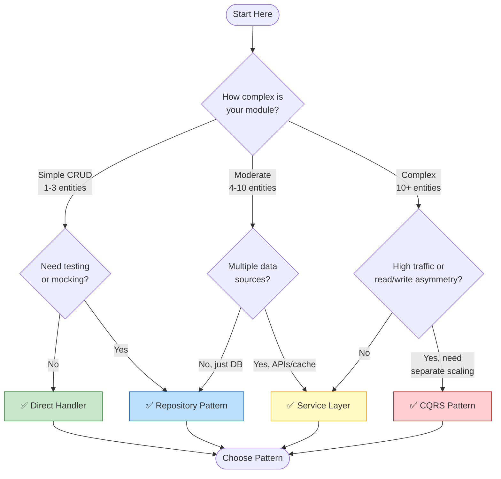
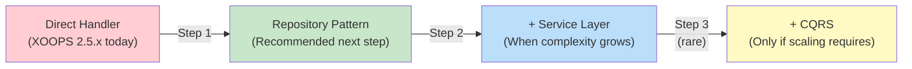

<span class="version-badge version-25x">2.5.x ✅</span> <span class="version-badge version-40x">4.0.x ✅</span>

> **از کدام الگو باید استفاده کنم؟** این درخت تصمیم به شما کمک می کند بین کنترل کننده های مستقیم، الگوی مخزن، لایه سرویس و CQRS انتخاب کنید.

---

## درخت تصمیم گیری سریع



---

## مقایسه الگوها

| معیارها | مدیریت مستقیم | مخزن | لایه سرویس | CQRS |
|----------|--------------|------------|-------------|------|
| **پیچیدگی** | ⭐ | ⭐⭐ | ⭐⭐⭐ | ⭐⭐⭐⭐⭐ |
| **آزمایش پذیری** | ❌ سخت | ✅ خوب | ✅ عالی | ✅ عالی |
| **انعطاف پذیری** | ❌ کم | ✅ متوسط ​​| ✅ بالا | ✅ بسیار بالا |
| **XOOPS 2.5.x** | ✅ بومی | ✅ آثار | ✅ آثار | ⚠️ مجتمع |
| **XOOPS 4.0** | ⚠️ منسوخ شده | ✅ پیشنهادی | ✅ پیشنهادی | ✅ برای ترازو |
| **اندازه تیم** | 1 برنامه نویس | 1-3 توسعه دهنده | 2-5 برنامه نویس | 5+ برنامه نویس |
| **نگهداری** | ❌ بالاتر | ✅ متوسط ​​| ✅ پایین | ⚠️نیازمند تخصص |

---

## زمان استفاده از هر الگو

### ✅ مدیریت مستقیم (`XoopsPersistableObjectHandler`)

**بهترین برای:** ماژول های ساده، نمونه های اولیه سریع، یادگیری XOOPS

```php
// Simple and direct - good for small modules
$handler = xoops_getModuleHandler('article', 'news');
$articles = $handler->getObjects(new Criteria('status', 1));
```

**این را زمانی انتخاب کنید که:**
- ساخت یک ماژول ساده با 1-3 جدول پایگاه داده
- ایجاد یک نمونه اولیه سریع
- شما تنها توسعه دهنده هستید و نیازی به آزمایش ندارید
- ماژول رشد قابل توجهی نخواهد داشت

**محدودیت ها:**
- آزمون واحد سخت (وابستگی جهانی)
- اتصال محکم به لایه پایگاه داده XOOPS
- منطق کسب و کار تمایل دارد به کنترلرها نفوذ کند

---

### ✅ الگوی مخزن

**بهترین برای:** اکثر ماژول ها، تیم هایی که خواهان آزمایش پذیری هستند

```php
// Abstraction allows mocking for tests
interface ArticleRepositoryInterface {
    public function findPublished(): array;
    public function save(Article $article): void;
}

class XoopsArticleRepository implements ArticleRepositoryInterface {
    private $handler;

    public function __construct() {
        $this->handler = xoops_getModuleHandler('article', 'news');
    }

    public function findPublished(): array {
        return $this->handler->getObjects(new Criteria('status', 1));
    }
}
```

**این را زمانی انتخاب کنید که:**
- می خواهید تست های واحد بنویسید
- ممکن است بعداً منابع داده را تغییر دهید (DB → API)
- کار با بیش از 2 توسعه دهنده
- ساخت ماژول برای توزیع

**مسیر ارتقا:** این الگوی توصیه شده برای آماده سازی XOOPS 4.0 است.

---

### ✅ لایه سرویس

**بهترین برای:** ماژول هایی با منطق تجاری پیچیده

```php
// Service coordinates multiple repositories and contains business rules
class ArticlePublicationService {
    public function __construct(
        private ArticleRepositoryInterface $articles,
        private NotificationServiceInterface $notifications,
        private CacheInterface $cache
    ) {}

    public function publish(int $articleId): void {
        $article = $this->articles->find($articleId);
        $article->setStatus('published');
        $article->setPublishedAt(new DateTime());

        $this->articles->save($article);
        $this->notifications->notifySubscribers($article);
        $this->cache->invalidate("article:{$articleId}");
    }
}
```

**این را زمانی انتخاب کنید که:**
- عملیات شامل چندین منبع داده است
- قوانین تجاری پیچیده هستند
- شما به مدیریت تراکنش نیاز دارید
- چندین قسمت از برنامه همین کار را انجام می دهند

**مسیر ارتقا:** برای یک معماری قوی با مخزن ترکیب کنید.

---

### ⚠️ CQRS (تفکیک مسئولیت پرس و جوی فرمان)

**بهترین برای:** ماژول های مقیاس بالا با عدم تقارن read/write

```php
// Commands modify state
class PublishArticleCommand {
    public function __construct(
        public readonly int $articleId,
        public readonly int $publisherId
    ) {}
}

// Queries read state (can use denormalized read models)
class GetPublishedArticlesQuery {
    public function __construct(
        public readonly int $limit = 10
    ) {}
}
```

**این را زمانی انتخاب کنید که:**
- خواندن بسیار بیشتر از تعداد نوشته ها (100:1 یا بیشتر)
- برای خواندن در مقابل نوشتن به مقیاس بندی متفاوتی نیاز دارید
- الزامات پیچیده reporting/analytics
- منبع یابی رویداد به دامنه شما کمک می کند

**هشدار:** CQRS پیچیدگی قابل توجهی را اضافه می کند. اکثر ماژول های XOOPS به آن نیاز ندارند.

---

## مسیر ارتقای توصیه شده



### مرحله 1: دسته‌ها را در مخازن قرار دهید (2-4 ساعت)

1. یک رابط برای نیازهای دسترسی به داده خود ایجاد کنید
2. آن را با استفاده از کنترل کننده موجود پیاده سازی کنید
3. به جای تماس مستقیم با `xoops_getModuleHandler()`، مخزن را تزریق کنید

### مرحله 2: اضافه کردن لایه سرویس در صورت نیاز (1-2 روز)

1. هنگامی که منطق تجاری در کنترلرها ظاهر می شود، به یک سرویس استخراج کنید
2. سرویس از مخازن استفاده می کند، نه از کنترل کننده ها به طور مستقیم
3. کنترلرها نازک می شوند (مسیر → سرویس → پاسخ)

### مرحله 3: CQRS را فقط در صورتی در نظر بگیرید (نادر)

1. روزانه میلیون ها مطالعه دارید
2. مدل های خواندن و نوشتن تفاوت قابل توجهی دارند
3. برای مسیرهای حسابرسی به منبع رویداد نیاز دارید
4. شما یک تیم با تجربه با CQRS دارید

---

## کارت مرجع سریع

| سوال | پاسخ |
|----------|--------|
| **"من فقط به داده های save/load نیاز دارم"** | مدیریت مستقیم |
| **"می خواهم تست بنویسم"** | الگوی مخزن |
| **"من قوانین تجاری پیچیده ای دارم"** | لایه سرویس |
| **"من نیاز به مقیاس خواندن جداگانه دارم"** | CQRS |
| **"من برای XOOPS 4.0 آماده می شوم"** | مخزن + لایه سرویس |

---

## مستندات مرتبط- [راهنمای الگوی مخزن](Patterns/Repository-Pattern.md)
- [راهنمای الگوی لایه سرویس](Patterns/Service-Layer-Pattern.md)
- [راهنمای الگوی CQRS](../07-XOOPS-4.0/Implementation-Guides/CQRS-Pattern-Guide.md) *(پیشرفته)*
- [قرارداد حالت هیبریدی](../07-XOOPS-4.0/Specifications/Hybrid-Mode-Contract.md)

---

#الگوها #دسترسی به داده ها #درخت تصمیم #بهترین شیوه ها #xoops