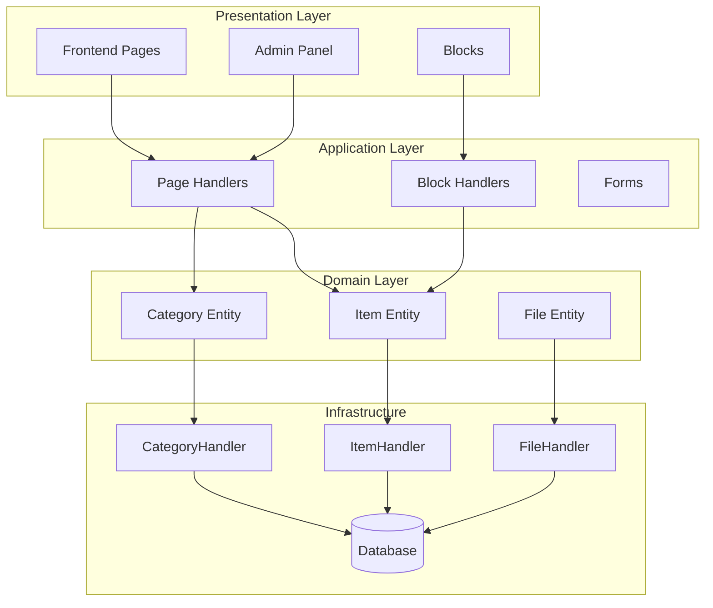
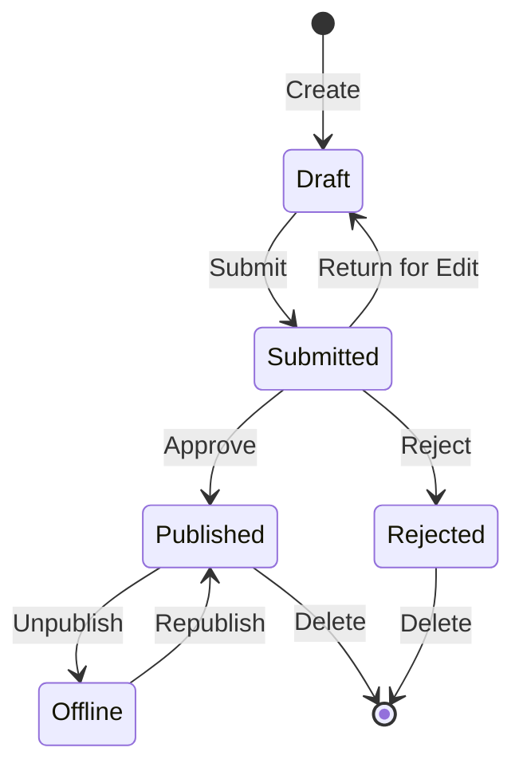

## بررسی اجمالی

این سند یک تحلیل فنی از معماری ماژول ناشر، الگوها و جزئیات پیاده سازی ارائه می دهد. از این به عنوان مرجع برای درک چگونگی ساختار یک ماژول XOOPS با کیفیت تولید استفاده کنید.

## مروری بر معماری



## ساختار دایرکتوری

```
publisher/
├── admin/
│   ├── index.php           # Admin dashboard
│   ├── item.php            # Article management
│   ├── category.php        # Category management
│   ├── permission.php      # Permissions
│   ├── file.php            # File manager
│   └── menu.php            # Admin menu
├── assets/
│   ├── css/
│   ├── js/
│   └── images/
├── class/
│   ├── Category.php        # Category entity
│   ├── CategoryHandler.php # Category data access
│   ├── Item.php            # Article entity
│   ├── ItemHandler.php     # Article data access
│   ├── File.php            # File attachment
│   ├── FileHandler.php     # File data access
│   ├── Form/               # Form classes
│   ├── Common/             # Utilities
│   └── Helper.php          # Module helper
├── include/
│   ├── common.php          # Initialization
│   ├── functions.php       # Utility functions
│   ├── oninstall.php       # Install hooks
│   ├── onupdate.php        # Update hooks
│   └── search.php          # Search integration
├── language/
├── templates/
├── sql/
└── xoops_version.php
```

## تجزیه و تحلیل موجودیت

### مورد (مقاله) نهاد

```php
class Item extends \XoopsObject
{
    // Fields
    public function initVar(): void
    {
        $this->initVar('itemid', XOBJ_DTYPE_INT, null, false);
        $this->initVar('categoryid', XOBJ_DTYPE_INT, 0, false);
        $this->initVar('title', XOBJ_DTYPE_TXTBOX, '', true);
        $this->initVar('subtitle', XOBJ_DTYPE_TXTBOX, '');
        $this->initVar('summary', XOBJ_DTYPE_TXTAREA, '');
        $this->initVar('body', XOBJ_DTYPE_TXTAREA, '', true);
        $this->initVar('uid', XOBJ_DTYPE_INT, 0);
        $this->initVar('status', XOBJ_DTYPE_INT, 0);
        $this->initVar('datesub', XOBJ_DTYPE_INT, time());
        // ... more fields
    }

    // Business methods
    public function isPublished(): bool
    {
        return $this->getVar('status') == _PUBLISHER_STATUS_PUBLISHED;
    }

    public function canEdit(int $userId): bool
    {
        return $this->getVar('uid') == $userId
            || $this->isAdmin($userId);
    }
}
```

### الگوی هندلر

```php
class ItemHandler extends \XoopsPersistableObjectHandler
{
    public function __construct(\XoopsDatabase $db)
    {
        parent::__construct(
            $db,
            'publisher_items',
            Item::class,
            'itemid',
            'title'
        );
    }

    public function getPublishedItems(int $limit = 10): array
    {
        $criteria = new \CriteriaCompo();
        $criteria->add(new \Criteria('status', _PUBLISHER_STATUS_PUBLISHED));
        $criteria->setSort('datesub');
        $criteria->setOrder('DESC');
        $criteria->setLimit($limit);

        return $this->getObjects($criteria);
    }
}
```

## سیستم مجوز

### انواع مجوز

| مجوز | توضیحات |
|------------|-------------|
| `publisher_view` | مشاهده category/articles |
| `publisher_submit` | ارسال مقالات جدید |
| `publisher_approve` | تایید خودکار مطالب ارسالی |
| `publisher_moderate` | بررسی مقالات در حال انتظار |
| `publisher_global` | مجوزهای ماژول جهانی |

### بررسی مجوز

```php
class PermissionHandler
{
    public function isGranted(string $permission, int $categoryId): bool
    {
        $userId = $GLOBALS['xoopsUser']?->uid() ?? 0;
        $groups = $this->getUserGroups($userId);

        return $this->grouppermHandler->checkRight(
            $permission,
            $categoryId,
            $groups,
            $this->helper->getModule()->mid()
        );
    }
}
```

## وضعیت گردش کار



## ساختار قالب

### قالب های Frontend

| الگو | هدف |
|----------|---------|
| `publisher_index.tpl` | صفحه اصلی ماژول |
| `publisher_item.tpl` | تک مقاله |
| `publisher_category.tpl` | فهرست بندی دسته ها |
| `publisher_submit.tpl` | فرم ارسال |
| `publisher_search.tpl` | نتایج جستجو |

### قالب ها را مسدود کنید

| الگو | هدف |
|----------|---------|
| `publisher_block_latest.tpl` | مقالات اخیر |
| `publisher_block_spotlight.tpl` | مقاله برگزیده |
| `publisher_block_category.tpl` | منوی دسته بندی |

## الگوهای کلیدی استفاده شده است

1. ** الگوی Handler ** - کپسوله کردن دسترسی به داده ها
2. **ارزش شی** - ثابت های وضعیت
3. **روش قالب** - تولید فرم
4. ** استراتژی ** - حالت های مختلف نمایش
5. ** ناظر ** - اطلاعیه ها در مورد رویدادها

## درس برای توسعه ماژول

1. از XoopsPersistableObjectHandler برای CRUD استفاده کنید
2. مجوزهای granular را پیاده سازی کنید
3. ارائه را از منطق جدا کنید
4. برای پرس و جو از معیارها استفاده کنید
5. پشتیبانی از چندین وضعیت محتوا
6. ادغام با سیستم اطلاع رسانی XOOPS

## مستندات مرتبط

- ایجاد-مقالات - مدیریت مقاله
- مدیریت-دسته ها - سیستم دسته بندی
- Permissions-Setup - Permission Configuration
- Developer-Guide/Hooks-and-Events - نقاط پسوند