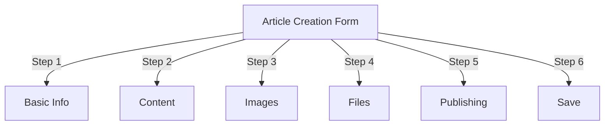
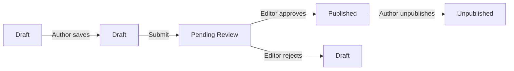
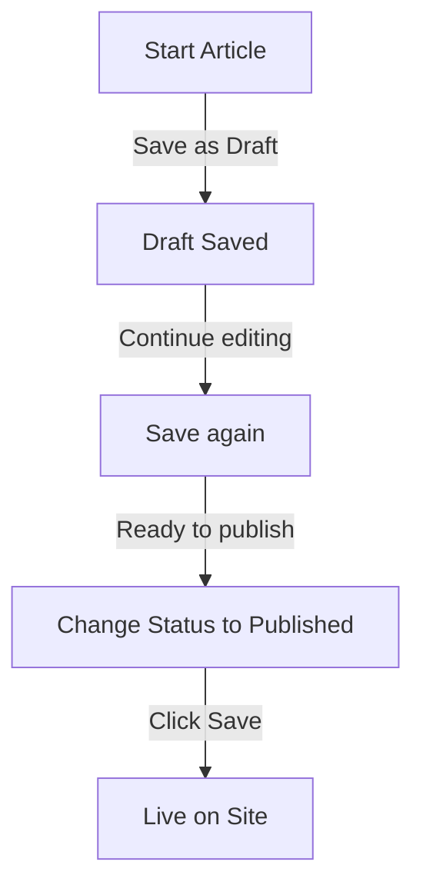

# ایجاد مقاله در Publisher

> راهنمای گام به گام ایجاد، ویرایش، قالب بندی و انتشار مقالات در ماژول Publisher.

---

## دسترسی به مدیریت مقاله

### ناوبری پنل مدیریت

```
Admin Panel
└── Modules
    └── Publisher
        └── Articles
            ├── Create New
            ├── Edit
            ├── Delete
            └── Publish
```

### سریعترین مسیر

1. به عنوان **Administrator** وارد شوید
2. روی **Modules** در نوار مدیریت کلیک کنید
3. **ناشر** را پیدا کنید
4. روی لینک **Admin** کلیک کنید
5. روی **Articles** در منوی سمت چپ کلیک کنید
6. روی دکمه **افزودن مقاله** کلیک کنید

---

## فرم ایجاد مقاله

### اطلاعات اولیه

هنگام ایجاد یک مقاله جدید، بخش های زیر را پر کنید:



---

## مرحله 1: اطلاعات اولیه

### فیلدهای مورد نیاز

#### عنوان مقاله

```
Field: Title
Type: Text input (required)
Max length: 255 characters
Example: "Top 5 Tips for Better Photography"
```

**راهنما:**
- توصیفی و اختصاصی
- شامل کلمات کلیدی برای سئو
- از ALL CAPS اجتناب کنید
- برای بهترین نمایش، کمتر از 60 کاراکتر را نگه دارید

#### دسته را انتخاب کنید

```
Field: Category
Type: Dropdown (required)
Options: List of created categories
Example: Photography > Tutorials
```

**نکات:**
- والدین و زیرمجموعه های موجود است
- مرتبط ترین دسته را انتخاب کنید
- فقط یک دسته در هر مقاله
- بعدا قابل تغییر است

#### زیرنویس مقاله (اختیاری)

```
Field: Subtitle
Type: Text input (optional)
Max length: 255 characters
Example: "Learn photography fundamentals in 5 easy steps"
```

**استفاده برای:**
- تیتر خلاصه
- متن تیزر
- عنوان تمدید شده

### توضیحات مقاله

#### توضیحات کوتاه

```
Field: Short Description
Type: Textarea (optional)
Max length: 500 characters
```

**هدف:**
- متن پیش نمایش مقاله
- نمایش در لیست دسته
- در نتایج جستجو استفاده می شود
- توضیحات متا برای سئو

**مثال:**
```
"Discover essential photography techniques that will transform your photos
from ordinary to extraordinary. This comprehensive guide covers composition,
lighting, and exposure settings."
```

#### مطالب کامل

```
Field: Article Body
Type: WYSIWYG Editor (required)
Max length: Unlimited
Format: HTML
```

منطقه محتوای اصلی مقاله با ویرایش متن غنی.

---

## مرحله 2: قالب بندی محتوا

### با استفاده از ویرایشگر WYSIWYG

#### قالب بندی متن

```
Bold:           Ctrl+B or click [B] button
Italic:         Ctrl+I or click [I] button
Underline:      Ctrl+U or click [U] button
Strikethrough:  Alt+Shift+D or click [S] button
Subscript:      Ctrl+, (comma)
Superscript:    Ctrl+. (period)
```

#### ساختار سرفصل

ایجاد سلسله مراتب سند مناسب:

```html
<h1>Article Title</h1>      <!-- Use once at top -->
<h2>Main Section</h2>        <!-- For major sections -->
<h3>Subsection</h3>          <!-- For subtopics -->
<h4>Sub-subsection</h4>      <!-- For details -->
```

**در ویرایشگر:**
- روی پنجره کشویی **Format** کلیک کنید
- انتخاب سطح عنوان (H1-H6)
- عنوان خود را تایپ کنید

#### لیست ها

**لیست نامرتب (گلوله):**

```markdown
• Point one
• Point two
• Point three
```

مراحل در ویرایشگر:
1. دکمه [≡] لیست گلوله را کلیک کنید
2. هر نقطه را تایپ کنید
3. Enter را برای مورد بعدی فشار دهید
4. Backspace را دوبار فشار دهید تا لیست پایان یابد

**لیست سفارش (شماره دار):**

```markdown
1. First step
2. Second step
3. Third step
```

مراحل در ویرایشگر:
1. روی دکمه فهرست شماره گذاری شده [1.] کلیک کنید
2. هر مورد را تایپ کنید
3. Enter را برای بعدی فشار دهید
4. Backspace را دوبار فشار دهید تا به پایان برسد

**لیست های تو در تو:**

```markdown
1. Main point
   a. Sub-point
   b. Sub-point
2. Next point
```

مراحل:
1. اولین لیست را ایجاد کنید
2. Tab را برای تورفتگی فشار دهید
3. آیتم های تودرتو ایجاد کنید
4. Shift+Tab را برای outdent فشار دهید

#### پیوندها

**افزودن هایپرلینک:**

1. متن را برای پیوند انتخاب کنید
2. روی دکمه **[👇] پیوند** کلیک کنید
3. URL را وارد کنید: `https://example.com`
4. اختیاری: title/target را اضافه کنید
5. روی **درج پیوند** کلیک کنید

**حذف لینک:**

1. در متن پیوند شده کلیک کنید
2. روی دکمه **[🔗] Remove Link** کلیک کنید

#### کد و نقل قول

**بلاک نقل قول:**

```
"This is an important quote from an expert"
- Attribution
```

مراحل:
1. متن نقل قول را تایپ کنید
2. روی دکمه **[❝] Blockquote** کلیک کنید
3. متن دارای تورفتگی و سبک است

**بلاک کد:**

```python
def hello_world():
    print("Hello, World!")
```

مراحل:
1. روی **Format → Code** کلیک کنید
2. کد را بچسبانید
3. زبان را انتخاب کنید (اختیاری)
4. نمایش کد با برجسته نحو

---

## مرحله 3: اضافه کردن تصاویر

### تصویر ویژه (تصویر قهرمان)

```
Field: Featured Image / Main Image
Type: Image upload
Format: JPG, PNG, GIF, WebP
Max size: 5 MB
Recommended: 600x400 px
```

**برای آپلود:**

1. روی دکمه **آپلود تصویر** کلیک کنید
2. تصویر را از رایانه انتخاب کنید
3. در صورت نیاز Crop/resize
4. روی **استفاده از این تصویر** کلیک کنید

**جایگاه تصویر:**
- در بالای مقاله نمایش داده می شود
- در لیست های دسته بندی استفاده می شود
- در آرشیو نشان داده شده است
- برای اشتراک گذاری اجتماعی استفاده می شود

### تصاویر درون خطی

درج تصاویر در متن مقاله:

1. مکان نما را در ویرایشگر جایی قرار دهید که تصویر باید برود
2. روی دکمه **[🖼️] Image** در نوار ابزار کلیک کنید
3. گزینه آپلود را انتخاب کنید:
   - آپلود تصویر جدید
   - از گالری انتخاب کنید
   - آدرس تصویر را وارد کنید
4. پیکربندی:
 
  ```
   Image Size:
   - Width: 300-600 px
   - Height: Auto (maintains ratio)
   - Alignment: Left/Center/Right
 
  ```
5. روی **درج تصویر** کلیک کنید

**پیچ دادن متن به دور تصویر:**

در ویرایشگر پس از درج:

```html
<!-- Image floats left, text wraps around -->

```

### گالری تصاویر

ایجاد گالری چند تصویری:

1. روی دکمه **گالری** کلیک کنید (در صورت موجود بودن)
2. بارگذاری چندین تصویر:
   - یک کلیک: اضافه کردن یک
   - کشیدن و رها کردن: اضافه کردن چند
3. ترتیب را با کشیدن
4. برای هر تصویر زیرنویس تنظیم کنید
5. روی **ایجاد گالری** کلیک کنید

---

## مرحله 4: پیوست کردن فایل ها

### پیوست های فایل را اضافه کنید

```
Field: File Attachments
Type: File upload (multiple allowed)
Supported: PDF, DOC, XLS, ZIP, etc.
Max per file: 10 MB
Max per article: 5 files
```**برای پیوست:**

1. روی دکمه **افزودن فایل** کلیک کنید
2. فایل را از کامپیوتر انتخاب کنید
3. اختیاری: اضافه کردن توضیحات فایل
4. روی **Attach File** کلیک کنید
5. برای چندین فایل تکرار کنید

**نمونه های فایل:**
- راهنمای PDF
- صفحات گسترده اکسل
- اسناد Word
- آرشیو ZIP
- کد منبع

### فایل های پیوست شده را مدیریت کنید

**ویرایش فایل:**

1. روی نام فایل کلیک کنید
2. توضیحات را ویرایش کنید
3. روی **ذخیره** کلیک کنید

**حذف فایل:**

1. فایل را در لیست پیدا کنید
2. روی نماد **[×] Delete** کلیک کنید
3. حذف را تایید کنید

---

## مرحله 5: انتشار و وضعیت

### وضعیت مقاله

```
Field: Status
Type: Dropdown
Options:
  - Draft: Not published, only author sees
  - Pending: Waiting for approval
  - Published: Live on site
  - Archived: Old content
  - Unpublished: Was published, now hidden
```

** وضعیت گردش کار:**



### گزینه های انتشار

#### فورا منتشر کنید

```
Status: Published
Start Date: Today (auto-filled)
End Date: (leave blank for no expiration)
```

#### برنامه برای بعد

```
Status: Scheduled
Start Date: Future date/time
Example: February 15, 2024 at 9:00 AM
```

مقاله در زمان مشخص شده به طور خودکار منتشر می شود.

#### انقضا را تنظیم کنید

```
Enable Expiration: Yes
Expiration Date: Future date
Action: Archive/Hide/Delete
Example: April 1, 2024 (article auto-archives)
```

### گزینه های مشاهده

```yaml
Show Article:
  - Display on front page: Yes/No
  - Show in category: Yes/No
  - Include in search: Yes/No
  - Include in recent articles: Yes/No

Featured Article:
  - Mark as featured: Yes/No
  - Featured section position: (number)
```

---

## مرحله 6: SEO و ابرداده

### تنظیمات SEO

```
Field: SEO Settings (Expand section)
```

#### توضیحات متا

```
Field: Meta Description
Type: Text (160 characters recommended)
Used by: Search engines, social media

Example:
"Learn photography fundamentals in 5 easy steps.
Discover composition, lighting, and exposure techniques."
```

#### متا کلمات کلیدی

```
Field: Meta Keywords
Type: Comma-separated list
Max: 5-10 keywords

Example: Photography, Tutorial, Composition, Lighting, Exposure
```

#### URL Slug

```
Field: URL Slug (auto-generated from title)
Type: Text
Format: lowercase, hyphens, no spaces

Auto: "top-5-tips-for-better-photography"
Edit: Change before publishing
```

#### تگ های نمودار را باز کنید

تولید خودکار از اطلاعات مقاله:
- عنوان
- توضیحات
- تصویر برجسته
- آدرس مقاله
- تاریخ انتشار

توسط فیس بوک، لینکدین، واتس اپ و غیره استفاده می شود.

---

## مرحله 7: نظرات و تعامل

### تنظیمات نظر

```yaml
Allow Comments:
  - Enable: Yes/No
  - Default: Inherit from preferences
  - Override: Specific to this article

Moderate Comments:
  - Require approval: Yes/No
  - Default: Inherit from preferences
```

### تنظیمات رتبه بندی

```yaml
Allow Ratings:
  - Enable: Yes/No
  - Scale: 5 stars (default)
  - Show average: Yes/No
  - Show count: Yes/No
```

---

## مرحله 8: گزینه های پیشرفته

### نویسنده و خط

```
Field: Author
Type: Dropdown
Default: Current user
Options: All users with author permission

Display:
  - Show author name: Yes/No
  - Show author bio: Yes/No
  - Show author avatar: Yes/No
```

### ویرایش قفل

```
Field: Edit Lock
Purpose: Prevent accidental changes

Lock Article:
  - Locked: Yes/No
  - Lock reason: "Final version"
  - Unlock date: (optional)
```

### تاریخچه تجدید نظر

نسخه های ذخیره شده خودکار مقاله:

```
View Revisions:
  - Click "Revision History"
  - Shows all saved versions
  - Compare versions
  - Restore previous version
```

---

## ذخیره و انتشار

### گردش کار را ذخیره کنید



### مقاله را ذخیره کنید

**ذخیره خودکار:**
- هر 60 ثانیه فعال می شود
- به صورت خودکار به عنوان پیش نویس ذخیره می شود
- نمایش "آخرین ذخیره: 2 دقیقه پیش"

**ذخیره دستی:**
- برای ادامه ویرایش روی **ذخیره و ادامه** کلیک کنید
- برای مشاهده نسخه منتشر شده روی **ذخیره و مشاهده** کلیک کنید
- برای ذخیره و بستن روی **ذخیره** کلیک کنید

### مقاله را منتشر کنید

1. تنظیم **وضعیت**: منتشر شده است
2. تنظیم **تاریخ شروع**: اکنون (یا تاریخ آینده)
3. روی **ذخیره** یا **انتشار** کلیک کنید
4. پیام تایید ظاهر می شود
5. مقاله زنده است (یا برنامه ریزی شده)

---

## ویرایش مقالات موجود

### به ویرایشگر مقاله دسترسی پیدا کنید

1. به **مدیر → ناشر → مقالات** بروید
2. مقاله را در لیست پیدا کنید
3. روی **Edit** icon/button کلیک کنید
4. ایجاد تغییرات
5. روی **ذخیره** کلیک کنید

### ویرایش انبوه

چندین مقاله را همزمان ویرایش کنید:

```
1. Go to Articles list
2. Select articles (checkboxes)
3. Choose "Bulk Edit" from dropdown
4. Change selected field
5. Click "Update All"

Available for:
  - Status
  - Category
  - Featured (Yes/No)
  - Author
```

### پیش نمایش مقاله

قبل از انتشار:

1. روی دکمه **پیش نمایش** کلیک کنید
2. همانطور که خوانندگان خواهند دید مشاهده کنید
3. قالب بندی را بررسی کنید
4. لینک ها را تست کنید
5. برای تنظیم به ویرایشگر بازگردید

---

## مدیریت مقاله

### مشاهده همه مقالات

**نمایش فهرست مقالات:**

```
Admin → Publisher → Articles

Columns:
  - Title
  - Category
  - Author
  - Status
  - Created date
  - Modified date
  - Actions (Edit, Delete, Preview)

Sorting:
  - By title (A-Z)
  - By date (newest/oldest)
  - By status (Published/Draft)
  - By category
```

### مقالات را فیلتر کنید

```
Filter Options:
  - By category
  - By status
  - By author
  - By date range
  - Search by title

Example: Show all "Draft" articles by "John" in "News" category
```

### حذف مقاله

**حذف نرم (توصیه می شود):**

1. تغییر **وضعیت**: منتشر نشده
2. روی **ذخیره** کلیک کنید
3. مقاله پنهان است اما حذف نشده است
4. بعدا قابل بازیابی است

**حذف سخت:**

1. مقاله را در لیست انتخاب کنید
2. روی دکمه **Delete** کلیک کنید
3. حذف را تایید کنید
4. مقاله برای همیشه حذف شد

---

## بهترین شیوه های محتوا

### نوشتن مقالات با کیفیت

```
Structure:
  ✓ Compelling title
  ✓ Clear subtitle/description
  ✓ Engaging opening paragraph
  ✓ Logical sections with headers
  ✓ Supporting visuals
  ✓ Conclusion/summary
  ✓ Call-to-action

Length:
  - Blog posts: 500-2000 words
  - News: 300-800 words
  - Guides: 2000-5000 words
  - Minimum: 300 words
```

### بهینه سازی سئو

```
Title Optimization:
  ✓ Include primary keyword
  ✓ Keep under 60 characters
  ✓ Put keyword near beginning
  ✓ Be descriptive and specific

Content Optimization:
  ✓ Use headings (H1, H2, H3)
  ✓ Include keyword in heading
  ✓ Use bold for important terms
  ✓ Add descriptive links
  ✓ Include images with alt text

Meta Description:
  ✓ Include primary keyword
  ✓ 155-160 characters
  ✓ Action-oriented
  ✓ Unique per article
```

### نکات قالب بندی

```
Readability:
  ✓ Short paragraphs (2-4 sentences)
  ✓ Bullet points for lists
  ✓ Subheadings every 300 words
  ✓ Generous whitespace
  ✓ Line breaks between sections

Visual Appeal:
  ✓ Featured image at top
  ✓ Inline images in content
  ✓ Alt text on all images
  ✓ Code blocks for technical
  ✓ Blockquotes for emphasis
```

---

## میانبرهای صفحه کلید

### میانبرهای ویرایشگر

```
Bold:               Ctrl+B
Italic:             Ctrl+I
Underline:          Ctrl+U
Link:               Ctrl+K
Save Draft:         Ctrl+S
```

### میانبرهای متنی

```
-- →  (dash to em dash)
... → … (three dots to ellipsis)
(c) → © (copyright)
(r) → ® (registered)
(tm) → ™ (trademark)
```

---

## وظایف مشترک

### مقاله را کپی کنید

1. مقاله را باز کنید
2. روی دکمه **Duplicate** یا **Clone** کلیک کنید
3. مقاله به عنوان پیش نویس کپی شده است
4. عنوان و محتوا را ویرایش کنید
5. انتشار دهید

### زمانبندی مقاله

1. ایجاد مقاله
2. **تاریخ شروع** را تنظیم کنید: آینده date/time
3. تنظیم **وضعیت**: منتشر شده است
4. روی **ذخیره** کلیک کنید
5. مقاله به طور خودکار منتشر می شود

### انتشارات دسته ای

1. مقالات را به عنوان پیش نویس ایجاد کنید
2. تاریخ انتشار را تنظیم کنید
3. مقالات در زمان های برنامه ریزی شده به صورت خودکار منتشر می شوند
4. از نمای "برنامه ریزی" نظارت کنید

### بین دسته ها حرکت کنید

1. مقاله را ویرایش کنید
2. کشویی **دسته** را تغییر دهید
3. روی **ذخیره** کلیک کنید
4. مقاله در دسته بندی جدید ظاهر می شود

---

## عیب یابی

### مشکل: مقاله ذخیره نمی شود**راه حل:**
```
1. Check form for required fields
2. Verify category is selected
3. Check PHP memory limit
4. Try saving as draft first
5. Clear browser cache
```

### مشکل: تصاویر نمایش داده نمی شوند

**راه حل:**
```
1. Verify image upload succeeded
2. Check image file format (JPG, PNG)
3. Verify image path in database
4. Check upload directory permissions
5. Try re-uploading image
```

### مشکل: نوار ابزار ویرایشگر نمایش داده نمی شود

**راه حل:**
```
1. Clear browser cache
2. Try different browser
3. Disable browser extensions
4. Check JavaScript console for errors
5. Verify editor plugin installed
```

### مشکل: مقاله منتشر نمی شود

**راه حل:**
```
1. Verify Status = "Published"
2. Check Start Date is today or earlier
3. Verify permissions allow publishing
4. Check category is published
5. Clear module cache
```

---

## راهنماهای مرتبط

- راهنمای پیکربندی
- مدیریت دسته
- راه اندازی مجوز
- قالب های سفارشی

---

## مراحل بعدی

- اولین مقاله خود را ایجاد کنید
- دسته بندی ها را تنظیم کنید
- پیکربندی مجوزها
- بررسی سفارشی سازی قالب

---

#ناشر #مقالات #محتوا #ایجاد #قالب بندی #ویرایش #xoops
