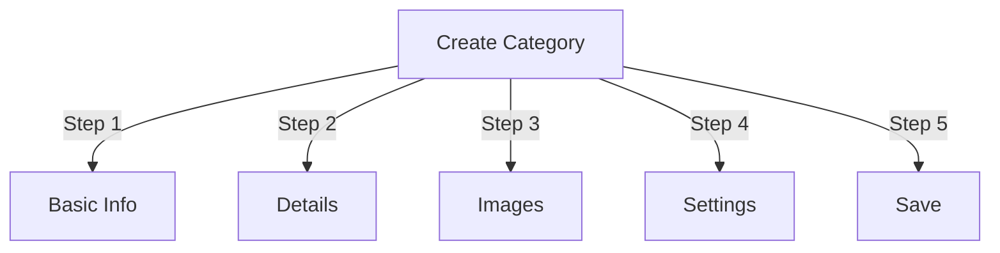

# مدیریت دسته ها در Publisher

> راهنمای کامل ایجاد، سازماندهی سلسله مراتب و مدیریت دسته ها در ماژول Publisher.

---

## مبانی دسته

### دسته بندی ها چیست؟

دسته بندی ها مقالات را در گروه های منطقی سازماندهی می کنند:

```
Example Structure:

  News (Main Category)
    ├── Technology
    ├── Sports
    └── Entertainment

  Tutorials (Main Category)
    ├── Photography
    │   ├── Basics
    │   └── Advanced
    └── Writing
        └── Blogging
```

### مزایای ساختار دسته بندی خوب

```
✓ Better user navigation
✓ Organized content
✓ Improved SEO
✓ Easier content management
✓ Better editorial workflow
```

---

## دسترسی به مدیریت دسته

### ناوبری پنل مدیریت

```
Admin Panel
└── Modules
    └── Publisher
        └── Categories
            ├── Create New
            ├── Edit
            ├── Delete
            ├── Permissions
            └── Organize
```

### دسترسی سریع

1. به عنوان **Administrator** وارد شوید
2. به **Admin → Modules** بروید
3. روی **Publisher → Admin** کلیک کنید
4. روی **Categories** در منوی سمت چپ کلیک کنید

---

## ایجاد دسته بندی

### فرم ایجاد دسته



### مرحله 1: اطلاعات اولیه

#### نام دسته

```
Field: Category Name
Type: Text input (required)
Max length: 100 characters
Uniqueness: Should be unique
Example: "Photography"
```

**راهنما:**
- وصف و مفرد یا جمع پیوسته
- با حروف بزرگ نوشته شده است
- از شخصیت های خاص خودداری کنید
- در حد معقول کوتاهی کنید

#### توضیحات دسته

```
Field: Description
Type: Textarea (optional)
Max length: 500 characters
Used in: Category listing pages, category blocks
```

**هدف:**
- محتوای دسته را توضیح می دهد
- در بالای مقالات دسته ظاهر می شود
- به کاربران کمک می کند تا محدوده را درک کنند
- برای توضیحات متا SEO استفاده می شود

**مثال:**
```
"Photography tips, tutorials, and inspiration for
all skill levels. From composition basics to advanced
lighting techniques, master your craft."
```

### مرحله 2: دسته والد

#### سلسله مراتب ایجاد کنید

```
Field: Parent Category
Type: Dropdown
Options: None (root), or existing categories
```

**نمونه های سلسله مراتبی:**

```
Flat Structure:
  News
  Tutorials
  Reviews

Nested Structure:
  News
    Technology
    Business
    Sports
  Tutorials
    Photography
      Basics
      Advanced
    Writing
```

**ایجاد زیر مجموعه:**

1. روی پنجره کشویی **Prent Category** کلیک کنید
2. انتخاب والد (به عنوان مثال، "اخبار")
3. نام دسته را پر کنید
4. ذخیره کنید
5. دسته جدید به عنوان کودک ظاهر می شود

### مرحله 3: تصویر دسته

#### تصویر دسته را آپلود کنید

```
Field: Category Image
Type: Image upload (optional)
Format: JPG, PNG, GIF, WebP
Max size: 5 MB
Recommended: 300x200 px (or your theme size)
```

**برای آپلود:**

1. روی دکمه **آپلود تصویر** کلیک کنید
2. تصویر را از رایانه انتخاب کنید
3. Crop/resize در صورت نیاز
4. روی **استفاده از این تصویر** کلیک کنید

**محل استفاده:**
- صفحه فهرست رده
- هدر بلوک دسته
- خرده نان (برخی تم)
- اشتراک گذاری رسانه های اجتماعی

### مرحله 4: تنظیمات دسته

#### تنظیمات نمایش

```yaml
Status:
  - Enabled: Yes/No
  - Hidden: Yes/No (hidden from menus, still accessible)

Display Options:
  - Show description: Yes/No
  - Show image: Yes/No
  - Show article count: Yes/No
  - Show subcategories: Yes/No

Layout:
  - Items per page: 10-50
  - Display order: Date/Title/Author
  - Display direction: Ascending/Descending
```

#### مجوزهای دسته

```yaml
Who Can View:
  - Anonymous: Yes/No
  - Registered: Yes/No
  - Specific groups: Configure per group

Who Can Submit:
  - Registered: Yes/No
  - Specific groups: Configure per group
  - Author must have: "submit articles" permission
```

### مرحله 5: تنظیمات SEO

#### متا تگ ها

```
Field: Meta Description
Type: Text (160 characters)
Purpose: Search engine description

Field: Meta Keywords
Type: Comma-separated list
Example: photography, tutorials, tips, techniques
```

#### پیکربندی URL

```
Field: URL Slug
Type: Text
Auto-generated from category name
Example: "photography" from "Photography"
Can be customized before saving
```

### ذخیره رده

1. تمام فیلدهای الزامی را پر کنید:
   - نام دسته ✓
   - توضیحات (توصیه می شود)
2. اختیاری: آپلود تصویر، تنظیم SEO
3. روی **ذخیره دسته** کلیک کنید
4. پیام تایید ظاهر می شود
5. دسته در حال حاضر در دسترس است

---

## سلسله مراتب دسته

### ساختار تودرتو ایجاد کنید

```
Step-by-step example: Create News → Technology subcategory

1. Go to Categories admin
2. Click "Add Category"
3. Name: "News"
4. Parent: (leave blank - this is root)
5. Save
6. Click "Add Category" again
7. Name: "Technology"
8. Parent: "News" (select from dropdown)
9. Save
```

### مشاهده درخت سلسله مراتب

```
Categories view shows tree structure:

📁 News
  📄 Technology
  📄 Sports
  📄 Entertainment
📁 Tutorials
  📄 Photography
    📄 Basics
    📄 Advanced
  📄 Writing
```

روی گسترش فلش ها به زیر شاخه های show/hide کلیک کنید.

### سازماندهی مجدد دسته ها

#### انتقال دسته

1. به لیست دسته ها بروید
2. روی **ویرایش** در دسته کلیک کنید
3. تغییر **دسته والد**
4. روی **ذخیره** کلیک کنید
5. دسته به موقعیت جدید منتقل شد

#### مرتب سازی مجدد دسته ها

در صورت وجود، از کشیدن و رها کردن استفاده کنید:

1. به لیست دسته ها بروید
2. دسته را کلیک کرده و بکشید
3. در موقعیت جدید قرار بگیرید
4. سفارش به صورت خودکار ذخیره می شود

#### حذف دسته

**گزینه 1: حذف نرم (پنهان کردن)**

1. دسته را ویرایش کنید
2. تنظیم **وضعیت**: غیر فعال
3. روی **ذخیره** کلیک کنید
4. دسته پنهان است اما حذف نشده است

**گزینه 2: حذف سخت**

1. به لیست دسته ها بروید
2. روی **Delete** در دسته کلیک کنید
3. اقدام را برای مقالات انتخاب کنید:
 
  ```
   ☐ Move articles to parent category
   ☐ Move articles to root (News)
   ☐ Delete all articles in category
 
  ```
4. حذف را تایید کنید

---

## عملیات دسته بندی

### ویرایش دسته

1. به **Admin → Publisher → Categories** بروید
2. روی **ویرایش** در دسته کلیک کنید
3. فیلدها را اصلاح کنید:
   - نام
   - توضیحات
   - دسته بندی والدین
   - تصویر
   - تنظیمات
4. روی **ذخیره** کلیک کنید

### مجوزهای دسته را ویرایش کنید

1. به دسته ها بروید
2. روی **مجوزها** در دسته کلیک کنید (یا روی دسته کلیک کنید سپس روی مجوزها)
3. پیکربندی گروه ها:

```
For each group:
  ☐ View articles in this category
  ☐ Submit articles to this category
  ☐ Edit own articles
  ☐ Edit all articles
  ☐ Approve/Moderate articles
  ☐ Manage category
```

4. روی **ذخیره مجوزها** کلیک کنید

### تصویر دسته را تنظیم کنید

**آپلود تصویر جدید:**

1. دسته را ویرایش کنید
2. روی **تغییر تصویر** کلیک کنید
3. تصویر را آپلود یا انتخاب کنید
4. Crop/resize
5. روی **استفاده از تصویر** کلیک کنید
6. روی **ذخیره دسته** کلیک کنید

**حذف تصویر:**

1. دسته را ویرایش کنید
2. روی **حذف تصویر** (در صورت وجود) کلیک کنید
3. روی **ذخیره دسته** کلیک کنید

---

## مجوزهای دسته

### ماتریس مجوز

```
                 Anonymous  Registered  Editor  Admin
View category        ✓         ✓         ✓       ✓
Submit article       ✗         ✓         ✓       ✓
Edit own article     ✗         ✓         ✓       ✓
Edit all articles    ✗         ✗         ✓       ✓
Moderate articles    ✗         ✗         ✓       ✓
Manage category      ✗         ✗         ✗       ✓
```

### مجوزهای سطح دسته را تنظیم کنید

#### کنترل دسترسی هر دسته1. به لیست **دسته ها** بروید
2. یک دسته را انتخاب کنید
3. روی **مجوزها** کلیک کنید
4. برای هر گروه، مجوزها را انتخاب کنید:

```
Example: News category
  Anonymous:   View only
  Registered:  Submit articles
  Editors:     Approve articles
  Admins:      Full control
```

5. روی **ذخیره** کلیک کنید

#### مجوزهای سطح فیلد

فیلدهای فرم را که کاربران می توانند see/edit را کنترل کنند:

```
Example: Limit field visibility for Registered users

Registered users can see/edit:
  ✓ Title
  ✓ Description
  ✓ Content
  ✗ Author (auto-set to current user)
  ✗ Scheduled date (only editors)
  ✗ Featured (only admins)
```

**پیکربندی در:**
- مجوزهای دسته
- به دنبال بخش "Field Visibility" باشید

---

## بهترین روش ها برای دسته ها

### ساختار دسته

```
✓ Keep hierarchy 2-3 levels deep
✗ Don't create too many top-level categories
✗ Don't create categories with one article

✓ Use consistent naming (plural or singular)
✗ Don't use vague names ("Stuff", "Other")

✓ Create categories for articles that exist
✗ Don't create empty categories in advance
```

### دستورالعمل نامگذاری

```
Good names:
  "Photography"
  "Web Development"
  "Travel Tips"
  "Business News"

Avoid:
  "Articles" (too vague)
  "Content" (redundant)
  "News&Updates" (inconsistent)
  "PHOTOGRAPHY STUFF" (formatting)
```

### نکات سازمانی

```
By Topic:
  News
    Technology
    Sports
    Entertainment

By Type:
  Tutorials
    Video
    Text
    Interactive

By Audience:
  For Beginners
  For Experts
  Case Studies

Geographic:
  North America
    United States
    Canada
  Europe
```

---

## بلوک های دسته

### بلوک دسته ناشر

نمایش لیست دسته ها در سایت شما:

1. به **Admin → Blocks** بروید
2. **ناشر - دسته ها** را پیدا کنید
3. روی **ویرایش** کلیک کنید
4. پیکربندی:

```
Block Title: "News Categories"
Show subcategories: Yes/No
Show article count: Yes/No
Height: (pixels or auto)
```

5. روی **ذخیره** کلیک کنید

### مسدود کردن مقالات دسته

نمایش آخرین مقالات از دسته خاص:

1. به **Admin → Blocks** بروید
2. **ناشر - مقالات دسته** را پیدا کنید
3. روی **ویرایش** کلیک کنید
4. انتخاب کنید:

```
Category: News (or specific category)
Number of articles: 5
Show images: Yes/No
Show description: Yes/No
```

5. روی **ذخیره** کلیک کنید

---

## تجزیه و تحلیل دسته

### مشاهده آمار دسته

از ادمین دسته ها:

```
Each category shows:
  - Total articles: 45
  - Published: 42
  - Draft: 2
  - Pending approval: 1
  - Total views: 5,234
  - Latest article: 2 hours ago
```

### ترافیک دسته را مشاهده کنید

اگر تجزیه و تحلیل فعال باشد:

1. روی نام دسته کلیک کنید
2. روی برگه **آمار** کلیک کنید
3. مشاهده:
   - بازدید از صفحه
   - مقالات محبوب
   - روند ترافیک
   - عبارات جستجو استفاده شده

---

## قالب های دسته

### نمایش دسته را سفارشی کنید

در صورت استفاده از الگوهای سفارشی، هر دسته می تواند لغو شود:

```
publisher_category.tpl
  ├── Category header
  ├── Category description
  ├── Category image
  ├── Article listing
  └── Pagination
```

**برای سفارشی سازی:**

1. فایل قالب را کپی کنید
2. HTML/CSS را اصلاح کنید
3. به دسته در admin اختصاص دهید
4. دسته از الگوی سفارشی استفاده می کند

---

## وظایف مشترک

### سلسله مراتب اخبار ایجاد کنید

```
Admin → Publisher → Categories
1. Create "News" (parent)
2. Create "Technology" (parent: News)
3. Create "Sports" (parent: News)
4. Create "Entertainment" (parent: News)
```

### مقاله ها را بین دسته ها جابه جا کنید

1. به **مقالات** admin بروید
2. انتخاب مقالات (چک باکس)
3. **"تغییر دسته"** را از قسمت کشویی اعمال انبوه انتخاب کنید
4. دسته جدید را انتخاب کنید
5. روی **به روز رسانی همه** کلیک کنید

### دسته را بدون حذف پنهان کنید

1. دسته را ویرایش کنید
2. **وضعیت**: Disabled/Hidden را تنظیم کنید
3. ذخیره کنید
4. دسته در منوها نشان داده نشده است (هنوز از طریق URL قابل دسترسی است)

### برای پیش نویس ها دسته ایجاد کنید

```
Best Practice:

Create "In Review" category
  ├── Purpose: Articles awaiting approval
  ├── Permissions: Hidden from public
  ├── Only admins/editors can see
  ├── Move articles here until approved
  └── Move to "News" when published
```

---

## دسته بندی Import/Export

### مقوله های صادراتی

در صورت موجود بودن:

1. به **Categories** admin بروید
2. روی **صادر کردن** کلیک کنید
3. فرمت را انتخاب کنید: CSV/JSON/XML
4. دانلود فایل
5. نسخه پشتیبان ذخیره شد

### دسته بندی های وارداتی

در صورت موجود بودن:

1. فایل با دسته ها را آماده کنید
2. به **دسته ها** admin بروید
3. روی **وارد کردن** کلیک کنید
4. آپلود فایل
5. استراتژی به روز رسانی را انتخاب کنید:
   - فقط جدید ایجاد کنید
   - به روز رسانی موجود
   - همه را جایگزین کنید
6. روی **وارد کردن** کلیک کنید

---

## دسته بندی عیب یابی

### مشکل: زیرمجموعه ها نمایش داده نمی شوند

**راه حل:**
```
1. Verify parent category status is "Enabled"
2. Check permissions allow viewing
3. Verify subcategories have status "Enabled"
4. Clear cache: Admin → Tools → Clear Cache
5. Check theme shows subcategories
```

### مشکل: نمی توان دسته را حذف کرد

**راه حل:**
```
1. Category must have no articles
2. Move or delete articles first:
   Admin → Articles
   Select articles in category
   Change category to another
3. Then delete empty category
4. Or choose "move articles" option when deleting
```

### مشکل: تصویر دسته نمایش داده نمی شود

**راه حل:**
```
1. Verify image uploaded successfully
2. Check image file format (JPG, PNG)
3. Verify upload directory permissions
4. Check theme displays category images
5. Try re-uploading image
6. Clear browser cache
```

### مشکل: مجوزها اعمال نمی شوند

**راه حل:**
```
1. Check group permissions in Category
2. Check global Publisher permissions
3. Check user belongs to configured group
4. Clear session cache
5. Log out and log back in
6. Check permission modules installed
```

---

## فهرست بهترین شیوه های دسته بندی

قبل از استقرار دسته ها:

- [ ] سلسله مراتب 2-3 سطح عمیق است
- [ ] هر دسته دارای 5+ مقاله است
- [ ] نام دسته ها سازگار است
- [ ] مجوزها مناسب هستند
- [ ] تصاویر دسته بهینه شده اند
- [ ] توضیحات کامل است
- [ ] ابرداده SEO پر شده است
- [ ] URL ها دوستانه هستند
- [ ] دسته بندی های آزمایش شده در front-end
- [ ] اسناد به روز شد

---

## راهنماهای مرتبط

- ایجاد مقاله
- مدیریت مجوز
- پیکربندی ماژول
- راهنمای نصب

---

## مراحل بعدی

- ایجاد مقالات در دسته ها
- پیکربندی مجوزها
- سفارشی کردن با قالب های سفارشی

---

#ناشر #دسته ها #سازمان #سلسله مراتب #مدیریت #کسوپس