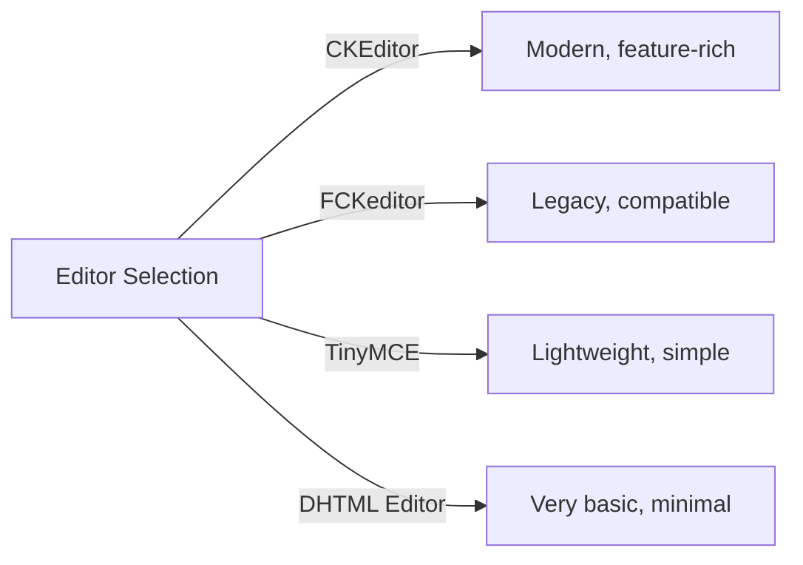
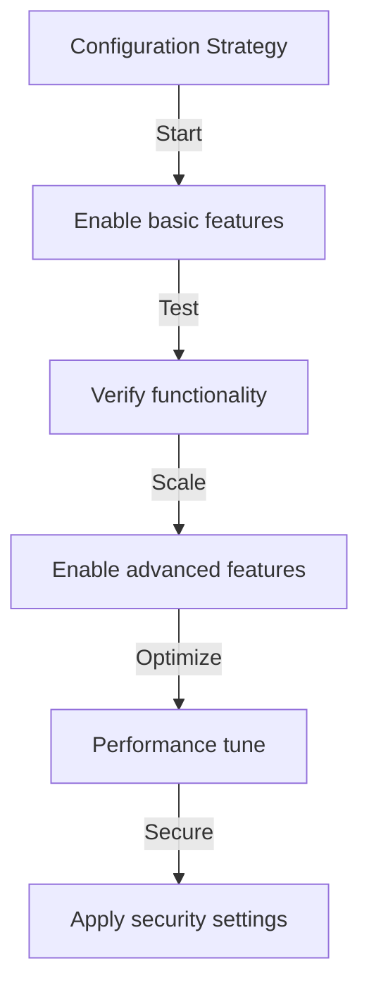

# پیکربندی اولیه ناشر

> تنظیمات ماژول ناشر، تنظیمات برگزیده و گزینه های کلی را برای نصب XOOPS خود پیکربندی کنید.

---

## دسترسی به پیکربندی

### ناوبری پنل مدیریت

```
XOOPS Admin Panel
└── Modules
    └── Publisher
        ├── Preferences
        ├── Settings
        └── Configuration
```

1. به عنوان **Administrator** وارد شوید
2. به **پنل مدیریت → ماژول ها** بروید
3. ماژول **Publisher** را پیدا کنید
4. روی پیوند **Preferences** یا **Admin** کلیک کنید

---

## تنظیمات عمومی

### پیکربندی دسترسی

```
Admin Panel → Modules → Publisher
```

برای این گزینه‌ها روی نماد **چرخ‌دنده** یا **تنظیمات** کلیک کنید:

#### گزینه های نمایش

| تنظیم | گزینه ها | پیش فرض | توضیحات |
|---------|---------|---------|-------------|
| **موارد در هر صفحه** | 5-50 | 10 | مقالات نشان داده شده در فهرست |
| **نمایش آرد سوخاری** | Yes/No | بله | نمایش مسیر ناوبری |
| **استفاده از پیجینگ** | Yes/No | بله | صفحه بندی لیست های طولانی |
| **تاریخ نمایش** | Yes/No | بله | نمایش تاریخ مقاله |
| **نمایش دسته** | Yes/No | بله | نمایش دسته مقاله |
| **نمایش نویسنده** | Yes/No | بله | نمایش نویسنده مقاله |
| **نمایش نماها** | Yes/No | بله | نمایش تعداد بازدید مقاله |

**پیکربندی نمونه:**

```yaml
Items Per Page: 15
Show Breadcrumb: Yes
Use Paging: Yes
Show Date: Yes
Show Category: Yes
Show Author: Yes
Show Views: Yes
```

#### گزینه های نویسنده

| تنظیم | پیش فرض | توضیحات |
|---------|---------|-------------|
| **نمایش نام نویسنده** | بله | نمایش نام واقعی یا نام کاربری |
| **استفاده از نام کاربری** | نه | نمایش نام کاربری به جای نام |
| **نمایش ایمیل نویسنده** | نه | نمایش ایمیل تماس نویسنده |
| **نمایش آواتار نویسنده** | بله | نمایش آواتار کاربر |

---

## پیکربندی ویرایشگر

### ویرایشگر WYSIWYG را انتخاب کنید

Publisher از چندین ویرایشگر پشتیبانی می کند:

#### ویرایشگرهای موجود



### CKEditor (توصیه می شود)

**بهترین برای:** اکثر کاربران، مرورگرهای مدرن، امکانات کامل

1. به **تنظیمات برگزیده** بروید
2. تنظیم **ویرایشگر**: CKEditor
3. گزینه ها را پیکربندی کنید:

```
Editor: CKEditor 4.x
Toolbar: Full
Height: 400px
Width: 100%
Remove plugins: []
Add plugins: [mathjax, codesnippet]
```

### FCKeditor

**بهترین برای:** سازگاری، سیستم های قدیمی تر

```
Editor: FCKeditor
Toolbar: Default
Custom config: (optional)
```

### TinyMCE

**بهترین برای:** حداقل ردپای، ویرایش اولیه

```
Editor: TinyMCE
Plugins: [paste, table, link, image]
Toolbar: minimal
```

---

## تنظیمات فایل و آپلود

### دایرکتوری های آپلود را پیکربندی کنید

```
Admin → Publisher → Preferences → Upload Settings
```

#### تنظیمات نوع فایل

```yaml
Allowed File Types:
  Images:
    - jpg
    - jpeg
    - gif
    - png
    - webp
  Documents:
    - pdf
    - doc
    - docx
    - xls
    - xlsx
    - ppt
    - pptx
  Archives:
    - zip
    - rar
    - 7z
  Media:
    - mp3
    - mp4
    - webm
    - mov
```

#### محدودیت اندازه فایل

| نوع فایل | حداکثر اندازه | یادداشت ها |
|-----------|----------|-------|
| **تصاویر** | 5 مگابایت | هر فایل تصویری |
| **اسناد** | 10 مگابایت | PDF, فایل های آفیس |
| **رسانه** | 50 مگابایت | فایل های Video/audio |
| **همه فایل** | 100 مگابایت | مجموع در هر بارگذاری |

**پیکربندی:**

```
Max Image Upload Size: 5 MB
Max Document Upload Size: 10 MB
Max Media Upload Size: 50 MB
Total Upload Size: 100 MB
Max Files per Article: 5
```

### تغییر اندازه تصویر

Publisher تصاویر را برای سازگاری به طور خودکار تغییر اندازه می دهد:

```yaml
Thumbnail Size:
  Width: 150
  Height: 150
  Mode: Crop/Resize

Category Image Size:
  Width: 300
  Height: 200
  Mode: Resize

Article Featured Image:
  Width: 600
  Height: 400
  Mode: Resize
```

---

## تنظیمات نظر و تعامل

### پیکربندی نظرات

```
Preferences → Comments Section
```

#### گزینه های نظر

```yaml
Allow Comments:
  - Enabled: Yes/No
  - Default: Yes
  - Per-article override: Yes

Comment Moderation:
  - Moderate comments: Yes/No
  - Moderate guest comments only: Yes/No
  - Spam filter: Enabled
  - Max comments per day: (unlimited)

Comment Display:
  - Display format: Threaded/Flat
  - Comments per page: 10
  - Date format: Full date/Time ago
  - Show comment count: Yes/No
```

### پیکربندی رتبه بندی

```yaml
Allow Ratings:
  - Enabled: Yes/No
  - Default: Yes
  - Per-article override: Yes

Rating Options:
  - Rating scale: 5 stars (default)
  - Allow user to rate own: No
  - Show average rating: Yes
  - Show rating count: Yes
```

---

## تنظیمات SEO و URL

### بهینه سازی موتورهای جستجو

```
Preferences → SEO Settings
```

#### پیکربندی URL

```yaml
SEO URLs:
  - Enabled: No (set to Yes for SEO URLs)
  - URL rewriting: None/Apache mod_rewrite/IIS rewrite

URL Format:
  - Category: /category/news
  - Article: /article/welcome-to-site
  - Archive: /archive/2024/01

Meta Description:
  - Auto-generate: Yes
  - Max length: 160 characters

Meta Keywords:
  - Auto-generate: Yes
  - From: Article tags, title
```

### URL های سئو را فعال کنید (پیشرفته)

**پیش نیاز:**
- آپاچی با `mod_rewrite` فعال است
- پشتیبانی `.htaccess` فعال است

**مراحل پیکربندی:**

1. به ** تنظیمات برگزیده → تنظیمات سئو ** بروید
2. تنظیم ** URL های SEO **: بله
3. **بازنویسی URL**: Apache mod_rewrite را تنظیم کنید
4. بررسی کنید که فایل `.htaccess` در پوشه Publisher وجود دارد

**.htaccess پیکربندی:**

```apache
<IfModule mod_rewrite.c>
    RewriteEngine On
    RewriteBase /modules/publisher/

    # Category rewrites
    RewriteRule ^category/([0-9]+)-(.*)\.html$ index.php?op=showcategory&categoryid=$1 [L,QSA]

    # Article rewrites
    RewriteRule ^article/([0-9]+)-(.*)\.html$ index.php?op=showitem&itemid=$1 [L,QSA]

    # Archive rewrites
    RewriteRule ^archive/([0-9]+)/([0-9]+)/$ index.php?op=archive&year=$1&month=$2 [L,QSA]
</IfModule>
```

---

## حافظه پنهان و عملکرد

### پیکربندی کش

```
Preferences → Cache Settings
```

```yaml
Enable Caching:
  - Enabled: Yes
  - Cache type: File (or Memcache)

Cache Lifetime:
  - Category lists: 3600 seconds (1 hour)
  - Article lists: 1800 seconds (30 minutes)
  - Single article: 7200 seconds (2 hours)
  - Recent articles block: 900 seconds (15 minutes)

Cache Clear:
  - Manual clear: Available in admin
  - Auto-clear on article save: Yes
  - Clear on category change: Yes
```

### کش را پاک کنید

**پاک کردن کش دستی:**

1. به **Admin → Publisher → Tools** بروید
2. روی **Clear Cache** کلیک کنید
3. انواع حافظه پنهان را برای پاک کردن انتخاب کنید:
   - [ ] حافظه پنهان دسته
   - [ ] کش مقاله
   - [ ] کش را مسدود کنید
   - [ ] تمام حافظه پنهان
4. روی **Clear Selected** کلیک کنید

**خط فرمان:**

```bash
# Clear all Publisher cache
php /path/to/xoops/admin/cache_manage.php publisher

# Or directly delete cache files
rm -rf /path/to/xoops/var/cache/publisher/*
```

---

## اطلاع رسانی و گردش کار

### اعلان های ایمیل

```
Preferences → Notifications
```

```yaml
Notify Admin on New Article:
  - Enabled: Yes
  - Recipient: Admin email
  - Include summary: Yes

Notify Moderators:
  - Enabled: Yes
  - On new submission: Yes
  - On pending articles: Yes

Notify Author:
  - On approval: Yes
  - On rejection: Yes
  - On comment: No (optional)
```

### گردش کار ارسال

```yaml
Require Approval:
  - Enabled: Yes
  - Editor approval: Yes
  - Admin approval: No

Draft Save:
  - Auto-save interval: 60 seconds
  - Save local versions: Yes
  - Revision history: Last 5 versions
```

---

## تنظیمات محتوا

### پیش‌فرض‌های انتشار

```
Preferences → Content Settings
```

```yaml
Default Article Status:
  - Draft/Published: Draft
  - Featured by default: No
  - Auto-publish time: None

Default Visibility:
  - Public/Private: Public
  - Show on front page: Yes
  - Show in categories: Yes

Scheduled Publishing:
  - Enabled: Yes
  - Allow per-article: Yes

Content Expiration:
  - Enabled: No
  - Auto-archive old: No
  - Archive after days: (unlimited)
```

### گزینه های محتوای WYSIWYG

```yaml
Allow HTML:
  - In articles: Yes
  - In comments: No

Allow Embedded Media:
  - Videos (iframe): Yes
  - Images: Yes
  - Plugins: No

Content Filtering:
  - Strip tags: No
  - XSS filter: Yes (recommended)
```

---

## تنظیمات موتور جستجو### یکپارچه سازی جستجو را پیکربندی کنید

```
Preferences → Search Settings
```

```yaml
Enable Article Indexing:
  - Include in site search: Yes
  - Index type: Full text/Title only

Search Options:
  - Search in titles: Yes
  - Search in content: Yes
  - Search in comments: Yes

Meta Tags:
  - Auto generate: Yes
  - OG tags (social): Yes
  - Twitter cards: Yes
```

---

## تنظیمات پیشرفته

### حالت اشکال زدایی (فقط توسعه)

```
Preferences → Advanced
```

```yaml
Debug Mode:
  - Enabled: No (only for development!)

Development Features:
  - Show SQL queries: No
  - Log errors: Yes
  - Error email: admin@example.com
```

### بهینه سازی پایگاه داده

```
Admin → Tools → Optimize Database
```

```bash
# Manual optimization
mysql> OPTIMIZE TABLE publisher_items;
mysql> OPTIMIZE TABLE publisher_categories;
mysql> OPTIMIZE TABLE publisher_comments;
```

---

## سفارشی سازی ماژول

### قالب های تم

```
Preferences → Display → Templates
```

مجموعه قالب را انتخاب کنید:
- پیش فرض
- کلاسیک
- مدرن
- تاریک
- سفارشی

هر الگو کنترل می کند:
- طرح بندی مقاله
- فهرست بندی دسته ها
- نمایش آرشیو
- نمایش نظرات

---

## نکات پیکربندی

### بهترین شیوه ها



1. **Start Simple** - ابتدا ویژگی های اصلی را فعال کنید
2. **تست هر تغییر** - قبل از حرکت تأیید کنید
3. **Caching را فعال کنید** - عملکرد را بهبود می بخشد
4. **ابتدا پشتیبان گیری ** - تنظیمات را قبل از تغییرات عمده صادر کنید
5. ** سیاهههای مربوط به مانیتور ** - سیاهههای مربوط به خطا را به طور منظم بررسی کنید

### بهینه سازی عملکرد

```yaml
For Better Performance:
  - Enable caching: Yes
  - Cache lifetime: 3600 seconds
  - Limit items per page: 10-15
  - Compress images: Yes
  - Minify CSS/JS: Yes (if available)
```

### سخت شدن امنیتی

```yaml
For Better Security:
  - Moderate comments: Yes
  - Disable HTML in comments: Yes
  - XSS filtering: Yes
  - File type whitelist: Strict
  - Max upload size: Reasonable limit
```

---

## تنظیمات Export/Import

### پیکربندی پشتیبان

```
Admin → Tools → Export Settings
```

**برای پشتیبان گیری از پیکربندی فعلی:**

1. روی **Export Configuration** کلیک کنید
2. فایل `.cfg` دانلود شده را ذخیره کنید
3. در مکان امن نگهداری کنید

**برای بازیابی:**

1. روی **Import Configuration** کلیک کنید
2. فایل `.cfg` را انتخاب کنید
3. روی **بازیابی** کلیک کنید

---

## راهنماهای پیکربندی مرتبط

- مدیریت دسته
- ایجاد مقاله
- پیکربندی مجوز
- راهنمای نصب

---

## پیکربندی عیب یابی

### تنظیمات ذخیره نمی‌شوند

**راه حل:**
1. مجوزهای دایرکتوری را در `/var/config/` بررسی کنید
2. دسترسی به نوشتن PHP را تأیید کنید
3. گزارش خطای PHP را برای مشکلات بررسی کنید
4. کش مرورگر را پاک کنید و دوباره امتحان کنید

### ویرایشگر ظاهر نمی شود

**راه حل:**
1. تأیید کنید که افزونه ویرایشگر نصب شده است
2. پیکربندی ویرایشگر XOOPS را بررسی کنید
3. گزینه ویرایشگر مختلف را امتحان کنید
4. کنسول مرورگر را برای خطاهای جاوا اسکریپت بررسی کنید

### مسائل مربوط به عملکرد

**راه حل:**
1. کش را فعال کنید
2. موارد در هر صفحه را کاهش دهید
3. فشرده سازی تصاویر
4. بهینه سازی پایگاه داده را بررسی کنید
5. گزارش کند پرس و جو را مرور کنید

---

## مراحل بعدی

- پیکربندی مجوزهای گروه
- اولین مقاله خود را ایجاد کنید
- دسته بندی ها را تنظیم کنید
- بررسی قالب های سفارشی

---

#ناشر #پیکربندی #ترجیحات #تنظیمات #xoops