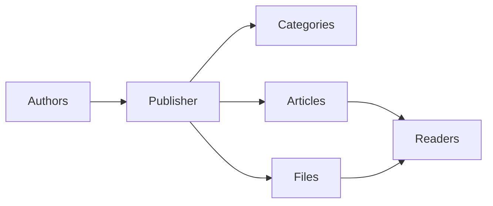
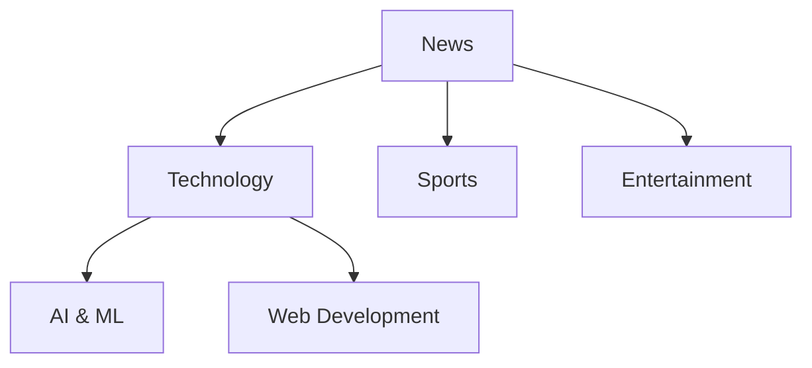
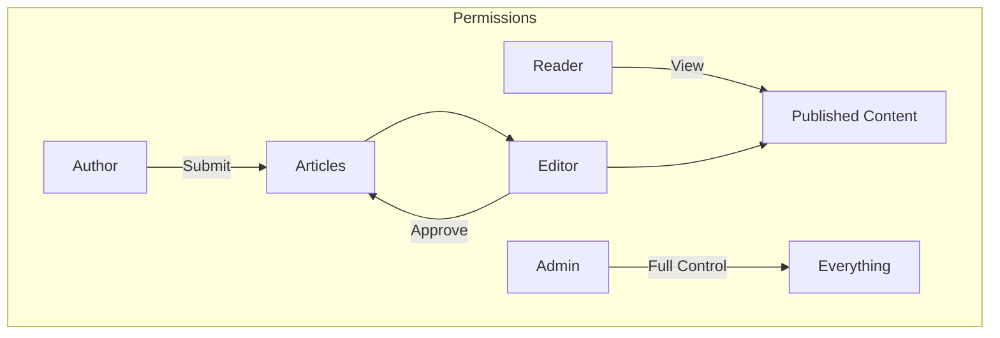
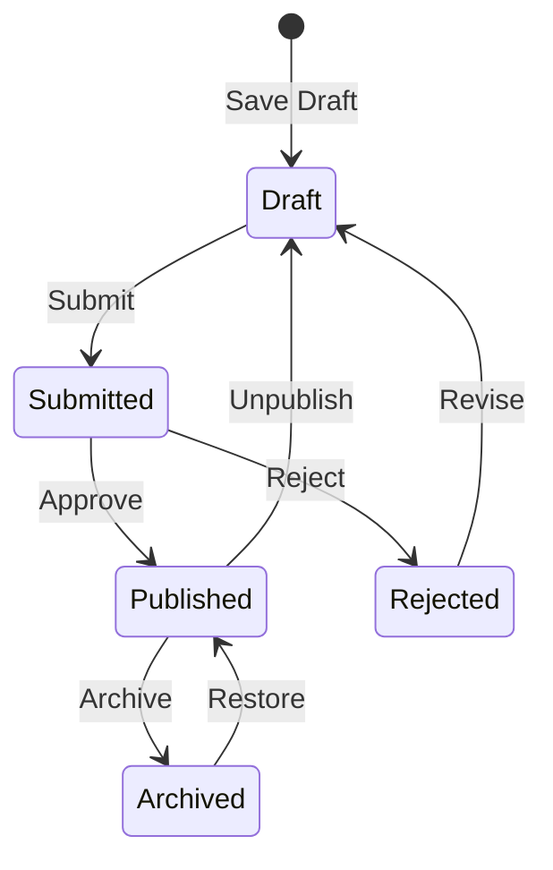

# شروع به کار با Publisher

> راهنمای گام به گام راه اندازی و استفاده از ماژول Publisher news/blog.

---

## ناشر چیست؟

Publisher ماژول مدیریت محتوا برتر XOOPS است که برای:

- **سایت های خبری** - انتشار مقالات با دسته بندی
- **وبلاگ** - وبلاگ نویسی شخصی یا چند نویسنده``
- **اسناد ** - پایگاه های دانش سازمان یافته
- ** پورتال های محتوا ** - محتوای رسانه های ترکیبی



---

## راه اندازی سریع

### مرحله 1: Publisher را نصب کنید

1. دانلود از [GitHub](https://github.com/XoopsModules25x/publisher)
2. در `modules/publisher/` آپلود کنید
3. به Admin → Modules → Install بروید

### مرحله ۲: دسته بندی ایجاد کنید



1. مدیر → ناشر → دسته ها
2. روی «افزودن دسته» کلیک کنید
3. پر کنید:
   - **نام**: نام دسته
   - **توضیح**: آنچه این دسته شامل می شود
   - **تصویر**: تصویر دسته بندی اختیاری
4. تنظیم مجوزها (چه کسی می تواند submit/view)
5. ذخیره کنید

### مرحله 3: تنظیمات را پیکربندی کنید

1. Admin → Publisher → Preferences
2. تنظیمات کلیدی برای پیکربندی:

| تنظیم | توصیه شده | توضیحات |
|---------|------------|-------------|
| موارد در هر صفحه | 10-20 | مقالات در فهرست |
| ویرایشگر | TinyMCE/CKEditor | ویرایشگر متن غنی |
| اجازه رتبه بندی | بله | بازخورد خواننده |
| اجازه نظرات | بله | بحث و گفتگو |
| تایید خودکار | نه | کنترل تحریریه |

### مرحله 4: اولین مقاله خود را ایجاد کنید

1. منوی اصلی → ناشر → ارسال مقاله
2- فرم را پر کنید:
   - **عنوان**: عنوان مقاله
   - **دسته**: جایی که تعلق دارد
   - **خلاصه**: توضیحات کوتاه
   - **بدن**: محتوای کامل مقاله
3. عناصر اختیاری را اضافه کنید:
   - تصویر برجسته
   - فایل های پیوست
   - تنظیمات سئو
4. برای بررسی یا انتشار ارسال کنید

---

## نقش های کاربر



### خواننده
- مشاهده مقالات منتشر شده
- امتیاز دهید و نظر دهید
- جستجو در محتوا

### نویسنده
- ارسال مقالات جدید
- ویرایش مقالات خود
- فایل ها را پیوست کنید

### ویرایشگر
- ارسالی Approve/reject
- هر مقاله را ویرایش کنید
- دسته ها را مدیریت کنید

### مدیر
- کنترل کامل ماژول
- تنظیمات را پیکربندی کنید
- مدیریت مجوزها

---

## مقاله نویسی

### ویرایشگر مقاله

```
┌─────────────────────────────────────────────────────┐
│ Title: [Your Article Title                        ] │
├─────────────────────────────────────────────────────┤
│ Category: [Select Category          ▼]              │
├─────────────────────────────────────────────────────┤
│ Summary:                                            │
│ ┌─────────────────────────────────────────────────┐ │
│ │ Brief description shown in listings...          │ │
│ └─────────────────────────────────────────────────┘ │
├─────────────────────────────────────────────────────┤
│ Body:                                               │
│ ┌─────────────────────────────────────────────────┐ │
│ │ [B] [I] [U] [Link] [Image] [Code]               │ │
│ ├─────────────────────────────────────────────────┤ │
│ │                                                  │ │
│ │ Full article content goes here...               │ │
│ │                                                  │ │
│ └─────────────────────────────────────────────────┘ │
├─────────────────────────────────────────────────────┤
│ [Submit] [Preview] [Save Draft]                     │
└─────────────────────────────────────────────────────┘
```

### بهترین شیوه ها

1. **عناوین قانع کننده** - سرفصل های واضح و جذاب
2. **خلاصه های خوب ** - خوانندگان را ترغیب کنید که کلیک کنند
3. **محتوای ساختاریافته** - از سرفصل ها، فهرست ها، تصاویر استفاده کنید
4. ** دسته بندی مناسب ** - به خوانندگان کمک کنید مطالب را پیدا کنند
5. **بهینه سازی SEO ** - کلمات کلیدی در عنوان و محتوا

---

## مدیریت محتوا

### جریان وضعیت مقاله



### توضیحات وضعیت

| وضعیت | توضیحات |
|--------|------------|
| پیش نویس | کار در حال انجام |
| ارسال شده | در انتظار بررسی |
| منتشر شده | زنده در سایت |
| منقضی شده | تاریخ انقضا گذشته |
| رد شد | نیاز به بازنگری |
| بایگانی شده | حذف از لیست ها |

---

## ناوبری

### دسترسی به ناشر

- ** منوی اصلی ** → ناشر
- **نشانی اینترنتی مستقیم**: `yoursite.com/modules/publisher/`

### صفحات کلیدی

| صفحه | آدرس اینترنتی | هدف |
|------|-----|---------|
| فهرست | `/modules/publisher/` | فهرست مقالات |
| دسته بندی | `/modules/publisher/category.php?id=X` | مقالات دسته بندی |
| مقاله | `/modules/publisher/item.php?itemid=X` | تک مقاله |
| ارسال | `/modules/publisher/submit.php` | مقاله جدید |
| جستجو | `/modules/publisher/search.php` | یافتن مقالات |

---

## بلوک

ناشر چندین بلوک برای سایت شما فراهم می کند:

### مقالات اخیر
آخرین مقالات منتشر شده را نمایش می دهد

### منوی دسته
پیمایش بر اساس دسته بندی

### مقالات محبوب
مطالب پربیننده

### مقاله تصادفی
نمایش محتوای تصادفی

### کانون توجه
مقالات برگزیده

---

## مستندات مرتبط

- ایجاد و ویرایش مقالات
- مدیریت دسته ها
- گسترش دهنده ناشر

---

#xoops #ناشر #راهنمای کاربر #شروع به کار #cms