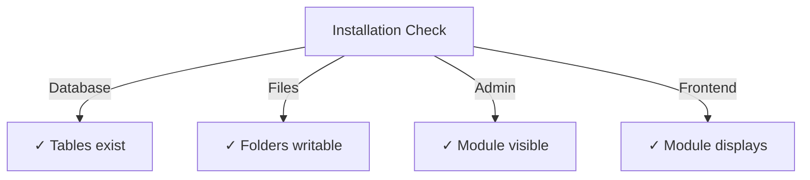

# راهنمای نصب ناشر

> دستورالعمل های کامل برای نصب و پیکربندی ماژول Publisher برای XOOPS CMS.

---

## سیستم مورد نیاز

### حداقل مورد نیاز

| مورد نیاز | نسخه | یادداشت ها |
|-------------|---------|-------|
| XOOPS | 2.5.10+ | پلتفرم هسته CMS |
| PHP | 7.1+ | PHP 8.x توصیه می شود |
| MySQL | 5.7+ | سرور پایگاه داده |
| وب سرور | Apache/Nginx | با پشتیبانی بازنویسی |

### پسوندهای PHP

```
- PDO (PHP Data Objects)
- pdo_mysql or mysqli
- mb_string (multibyte strings)
- curl (for external content)
- json
- gd (image processing)
```

### فضای دیسک

- **فایل های ماژول**: ~5 مگابایت
- **دایرکتوری کش**: 50+ مگابایت توصیه می شود
- **دایرکتوری آپلود**: در صورت نیاز برای محتوا

---

## چک لیست قبل از نصب

قبل از نصب Publisher، تأیید کنید:

- [ ] هسته XOOPS نصب شده و در حال اجرا است
- [ ] حساب مدیریت دارای مجوزهای مدیریت ماژول است
- [ ] پشتیبان گیری از پایگاه داده ایجاد شد
- [ ] مجوزهای فایل اجازه دسترسی نوشتن به فهرست راهنمای `/modules/` را می دهد
- [ ] محدودیت حافظه PHP حداقل 128 مگابایت است
- [ ] محدودیت اندازه آپلود فایل مناسب است (حداقل 10 مگابایت)

---

## مراحل نصب

### مرحله 1: دانلود Publisher

#### گزینه A: از GitHub (توصیه می شود)

```bash
# Navigate to modules directory
cd /path/to/xoops/htdocs/modules/

# Clone the repository
git clone https://github.com/XoopsModules25x/publisher.git

# Verify download
ls -la publisher/
```

#### گزینه B: دانلود دستی

1. از [نسخه‌های ناشر GitHub](https://github.com/XoopsModules25x/publisher/releases) بازدید کنید
2. آخرین فایل `.zip` را دانلود کنید
3. به `modules/publisher/` استخراج کنید

### مرحله 2: مجوزهای فایل را تنظیم کنید

```bash
# Set proper ownership
chown -R www-data:www-data /path/to/xoops/htdocs/modules/publisher

# Set directory permissions (755)
find publisher -type d -exec chmod 755 {} \;

# Set file permissions (644)
find publisher -type f -exec chmod 644 {} \;

# Make scripts executable
chmod 755 publisher/admin/index.php
chmod 755 publisher/index.php
```

### مرحله 3: از طریق XOOPS Admin نصب کنید

1. به عنوان سرپرست به **پنل مدیریت XOOPS** وارد شوید
2. به **سیستم → ماژول** بروید
3. روی **Install Module** کلیک کنید
4. **Publisher** را در لیست پیدا کنید
5. روی دکمه **Install** کلیک کنید
6. منتظر بمانید تا نصب کامل شود (جدول پایگاه داده ایجاد شده را نشان می دهد)

```
Installation Progress:
✓ Tables created
✓ Configuration initialized
✓ Permissions set
✓ Cache cleared
Installation Complete!
```

---

## راه اندازی اولیه

### مرحله 1: دسترسی به Publisher Admin

1. به **پنل مدیریت → ماژول ها** بروید
2. ماژول **Publisher** را پیدا کنید
3. روی لینک **Admin** کلیک کنید
4. اکنون در Publisher Administration هستید

### مرحله 2: تنظیمات ماژول را پیکربندی کنید

1. روی **Preferences** در منوی سمت چپ کلیک کنید
2. تنظیمات اولیه را پیکربندی کنید:

```
General Settings:
- Editor: Select your WYSIWYG editor
- Items per page: 10
- Show breadcrumb: Yes
- Allow comments: Yes
- Allow ratings: Yes

SEO Settings:
- SEO URLs: No (enable later if needed)
- URL rewriting: None

Upload Settings:
- Max upload size: 5 MB
- Allowed file types: jpg, png, gif, pdf, doc, docx
```

3. روی **ذخیره تنظیمات** کلیک کنید

### مرحله 3: اولین دسته را ایجاد کنید

1. روی **Categories** در منوی سمت چپ کلیک کنید
2. روی **افزودن دسته** کلیک کنید
3- فرم را پر کنید:

```
Category Name: News
Description: Latest news and updates
Image: (optional) Upload category image
Parent Category: (leave blank for top-level)
Status: Enabled
```

4. روی **ذخیره دسته** کلیک کنید

### مرحله 4: تأیید نصب

این شاخص ها را بررسی کنید:



#### بررسی پایگاه داده

```bash
mysql -u xoops_user -p xoops_database
mysql> SHOW TABLES LIKE 'publisher%';

# Should show tables:
# - publisher_categories
# - publisher_items
# - publisher_comments
# - publisher_files
```

#### بررسی Front-End

1. از صفحه اصلی XOOPS خود دیدن کنید
2. به دنبال بلوک **Publisher** یا **News** بگردید
3. باید مقالات اخیر را نمایش دهد

---

## پیکربندی پس از نصب

### انتخاب ویرایشگر

Publisher از چندین ویرایشگر WYSIWYG پشتیبانی می کند:

| ویرایشگر | جوانب مثبت | معایب |
|--------|------|------|
| ویرایشگر FCK | ویژگی های غنی | قدیمی تر، بزرگتر |
| CKEditor | استاندارد مدرن | پیچیدگی پیکربندی |
| TinyMCE | سبک | امکانات محدود |
| ویرایشگر DHTML | پایه | خیلی ابتدایی |

**برای تغییر ویرایشگر:**

1. به **تنظیمات برگزیده** بروید
2. به تنظیمات **ویرایشگر** بروید
3. از منوی کشویی انتخاب کنید
4. ذخیره و تست کنید

### راه اندازی دایرکتوری آپلود

```bash
# Create upload directories
mkdir -p /path/to/xoops/uploads/publisher/
mkdir -p /path/to/xoops/uploads/publisher/categories/
mkdir -p /path/to/xoops/uploads/publisher/images/
mkdir -p /path/to/xoops/uploads/publisher/files/

# Set permissions
chmod 755 /path/to/xoops/uploads/publisher/
chmod 755 /path/to/xoops/uploads/publisher/*
```

### اندازه تصویر را پیکربندی کنید

در تنظیمات برگزیده، اندازه تصاویر کوچک را تنظیم کنید:

```
Category image size: 300 x 200 px
Article image size: 600 x 400 px
Thumbnail size: 150 x 100 px
```

---

## مراحل پس از نصب

### 1. مجوزهای گروه را تنظیم کنید

1. در منوی مدیریت به **مجوزها** بروید
2. پیکربندی دسترسی برای گروه ها:
   - ناشناس: فقط مشاهده
   - کاربران ثبت نام شده: ارسال مقالات
   - ویراستاران: مقالات Approve/edit
   - مدیران: دسترسی کامل

### 2. قابلیت مشاهده ماژول را پیکربندی کنید

1. در XOOPS admin به **Blocks** بروید
2. بلوک‌های Publisher را پیدا کنید:
   - ناشر - آخرین مقالات
   - ناشر - دسته بندی ها
   - ناشر - آرشیو
3. قابلیت مشاهده بلوک را در هر صفحه پیکربندی کنید

### 3. وارد کردن محتوای آزمایشی (اختیاری)

برای آزمایش، نمونه مقالات را وارد کنید:

1. به ** Publisher Admin → Import** بروید
2. **نمونه محتوای** را انتخاب کنید
3. روی **وارد کردن** کلیک کنید

### 4. URL های SEO را فعال کنید (اختیاری)

برای URL های مناسب برای جستجو:1. به **تنظیمات برگزیده** بروید
2. تنظیم ** URL های SEO **: بله
3. بازنویسی **.htaccess** را فعال کنید
4. بررسی کنید که فایل `.htaccess` در پوشه Publisher وجود دارد

```apache
# .htaccess example
<IfModule mod_rewrite.c>
    RewriteEngine On
    RewriteBase /modules/publisher/
    RewriteRule ^category/([0-9]+)-(.*)\.html$ index.php?op=showcategory&categoryid=$1 [L]
    RewriteRule ^article/([0-9]+)-(.*)\.html$ index.php?op=showitem&itemid=$1 [L]
</IfModule>
```

---

## عیب یابی نصب

### مشکل: ماژول در admin ظاهر نمی شود

**راه حل:**
```bash
# Check file permissions
ls -la /path/to/xoops/modules/publisher/

# Check xoops_version.php exists
ls /path/to/xoops/modules/publisher/xoops_version.php

# Verify PHP syntax
php -l /path/to/xoops/modules/publisher/xoops_version.php
```

### مشکل: جداول پایگاه داده ایجاد نشده است

**راه حل:**
1. بررسی کنید که کاربر MySQL دارای امتیاز CREATE TABLE است
2. گزارش خطای پایگاه داده را بررسی کنید:
 
  ```bash
   mysql> SHOW WARNINGS;
 
  ```
3. SQL را به صورت دستی وارد کنید:
 
  ```bash
   mysql -u user -p database < modules/publisher/sql/mysql.sql
 
  ```

### مشکل: آپلود فایل انجام نشد

**راه حل:**
```bash
# Check directory exists and is writable
stat /path/to/xoops/uploads/publisher/

# Fix permissions
chmod 777 /path/to/xoops/uploads/publisher/

# Verify PHP settings
php -i | grep upload_max_filesize
```

### مشکل: خطاهای "صفحه یافت نشد".

**راه حل:**
1. بررسی کنید فایل `.htaccess` وجود دارد
2. بررسی کنید که Apache `mod_rewrite` فعال باشد:
 
  ```bash
   a2enmod rewrite
   systemctl restart apache2
 
  ```
3. `AllowOverride All` را در تنظیمات آپاچی بررسی کنید

---

## ارتقا از نسخه های قبلی

### از Publisher 1.x به 2.x

1. **نصب نسخه پشتیبان:**
 
  ```bash
   cp -r modules/publisher/ modules/publisher-backup/
   mysqldump -u user -p database > publisher-backup.sql
 
  ```

2. **دانلود Publisher 2.x**

3. **بازنویسی فایل ها:**
 
  ```bash
   rm -rf modules/publisher/
   unzip publisher-2.0.zip -d modules/
 
  ```

4. **اجرای آپدیت:**
   - به **Admin → Publisher → Update بروید**
   - روی **به روز رسانی پایگاه داده** کلیک کنید
   - منتظر تکمیل شدن باشید

5. **تأیید کنید:**
   - نمایش همه مقالات را به درستی بررسی کنید
   - بررسی کنید که مجوزها دست نخورده هستند
   - تست آپلود فایل

---

## ملاحظات امنیتی

### مجوزهای فایل

```
- Core files: 644 (readable by web server)
- Directories: 755 (browseable by web server)
- Upload directories: 755 or 777
- Config files: 600 (not readable by web)
```

### دسترسی مستقیم به فایل های حساس را غیرفعال کنید

`.htaccess` را در فهرست های آپلود ایجاد کنید:

```apache
<FilesMatch "\.(php|phtml|php3|php4|php5|phtml)$">
    Deny from all
</FilesMatch>
```

### امنیت پایگاه داده

```bash
# Use strong password
ALTER USER 'publisher_user'@'localhost' IDENTIFIED BY 'strong_password_here';

# Grant minimal permissions
GRANT SELECT, INSERT, UPDATE, DELETE ON publisher_db.* TO 'publisher_user'@'localhost';
FLUSH PRIVILEGES;
```

---

## چک لیست تأیید

پس از نصب، بررسی کنید:

- [ ] ماژول در لیست ماژول های مدیریت ظاهر می شود
- [ ] می تواند به بخش مدیریت Publisher دسترسی داشته باشد
- [ ] می تواند دسته بندی ایجاد کند
- [ ] می تواند مقاله ایجاد کند
- [ ] مقالات در قسمت جلویی نمایش داده می شوند
- [ ] آپلود فایل کار می کند
- [ ] تصاویر به درستی نمایش داده می شوند
- [ ] مجوزها به درستی اعمال می شوند
- [ ] جداول پایگاه داده ایجاد شد
- [ ] دایرکتوری کش قابل نوشتن است

---

## مراحل بعدی

پس از نصب موفق:

1. راهنمای تنظیمات اولیه را بخوانید
2. اولین مقاله خود را ایجاد کنید
3. مجوزهای گروه را تنظیم کنید
4. مدیریت دسته را بررسی کنید

---

## پشتیبانی و منابع

- **مشکلات GitHub**: [مشکلات ناشر](https://github.com/XoopsModules25x/publisher/issues)
- ** انجمن XOOPS**: [پشتیبانی انجمن](https://www.xoops.org/modules/newbb/)
- **GitHub Wiki**: [راهنمای نصب](https://github.com/XoopsModules25x/publisher/wiki)

---

#ناشر #نصب #راه اندازی #xoops #ماژول #پیکربندی