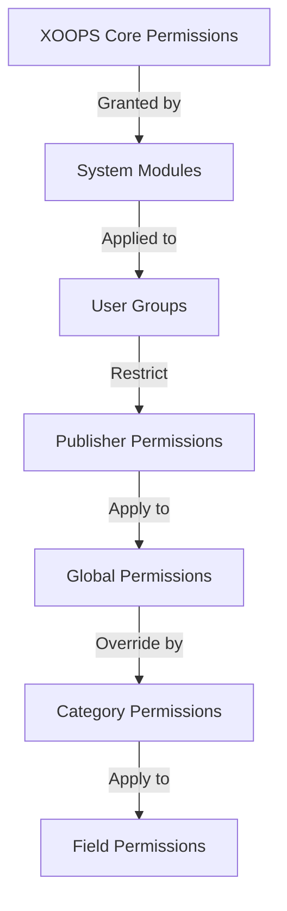

# راه اندازی مجوزهای ناشر

> راهنمای کامل پیکربندی مجوزهای گروه، کنترل دسترسی و مدیریت دسترسی کاربر در Publisher.

---

## مبانی مجوز

### مجوزها چیست؟

مجوزها کارهایی را که گروه‌های کاربری مختلف می‌توانند در Publisher انجام دهند کنترل می‌کنند:

```
Who can:
  - View articles
  - Submit articles
  - Edit articles
  - Approve articles
  - Manage categories
  - Configure settings
```

### سطوح مجوز

```
Anonymous
  └── View published articles only

Registered Users
  ├── View articles
  ├── Submit articles (pending approval)
  └── Edit own articles

Editors/Moderators
  ├── All registered permissions
  ├── Approve articles
  ├── Edit all articles
  └── Manage some categories

Administrators
  └── Full access to everything
```

---

## مدیریت مجوز دسترسی

### به Permissions بروید

```
Admin Panel
└── Modules
    └── Publisher
        ├── Permissions
        ├── Category Permissions
        └── Group Management
```

### دسترسی سریع

1. به عنوان **Administrator** وارد شوید
2. به **Admin → Modules** بروید
3. روی **Publisher → Admin** کلیک کنید
4. روی **Permissions** در منوی سمت چپ کلیک کنید

---

## مجوزهای جهانی

### مجوزهای سطح ماژول

کنترل دسترسی به ماژول و ویژگی های Publisher:

```
Permissions configuration view:
┌─────────────────────────────────────┐
│ Permission             │ Anon │ Reg │ Editor │ Admin │
├────────────────────────┼──────┼─────┼────────┼───────┤
│ View articles          │  ✓   │  ✓  │   ✓    │  ✓   │
│ Submit articles        │  ✗   │  ✓  │   ✓    │  ✓   │
│ Edit own articles      │  ✗   │  ✓  │   ✓    │  ✓   │
│ Edit all articles      │  ✗   │  ✗  │   ✓    │  ✓   │
│ Approve articles       │  ✗   │  ✗  │   ✓    │  ✓   │
│ Manage categories      │  ✗   │  ✗  │   ✗    │  ✓   │
│ Access admin panel     │  ✗   │  ✗  │   ✓    │  ✓   │
└─────────────────────────────────────┘
```

### توضیحات مجوز

| مجوز | کاربران | اثر |
|------------|-------|--------|
| **مشاهده مقالات** | همه گروه ها | می توانید مقالات منتشر شده در front-end |
| **ارسال مقالات** | ثبت شده+ | می تواند مقالات جدید ایجاد کند (در انتظار تایید) |
| **ویرایش مقالات خود ** | ثبت شده+ | آیا edit/delete می تواند مقالات خود را |
| **ویرایش همه مقالات** | ویرایشگران+ | می تواند مقالات هر کاربر را ویرایش کند |
| **مقالات خود را حذف کنید** | ثبت شده+ | می تواند مقالات منتشر نشده خود را حذف کند |
| **حذف همه مقالات** | ویرایشگران+ | می تواند هر مقاله ای را حذف کند |
| **تأیید مقالات** | ویرایشگران+ | می تواند مقالات معلق را منتشر کند |
| **مدیریت دسته ها** | مدیران | ایجاد، ویرایش، حذف دسته بندی |
| **دسترسی ادمین** | ویرایشگران+ | دسترسی به رابط مدیریت |

---

## مجوزهای جهانی را پیکربندی کنید

### مرحله 1: دسترسی به تنظیمات مجوز

1. به **Admin → Modules** بروید
2. **ناشر** را پیدا کنید
3. روی **Permissions** (یا لینک Admin سپس Permissions) کلیک کنید.
4. ماتریس مجوز را می بینید

### مرحله 2: مجوزهای گروه را تنظیم کنید

برای هر گروه، کارهایی را که می توانند انجام دهند پیکربندی کنید:

#### کاربران ناشناس

```yaml
Anonymous Group Permissions:
  View articles: ✓ YES
  Submit articles: ✗ NO
  Edit articles: ✗ NO
  Delete articles: ✗ NO
  Approve articles: ✗ NO
  Manage categories: ✗ NO
  Admin access: ✗ NO

Result: Anonymous users can only view published content
```

#### کاربران ثبت نام شده

```yaml
Registered Group Permissions:
  View articles: ✓ YES
  Submit articles: ✓ YES (with approval required)
  Edit own articles: ✓ YES
  Edit all articles: ✗ NO
  Delete own articles: ✓ YES (drafts only)
  Delete all articles: ✗ NO
  Approve articles: ✗ NO
  Manage categories: ✗ NO
  Admin access: ✗ NO

Result: Registered users can contribute content after approval
```

#### گروه ویراستاران

```yaml
Editors Group Permissions:
  View articles: ✓ YES
  Submit articles: ✓ YES
  Edit own articles: ✓ YES
  Edit all articles: ✓ YES
  Delete own articles: ✓ YES
  Delete all articles: ✓ YES
  Approve articles: ✓ YES
  Manage categories: ✓ LIMITED
  Admin access: ✓ YES
  Configure settings: ✗ NO

Result: Editors manage content but not settings
```

#### مدیران

```yaml
Admins Group Permissions:
  ✓ FULL ACCESS to all features

  - All editor permissions
  - Manage all categories
  - Configure all settings
  - Manage permissions
  - Install/uninstall
```

### مرحله 3: مجوزها را ذخیره کنید

1. مجوزهای هر گروه را پیکربندی کنید
2. کادرها را برای اعمال مجاز علامت بزنید
3. علامت کادرهای مربوط به اقدامات رد شده را بردارید
4. روی **ذخیره مجوزها** کلیک کنید
5. پیام تایید ظاهر می شود

---

## مجوزهای سطح دسته

### دسترسی به دسته را تنظیم کنید

کنترل کنید چه کسی می‌تواند view/submit را به دسته‌های خاص تبدیل کند:

```
Admin → Publisher → Categories
→ Select category → Permissions
```

### ماتریس مجوز دسته

```
                 Anonymous  Registered  Editor  Admin
View category        ✓         ✓         ✓       ✓
Submit to category   ✗         ✓         ✓       ✓
Edit own in category ✗         ✓         ✓       ✓
Edit all in category ✗         ✗         ✓       ✓
Approve in category  ✗         ✗         ✓       ✓
Manage category      ✗         ✗         ✗       ✓
```

### مجوزهای دسته را پیکربندی کنید

1. به **Categories** admin بروید
2. دسته بندی را پیدا کنید
3. روی دکمه **مجوزها** کلیک کنید
4. برای هر گروه، انتخاب کنید:
   - [ ] مشاهده این دسته
   - [ ] ارسال مقالات
   - [ ] مقالات خود را ویرایش کنید
   - [ ] ویرایش همه مقالات
   - [ ] مقالات را تایید کنید
   - [ ] دسته بندی را مدیریت کنید
5. روی **ذخیره** کلیک کنید

### نمونه های مجوز دسته

#### دسته بندی اخبار عمومی

```
Anonymous: View only
Registered: View + Submit (pending approval)
Editors: Approve + Edit
Admins: Full control
```

#### دسته به روز رسانی داخلی

```
Anonymous: No access
Registered: View only
Editors: Submit + Approve
Admins: Full control
```

#### دسته وبلاگ مهمان

```
Anonymous: View only
Registered: Submit (pending approval)
Editors: Approve
Admins: Full control
```

---

## مجوزهای سطح فیلد

### مشاهده فیلد فرم کنترل

محدود کردن فیلدهای فرمی که کاربران می توانند see/edit باشند:

```
Admin → Publisher → Permissions → Fields
```

### گزینه های فیلد

```yaml
Visible Fields for Registered Users:
  ✓ Title
  ✓ Description
  ✓ Content (body)
  ✓ Featured image
  ✓ Category
  ✓ Tags
  ✗ Author (auto-set)
  ✗ Publication date (editors only)
  ✗ Scheduled date (editors only)
  ✗ Featured flag (editors only)
  ✗ Permissions (admins only)
```

### مثالها

#### ارسال محدود برای ثبت نام

کاربران ثبت نام شده گزینه های کمتری را می بینند:

```
Available fields:
  - Title ✓
  - Description ✓
  - Content ✓
  - Featured image ✓
  - Category ✓

Hidden fields:
  - Author (auto-current user)
  - Publication date (editors decide)
  - Scheduled date (admins only)
  - Featured status (editors choose)
```

#### فرم کامل برای ویراستاران

ویرایشگران همه گزینه ها را می بینند:

```
Available fields:
  - All basic fields
  - All metadata
  - Author selection ✓
  - Publication date/time ✓
  - Scheduled date ✓
  - Featured status ✓
  - Expiration date ✓
  - Permissions ✓
```

---

## پیکربندی گروه کاربر

### گروه سفارشی ایجاد کنید

1. به **Admin → Users → Groups** بروید
2. روی **ایجاد گروه** کلیک کنید
3. جزئیات گروه را وارد کنید:

```
Group Name: "Community Bloggers"
Group Description: "Users who contribute blog content"
Type: Regular group
```

4. روی **ذخیره گروه** کلیک کنید
5. به مجوزهای ناشر برگردید
6. مجوزها را برای گروه جدید تنظیم کنید

### نمونه های گروهی

```
Suggested Groups for Publisher:

Group: Contributors
  - Regular members who submit articles
  - Can edit own articles
  - Cannot approve articles

Group: Reviewers
  - Can see submitted articles
  - Can approve/reject articles
  - Cannot delete others' articles

Group: Editors
  - Can edit any article
  - Can approve articles
  - Can moderate comments
  - Can manage some categories

Group: Publishers
  - Can edit any article
  - Can publish directly (no approval)
  - Can manage all categories
  - Can configure settings
```

---

## سلسله مراتب مجوز

### جریان مجوز



### وراثت مجوز

```
Base: Global module permissions
  ↓
Category: Overrides for specific categories
  ↓
Field: Further restricts available fields
  ↓
User: Has permission if ALL levels allow
```

**مثال:**

```
User wants to edit article:
1. User group must have "edit articles" permission (global)
2. Category must allow editing (category level)
3. Field restrictions must allow (if applicable)
4. User must be author OR editor (for own vs all)

If ANY level denies → Permission denied
```

---

## مجوزهای گردش کار تایید

### پیکربندی تایید ارسال

کنترل اینکه آیا مقالات نیاز به تأیید دارند یا خیر:

```
Admin → Publisher → Preferences → Workflow
```

#### گزینه های تایید

```yaml
Submission Workflow:
  Require Approval: Yes

  For Registered Users:
    - New articles: Draft (pending approval)
    - Editors must approve
    - User can edit while pending
    - After approval: User can still edit

  For Editors:
    - New articles: Publish directly (optional)
    - Skip approval queue
    - Or always require approval
```

#### پیکربندی در هر گروه1. به Preferences بروید
2. «گردش کار ارسال» را پیدا کنید
3. برای هر گروه، تنظیم کنید:

```
Group: Registered Users
  Require approval: ✓ YES
  Default status: Draft
  Can modify while pending: ✓ YES

Group: Editors
  Require approval: ✗ NO
  Default status: Published
  Can modify published: ✓ YES
```

4. روی **ذخیره** کلیک کنید

---

## مقالات را تعدیل کنید

### مقالات معلق را تایید کنید

برای کاربرانی که مجوز «تأیید مقالات» دارند:

1. به **مدیر → ناشر → مقالات** بروید
2. فیلتر بر اساس **وضعیت**: در انتظار
3. برای بررسی روی مقاله کلیک کنید
4. کیفیت محتوا را بررسی کنید
5. تنظیم **وضعیت**: منتشر شده است
6. اختیاری: اضافه کردن یادداشت های سرمقاله
7. روی **ذخیره** کلیک کنید

### مقالات را رد کنید

اگر مقاله استانداردها را رعایت نمی کند:

1. مقاله را باز کنید
2. تنظیم **وضعیت**: پیش نویس
3. دلیل رد را اضافه کنید (در نظر یا ایمیل)
4. روی **ذخیره** کلیک کنید
5. برای نویسنده توضیح رد پیام ارسال کنید

### نظرات را تعدیل کنید

در صورت تعدیل نظرات:

1. به **Admin → Publisher → Comments بروید**
2. فیلتر بر اساس **وضعیت**: در انتظار
3. نظر را مرور کنید
4. گزینه ها:
   - تایید: روی **تأیید** کلیک کنید
   - رد کردن: روی **Delete** کلیک کنید
   - ویرایش: روی **ویرایش**، تعمیر، ذخیره کلیک کنید
5. روی **ذخیره** کلیک کنید

---

## دسترسی کاربر را مدیریت کنید

### مشاهده گروه های کاربر

ببینید کدام کاربران به گروه ها تعلق دارند:

```
Admin → Users → User Groups

For each user:
  - Primary group (one)
  - Secondary groups (multiple)

Permissions apply from all groups (union)
```

### افزودن کاربر به گروه

1. به **Admin → Users** بروید
2. کاربر را پیدا کنید
3. روی **ویرایش** کلیک کنید
4. در قسمت **گروه ها**، گروه ها را برای افزودن علامت بزنید
5. روی **ذخیره** کلیک کنید

### مجوزهای کاربر را تغییر دهید

برای کاربران فردی (در صورت پشتیبانی):

1. به User admin بروید
2. کاربر را پیدا کنید
3. روی **ویرایش** کلیک کنید
4. به دنبال لغو مجوزهای فردی باشید
5. در صورت نیاز پیکربندی کنید
6. روی **ذخیره** کلیک کنید

---

## سناریوهای مجوز مشترک

### سناریوی 1: وبلاگ را باز کنید

به هر کسی اجازه ارسال کنید:

```
Anonymous: View
Registered: Submit, edit own, delete own
Editors: Approve, edit all, delete all
Admins: Full control

Result: Open community blog
```

### سناریو 2: سایت خبری تعدیل شده

فرآیند تایید دقیق:

```
Anonymous: View only
Registered: Cannot submit
Editors: Submit, approve others
Admins: Full control

Result: Only approved professionals publish
```

### سناریوی 3: وبلاگ کارکنان

کارمندان می توانند مشارکت داشته باشند:

```
Create group: "Staff"
Anonymous: View
Registered: View only (non-staff)
Staff: Submit, edit own, publish directly
Admins: Full control

Result: Staff-authored blog
```

### سناریوی 4: چند دسته با ویرایشگرهای مختلف

ویرایشگرهای مختلف برای دسته های مختلف:

```
News category:
  Editors group A: Full control

Reviews category:
  Editors group B: Full control

Tutorials category:
  Editors group C: Full control

Result: Decentralized editorial control
```

---

## تست مجوز

### مجوزهای کار را تأیید کنید

1. در هر گروه کاربر آزمایشی ایجاد کنید
2. به عنوان هر کاربر آزمایشی وارد شوید
3. سعی کنید:
   - مشاهده مقالات
   - ارسال مقاله (در صورت اجازه باید پیش نویس ایجاد شود)
   - ویرایش مقاله (خود و دیگران)
   - حذف مقاله
   - دسترسی به پنل مدیریت
   - دسترسی به دسته ها

4. بررسی نتایج مطابق با مجوزهای مورد انتظار

### موارد تست رایج

```
Test Case 1: Anonymous user
  [ ] Can view published articles: ✓
  [ ] Cannot submit articles: ✓
  [ ] Cannot access admin: ✓

Test Case 2: Registered user
  [ ] Can submit articles: ✓
  [ ] Articles go to Draft: ✓
  [ ] Can edit own article: ✓
  [ ] Cannot edit others: ✓
  [ ] Cannot access admin: ✓

Test Case 3: Editor
  [ ] Can approve articles: ✓
  [ ] Can edit any article: ✓
  [ ] Can access admin: ✓
  [ ] Cannot delete all: ✓ (or ✓ if allowed)

Test Case 4: Admin
  [ ] Can do everything: ✓
```

---

## مجوزهای عیب یابی

### مشکل: کاربر نمی تواند مقاله ارسال کند

**بررسی:**
```
1. User group has "submit articles" permission
   Admin → Publisher → Permissions

2. User belongs to allowed group
   Admin → Users → Edit user → Groups

3. Category allows submission from user's group
   Admin → Publisher → Categories → Permissions

4. User is registered (not anonymous)
```

**راه حل:**
```bash
1. Verify registered user group has submission permission
2. Add user to appropriate group
3. Check category permissions
4. Clear user session cache
```

### مشکل: ویرایشگر نمی تواند مقاله ها را تأیید کند

**بررسی:**
```
1. Editor group has "approve articles" permission
2. Articles exist with "Pending" status
3. Editor is in correct group
4. Category allows approval from editor's group
```

**راه حل:**
```bash
1. Go to Permissions, check "approve articles" is checked for editor group
2. Create test article, set to Draft
3. Try to approve as editor
4. Check error messages in system log
```

### مشکل: می‌تواند مقالات را ببیند اما به دسته دسترسی ندارد

**بررسی:**
```
1. Category is not disabled/hidden
2. Category permissions allow viewing
3. User's group is permitted to view category
4. Category is published
```

**راه حل:**
```bash
1. Go to Categories, check category status is "Enabled"
2. Check category permissions are set
3. Add user's group to category view permission
```

### مشکل: مجوزها تغییر کردند اما اعمال نمی شوند

**راه حل:**
```bash
1. Clear cache: Admin → Tools → Clear Cache
2. Clear session: Logout and login again
3. Check system log for errors
4. Verify permissions actually saved
5. Try different browser/incognito window
```

---

## مجوز پشتیبان گیری و صادرات

### مجوزهای صادرات

برخی از سیستم ها اجازه صادرات را می دهند:

1. به **Admin → Publisher → Tools** بروید
2. روی **Export Permissions** کلیک کنید
3. فایل `.xml` یا `.json` را ذخیره کنید
4. به عنوان پشتیبان نگه دارید

### مجوزهای واردات

بازیابی از پشتیبان:

1. به **Admin → Publisher → Tools** بروید
2. روی **Import Permissions** کلیک کنید
3. فایل پشتیبان را انتخاب کنید
4. تغییرات را بررسی کنید
5. روی **وارد کردن** کلیک کنید

---

## بهترین شیوه ها

### چک لیست پیکربندی مجوز

- [ ] در مورد گروه های کاربری تصمیم بگیرید
- [ ] نام های واضح را به گروه ها اختصاص دهید
- [ ] مجوزهای پایه را برای هر گروه تنظیم کنید
- [ ] هر سطح مجوز را تست کنید
- [ ] ساختار مجوز سند
- [ ] گردش کار تایید را ایجاد کنید
- [ ] ویراستاران را در مورد تعدیل آموزش دهید
- [ ] نظارت بر استفاده از مجوز
- [ ] مجوزها را به صورت فصلی بررسی کنید
- [ ] تنظیمات مجوز پشتیبان

### بهترین شیوه های امنیتی

```
✓ Principle of Least Privilege
  - Grant minimum necessary permissions

✓ Role-Based Access
  - Use groups for roles (editor, moderator, etc)

✓ Audit Permissions
  - Review who has what access

✓ Separate Duties
  - Submitter, approver, publisher are different

✓ Regular Review
  - Check permissions quarterly
  - Remove access when users leave
  - Update for new requirements
```

---

## راهنماهای مرتبط

- ایجاد مقالات
- مدیریت دسته ها
- پیکربندی اولیه
- نصب و راه اندازی

---

## مراحل بعدی

- مجوزها را برای گردش کار خود تنظیم کنید
- ایجاد مقالات با مجوزهای مناسب
- دسته بندی ها را با مجوز پیکربندی کنید
- آموزش کاربران در زمینه ایجاد مقاله

---

#ناشر #مجوزها #گروه ها #دسترسی-کنترل #امنیت #اعتدال #زووپ